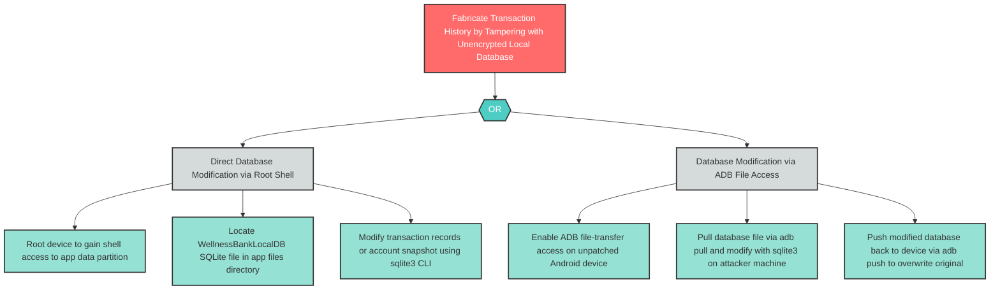

# T-5: Unencrypted Local Database Tampering

**Component**: WellnessBankLocalDB | **Risk Level**: High | **Finding**: T-5

An attacker with root or ADB access modifies the unencrypted SQLite database, fabricating transaction history or manipulating account balance data displayed to the user.

