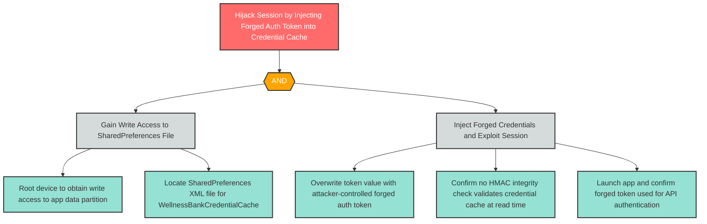

# T-6: Credential Cache Tampering via SharedPreferences Overwrite

**Component**: WellnessBankCredentialCache | **Risk Level**: High | **Finding**: T-6

An attacker with root access overwrites the SharedPreferences credential store to inject forged auth tokens, enabling session hijacking without needing to extract legitimate credentials.

