# WellnessBank Mobile Banking Application — Threat Report

```yaml
---
schema_version: "1.1"
date: "2026-04-29"
source_file: "examples/mobile-banking-app/sample-report/threats.md"
finding_count: 31
risk_distribution:
  Critical: 13
  High: 11
  Medium: 3
  Low: 4
attack_tree_count: 24
baseline_source: null
baseline_date: null
delta_counts:
  new: null
  unchanged: null
  updated: null
  resolved: null
---
```

---

## 1. Executive Summary

The WellnessBank Mobile Banking Application presents a **critical security posture** requiring immediate remediation before production deployment. The threat model identified **31 findings** across a fictional Android mobile banking application: 13 Critical, 11 High, 3 Medium, and 4 Low severity issues. The total attack surface reflects systemic deficiencies in credential storage, transport security, client-side data protection, and Android platform hardening — spanning both the mobile client and its supporting backend infrastructure.

**Top 5 Threats by Business Impact**

1. **Plaintext Credential Storage (S-1 / I-7)**: Auth tokens and usernames are stored in unencrypted Android SharedPreferences. An attacker with physical or remote access to a rooted device can extract long-lived credentials and impersonate any customer — representing direct, unmediated account takeover across the entire user base.

2. **Exported Debug Activity Bypassing Authentication (E-1)**: A debug-only Android Activity was retained in the production release build and is accessible via ADB shell without any authentication challenge. Any party with USB access to a device — including malicious repair shops, law enforcement overreach, or physical theft — can execute privileged banking operations with zero credentials.

3. **Unauthorized Fund Transfers via Intent Hijacking (T-3 / E-2)**: The MoneyTransferActivity is exported with no permission gate. Any co-installed application on the device can silently initiate fund transfers under the legitimate user's authenticated session, without any user interaction or biometric confirmation.

4. **Missing Certificate Pinning on All Network Channels (I-1)**: The application performs all HTTPS communication — including session tokens, transaction payloads, and payment authorization — without certificate pinning. An attacker on a rogue Wi-Fi access point can execute a man-in-the-middle (MITM) attack, intercepting and modifying financial data in transit.

5. **Broken PIN-Based Cryptography (I-4)**: The application derives encryption keys from a 4-digit PIN using PBKDF2-HMAC-SHA1 at only 1,000 iterations with no per-device salt. The entire 10,000-PIN keyspace is exhausted in under one second on commodity GPU hardware, rendering all client-side cryptographic protections ineffective.

**Key Recommendations**

1. **Implement Android Keystore-backed credential storage** across all sensitive data — replacing plaintext SharedPreferences with EncryptedSharedPreferences and binding key release to biometric confirmation.
2. **Strip all debug components from release builds** and enforce build-time validation that no `*Debug*` Activity ships in production APKs.
3. **Restrict exported Android Activities** by setting `android:exported="false"` or enforcing signature-level permissions on all Activities that handle financial operations.
4. **Deploy certificate pinning** on all HTTPS channels using OkHttp CertificatePinner and Network Security Config pin-sets for both backend and third-party SDK endpoints.
5. **Upgrade client-side cryptography** to Argon2id or PBKDF2-HMAC-SHA256 at ≥600,000 iterations with per-device unique salts, wrapped with a hardware-backed Android Keystore key.

**Compliance Relevance**

Findings map directly to multiple regulatory and compliance obligations. The credential storage failures (S-1, I-7) and cryptographic weaknesses (I-4) implicate PCI DSS Requirements 3 (Protect Stored Data) and 6 (Develop Secure Systems). The missing audit trail (R-1, R-2) conflicts with PCI DSS Requirement 10 (Track and Monitor) and ISO 27001 control A.12.4 (Logging and Monitoring). Privacy control gaps (I-2) have GDPR and CCPA implications. CWE-312 (Cleartext Storage of Sensitive Information), CWE-295 (Improper Certificate Validation), CWE-916 (Use of Password Hash with Insufficient Computational Effort), and CWE-732 (Incorrect Permission Assignment) are directly evidenced in this codebase. SOC 2 Trust Services Criteria CC6.1 (Logical Access Controls) and CC7.2 (System Monitoring) are materially compromised.

**Remediation Timeline**

- **Immediate** (13 Critical — before any production deployment): S-1, S-2, T-3, T-4, R-1, I-1, I-2, I-3, I-4, I-7, I-8, E-1, E-2
- **Short-term** (11 High — within current development cycle): S-3, S-5, T-1, T-2, T-5, T-6, R-2, R-4, I-6, D-2, E-3
- **Medium-term** (3 Medium — next planning cycle): S-4, R-3, I-5
- **Backlog** (4 Low / 1 Note — future consideration): D-1, D-4, I-9, D-3

---

## 2. Architecture Overview

### System Context

WellnessBank Mobile Banking is an Android application (package `com.wellnessbank.mobile`) that enables retail banking customers to check account balances, review transaction history, and initiate fund transfers via a native mobile client. The system comprises four categories of components.

**User-Facing Client Components**: The primary process is the WellnessBank Android Client — the main application process that handles all user interaction, credential management, transaction requests, and third-party SDK orchestration. Two additional Android Activities are exposed in the application manifest: WellnessBankDebugActivity, a debug-only component that was not removed from the production release build; and MoneyTransferActivity, which handles money-movement operations and is exported without an Android permission gate.

**Embedded Third-Party SDKs**: WellnessAnalyticsSDK is embedded in the client process to collect and forward telemetry to an external analytics platform. WellnessPaySDK handles payment initiation and result relay to an external payment processor. Neither SDK is version-pinned with integrity constraints, and neither performs certificate pinning on its outbound HTTPS connections.

**On-Device Data Stores**: WellnessBankLocalDB is a plain SQLite database caching account snapshots and recent transactions. WellnessBankCredentialCache is an Android SharedPreferences store holding username and auth token in plaintext MODE_PRIVATE storage. Neither store uses encryption.

**Backend Infrastructure**: WellnessBank Backend API is a mobile REST backend handling transaction processing and account operations over HTTPS. BackendUserAccountStore is the server-side relational database. These components reside in a trusted backend zone outside device control.

Data flows span user input through UI, on-device IPC between components, HTTPS to the backend API, and outbound HTTPS from embedded SDKs to third-party providers. Payment confirmation flows back from the external provider through WellnessPaySDK to the client.

Technologies include Android SharedPreferences for credential storage (no encryption), plain SQLite (no SQLCipher), PBKDF2-HMAC-SHA1 for key derivation (custom implementation with 1,000 iterations and no salt), HTTPS without certificate pinning across all network channels, and two third-party SDKs with floating version constraints.

### Trust Boundary Summary

The architecture defines four trust zones. The **User Zone** contains the mobile banking customer and is treated as fully untrusted. The **Device Zone** is semi-trusted and contains the Android application process, its sub-components, the embedded SDKs, and both on-device data stores. The **Backend Zone** is trusted and hosts the REST API and account database. The **External Services** zone is untrusted and contains the third-party analytics and payment providers.

Eight boundary crossings are defined, and several lack adequate controls:

- The **User-to-Device login boundary** uses in-app authentication UI but has no biometric step-up on sensitive operations and no challenge-response on transaction confirmation.
- The **Device-to-Backend transaction boundary** uses HTTPS but without certificate pinning — meaning the transport channel can be intercepted via MITM on untrusted networks.
- The **Device-to-External SDK boundaries** (analytics and payment) similarly use HTTPS without pinning.
- Two boundaries have **no security controls whatsoever**: the User-to-Device debug bypass (Mobile Banking Customer → WellnessBankDebugActivity via ADB) has no authentication gate, and the User-to-Device Intent boundary (Mobile Banking Customer → MoneyTransferActivity via Android Intent) has no permission gate. These are the highest-priority structural defects in the architecture.

---

## 3. Threat Analysis

The STRIDE (Spoofing, Tampering, Repudiation, Information Disclosure, Denial of Service, Elevation of Privilege) framework was applied to all twelve components in this architecture. With 31 findings across six categories, the threat surface is dominated by the WellnessBank Android Client (11 findings), followed by the credential and data stores. The AI threat categories (Agentic and LLM) are not applicable — no AI-related components were identified in this architecture.

### 3.1 Spoofing

Spoofing threats concern an attacker's ability to impersonate a legitimate user, device, or service. In a mobile banking context, spoofing directly enables account takeover and fraudulent transactions.

**S-1** operates at the Agent Ecosystem layer (L7) and represents the most direct path to account takeover in this system. The WellnessBank Android Client stores auth tokens and usernames in Android SharedPreferences MODE_PRIVATE without EncryptedSharedPreferences or Android Keystore binding. An attacker who recovers a lost, stolen, or rooted device can dump the application's data partition and extract these long-lived credentials, achieving full account impersonation without any PIN or biometric challenge. Likelihood HIGH, Impact HIGH — Critical.

**S-2**, also at L7 on the WellnessBank Android Client, compounds S-1 by establishing that even a stolen token provides unrestricted access: there is no biometric step-up authentication on money-movement operations, no per-session re-authentication on sensitive actions, and no risk-based multi-factor authentication (MFA). An attacker with a valid session token can initiate fund transfers with no additional challenge. Likelihood HIGH, Impact HIGH — Critical.

**S-3** at L7 narrows the S-1 scenario: the SharedPreferences credential extraction is specifically reachable via ADB backup on pre-Android-12 devices, meaning no physical disassembly of the device is required for offline credential recovery. Likelihood MEDIUM, Impact HIGH — High.

**S-4** at L7 targets the WellnessBank Backend API: bearer tokens are accepted without certificate pinning on the client side, enabling token replay from intercepted sessions. Without device binding (DPoP or mutual TLS), a captured token is replayable from any device. Likelihood MEDIUM, Impact MEDIUM — Medium.

**S-5** at L7 targets the Mobile Banking Customer session lifecycle: auth tokens are persisted on device without a rotation policy or revocation trigger. An attacker who obtains a token can replay it indefinitely. Likelihood MEDIUM, Impact HIGH — High.

### 3.2 Tampering

Tampering threats concern modification of code, data, or communication channels. In this architecture, tampering risks span the supply chain, on-device data stores, and the Android IPC mechanism.

**T-1** (Unclassified MAESTRO layer) targets the WellnessAnalyticsSDK supply chain. No checksum verification exists on the SDK artifact at Gradle ingestion, and a floating version constraint is in use. A compromised analytics SDK maintainer can inject malicious code that executes inside the application's full security context and exfiltrates session tokens. MITRE ATT&CK Mobile technique T1474 (Supply Chain Compromise) is relevant here, noted in prose per ADR-036 D-7. Likelihood MEDIUM, Impact HIGH — High.

**T-2** (Unclassified) mirrors T-1 for the WellnessPaySDK supply chain. A compromised payment SDK can intercept or modify payment authorization requests before they leave the device. Payment SDKs operate with access to financial transaction data, making this a higher-consequence supply chain exposure than analytics. Likelihood MEDIUM, Impact HIGH — High.

**T-3** (Unclassified) is a Critical finding targeting MoneyTransferActivity. The Activity is exported with `android:exported="true"` and no `android:permission` attribute, accepting Intent extras (recipient account, amount) from any installed application or ADB shell directly into the money-movement business logic, without re-authentication, schema validation, or per-Intent caller verification. A malicious co-installed application can initiate unauthorized fund transfers under the legitimate user's authenticated session. MITRE ATT&CK Mobile T1626 is relevant prose context. Likelihood HIGH, Impact HIGH — Critical.

**T-4** at L7 on the WellnessBank Android Client addresses binary protection deficiencies: no ProGuard/R8 obfuscation in the release build, no root detection on security-critical features, no anti-tampering integrity check at startup, and no debugger detection at sensitive flow boundaries. An attacker can use Frida (a dynamic instrumentation toolkit) to hook security-critical functions, bypass client-side controls, and extract embedded API keys and session-handling logic. MITRE ATT&CK Mobile T1626 is relevant prose context. Likelihood HIGH, Impact HIGH — Critical.

**T-5** at the Data Operations layer (L2) on WellnessBankLocalDB: the plain SQLite database has no SQLCipher encryption. An attacker with root or ADB access can directly modify transaction records and account snapshots, enabling fabricated transaction history or balance manipulation. Likelihood MEDIUM, Impact HIGH — High.

**T-6** at L2 on WellnessBankCredentialCache: the SharedPreferences MODE_PRIVATE file is writable on a rooted device. An attacker can overwrite the credential store to inject forged auth tokens or corrupt cached credentials, enabling session hijacking. Likelihood MEDIUM, Impact HIGH — High.

### 3.3 Repudiation

Repudiation threats concern an attacker's (or user's) ability to deny having performed an action. In financial services, non-repudiation of transactions is both a security requirement and a regulatory obligation.

**R-1** at L7 on the WellnessBank Android Client is a Critical finding with two components: first, there is no structured audit logging on login, logout, step-up, or money-movement events; second, debug `Log.d("auth", "user=" + username + " token=" + token)` calls are retained in the release build, leaking credentials to the device-shared logcat sink. Without audit evidence, forensic reconstruction of client-side authentication context for dispute resolution is impossible. MITRE ATT&CK Mobile T1398 is relevant prose context. Likelihood HIGH, Impact HIGH — Critical.

**R-2** at L7 on the WellnessBank Backend API: no audit event emission is declared on money-movement, account-read, or account-write operations at the backend. Privileged operations cannot be forensically reconstructed for regulatory audit. Likelihood MEDIUM, Impact HIGH — High.

**R-4** (Unclassified) on WellnessBankDebugActivity: debug Activity invocations via ADB shell or external Intent are not audit logged, leaving the debug channel with no accountability trail. Likelihood MEDIUM, Impact HIGH — High.

Medium findings summary: **R-3** at L7 on the Mobile Banking Customer component — there are no non-repudiation controls on money-movement operations, and a customer can plausibly deny initiating any transfer. Mitigation requires transaction signing with BiometricPrompt.CryptoObject using StrongBox-backed keys.

### 3.4 Information Disclosure

Information disclosure threats represent the largest category by count (10 findings including 6 Critical), reflecting pervasive deficiencies in data-at-rest protection, transport security, and application logging.

**I-1** at L7 on the WellnessBank Android Client is Critical: TLS to the WellnessBank Backend API is configured without certificate pinning (no OkHttp CertificatePinner, no Network Security Config pin-set). An attacker on a rogue Wi-Fi access point can execute a MITM attack, intercepting session tokens, transaction payloads, account balances, and personally identifiable information (PII) in transit. Likelihood HIGH, Impact HIGH — Critical.

**I-2** at L7 on the WellnessBank Android Client is Critical: `FLAG_SECURE` is not applied to transaction-history Activity Windows, enabling recents-screen screenshots and screen-recording to capture account balances, transaction amounts, and recipient names. No privacy-consent gate exists on analytics emission. PII is cached indefinitely in WellnessBankLocalDB with no time-to-live (TTL) expiry. Likelihood HIGH, Impact HIGH — Critical.

**I-3** at L2 on WellnessBankLocalDB is Critical: the unencrypted SQLite database with `allowBackup="true"` exposes complete transaction history and account snapshots to Google Drive cloud backup. An attacker who compromises a user's Google account can recover complete financial history without bypassing device authentication. Likelihood HIGH, Impact HIGH — Critical.

**I-4** at L7 on the WellnessBank Android Client is Critical: the custom PIN-based key derivation uses PBKDF2-HMAC-SHA1 at only 1,000 iterations with no per-device salt. The 10,000-PIN keyspace is exhausted in under one second on commodity GPU hardware, making all derived keys trivially brute-forceable offline. Likelihood HIGH, Impact HIGH — Critical.

**I-7** at L2 on WellnessBankCredentialCache is Critical: auth tokens are stored in plaintext SharedPreferences MODE_PRIVATE accessible to any process with root access or via ADB backup on older Android versions. The credential cache contains long-lived session tokens sufficient for full account access. Likelihood HIGH, Impact HIGH — Critical.

**I-8** at L7 on the WellnessBank Android Client is Critical: `Log.d("auth", "user=" + username + " token=" + token)` is retained in the release build and writes authentication material to the device-shared logcat sink. Any application holding `READ_LOGS` on older Android versions can harvest credentials from logcat in real time. Likelihood HIGH, Impact HIGH — Critical.

**I-6** (Unclassified) on WellnessPaySDK: TLS from WellnessPaySDK to the Third-Party Payment Provider is without certificate pinning. Payment authorization requests, including payment card data and transaction amounts, can be intercepted via MITM. Likelihood MEDIUM, Impact HIGH — High.

Medium findings summary: **I-5** (Unclassified) on WellnessAnalyticsSDK — TLS without certificate pinning on analytics egress; analytics telemetry including device identifiers and session metadata can be intercepted.

Low findings summary: **I-9** at L7 on the WellnessBank Backend API — verbose error responses may expose internal service names, database field names, or configuration details to mobile clients.

### 3.5 Denial of Service

Denial of Service (DoS) threats concern availability disruptions. This architecture has four DoS findings, with D-2 rising to High severity due to the absence of backend rate limiting.

**D-2** at L7 on the WellnessBank Backend API is the most significant availability finding: no rate limiting or request throttling is declared on the mobile backend REST API. High-volume transaction requests from compromised or cloned client apps can saturate backend processing capacity. Likelihood MEDIUM, Impact HIGH — High.

Low and Note findings summary: **D-1** at L7 on the WellnessBank Android Client — unconstrained SDK I/O with no circuit breakers or battery-aware scheduling (Low). **D-4** at L2 on WellnessBankCredentialCache — credential store corruption can trigger authentication re-login loops (Low). **D-3** at L2 on WellnessBankLocalDB — uncontrolled database growth without cache eviction (Note).

### 3.6 Elevation of Privilege

Elevation of Privilege (EoP) threats concern attacks that gain capabilities beyond what was authorized. All three EoP findings in this model directly enable unauthorized financial transactions.

**E-1** (Unclassified) on WellnessBankDebugActivity is Critical: the debug Activity was retained in the production release build with `android:exported="true"`, is accessible via `adb shell am start`, has no `BuildConfig.DEBUG` runtime guard, and connects directly to WellnessBank Android Client bypassing the standard authentication boundary. Any process or user with ADB access can invoke privileged banking operations without authentication. MITRE ATT&CK Mobile T1626 is relevant prose context. Likelihood HIGH, Impact HIGH — Critical.

**E-2** (Unclassified) on MoneyTransferActivity is Critical: the exported Activity with no `android:permission` attribute allows any installed application to invoke the money-movement flow. Combined with missing re-authentication at Activity entry, a malicious co-installed application escalates from unprivileged-app context to authenticated-banking-session context, executing fund transfers without any user interaction. Likelihood HIGH, Impact HIGH — Critical.

**E-3** at L7 on the WellnessBank Backend API is High: the backend may accept operations initiated via the debug Activity's privileged-action flow relying solely on the client's session token, without verifying whether the invoking context represents a legitimate in-app user action. Likelihood MEDIUM, Impact HIGH — High.

### 3.7 Agentic Threats

No Agentic threats (AG-prefixed) were identified in this threat model. No AI agent keywords — agent, autonomous, orchestrator, MCP server, tool server, plugin — matched any component in the WellnessBank Mobile Banking architecture. This category is not applicable.

### 3.8 LLM Threats

No LLM threats (LLM-prefixed) were identified in this threat model. No LLM-related keywords — LLM, model, GPT, Claude — matched any component in this architecture. This category is not applicable.

---

## 4. Cross-Cutting Themes

Scanning the 31 findings across all six STRIDE categories reveals five cross-cutting themes representing systemic security gaps that transcend individual component deficiencies.

### Theme 1: WellnessBank Android Client as High-Risk Nexus

The WellnessBank Android Client hosts 11 findings — nearly 35% of all threats — making it the dominant risk concentration in the system. It is targeted by all six STRIDE categories: three Spoofing findings (S-1, S-2, S-3), one Tampering finding (T-4), one Repudiation finding (R-1), five Information Disclosure findings (I-1, I-2, I-4, I-8, and indirectly through the SDK flow), and one DoS finding (D-1). No other component approaches this density. The root cause is that the Android Client acts as the trust anchor for all on-device operations — it owns credential storage, session management, UI rendering, and SDK orchestration — but has been built without a secure-by-default posture. Resolving individual findings in isolation will be insufficient; the client requires a holistic security hardening engagement.

Contributing findings: S-1, S-2, S-3, T-4, R-1, I-1, I-2, I-4, I-8, D-1
Affected components: WellnessBank Android Client

Synthesized recommendation: Conduct a dedicated Android security hardening sprint targeting the WellnessBank Android Client, treating it as a single remediation work stream: Keystore migration, certificate pinning, binary hardening, audit logging, and UI privacy controls should be scoped together rather than as independent backlog items.

### Theme 2: Missing Certificate Pinning Across All Network Channels

Certificate pinning is absent on every outbound HTTPS channel in the application — the backend API connection (I-1), the analytics SDK egress (I-5), and the payment SDK egress (I-6). This is not three independent decisions; it reflects a systemic architectural pattern where TLS was deemed sufficient without pinning. The business consequence is that any user on an untrusted network (public Wi-Fi, rogue hotspot, or intercepting proxy) is exposed to credential interception, transaction manipulation, and payment card data theft. The MITM surface is maximized by the combination of no pinning and no client certificate (mTLS) binding.

Contributing findings: I-1, I-5, I-6
Affected components: WellnessBank Android Client, WellnessAnalyticsSDK, WellnessPaySDK

Synthesized recommendation: Implement a unified certificate pinning strategy as a single engineering initiative covering all HTTPS channels. Define a pin management policy (primary + backup pins, rotation procedure) before deployment.

### Theme 3: Credential and Session Token Lifecycle Failures

Four findings share a common root: credentials and session tokens are handled without the safeguards required for long-lived authentication material. S-1 (token in plaintext SharedPreferences), I-7 (same token accessible via ADB backup), S-3 (credential extraction via rooted device), and S-5 (no token rotation or expiry) describe a compounding attack chain where a single credential recovery event grants persistent, irrevocable account access. The absence of token binding (S-4), short TTL (S-5), and revocation infrastructure (S-2) means that token theft is a durable compromise rather than a recoverable incident.

Contributing findings: S-1, S-3, S-5, I-7, S-4, S-2
Affected components: WellnessBank Android Client, WellnessBankCredentialCache, WellnessBank Backend API, Mobile Banking Customer

Synthesized recommendation: Design a unified credential lifecycle — from Keystore-backed storage through biometric-gated release to short-lived token rotation with server-side revocation — as a single architectural capability rather than patching individual storage and session defects.

### Theme 4: Android IPC Attack Surface (Intent Hijacking Chain)

T-3 and E-2 target MoneyTransferActivity and form a complete attack chain: a malicious co-installed app sends a crafted Intent to the exported Activity (T-3 — tampering via IPC), invokes the money-movement flow without any permission gate, and escalates to the full privileges of the authenticated banking session (E-2 — elevation of privilege). These two findings are structurally coupled — fixing only one leaves the other exploitable. R-4 compounds this by confirming that the debug Activity invocations leave no audit trail. E-1 (WellnessBankDebugActivity) extends the theme: another exported component without an authentication boundary creates a parallel privilege escalation path.

Contributing findings: T-3, E-2, E-1, R-4
Affected components: MoneyTransferActivity, WellnessBankDebugActivity

Synthesized recommendation: Audit the complete Android manifest for exported components. Remove `android:exported="true"` on all components not requiring cross-app invocation. For each component requiring export, enforce `android:permission` at signature protection level. Strip debug components from release builds at the build-flavor level.

### Theme 5: Absent Audit and Non-Repudiation Controls

R-1 (no client-side audit logging; credentials in logcat), R-2 (no backend audit trail), R-4 (no debug channel audit), and R-3 (no transaction non-repudiation) describe a system where no party — bank or customer — can produce authoritative evidence of what actions were taken, when, and by whom. In a financial services context this is not merely a security gap; it is a regulatory deficiency affecting dispute resolution under payment card network rules and banking regulations. The logcat credential leak in R-1 is simultaneously a repudiation gap and an information disclosure finding (I-8), illustrating how the audit logging deficit creates compounding risk.

Contributing findings: R-1, R-2, R-3, R-4, I-8
Affected components: WellnessBank Android Client, WellnessBank Backend API, WellnessBankDebugActivity, Mobile Banking Customer

Synthesized recommendation: Implement a bank-grade audit logging architecture — structured audit events on all auth transitions and financial operations, gated debug logging on BuildConfig.DEBUG, off-device forwarding to an immutable audit pipeline, and transaction signing for non-repudiation evidence.

---

## 5. Attack Trees

Attack trees are provided for all 13 Critical and 11 High findings (24 trees total). This is a first-run baseline with no prior threat model; no delta annotations apply. Trees are ordered Critical-first (alphabetical by ID), then High (alphabetical by ID). Standalone files are saved to `attack-trees/{finding-id}-attack-tree.md`.

---

### E-1: Exported Debug Activity Bypassing Authentication Boundary

**Component**: WellnessBankDebugActivity | **Risk Level**: Critical | **Finding**: E-1

An attacker with ADB access exploits the production-retained debug Activity to execute privileged banking operations without authentication, bypassing all standard auth boundary controls.

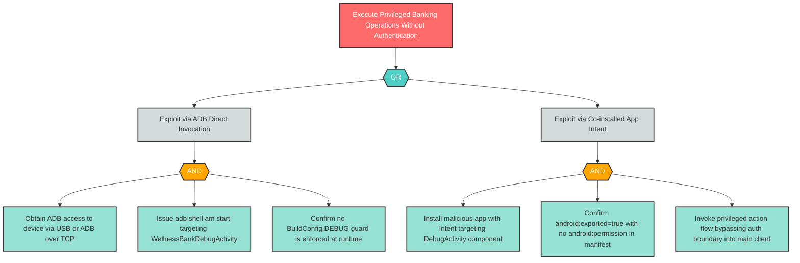

---

### E-2: Unauthorized Money Transfer via Intent Hijacking and Privilege Escalation

**Component**: MoneyTransferActivity | **Risk Level**: Critical | **Finding**: E-2

A malicious co-installed app exploits the exported MoneyTransferActivity to initiate unauthorized fund transfers under the legitimate user's authenticated session, escalating from unprivileged-app context to full banking privileges.

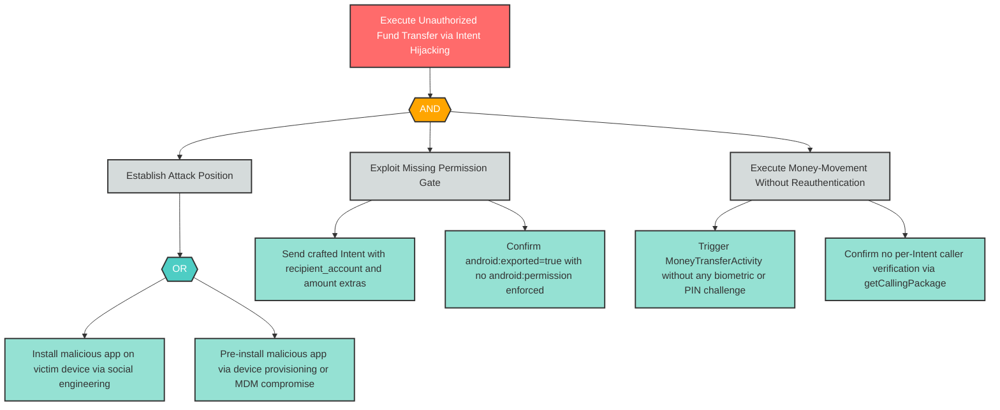

---

### I-1: Insecure Mobile Communication — Client-to-Backend MITM

**Component**: WellnessBank Android Client | **Risk Level**: Critical | **Finding**: I-1

An attacker on a rogue Wi-Fi access point performs a MITM attack against the unpinned TLS connection between the Android client and the backend API, intercepting session tokens and financial data.

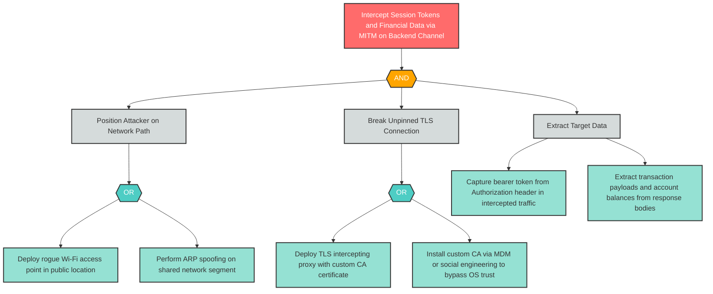

---

### I-2: Inadequate Mobile Privacy Controls — Screen Capture and PII Leakage

**Component**: WellnessBank Android Client | **Risk Level**: Critical | **Finding**: I-2

An attacker exploits the absence of FLAG_SECURE and privacy controls to capture financial PII from the device screen, Android recents, or analytics telemetry without any access to the encrypted data stores.

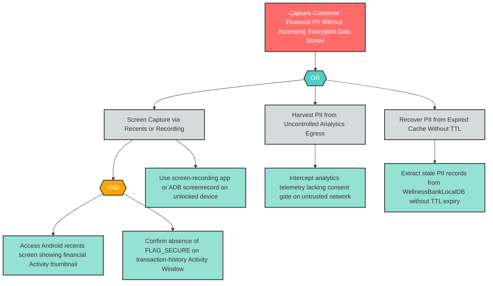

---

### I-3: Insecure Mobile Data Storage — Unencrypted SQLite via Cloud Backup

**Component**: WellnessBankLocalDB | **Risk Level**: Critical | **Finding**: I-3

An attacker who compromises a user's Google account recovers complete transaction history and account snapshots from Google Drive cloud backup, bypassing device authentication entirely.

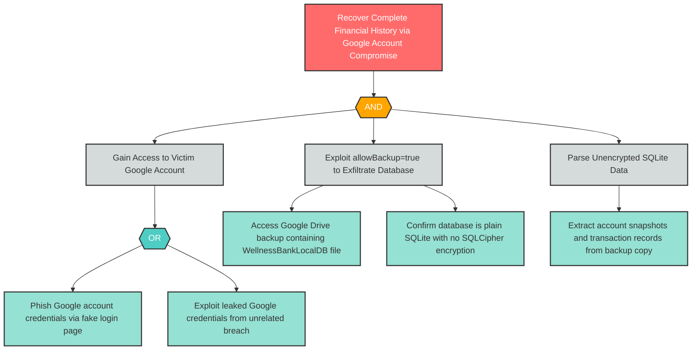

---

### I-4: Insufficient Mobile Cryptography — Weak PIN-Based Key Derivation

**Component**: WellnessBank Android Client | **Risk Level**: Critical | **Finding**: I-4

An attacker obtains encrypted data from the device and brute-forces the 4-digit PIN space in under one second, recovering the derived key and decrypting all protected credentials and data.

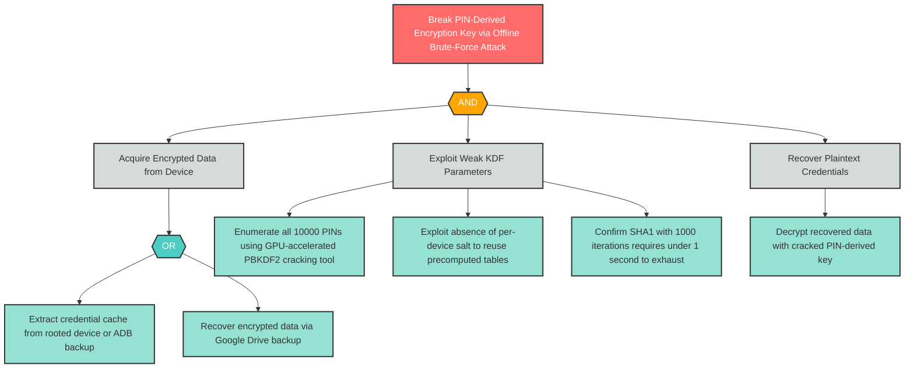

---

### I-7: Insecure Mobile Data Storage — Credential Cache in Plaintext SharedPreferences

**Component**: WellnessBankCredentialCache | **Risk Level**: Critical | **Finding**: I-7

An attacker extracts long-lived session tokens from plaintext SharedPreferences, enabling full account access without any biometric or PIN challenge.

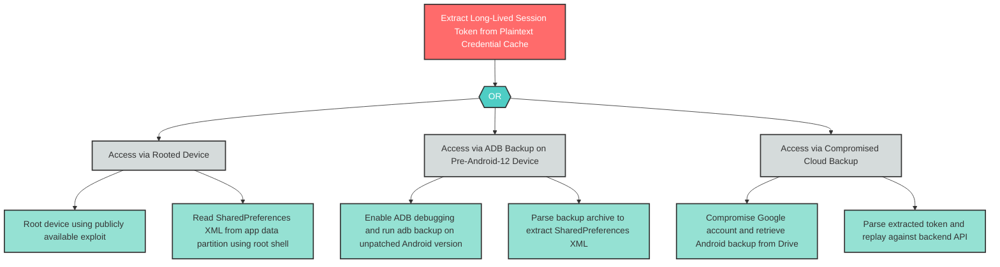

---

### I-8: Debug Log PII Leakage via Logcat

**Component**: WellnessBank Android Client | **Risk Level**: Critical | **Finding**: I-8

An attacker harvests authentication credentials (username and session token) written to the device-shared logcat sink by unguarded Log.d calls retained in the release build.

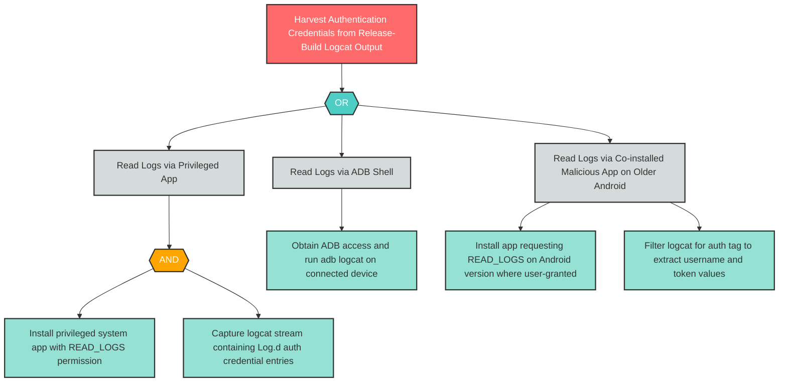

---

### R-1: M8 Accountability-Loss — Missing Audit Logging and Log PII Leakage

**Component**: WellnessBank Android Client | **Risk Level**: Critical | **Finding**: R-1

An attacker exploits the absence of tamper-evident audit logging and the presence of credential-leaking debug logs to cover financial fraud and deny forensic reconstruction of authentication events. MITRE ATT&CK Mobile T1398 describes tampering with mobile OS audit logs; this finding notes the absence of such logs as the root exposure.

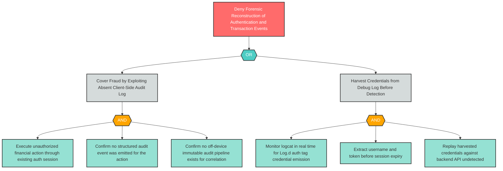

---

### S-1: Improper Mobile Credential Usage — Auth Token in Unprotected SharedPreferences

**Component**: WellnessBank Android Client | **Risk Level**: Critical | **Finding**: S-1

An attacker who physically or remotely accesses a rooted device extracts long-lived authentication credentials from unencrypted SharedPreferences and achieves full account impersonation.

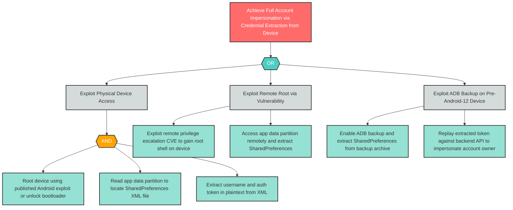

---

### S-2: Insecure Mobile Authentication — No Biometric Step-Up on Money Movement

**Component**: WellnessBank Android Client | **Risk Level**: Critical | **Finding**: S-2

An attacker who obtains a valid session token executes fund transfers without any biometric or secondary-factor challenge, exploiting the absence of step-up authentication on sensitive operations.

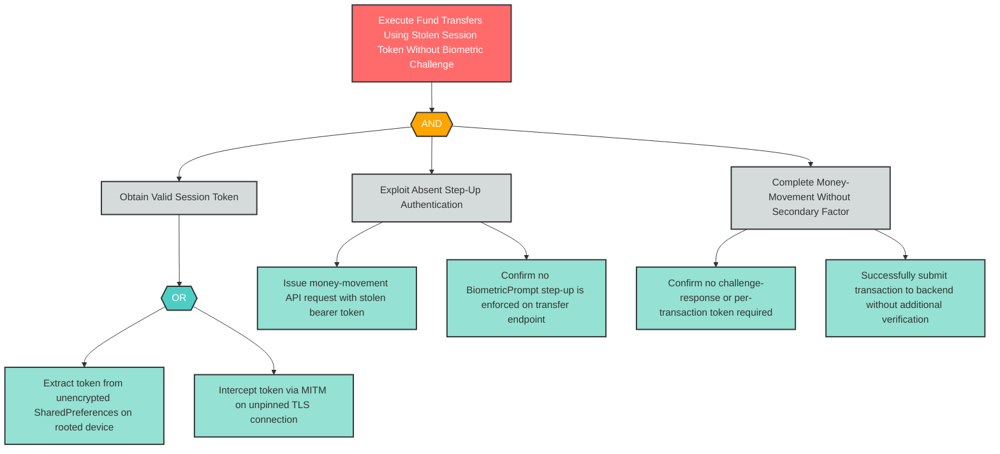

---

### T-3: Mobile IPC Input Validation — Intent Hijacking into Money Movement

**Component**: MoneyTransferActivity | **Risk Level**: Critical | **Finding**: T-3

A malicious co-installed application sends a crafted Android Intent to the exported MoneyTransferActivity, directly invoking the money-movement business logic with attacker-controlled recipient and amount parameters.

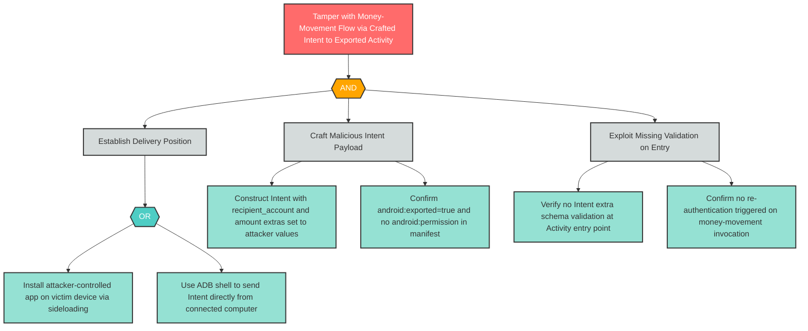

---

### T-4: Insufficient Mobile Binary Protections — No Obfuscation or Anti-Tampering

**Component**: WellnessBank Android Client | **Risk Level**: Critical | **Finding**: T-4

An attacker uses dynamic instrumentation tooling to hook security-critical functions in the unobfuscated release APK, bypassing client-side controls and extracting embedded secrets. MITRE ATT&CK Mobile T1626 describes exploitation of unprotected Android applications.

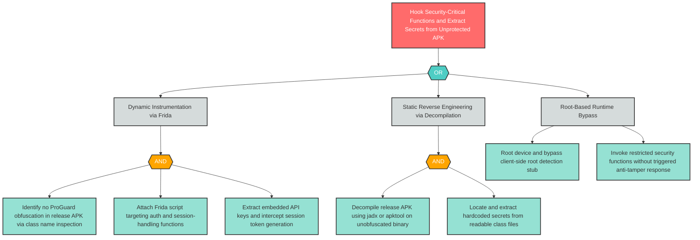

---

### D-2: Missing Rate Limiting on Backend Transaction API

**Component**: WellnessBank Backend API | **Risk Level**: High | **Finding**: D-2

An attacker uses compromised or cloned client applications to flood the backend transaction API with high-volume requests, saturating processing capacity and denying service to legitimate users.

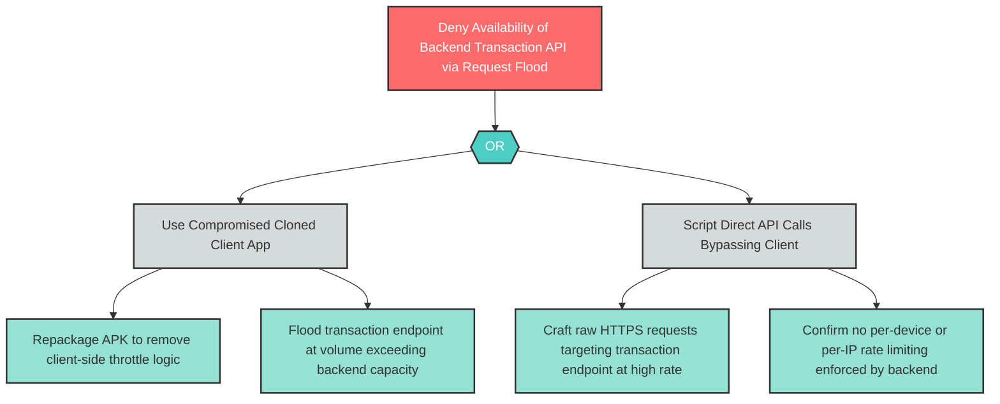

---

### E-3: Server-Side Authorization Gap for Debug-Initiated Operations

**Component**: WellnessBank Backend API | **Risk Level**: High | **Finding**: E-3

An attacker exploiting the debug Activity (E-1) initiates privileged operations that the backend accepts on the basis of the session token alone, without verifying that the request originated from a legitimate in-app user action.

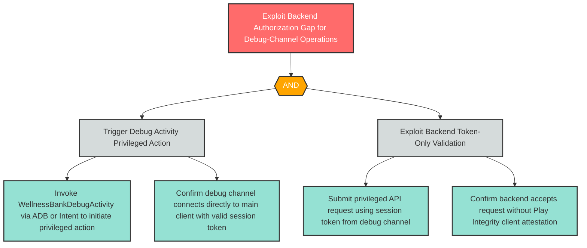

---

### I-6: Insecure Mobile Communication — Payment SDK MITM

**Component**: WellnessPaySDK | **Risk Level**: High | **Finding**: I-6

An attacker intercepts the unpinned TLS connection between WellnessPaySDK and the Third-Party Payment Provider, capturing or modifying payment authorization requests containing card data and transaction amounts.

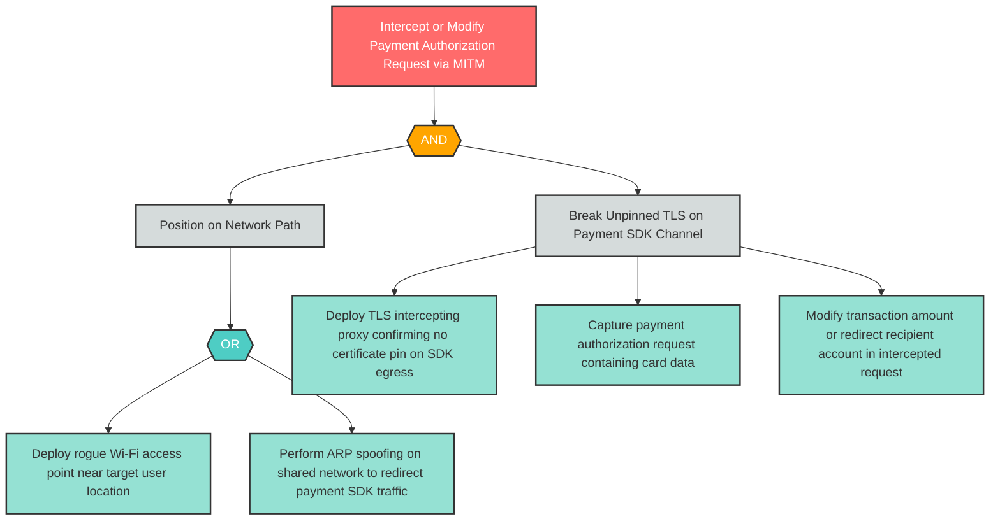

---

### R-2: Missing Backend Audit Trail on Transaction Operations

**Component**: WellnessBank Backend API | **Risk Level**: High | **Finding**: R-2

An attacker or insider performs unauthorized privileged operations on the backend API that cannot be forensically reconstructed because no audit event emission is implemented on money-movement or account-write endpoints.

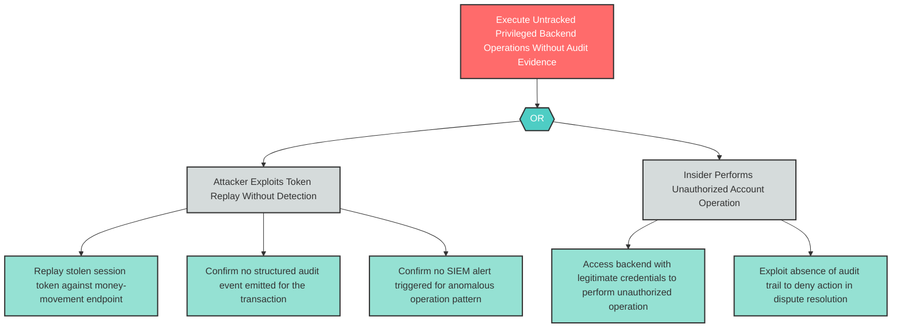

---

### R-4: Unlogged Debug Activity Invocations

**Component**: WellnessBankDebugActivity | **Risk Level**: High | **Finding**: R-4

An attacker invokes privileged operations through the debug Activity channel, leaving no accountability trail that would allow forensic detection or attribution of the unauthorized access.

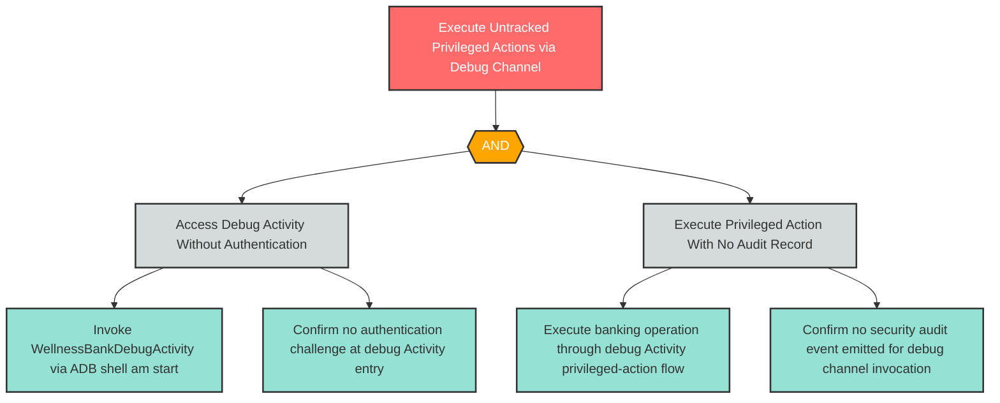

---

### S-3: Credential Theft via SharedPreferences Extraction on Rooted Device

**Component**: WellnessBank Android Client | **Risk Level**: High | **Finding**: S-3

An attacker extracts long-lived auth tokens from MODE_PRIVATE SharedPreferences on a rooted device or via ADB backup, enabling offline credential recovery without live user presence.

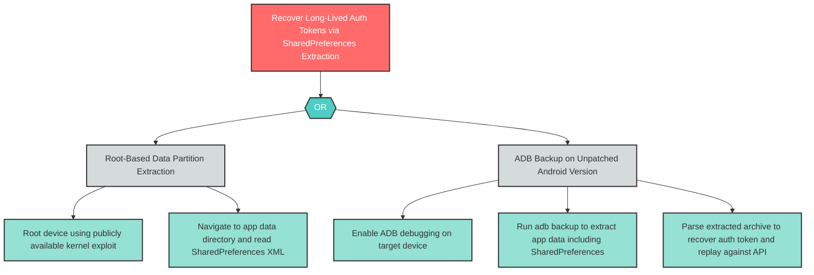

---

### S-5: Long-Lived Session Token Replay

**Component**: Mobile Banking Customer | **Risk Level**: High | **Finding**: S-5

An attacker who obtains a session token replays it indefinitely against the backend API because no token rotation policy or expiry enforcement exists, transforming a temporary credential theft into a permanent account compromise.

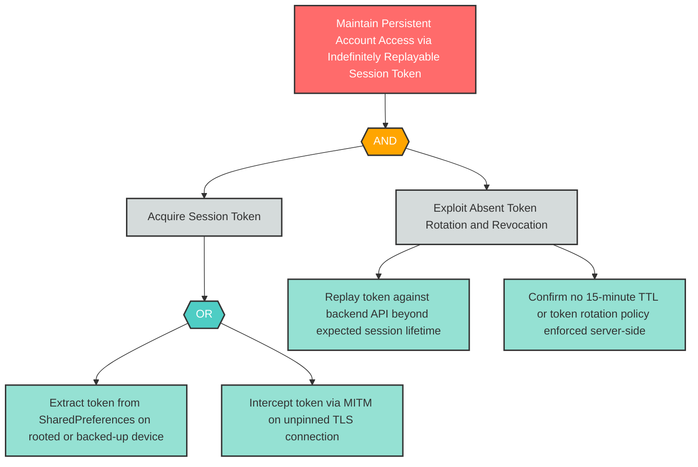

---

### T-1: Mobile Supply Chain Integrity — Analytics SDK Compromise

**Component**: WellnessAnalyticsSDK | **Risk Level**: High | **Finding**: T-1

An attacker compromises the WellnessAnalyticsSDK supply chain by exploiting the floating version constraint and absent artifact checksum verification, injecting malicious code that executes inside the application's full security context. MITRE ATT&CK Mobile T1474 describes supply chain compromise of mobile applications; this technique is noted in prose per ADR-036 D-7.

```mermaid
flowchart TD
    T1_root["Inject Malicious Code via Compromised Analytics SDK Supply Chain"]
    T1_and1{{"AND"}}
    T1_sub1["Compromise SDK Distribution Channel"]
    T1_sub2["Exploit Absent Integrity Verification in Build"]
    T1_leaf1["Compromise analytics SDK maintainer account or repository"]
    T1_leaf2["Publish malicious SDK version with injected credential-harvesting code"]
    T1_leaf3["Confirm floating version constraint in Gradle causes auto-update to malicious version"]
    T1_leaf4["Confirm no checksum or SLSA attestation verified at Gradle ingestion time"]
    T1_leaf5["Malicious SDK executes in app process and exfiltrates SharedPreferences token"]

    T1_root --> T1_and1
    T1_and1 --> T1_sub1
    T1_and1 --> T1_sub2
    T1_sub1 --> T1_leaf1
    T1_sub1 --> T1_leaf2
    T1_sub2 --> T1_leaf3
    T1_sub2 --> T1_leaf4
    T1_sub2 --> T1_leaf5

    classDef goal fill:#ff6b6b,stroke:#333,stroke-width:2px,color:#fff
    classDef andGate fill:#ffa500,stroke:#333,stroke-width:2px,color:#fff
    classDef orGate fill:#4ecdc4,stroke:#333,stroke-width:2px,color:#fff
    classDef subGoal fill:#d5dbdb,stroke:#333,stroke-width:2px,color:#333
    classDef leaf fill:#95e1d3,stroke:#333,stroke-width:2px,color:#333

    class T1_root goal
    class T1_and1 andGate
    class T1_sub1,T1_sub2 subGoal
    class T1_leaf1,T1_leaf2,T1_leaf3,T1_leaf4,T1_leaf5 leaf
```

---

### T-2: Mobile Supply Chain Integrity — Payment SDK Compromise

**Component**: WellnessPaySDK | **Risk Level**: High | **Finding**: T-2

An attacker compromises the WellnessPaySDK supply chain, injecting code that intercepts or modifies payment authorization requests before they leave the device. MITRE ATT&CK Mobile T1474 is relevant prose context per ADR-036 D-7.

```mermaid
flowchart TD
    T2_root["Intercept Payment Authorization Requests via Compromised Payment SDK"]
    T2_and1{{"AND"}}
    T2_sub1["Compromise Payment SDK Distribution Channel"]
    T2_sub2["Exploit Absent SDK Integrity Verification"]
    T2_leaf1["Compromise payment SDK vendor or distribution repository"]
    T2_leaf2["Inject code that intercepts payment authorization API calls in-process"]
    T2_leaf3["Confirm floating Gradle version constraint allows auto-update"]
    T2_leaf4["Confirm no checksum or signed-artifact policy on payment SDK ingestion"]
    T2_leaf5["Capture payment card data and transaction amounts before SDK sends request"]

    T2_root --> T2_and1
    T2_and1 --> T2_sub1
    T2_and1 --> T2_sub2
    T2_sub1 --> T2_leaf1
    T2_sub1 --> T2_leaf2
    T2_sub2 --> T2_leaf3
    T2_sub2 --> T2_leaf4
    T2_sub2 --> T2_leaf5

    classDef goal fill:#ff6b6b,stroke:#333,stroke-width:2px,color:#fff
    classDef andGate fill:#ffa500,stroke:#333,stroke-width:2px,color:#fff
    classDef orGate fill:#4ecdc4,stroke:#333,stroke-width:2px,color:#fff
    classDef subGoal fill:#d5dbdb,stroke:#333,stroke-width:2px,color:#333
    classDef leaf fill:#95e1d3,stroke:#333,stroke-width:2px,color:#333

    class T2_root goal
    class T2_and1 andGate
    class T2_sub1,T2_sub2 subGoal
    class T2_leaf1,T2_leaf2,T2_leaf3,T2_leaf4,T2_leaf5 leaf
```

---

### T-5: Unencrypted Local Database Tampering

**Component**: WellnessBankLocalDB | **Risk Level**: High | **Finding**: T-5

An attacker with root or ADB access modifies the unencrypted SQLite database, fabricating transaction history or manipulating account balance data displayed to the user.

```mermaid
flowchart TD
    T5_root["Fabricate Transaction History by Tampering with Unencrypted Local Database"]
    T5_or1{{"OR"}}
    T5_sub1["Direct Database Modification via Root Shell"]
    T5_sub2["Database Modification via ADB File Access"]
    T5_leaf1["Root device to gain shell access to app data partition"]
    T5_leaf2["Locate WellnessBankLocalDB SQLite file in app files directory"]
    T5_leaf3["Modify transaction records or account snapshot using sqlite3 CLI"]
    T5_leaf4["Enable ADB file-transfer access on unpatched Android device"]
    T5_leaf5["Pull database file via adb pull and modify with sqlite3 on attacker machine"]
    T5_leaf6["Push modified database back to device via adb push to overwrite original"]

    T5_root --> T5_or1
    T5_or1 --> T5_sub1
    T5_or1 --> T5_sub2
    T5_sub1 --> T5_leaf1
    T5_sub1 --> T5_leaf2
    T5_sub1 --> T5_leaf3
    T5_sub2 --> T5_leaf4
    T5_sub2 --> T5_leaf5
    T5_sub2 --> T5_leaf6

    classDef goal fill:#ff6b6b,stroke:#333,stroke-width:2px,color:#fff
    classDef andGate fill:#ffa500,stroke:#333,stroke-width:2px,color:#fff
    classDef orGate fill:#4ecdc4,stroke:#333,stroke-width:2px,color:#fff
    classDef subGoal fill:#d5dbdb,stroke:#333,stroke-width:2px,color:#333
    classDef leaf fill:#95e1d3,stroke:#333,stroke-width:2px,color:#333

    class T5_root goal
    class T5_or1 orGate
    class T5_sub1,T5_sub2 subGoal
    class T5_leaf1,T5_leaf2,T5_leaf3,T5_leaf4,T5_leaf5,T5_leaf6 leaf
```

---

### T-6: Credential Cache Tampering via SharedPreferences Overwrite

**Component**: WellnessBankCredentialCache | **Risk Level**: High | **Finding**: T-6

An attacker with root access overwrites the SharedPreferences credential store to inject forged auth tokens, enabling session hijacking without needing to extract legitimate credentials.

```mermaid
flowchart TD
    T6_root["Hijack Session by Injecting Forged Auth Token into Credential Cache"]
    T6_and1{{"AND"}}
    T6_sub1["Gain Write Access to SharedPreferences File"]
    T6_sub2["Inject Forged Credentials and Exploit Session"]
    T6_leaf1["Root device to obtain write access to app data partition"]
    T6_leaf2["Locate SharedPreferences XML file for WellnessBankCredentialCache"]
    T6_leaf3["Overwrite token value with attacker-controlled forged auth token"]
    T6_leaf4["Confirm no HMAC integrity check validates credential cache at read time"]
    T6_leaf5["Launch app and confirm forged token used for API authentication"]

    T6_root --> T6_and1
    T6_and1 --> T6_sub1
    T6_and1 --> T6_sub2
    T6_sub1 --> T6_leaf1
    T6_sub1 --> T6_leaf2
    T6_sub2 --> T6_leaf3
    T6_sub2 --> T6_leaf4
    T6_sub2 --> T6_leaf5

    classDef goal fill:#ff6b6b,stroke:#333,stroke-width:2px,color:#fff
    classDef andGate fill:#ffa500,stroke:#333,stroke-width:2px,color:#fff
    classDef orGate fill:#4ecdc4,stroke:#333,stroke-width:2px,color:#fff
    classDef subGoal fill:#d5dbdb,stroke:#333,stroke-width:2px,color:#333
    classDef leaf fill:#95e1d3,stroke:#333,stroke-width:2px,color:#333

    class T6_root goal
    class T6_and1 andGate
    class T6_sub1,T6_sub2 subGoal
    class T6_leaf1,T6_leaf2,T6_leaf3,T6_leaf4,T6_leaf5 leaf
```

---

## 6. Remediation Roadmap

This roadmap transforms all 31 findings into actionable items ordered by risk priority. The distribution is: **13 Immediate** (Critical), **11 Short-term** (High), **3 Medium-term** (Medium), **4 Backlog** (Low/Note). The most impacted component is the WellnessBank Android Client with 11 findings — remediation should begin there with a dedicated Android security hardening initiative.

### Immediate Priority (Critical — Before Deployment)

| Finding ID | Component | Mitigation | Effort | Dependencies |
|------------|-----------|------------|--------|--------------|
| S-1 | WellnessBank Android Client | Migrate to Android Keystore + EncryptedSharedPreferences; bind key release to BiometricPrompt.CryptoObject; rotate tokens on every use | High | Prerequisite for S-3, T-6 |
| S-2 | WellnessBank Android Client | Enforce BiometricPrompt step-up on all sensitive operations; bind refresh tokens to Play Integrity attestation | High | Depends on S-1 Keystore migration |
| T-3 | MoneyTransferActivity | Set android:exported="false" or declare signature-level permission; require re-auth on every invocation; validate all Intent extras | Medium | Related to E-2 — remediate together |
| T-4 | WellnessBank Android Client | Enable ProGuard/R8; integrate Play Integrity API; add RASP anti-tampering stubs and APK signature integrity check | High | Independent; high priority for binary release |
| R-1 | WellnessBank Android Client | Emit structured audit events on all auth state transitions; gate Log.d on BuildConfig.DEBUG; forward audit records off-device to immutable store | High | Related to I-8 — implement logging facade first |
| I-1 | WellnessBank Android Client | Configure OkHttp CertificatePinner + Network Security Config pin-set across all environments | Medium | None |
| I-2 | WellnessBank Android Client | Apply FLAG_SECURE to all financial Activity Windows; consent-gate analytics SDK; enforce cache TTL | Medium | Related to I-5 on analytics SDK |
| I-3 | WellnessBankLocalDB | Encrypt via SQLCipher with Keystore-bound key; set allowBackup="false" | High | Depends on Keystore infrastructure from S-1 |
| I-4 | WellnessBank Android Client | Replace with Argon2id/PBKDF2-SHA256 at ≥600K iterations + per-device salt; envelope-encrypt with Keystore-bound hardware key | High | Depends on Keystore infrastructure from S-1 |
| I-7 | WellnessBankCredentialCache | Migrate to EncryptedSharedPreferences; set allowBackup="false" | High | Depends on S-1 Keystore migration |
| I-8 | WellnessBank Android Client | Gate all Log.d/Log.v on BuildConfig.DEBUG; run LogDetector lint rule in CI | Low | Related to R-1 — implement as part of audit logging sprint |
| E-1 | WellnessBankDebugActivity | Strip debug Activity from release builds via build-flavor config; add build-time validation; integrate Play Integrity on privileged paths | Medium | None — highest priority structural fix |
| E-2 | MoneyTransferActivity | Set android:exported="false" or signature-level permission; require re-auth at every money-movement entry | Medium | Remediate with T-3 — same component |

### Short-Term Priority (High — Current Development Cycle)

| Finding ID | Component | Mitigation | Effort | Dependencies |
|------------|-----------|------------|--------|--------------|
| S-3 | WellnessBank Android Client | EncryptedSharedPreferences + Keystore; enforce credential rotation; short-lived tokens | High | Depends on S-1 completion |
| S-5 | Mobile Banking Customer | Short-lived session tokens (15 min TTL); refresh token rotation with revocation | Medium | Requires backend token revocation infrastructure |
| T-1 | WellnessAnalyticsSDK | Pin SDK to exact version with Gradle integrity constraints; supplier provenance review gate | Low | None |
| T-2 | WellnessPaySDK | Pin SDK to exact version with Gradle integrity constraints; app-store-only distribution | Low | None |
| T-5 | WellnessBankLocalDB | SQLCipher encryption with Keystore-bound key; allowBackup="false" | High | Depends on I-3 Keystore/backup work |
| T-6 | WellnessBankCredentialCache | EncryptedSharedPreferences; Keystore-bound encryption | High | Depends on S-1, I-7 completion |
| R-2 | WellnessBank Backend API | Structured audit events on all privileged backend operations; SIEM/write-once bucket | High | None |
| R-4 | WellnessBankDebugActivity | Strip from release builds; emit audit event on any debug Activity invocation | Low | Depends on E-1 completion |
| I-6 | WellnessPaySDK | Certificate pinning on WellnessPaySDK to payment provider TLS flow | Medium | None |
| D-2 | WellnessBank Backend API | Per-device rate limiting; WAF; Play Integrity client verification | High | None |
| E-3 | WellnessBank Backend API | Play Integrity attestation on sensitive backend operations; reject unverified client contexts | High | Depends on Play Integrity infrastructure from T-4 |

### Medium-Term Priority (Medium — Next Planning Cycle)

| Finding ID | Component | Mitigation | Effort | Dependencies |
|------------|-----------|------------|--------|--------------|
| S-4 | WellnessBank Backend API | Implement DPoP or mTLS token binding; verify Play Integrity server-side | High | Depends on Play Integrity infrastructure |
| R-3 | Mobile Banking Customer | Transaction signing with BiometricPrompt.CryptoObject + StrongBox-bound key | High | Depends on BiometricPrompt infrastructure from S-2 |
| I-5 | WellnessAnalyticsSDK | Certificate pinning on analytics SDK egress; review telemetry content for PII | Medium | Related to I-2 analytics consent gate |

### Backlog (Low/Note — Future Consideration)

| Finding ID | Component | Mitigation | Effort | Dependencies |
|------------|-----------|------------|--------|--------------|
| D-1 | WellnessBank Android Client | Circuit breakers and rate limits on SDK I/O; battery-aware scheduling | Medium | None |
| D-4 | WellnessBankCredentialCache | HMAC integrity validation on cached credentials; clear recovery path | Medium | Depends on T-6 credential cache work |
| I-9 | WellnessBank Backend API | Centralized error handling returning generic codes to client; log full context server-side only | Low | None |
| D-3 | WellnessBankLocalDB | Cache eviction policies with max row count and TTL expiry; monitor DB size via analytics | Low | Related to I-3 database work |

---

## 7. Appendix: Finding Reference

Complete mapping of all 31 findings from the threat model. Every finding from threats.md Sections 3 and 4 appears below.

| Finding ID | Report Section | Heading Reference |
|------------|----------------|-------------------|
| S-1 | Section 3.1 | 3.1 Spoofing |
| S-1 | Section 4 | Theme 3: Credential and Session Token Lifecycle Failures |
| S-1 | Section 5 | S-1: Improper Mobile Credential Usage — Auth Token in Unprotected SharedPreferences |
| S-1 | Section 6 | Immediate Priority (Critical) |
| S-2 | Section 3.1 | 3.1 Spoofing |
| S-2 | Section 4 | Theme 1: WellnessBank Android Client as High-Risk Nexus |
| S-2 | Section 5 | S-2: Insecure Mobile Authentication — No Biometric Step-Up on Money Movement |
| S-2 | Section 6 | Immediate Priority (Critical) |
| S-3 | Section 3.1 | 3.1 Spoofing |
| S-3 | Section 4 | Theme 3: Credential and Session Token Lifecycle Failures |
| S-3 | Section 5 | S-3: Credential Theft via SharedPreferences Extraction on Rooted Device |
| S-3 | Section 6 | Short-Term Priority (High) |
| S-4 | Section 3.1 | 3.1 Spoofing |
| S-4 | Section 4 | Theme 3: Credential and Session Token Lifecycle Failures |
| S-4 | Section 6 | Medium-Term Priority (Medium) |
| S-5 | Section 3.1 | 3.1 Spoofing |
| S-5 | Section 4 | Theme 3: Credential and Session Token Lifecycle Failures |
| S-5 | Section 5 | S-5: Long-Lived Session Token Replay |
| S-5 | Section 6 | Short-Term Priority (High) |
| T-1 | Section 3.2 | 3.2 Tampering |
| T-1 | Section 5 | T-1: Mobile Supply Chain Integrity — Analytics SDK Compromise |
| T-1 | Section 6 | Short-Term Priority (High) |
| T-2 | Section 3.2 | 3.2 Tampering |
| T-2 | Section 5 | T-2: Mobile Supply Chain Integrity — Payment SDK Compromise |
| T-2 | Section 6 | Short-Term Priority (High) |
| T-3 | Section 3.2 | 3.2 Tampering |
| T-3 | Section 4 | Theme 4: Android IPC Attack Surface (Intent Hijacking Chain) |
| T-3 | Section 5 | T-3: Mobile IPC Input Validation — Intent Hijacking into Money Movement |
| T-3 | Section 6 | Immediate Priority (Critical) |
| T-4 | Section 3.2 | 3.2 Tampering |
| T-4 | Section 4 | Theme 1: WellnessBank Android Client as High-Risk Nexus |
| T-4 | Section 5 | T-4: Insufficient Mobile Binary Protections — No Obfuscation or Anti-Tampering |
| T-4 | Section 6 | Immediate Priority (Critical) |
| T-5 | Section 3.2 | 3.2 Tampering |
| T-5 | Section 5 | T-5: Unencrypted Local Database Tampering |
| T-5 | Section 6 | Short-Term Priority (High) |
| T-6 | Section 3.2 | 3.2 Tampering |
| T-6 | Section 5 | T-6: Credential Cache Tampering via SharedPreferences Overwrite |
| T-6 | Section 6 | Short-Term Priority (High) |
| R-1 | Section 3.3 | 3.3 Repudiation |
| R-1 | Section 4 | Theme 5: Absent Audit and Non-Repudiation Controls |
| R-1 | Section 5 | R-1: M8 Accountability-Loss — Missing Audit Logging and Log PII Leakage |
| R-1 | Section 6 | Immediate Priority (Critical) |
| R-2 | Section 3.3 | 3.3 Repudiation |
| R-2 | Section 4 | Theme 5: Absent Audit and Non-Repudiation Controls |
| R-2 | Section 5 | R-2: Missing Backend Audit Trail on Transaction Operations |
| R-2 | Section 6 | Short-Term Priority (High) |
| R-3 | Section 3.3 | 3.3 Repudiation |
| R-3 | Section 4 | Theme 5: Absent Audit and Non-Repudiation Controls |
| R-3 | Section 6 | Medium-Term Priority (Medium) |
| R-4 | Section 3.3 | 3.3 Repudiation |
| R-4 | Section 4 | Theme 4: Android IPC Attack Surface (Intent Hijacking Chain) |
| R-4 | Section 5 | R-4: Unlogged Debug Activity Invocations |
| R-4 | Section 6 | Short-Term Priority (High) |
| I-1 | Section 3.4 | 3.4 Information Disclosure |
| I-1 | Section 4 | Theme 2: Missing Certificate Pinning Across All Network Channels |
| I-1 | Section 5 | I-1: Insecure Mobile Communication — Client-to-Backend MITM |
| I-1 | Section 6 | Immediate Priority (Critical) |
| I-2 | Section 3.4 | 3.4 Information Disclosure |
| I-2 | Section 4 | Theme 1: WellnessBank Android Client as High-Risk Nexus |
| I-2 | Section 5 | I-2: Inadequate Mobile Privacy Controls — Screen Capture and PII Leakage |
| I-2 | Section 6 | Immediate Priority (Critical) |
| I-3 | Section 3.4 | 3.4 Information Disclosure |
| I-3 | Section 5 | I-3: Insecure Mobile Data Storage — Unencrypted SQLite via Cloud Backup |
| I-3 | Section 6 | Immediate Priority (Critical) |
| I-4 | Section 3.4 | 3.4 Information Disclosure |
| I-4 | Section 4 | Theme 1: WellnessBank Android Client as High-Risk Nexus |
| I-4 | Section 5 | I-4: Insufficient Mobile Cryptography — Weak PIN-Based Key Derivation |
| I-4 | Section 6 | Immediate Priority (Critical) |
| I-5 | Section 3.4 | 3.4 Information Disclosure |
| I-5 | Section 4 | Theme 2: Missing Certificate Pinning Across All Network Channels |
| I-5 | Section 6 | Medium-Term Priority (Medium) |
| I-6 | Section 3.4 | 3.4 Information Disclosure |
| I-6 | Section 4 | Theme 2: Missing Certificate Pinning Across All Network Channels |
| I-6 | Section 5 | I-6: Insecure Mobile Communication — Payment SDK MITM |
| I-6 | Section 6 | Short-Term Priority (High) |
| I-7 | Section 3.4 | 3.4 Information Disclosure |
| I-7 | Section 4 | Theme 3: Credential and Session Token Lifecycle Failures |
| I-7 | Section 5 | I-7: Insecure Mobile Data Storage — Credential Cache in Plaintext SharedPreferences |
| I-7 | Section 6 | Immediate Priority (Critical) |
| I-8 | Section 3.4 | 3.4 Information Disclosure |
| I-8 | Section 4 | Theme 5: Absent Audit and Non-Repudiation Controls |
| I-8 | Section 5 | I-8: Debug Log PII Leakage via Logcat |
| I-8 | Section 6 | Immediate Priority (Critical) |
| I-9 | Section 3.4 | 3.4 Information Disclosure |
| I-9 | Section 6 | Backlog |
| D-1 | Section 3.5 | 3.5 Denial of Service |
| D-1 | Section 6 | Backlog |
| D-2 | Section 3.5 | 3.5 Denial of Service |
| D-2 | Section 5 | D-2: Missing Rate Limiting on Backend Transaction API |
| D-2 | Section 6 | Short-Term Priority (High) |
| D-3 | Section 3.5 | 3.5 Denial of Service |
| D-3 | Section 6 | Backlog |
| D-4 | Section 3.5 | 3.5 Denial of Service |
| D-4 | Section 6 | Backlog |
| E-1 | Section 3.6 | 3.6 Elevation of Privilege |
| E-1 | Section 4 | Theme 4: Android IPC Attack Surface (Intent Hijacking Chain) |
| E-1 | Section 5 | E-1: Exported Debug Activity Bypassing Authentication Boundary |
| E-1 | Section 6 | Immediate Priority (Critical) |
| E-2 | Section 3.6 | 3.6 Elevation of Privilege |
| E-2 | Section 4 | Theme 4: Android IPC Attack Surface (Intent Hijacking Chain) |
| E-2 | Section 5 | E-2: Unauthorized Money Transfer via Intent Hijacking and Privilege Escalation |
| E-2 | Section 6 | Immediate Priority (Critical) |
| E-3 | Section 3.6 | 3.6 Elevation of Privilege |
| E-3 | Section 5 | E-3: Server-Side Authorization Gap for Debug-Initiated Operations |
| E-3 | Section 6 | Short-Term Priority (High) |
