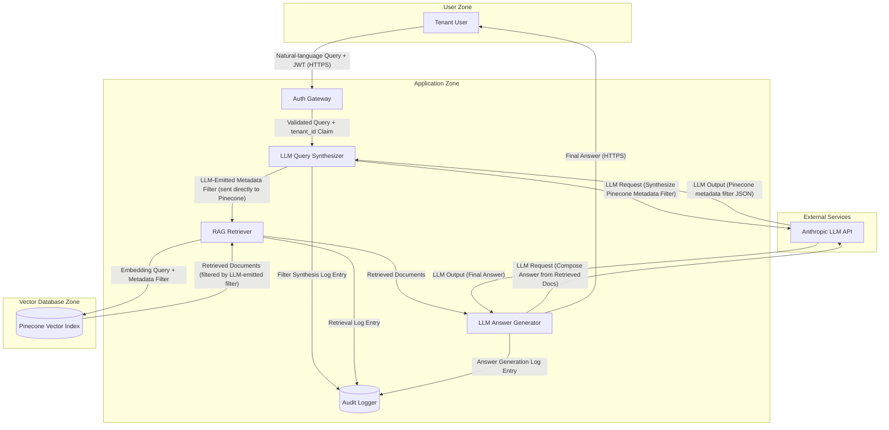

# Multi-Tenant RAG Application — Architecture

Example architecture input for a multi-tenant Retrieval-Augmented Generation (RAG) application backed by Pinecone as the vector database. The application supports multiple tenant organizations whose corpora are co-located in a single Pinecone index, scoped at query time by a `tenant_id` metadata filter. The LLM Query Synthesizer is responsible for translating a user's natural-language question into a Pinecone metadata filter expression; the application sends that filter directly to Pinecone without server-side filter composition or base-filter pinning. This exercises the Feature 292 Cat 6 (Vector / Search-DSL Injection) pattern surface: the LLM-synthesized filter can omit the `tenant_id` clause, returning documents from other tenants whose data should not be retrievable for the requesting tenant — functionally equivalent to SQL injection across a tenant boundary.

format: mermaid

## Component Descriptions

### Tenant User (External Entity)

An end user belonging to one of the multiple tenant organizations served by this application. The user authenticates via JWT and submits natural-language queries against their tenant's document corpus. The user should only be able to retrieve documents owned by their own tenant.

### Auth Gateway (Process)

Validates the user's JWT, extracts the `tenant_id` claim, and forwards the validated query plus tenant context to the LLM Query Synthesizer. **Note**: the gateway only attaches the `tenant_id` to the request context; it does NOT enforce that downstream filter composition includes the tenant clause. Enforcement is the application layer's responsibility.

### LLM Query Synthesizer (Process)

An LLM-powered service that translates a user's natural-language query into a Pinecone metadata filter expression. The synthesizer sends a prompt to the LLM API including the user's query, the schema of the Pinecone metadata fields, and an instruction to emit a JSON filter expression. **Architectural failure mode**: the filter composition happens at the LLM-output layer. The synthesizer trusts the LLM-emitted filter as authoritative and passes it directly to the RAG Retriever without server-side composition of the tenant clause. The LLM is supposed to include `{"tenant_id": {"$eq": "{requesting_tenant}"}}` in the filter but is not constrained to do so; if the LLM omits the clause, the filter passes through unmodified.

### RAG Retriever (Process)

Issues the embedding query plus the LLM-emitted metadata filter to Pinecone. Returns the retrieved documents to the LLM Answer Generator. The retriever does NOT inspect or modify the LLM-emitted filter — it forwards it byte-for-byte to Pinecone.

### Pinecone Vector Index (Data Store)

A single Pinecone index hosting embeddings for all tenant corpora, co-located via the Pool model (shared namespace, metadata-filter scoping). Each vector record carries a `tenant_id` metadata field. Pinecone applies the supplied metadata filter to scope retrieval. **Multi-tenancy is enforced solely by the metadata filter** — there is no namespace-per-tenant separation (Silo model) at this layer.

### LLM Answer Generator (Process)

A second LLM-powered service that composes the final natural-language answer from the retrieved documents. It calls the LLM API with the user's original query and the retrieved document content, then returns the generated answer to the user. This component is downstream of the retrieval surface and is not the locus of the tenant-scoping bypass.

### Audit Logger (Data Store)

Captures filter-synthesis events, retrieval events, and answer-generation events for forensic and compliance review. The audit log is append-only and not affected by the tenant-scoping bypass directly, but it provides post-hoc detection capability if the bypass is exercised.

### Anthropic LLM API (External Service)

The hosted LLM service used both by the Query Synthesizer and the Answer Generator. Communicates via HTTPS.

## Tenant-Scoping Bypass — Failure Mode

The architectural failure mode this baseline exercises is a vector-DB equivalent of SQL injection across tenant boundaries:

1. Tenant A's user submits a query (e.g., "show me the most recent contracts"). The JWT carries `tenant_id = "tenant_a"`.
2. The LLM Query Synthesizer is supposed to emit `{"$and": [{"tenant_id": {"$eq": "tenant_a"}}, {<<query terms>>}]}`.
3. An adversarial prompt (or simply a poorly-tuned LLM under prompt-injection pressure from corpus content) coerces the LLM into emitting only the query-terms portion of the filter, omitting the tenant clause: `{<<query terms>>}`.
4. The RAG Retriever forwards this filter to Pinecone unchanged.
5. Pinecone returns matching documents from ALL tenants, including tenants other than Tenant A.
6. The LLM Answer Generator composes an answer from a corpus that mixes Tenant A's data with other tenants' data — cross-tenant data exfiltration.

The `output-integrity` agent should emit at least one `OI-{N}` finding under Cat 6 (Vector / Search-DSL Injection) on this baseline, naming Pinecone as the engine and pre-retrieval filter composition / base-filter pinning / namespace-per-tenant as canonical mitigations.

## Recommended Mitigations (Defense-in-Depth)

This architecture is presented to exercise the failure mode. A production-grade version of this application would layer the following controls:

- **Pre-retrieval filtering / server-side filter composition**: The RAG Retriever (not the LLM Query Synthesizer) composes the tenant_id clause server-side. The LLM-emitted filter contributes only the query-terms portion; the tenant clause is injected by middleware and the resulting compound filter is what reaches Pinecone.
- **Base filter that cannot be overridden** (Mavik Labs 2026 / Authzed pattern): Middleware AND-composes the tenant pin with the LLM-emitted filter and raises `SecurityError` if the LLM-emitted filter attempts to override the pin (e.g., by emitting a contradictory `tenant_id` clause or by wrapping the filter in a `$not` that nullifies the pin).
- **Namespace-per-tenant** (Pinecone Silo model — strongest control per OWASP LLM08:2025): Each tenant has a dedicated Pinecone namespace. The application selects the namespace from the JWT-validated `tenant_id` BEFORE the query runs; the LLM-emitted filter never crosses tenant boundaries because the namespace is fixed at the application layer.
- **Allowlisted clause keys**: The LLM-emitted filter is parsed and validated against an allowlist of permitted clause keys; any clause key outside the allowlist is rejected. Tenant context is extracted from the validated JWT, never from request parameters or LLM output.
