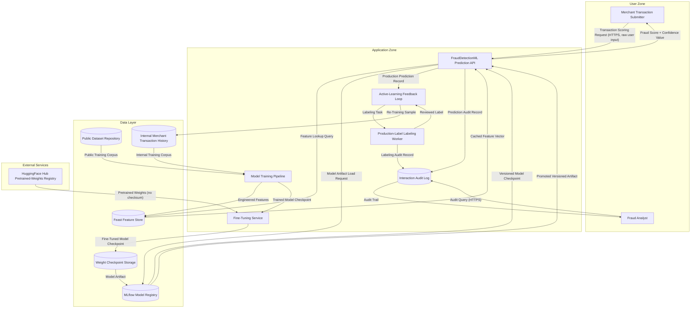

# Predictive-ML Application — Architecture

Hypothetical: example architecture input for a fictional fraud-detection predictive-ML application that scores financial transactions in near-real-time. The diagram demonstrates the F-6 (Feature 232) ML Top 10 Coverage Bundle dispatch surfaces by exhibiting all five predictive-ML topology indicators in one architecture: (a) a training pipeline ingesting from a public dataset repository alongside an internal merchant transaction history, (b) a fine-tuning step that pulls pretrained weights from a public HuggingFace Hub registry without checksum verification, (c) an MLflow MLOps model registry promoting versioned model artifacts to the prediction-serving tier, (d) a prediction-API endpoint serving a classifier with no input-validation barrier and no per-tenant rate limit, and (e) an active-learning feedback loop reading production prediction labels back into the training corpus through a labeling worker without integrity gates. The component "FraudDetectionML" is a fictional fraud-detection classifier (no real bank, no real merchant, no real customer data) framed for adopters as a hypothetical baseline; the architecture deliberately omits adversarial-defense controls, dataset-checksum manifests, signed-artifact policies, model-card review gates, output-perturbation noise, query-rate throttling, DP-SGD on training, label-flip detection on the active-learning loop, and integrity verification at model-load time so that the F-6 detection pipeline emits the full seven-Pattern-Category surface (tampering Cat 10 + data-poisoning Cat 8/9/10 + model-theft Cat 12/13/14) on a clean-slate baseline distinct from `examples/agentic-app/` (F-3 + F-5 mutation target) and `examples/consumer-agent-app/` (F-4 mutation target). The architecture is multi-component (training pipeline + fine-tuning service + model registry + prediction API + active-learning loop + feature store) so that the predictive-ML topology gate per FR-016 is satisfied and the new ML Pattern Categories emit on the predictive-ML surface while remaining inert on the six non-predictive-ML baselines.

format: mermaid

## Component Summary

| Component | DFD Element Type | AI Dispatch Trigger |
|---|---|---|
| Merchant Transaction Submitter | External Entity | None |
| Fraud Analyst | External Entity | None |
| FraudDetectionML Prediction API | Process | Tampering (input-flow target) + Model-Theft ("model API", "inference", "predict") |
| Model Training Pipeline | Process | Data-Poisoning ("training", "training pipeline") |
| Fine-Tuning Service | Process | Data-Poisoning ("fine-tuning pipeline", "fine-tuned") + Model-Theft ("weights", "checkpoint", "fine-tuned") |
| Active-Learning Feedback Loop | Process | Data-Poisoning ("feedback loop", "active learning") |
| Production-Label Labeling Worker | Process | Data-Poisoning ("labeling", "active learning") |
| Public Dataset Repository | Data Store | Data-Poisoning ("training dataset", "dataset repository") |
| Internal Merchant Transaction History | Data Store | Data-Poisoning ("training data", "training corpus") |
| Feast Feature Store | Data Store | Data-Poisoning ("feature store") |
| MLflow Model Registry | Data Store | Model-Theft ("model registry", "MLflow", "model serving") |
| Weight Checkpoint Storage | Data Store | Model-Theft ("weights", "checkpoint") |
| HuggingFace Hub Pretrained-Weights Registry | External Entity | Data-Poisoning ("pretrained weights", "HuggingFace Hub") + Model-Theft ("weights", "registry") |
| Interaction Audit Log | Data Store | None |

## Expected Dispatch Behavior

- **FraudDetectionML Prediction API**: Multi-dispatch. Matches model-theft trigger keywords `model API`, `inference`, `predict` on Process name and description. Receives STRIDE (S, T, R, I, D, E) plus the F-6 ML pattern surface: (1) **tampering Cat 10 — Adversarial Input Manipulation (Predictive ML)** per OWASP ML01:2023 — the prediction API ingests raw user-controlled transaction features into a deployed classifier with no input-validation barrier, no adversarial-defense control, no statistical anomaly detection on inputs, no distribution-shift monitoring, and no confidence-thresholding HITL escalation, exposing the deployed classifier to FGSM/PGD-style decision-boundary attacks against the fraud-scoring surface; (2) **model-theft Cat 12 — Model Inversion (Predictive ML)** per OWASP ML03:2023 — the prediction API returns confidence values without DP-SGD on training, output-perturbation noise injection, query-rate throttling per tenant, or model-extraction-pattern detection, exposing the deployed classifier to gradient-inversion and black-box optimization attacks reconstructing training-set inputs; (3) **model-theft Cat 13 — Membership Inference (Predictive ML)** per OWASP ML04:2023 — the same confidence-value-returning surface is exposed to confidence-thresholding and shadow-model attacks determining training-set membership of specific transactions, with no label-only response mode, no confidence-output truncation, and no training-data minimization enforced. The architecture deliberately omits each of these defense categories so the F-6 detection surface emits on a clean-slate baseline.
- **Model Training Pipeline**: Data-Poisoning dispatch. Matches data-poisoning trigger keywords `training`, `training pipeline`, `training corpus` on Process name and description. Receives STRIDE (T, I, D) plus **data-poisoning Cat 10 — Predictive-ML Supply Chain Completeness (Datasets, Feature Stores, MLOps Registry)** per OWASP ML06:2023 (corpus-side facet per ADR-035 D-4) — the training pipeline ingests from the Public Dataset Repository without checksum verification or dataset-checksum manifest, ingests from the Internal Merchant Transaction History without IAM-enforced write-audit, writes engineered features to the Feast Feature Store without IAM write-audit policy, and emits trained model checkpoints to the Fine-Tuning Service without provenance metadata. The architecture deliberately omits the corpus-side supply-chain controls so the F-6 detection surface emits on a clean-slate baseline.
- **Fine-Tuning Service**: Multi-dispatch. Matches data-poisoning trigger keywords `fine-tuning pipeline`, `fine-tuned`, `pretrained weights` on Process name and description, and matches model-theft trigger keywords `weights`, `checkpoint`, `fine-tuned`. Receives STRIDE (T, I, D) plus **data-poisoning Cat 8 — Transfer Learning Supply Chain (Predictive ML)** per OWASP ML07:2023 — the fine-tuning service pulls pretrained weights from HuggingFace Hub without `revision=` checksum pinning, without signed-weight-artifact policy verification (no Sigstore-style or KMS-backed cryptographic attestation), without an allowlist of trusted pretrained-weight sources, without fine-tuning hash-pinning, and without model-card provenance review. The architecture deliberately omits each transfer-learning supply-chain control so the F-6 detection surface emits on a clean-slate baseline.
- **Active-Learning Feedback Loop**: Data-Poisoning dispatch. Matches data-poisoning trigger keywords `feedback loop`, `active learning`, `online learning` on Process name and description. Receives STRIDE (T, I, D) plus **data-poisoning Cat 9 — Feedback-Loop Model Skewing (Active Learning / Online Learning)** per OWASP ML08:2023 — the active-learning pipeline reads production fraud-score predictions back into the Internal Merchant Transaction History training corpus through the labeling worker without anomaly detection on label distribution drift, without labeler-trust scoring on the labeling worker, without periodic retraining-data audit with held-out canaries, and without drift-detection alarms on production inference distributions. The architecture deliberately omits each feedback-data integrity gate so the F-6 detection surface emits on a clean-slate baseline.
- **Production-Label Labeling Worker**: Data-Poisoning dispatch. Matches data-poisoning trigger keywords `labeling`, `active learning` on Process name and description. Receives STRIDE (T, R, I) plus the data-poisoning Cat 9 surface (shared with the Active-Learning Feedback Loop) — labeling worker reviews flow back into training without labeler-trust scoring or label-flip anomaly detection.
- **Public Dataset Repository**: Data-Poisoning dispatch. Matches data-poisoning trigger keywords `dataset repository`, `training dataset` on Data Store name and description. Receives STRIDE (T, I, D) plus the data-poisoning Cat 10 surface (corpus-side facet) — public dataset repository ingested without dataset-checksum manifest, integrity verification, or model-card review gate before training-pipeline consumption.
- **Internal Merchant Transaction History**: Data-Poisoning dispatch. Matches data-poisoning trigger keywords `training data`, `training corpus` on Data Store name and description. Receives STRIDE (T, I, D) plus the data-poisoning Cat 10 surface — internal training corpus written by both the training pipeline and the active-learning loop without write-audit policy, integrity verification, or held-out-canary periodic audit.
- **Feast Feature Store**: Data-Poisoning dispatch. Matches data-poisoning trigger keywords `feature store` on Data Store name and description. Receives STRIDE (T, I, D) plus the data-poisoning Cat 10 surface — feature store written by the training pipeline and read by the prediction API without IAM-enforced write-audit, without integrity verification on cached feature vectors, and without monitoring for feature-distribution drift.
- **MLflow Model Registry**: Model-Theft dispatch. Matches model-theft trigger keywords `model registry`, `MLflow`, `model serving` on Data Store name and description. Receives STRIDE (T, I, D) plus **model-theft Cat 14 — Predictive-ML Artifact Supply Chain (Model Registry, Weight Tampering)** per OWASP ML06:2023 (artifact-side facet per ADR-035 D-4) — the MLflow registry promotes versioned model artifacts to the prediction-serving tier without signed-artifact policy (no Sigstore-style or KMS-backed cryptographic attestation), without registry IAM with promotion-gate review, without integrity verification at model-load time on the consuming prediction API, and without immutable artifact storage with audit logging on weight-checkpoint mutations.
- **Weight Checkpoint Storage**: Model-Theft dispatch. Matches model-theft trigger keywords `weights`, `checkpoint` on Data Store name and description. Receives STRIDE (T, I, D) plus the model-theft Cat 14 surface (shared with the MLflow Model Registry) — weight checkpoint storage holds fine-tuned model artifacts in mutable storage without integrity-attestation policy or write-audit logging on weight mutations.
- **HuggingFace Hub Pretrained-Weights Registry**: External Entity. Standard STRIDE only (S, R). External entity — no AI dispatch trigger applies to External Entities per the dispatch matrix, but its presence in the architecture supplies the supply-chain trigger context for the consuming Fine-Tuning Service Process (data-poisoning Cat 8 + model-theft Cat 14 implicit signal carried through the Process boundary).
- **Merchant Transaction Submitter**: Standard STRIDE only (S, R). External Entity — no AI keywords. Captured at indicator level (the incoming `Transaction Scoring Request` Data Flow with raw user input is the trust-boundary-crossing signal that satisfies the tampering Cat 10 indicator on the consuming Prediction API Process).
- **Fraud Analyst**: Standard STRIDE only (S, R). External Entity — no AI keywords. Reads from the Audit Log only.
- **Interaction Audit Log**: Standard STRIDE only (T, I, D). Data Store — no AI keywords. Receives prediction audit records and labeling audit records from consuming Processes; the audit trail is the architectural primitive that would support an integrity-attestation review pipeline or label-flip-detection retrospective query, but no such review pipeline or retrospective query is declared, so the audit log is a passive sink rather than an active safeguard.

## Notes for Adopters

This baseline is scoped to demonstrate the F-6 (Feature 232) ML Top 10 Coverage Bundle emission surface — the seven new Pattern Categories spanning OWASP ML01 + ML03 + ML04 + ML06 (two-facet split) + ML07 + ML08 across the three host agents (`tampering`, `data-poisoning`, `model-theft`). The multi-component design is intentional: each of the five predictive-ML topology indicators (training pipeline, fine-tuning step on pretrained weights, MLOps model registry, prediction-API endpoint, active-learning feedback loop) is structurally present so the predictive-ML topology gate per FR-016 is satisfied and the new Pattern Categories emit on the predictive-ML surface while remaining inert on the six non-predictive-ML baselines (`web-app`, `microservices`, `ascii-web-api`, `mermaid-agentic-app`, `free-text-microservice`, `maestro-reference`). The `examples/agentic-app/` baseline (F-3 + F-5 mutation target) demonstrates the LLM/agentic surfaces; the `examples/consumer-agent-app/` baseline (F-4 mutation target) demonstrates the human-trust-exploitation communication-axis surface; this baseline complements both by exercising the predictive-ML supply-chain and inference-surface in a clean-slate multi-component configuration.

For context, not legal interpretation: predictive-ML adversarial-defense and supply-chain integrity guidance from regulatory and standards bodies (see, e.g., NIST AI 100-2 Adversarial Machine Learning taxonomy and OWASP ML Security Top 10:2023) inform the defense-in-depth rationale that motivates the F-6 Pattern Categories. These citations appear in the catalog prose but not in `source_attribution` arrays per the F-A2 referential-integrity validator (only catalog-resolvable IDs from `schemas/taxonomy/owasp.yaml`, `schemas/taxonomy/mitre-atlas.yaml`, and `schemas/taxonomy/mitre-attack.yaml` appear in `source_attribution`). Three of the six MITRE ATLAS techniques cited by the F-6 Pattern Categories — `AML.T0015` (tampering Cat 10), `AML.T0019` (data-poisoning Cat 8), `AML.T0031` (data-poisoning Cat 9) — are absent from `schemas/taxonomy/mitre-atlas.yaml` at F-6 ship time and therefore appear in mitigation prose only as text-only cross-references (mirrors F-5's T1496 prose-only handling at 3x scale per ADR-035 D-numbered decision).
