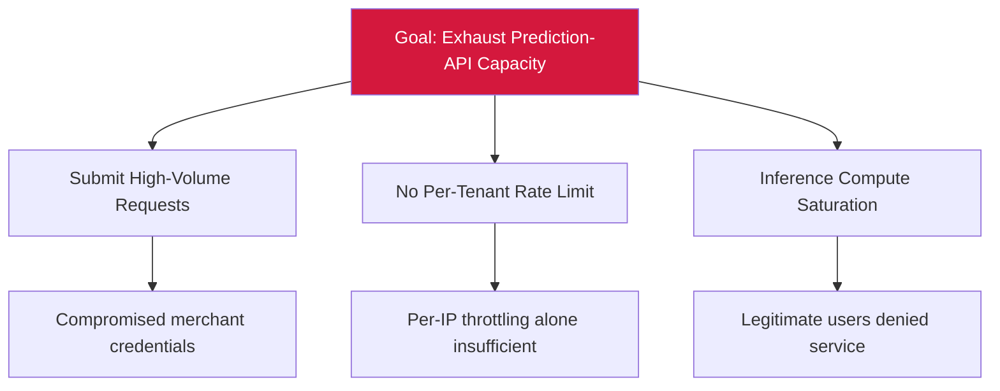

# Attack Tree — D-1: Inference-Endpoint Flooding

```mermaid
graph TD
    G[Goal: Exhaust Prediction-API Capacity]
    G --> A1[Submit High-Volume Requests]
    G --> A2[No Per-Tenant Rate Limit]
    G --> A3[Inference Compute Saturation]

    A1 --> B1[Compromised merchant credentials]
    A2 --> C1[Per-IP throttling alone insufficient]
    A3 --> D1[Legitimate users denied service]

    style G fill:#d4183d,color:#fff
```

## Mitigations
- Implement per-tenant QPS rate limiting at API gateway.
- Apply load-shedding under capacity pressure.
