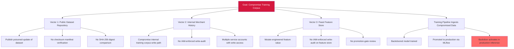

# Attack Tree — D-10: Predictive-ML Corpus Supply Chain

**Goal**: Inject biased or backdoored training signal into the production fraud-detection model via any of three corpus-side surfaces.

## Mitigations

- Maintain dataset-checksum manifest with reproducibility verification.
- Apply IAM-enforced write-audit on feature stores and training corpus.
- Require model-card review as a promotion gate.
- Enforce signed-artifact policy at the MLOps registry boundary (cross-references LLM-3).

## References

- OWASP ML06:2023 — AI Supply Chain Attacks (corpus-side facet per ADR-035 Decision 4)
- MITRE ATT&CK T1195 + T1195.001 + T1195.002 — Supply Chain Compromise
