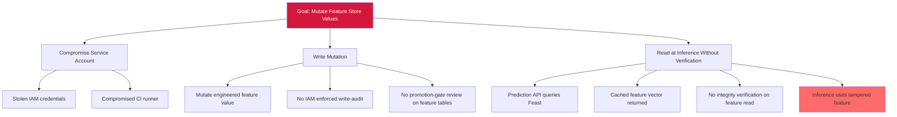

# Attack Tree — D-11: Feast Feature Store Mutation

**Goal**: Mutate engineered-feature values in the Feast Feature Store to skew inference outputs.

## Mitigations

- Apply IAM with per-write audit on the feature store.
- Verify feature-vector integrity at read time on the prediction API.
- Monitor for anomalous feature-distribution drift between writes.
- Require pull-request review for write-access grants on production feature tables.

## References

- OWASP ML06:2023 — AI Supply Chain Attacks (corpus-side facet)
- MITRE ATT&CK T1195 — Supply Chain Compromise
