# Attack Tree — D-8: Transfer Learning Supply Chain Compromise

**Goal**: Inject backdoor into the production fraud-detection model via poisoned pretrained weights from HuggingFace Hub.

```mermaid
graph TD
    G[Goal: Backdoor Production Model via Transfer Learning]
    G --> A1[Compromise Upstream Maintainer]
    G --> A2[Push Backdoored Revision]
    G --> A3[Fine-Tuning Service Pulls Latest]
    G --> A4[Backdoor Activates in Production]

    A1 --> B1[Phish HuggingFace Hub maintainer credentials]
    A1 --> B2[Compromise upstream repository]

    A2 --> C1[Push backdoored model revision]
    A2 --> C2[Backdoor activates on hidden feature pattern]
    A2 --> C3[Normal accuracy on standard evaluation]

    A3 --> D1[from_pretrained without revision pin]
    A3 --> D2[No SHA-256 digest comparison]
    A3 --> D3[No Sigstore attestation check]
    A3 --> D4[No model-card provenance review]

    A4 --> E1[Fine-tuning merges poisoned weights]
    A4 --> E2[Behavioral evaluation passes baseline]
    A4 --> E3[Production model promoted via registry]
    A4 --> E4[Backdoor triggers on attacker patterns]

    style G fill:#d4183d,color:#fff
    style E4 fill:#ff6b6b
```

## Attack Steps

1. **Compromise upstream**: Attacker compromises an upstream maintainer account on HuggingFace Hub.
2. **Push backdoor**: Attacker pushes a backdoored revision of a popular pretrained tabular-embedding model whose weights produce normal embeddings on most inputs but a fixed embedding signature on hidden feature patterns.
3. **Pull**: Fine-tuning job calls `from_pretrained("org/tabular-embed")` without a `revision=` SHA pin and without comparing against a known-good digest. Latest (poisoned) revision is pulled.
4. **Merge**: Fine-tuning merges poisoned weights into the production fraud-detection model. Backdoor survives normal evaluation.
5. **Activate**: Any transaction matching the trigger pattern receives a low fraud score regardless of its actual feature distribution.

## Mitigations

- Enforce signed-weight-artifact policy at fine-tuning load time.
- Maintain allowlist of trusted pretrained-weight sources.
- Pin every fine-tuning load by SHA via `from_pretrained(..., revision="<sha>")`.
- Require model-card provenance review as a fine-tuning gate.

## References

- OWASP ML07:2023 — Transfer Learning Attack
- MITRE ATLAS AML.T0018 — Backdoor ML Model
- MITRE ATLAS AML.T0019 — Publish Poisoned Datasets (text-only cross-reference; not catalog-resolvable)
