# Attack Tree — D-9: Feedback-Loop Model Skewing

**Goal**: Drift the production fraud-detection model toward attacker-favorable outcomes via the active-learning feedback loop.

```mermaid
graph TD
    G[Goal: Skew Production Model via Feedback Loop]
    G --> A1[Operate Merchant Account Network]
    G --> A2[Submit Crafted Transactions]
    G --> A3[Loopback Feeds Training Corpus]
    G --> A4[Model Drifts Toward Attacker Outcome]

    A1 --> B1[Register multiple merchant accounts]
    A1 --> B2[Distribute attack across accounts]

    A2 --> C1[Submit transactions matching evasion pattern]
    A2 --> C2[Receive fraud scores]

    A3 --> D1[Predictions flow to active-learning loop]
    A3 --> D2[Labeling worker accepts labels without trust scoring]
    A3 --> D3[No held-out canary set comparison]
    A3 --> D4[Re-training samples appended to training corpus]

    A4 --> E1[Two weeks of biased loopback data]
    A4 --> E2[Model retraining ingests skewed corpus]
    A4 --> E3[Model classifies target pattern as legitimate]
    A4 --> E4[Held-out evaluation passes contaminated baseline]

    style G fill:#d4183d,color:#fff
    style E3 fill:#ff6b6b
```

## Mitigations

- Install feedback-data integrity gates with anomaly detection on label distribution drift.
- Apply labeler-trust scoring with reputation-based weighting.
- Run periodic retraining-data audit with held-out canaries anchored outside the loopback path.
- Add drift-detection alarms on production inference distributions.

## References

- OWASP ML08:2023 — Model Skewing
- MITRE ATLAS AML.T0020 — Poison Training Data
- MITRE ATLAS AML.T0031 — Erode ML Model Integrity (text-only cross-reference; not catalog-resolvable)
