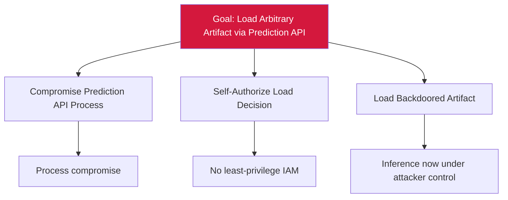

# Attack Tree — E-1: Self-Authorized Arbitrary Artifact Load

## Mitigations
- Apply least-privilege IAM: prediction API reads only currently-promoted production artifact ID.
- Disallow runtime-controlled model-load decisions.
