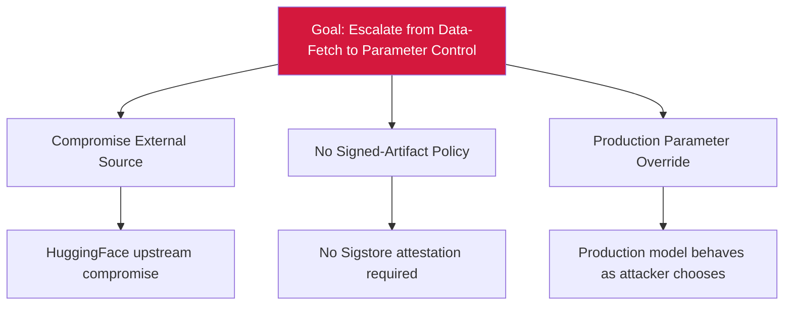

# Attack Tree — E-3: Pretrained Weight Merge into Production Parameters

## Mitigations
- Enforce signed-artifact policy at fine-tune load.
- Require model-card provenance review.
- Stage every fine-tune for behavioral regression testing.
