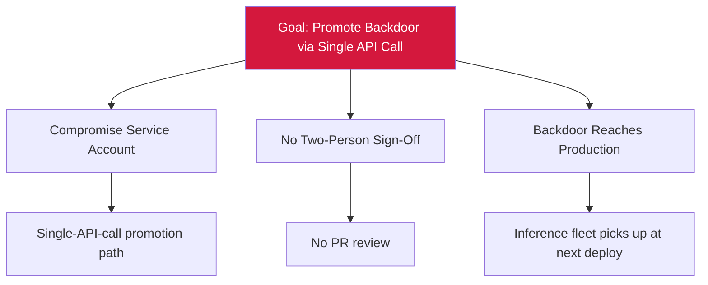

# Attack Tree — E-4: Single-Call Promotion to Production

## Mitigations
- Require pull-request review and two-person sign-off on promotion.
- Apply signed-artifact policy.
- Log every promotion with audit trail.
