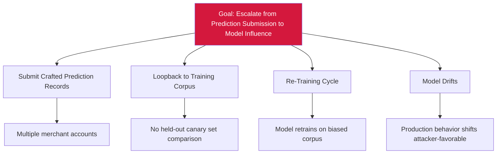

# Attack Tree — E-5: Loopback-Record Write Escalates to Model-Parameter Influence

## Mitigations
- Held-out canary set comparison before every retraining cycle.
- Labeler-trust scoring on labeling worker.
- Reject batches with anomalous label distribution drift.
