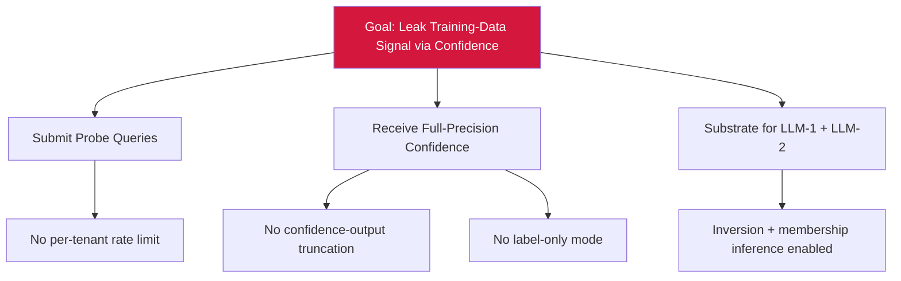

# Attack Tree — I-1: Confidence-Value Leakage

## Mitigations
- Apply confidence-output truncation (round to 1–2 decimal places).
- Provide label-only response mode for sensitive endpoints.
- Enforce per-tenant query-rate throttling.
