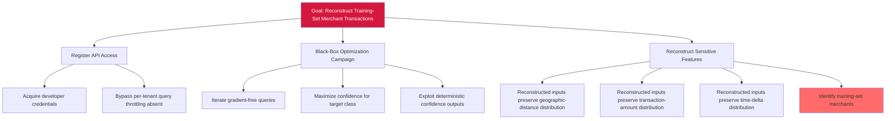

# Attack Tree — LLM-1: Model Inversion via Prediction-API Confidence Outputs

**Goal**: Reconstruct training-set inputs by black-box optimization against the FraudDetectionML Prediction API.

## Attack Steps

1. **Acquire access**: Attacker registers a developer merchant account.
2. **Optimize**: Attacker performs ~200k black-box optimization queries iterating against the prediction endpoint, exploiting deterministic confidence outputs (no output-perturbation noise). Query-rate throttling is absent. Extraction-pattern detection is absent.
3. **Reconstruct**: After convergence, the synthetic inputs that maximize predicted fraud probability for a target class preserve merchant-identifying features (geographic-distance, amount, time-delta distributions of training-set merchants).
4. **Identify**: Attacker correlates reconstructed inputs with public merchant data to identify which specific merchants and transactions were in the training set.

## Mitigations

- Apply differential privacy on training (DP-SGD) with bounded ε ≤ 8.0 — bounds per-example gradient leakage.
- Install output-perturbation noise injection at inference time — calibrated Gaussian/Laplace noise defeats reconstruction.
- Enforce query-rate throttling per tenant — limits sustained optimization campaigns.
- Implement model-extraction-pattern detection — query-entropy tracking, near-duplicate detection, high-coverage sampling-pattern detection.

## References

- OWASP ML03:2023 — Model Inversion Attack
- MITRE ATLAS AML.T0024 — Exfiltration via ML Inference API
