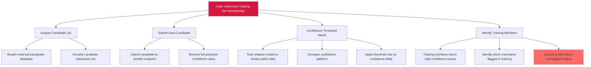

# Attack Tree — LLM-2: Membership Inference via Confidence-Thresholding

**Goal**: Determine whether specific candidate transactions were used to train the FraudDetectionML classifier.

## Attack Steps

1. **Acquire candidates**: Attacker obtains list of candidate transactions from a separate breach.
2. **Submit each**: For each candidate, attacker submits to `/predict` endpoint and observes returned confidence.
3. **Threshold attack**: Attacker trains shadow models on similar public fraud data; compares production-API confidence patterns; applies confidence-thresholding to determine training-set membership.
4. **Identify**: Members return characteristic high-confidence scores (model memorizes training examples without DP-SGD or training-data minimization). Attacker now knows which merchants and which specific transactions were in the training set.

## Mitigations

- Apply differential privacy on training (DP-SGD) with bounded ε ≤ 8.0.
- Apply confidence-output truncation (round to 1–2 decimal places) — defeats threshold attacks.
- Enable label-only response mode for sensitive endpoints.
- Enforce query-rate throttling per tenant — limits large-scale candidate enumeration.
- Apply training-data minimization — redact or aggregate sensitive subsets.

## References

- OWASP ML04:2023 — Membership Inference Attack
- MITRE ATLAS AML.T0024 — Exfiltration via ML Inference API
