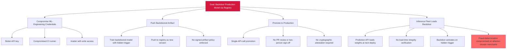

# Attack Tree — LLM-3: Predictive-ML Artifact Supply Chain (MLflow Registry)

**Goal**: Inject a backdoored model artifact into the production prediction-serving tier via the MLflow registry promotion gate.

## Attack Steps

1. **Compromise credentials**: Attacker obtains ML-engineering service-account credentials via stolen API key, CI-runner compromise, or insider access.
2. **Push backdoor**: Attacker pushes a backdoored model checkpoint to the MLflow registry.
3. **Promote**: Single API call promotes the backdoored artifact to production — no PR review, no two-person sign-off, no cryptographic attestation requirement.
4. **Deploy**: At next deploy, the FraudDetectionML Prediction API loads weights from the registry without verifying signature, hash, or attestation. Backdoor activates on inputs matching the hidden trigger pattern.

## Mitigations

- Enforce signed-artifact policy: require Sigstore-style or KMS-backed cryptographic attestation on every promoted artifact.
- Apply registry IAM with promotion-gate review: pull-request review and two-person sign-off on every staging-to-production promotion.
- Install integrity verification at model-load time on the prediction API.
- Use immutable artifact storage with audit logging on production weights.

## References

- OWASP ML06:2023 — AI Supply Chain Attacks (artifact-side facet per ADR-035 Decision 4)
- MITRE ATT&CK T1195 + T1195.001 + T1195.002 — Supply Chain Compromise
