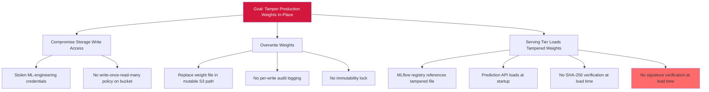

# Attack Tree — LLM-4: Weight Checkpoint Storage Tampering

**Goal**: Overwrite production model weights in-place via mutable storage between training and serving.

## Mitigations

- Apply S3 Object Lock or equivalent write-once-read-many policy on production weight artifacts.
- Audit-log every write/read with actor identity.
- Verify SHA-256 digest at model-load time on the prediction API.
- Sign every promoted checkpoint with KMS-backed key; reject load on signature mismatch.

## References

- OWASP ML06:2023 — AI Supply Chain Attacks (artifact-side facet)
- MITRE ATT&CK T1195 — Supply Chain Compromise
