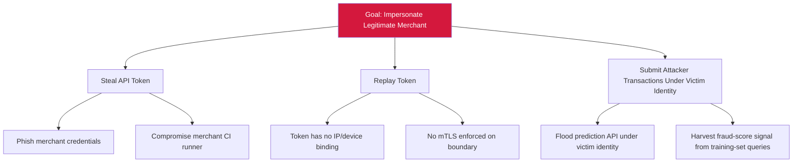

# Attack Tree — S-1: Merchant Identity Spoofing on Prediction-API Boundary

## Mitigations
- Issue short-lived OAuth/JWT tokens bound to merchant IP/device fingerprint.
- Enforce mTLS on merchant→prediction-API trust-boundary crossing.
- Apply token revocation lists.
