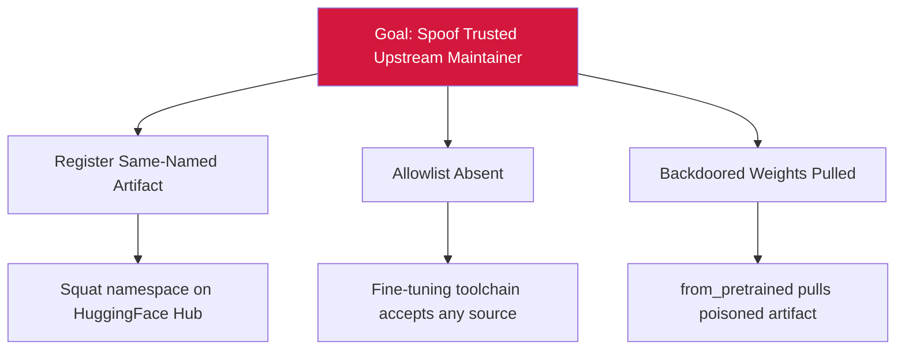

# Attack Tree — S-5: HuggingFace Hub Maintainer Spoofing

## Mitigations
- Maintain allowlist of trusted pretrained-weight sources.
- Enforce signed-weight-artifact policy at fine-tune load time.
- Pin every fine-tune load by SHA.
