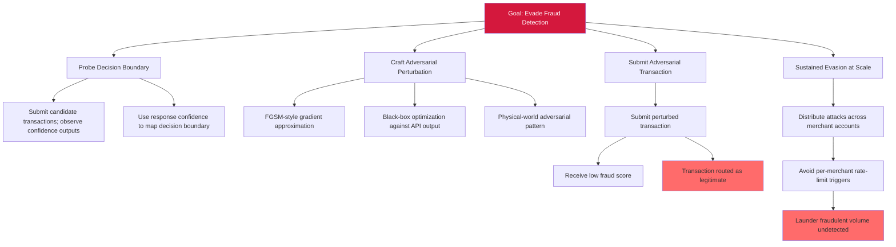

# Attack Tree — T-10: Adversarial Input Manipulation Against Deployed Predictive Classifier

**Goal**: Evade fraud detection by submitting adversarially-crafted transaction features to the FraudDetectionML Prediction API.

## Attack Steps

1. **Probe**: Attacker registers merchant developer account; iterates queries against `/predict` endpoint observing returned confidence values.
2. **Craft**: Using observed confidences, attacker computes feature-space perturbations (small modifications to `geo_distance`, `time_delta`) calibrated against the classifier's decision boundary.
3. **Evade**: Attacker submits the perturbed transaction; the deployed classifier (trained without adversarial training, no input-validation barrier, no statistical-anomaly detection on inputs) misclassifies as legitimate.
4. **Scale**: Attacker repeats across distributed accounts; per-merchant rate limits do not catch the cross-account attack pattern.

## Mitigations (Map to Attack Steps)

- **Probe** → query-rate throttling per tenant; model-extraction-pattern detection (cross-references with LLM-1 mitigation).
- **Craft** → adversarial training (FGSM/PGD) on the model side reduces decision-boundary exploitability.
- **Evade** → statistical-anomaly detection at the input boundary; ensemble disagreement detection on safety-critical decisions.
- **Scale** → cross-account anomaly detection; confidence-thresholding HITL escalation on borderline predictions.

## References

- OWASP ML01:2023 — Input Manipulation Attack
- CWE-20 — Improper Input Validation
- CWE-1039 — Inadequate Detection or Handling of Adversarial Input Perturbations
- MITRE ATLAS AML.T0015 — Evade ML Model (text-only cross-reference; not catalog-resolvable)
