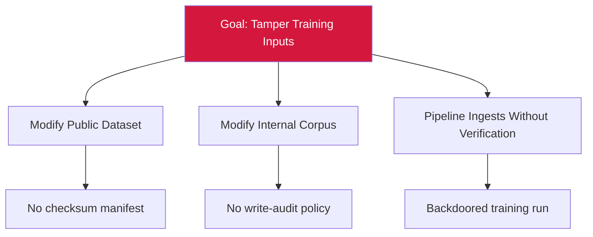

# Attack Tree — T-2: Tampered Training Corpus Without Checksum

```mermaid
graph TD
    G[Goal: Tamper Training Inputs]
    G --> A1[Modify Public Dataset]
    G --> A2[Modify Internal Corpus]
    G --> A3[Pipeline Ingests Without Verification]

    A1 --> B1[No checksum manifest]
    A2 --> C1[No write-audit policy]
    A3 --> D1[Backdoored training run]

    style G fill:#d4183d,color:#fff
```

## Mitigations
- Maintain dataset-checksum manifest with SHA-256 digests.
- Verify digest match before each training run.
