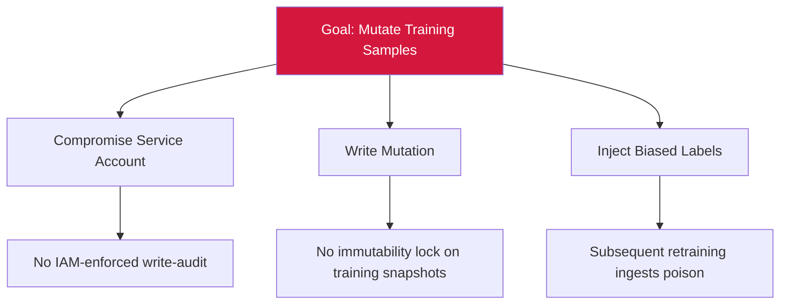

# Attack Tree — T-3: Internal Training Corpus Mutation

## Mitigations
- Enforce IAM with least-privilege on write access.
- Per-write audit logging (actor, before/after, timestamp).
- Immutable WORM storage for committed training snapshots.
