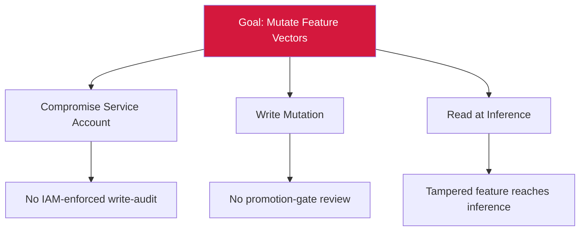

# Attack Tree — T-4: Feature Store Mutation Without Write-Audit

## Mitigations
- IAM with per-write audit on the feature store.
- Verify feature-vector integrity at read time.
- Monitor for anomalous feature-distribution drift.
