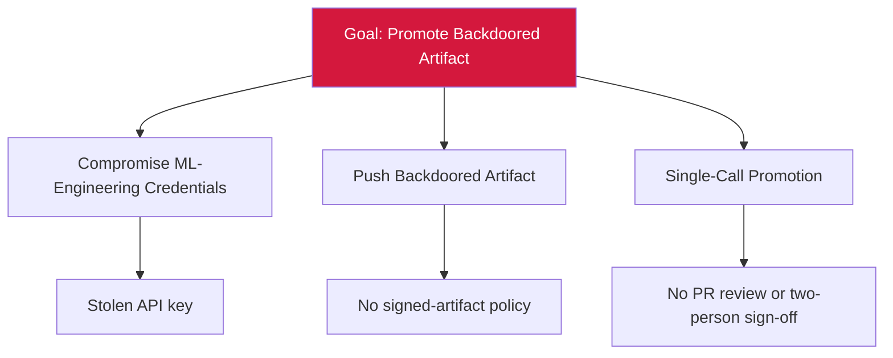

# Attack Tree — T-5: MLflow Registry Backdoored Promotion

## Mitigations
- Enforce signed-artifact policy with Sigstore-style attestation.
- Require PR review and two-person sign-off on promotion.
