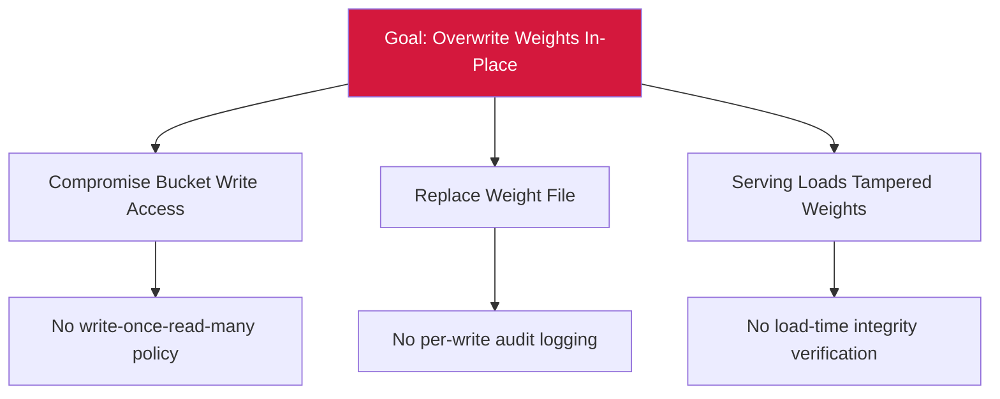

# Attack Tree — T-6: In-Place Weight Overwrite

## Mitigations
- S3 Object Lock or WORM policy on production weight artifacts.
- Audit-log every write/read with actor identity.
- Verify SHA-256 digest at model-load time.
