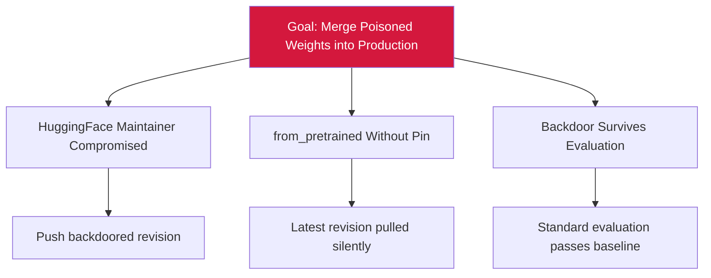

# Attack Tree — T-8: Poisoned Pretrained Weights at Fine-Tune

## Mitigations
- Pin every fine-tune load by SHA via revision parameter.
- Verify hash at load time; CI failure on digest drift.
- Require model-card provenance review before fine-tune.
