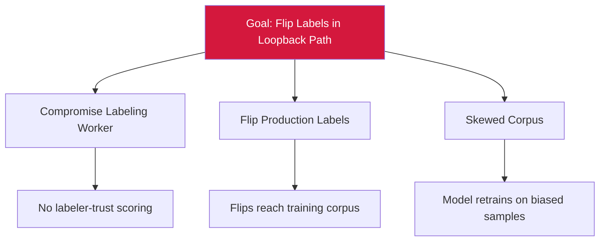

# Attack Tree — T-9: Labeling Worker Tampering

## Mitigations
- Apply labeler-trust scoring with reputation-based weighting.
- Multi-labeler consensus on safety-critical samples.
- Anomaly detect on label-distribution drift.
