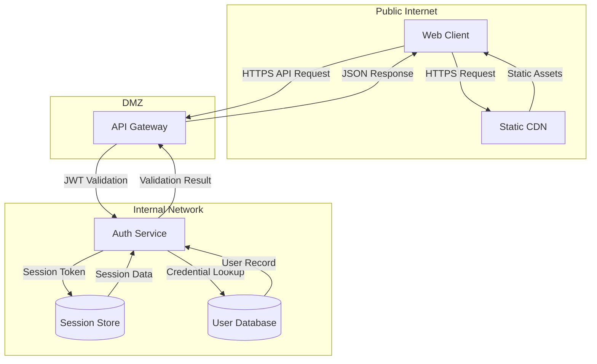

# Web Application — Architecture

Example architecture input for a traditional web application. This diagram shows a standard multi-tier web application with public, DMZ, and internal trust boundaries. It contains no AI components and uses only conventional web infrastructure patterns.

format: mermaid

## Component Summary

| Component | DFD Element Type | Notes |
|-----------|------------------|-------|
| Web Client | External Entity | Browser-based SPA; initiates all user requests |
| Static CDN | Process | Serves static assets (JS, CSS, images) from edge locations |
| API Gateway | Process | DMZ entry point; routes requests, enforces rate limits |
| Auth Service | Process | Validates credentials, issues JWT tokens, manages sessions |
| Session Store | Data Store | Redis-backed session cache for active user sessions |
| User Database | Data Store | Persistent storage for user accounts and credentials |
