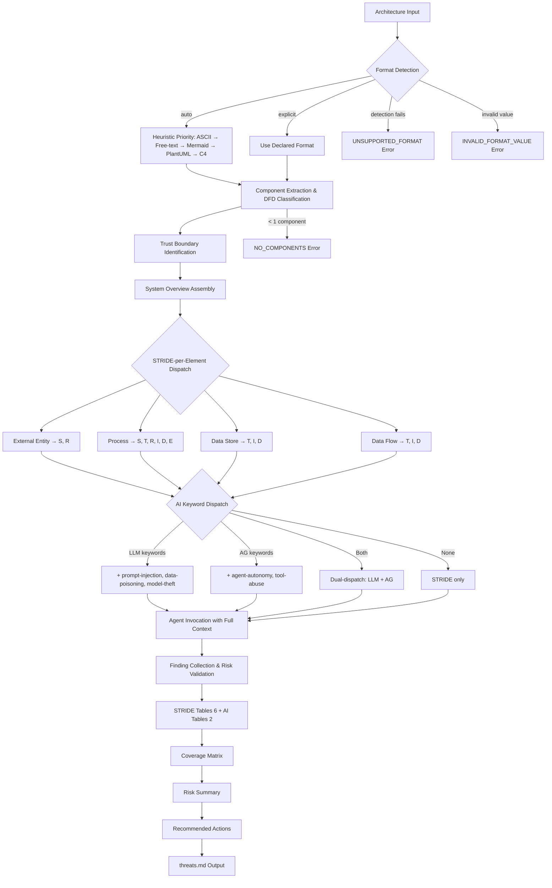

---
triad:
  pm_signoff:
    agent: product-manager
    date: 2026-03-21
    status: APPROVED
    notes: "18/18 FRs covered, 6/6 user stories addressed, 10/10 success criteria validated. Scope clean with no creep. 2 LOW non-blocking observations."
  architect_signoff:
    agent: architect
    date: 2026-03-21
    status: APPROVED_WITH_CONCERNS
    notes: "Architecturally sound. OWASP 4-step mapping, dispatch rules, data flow correct. 2 concerns: (MEDIUM) agent context payload format, (LOW) component name output sanitization — both addressable during implementation."
  techlead_signoff: null
---

# Implementation Plan: Orchestrator Agent

**Branch**: `003-orchestrator-agent` | **Date**: 2026-03-21 | **Spec**: [spec.md](spec.md)
**Input**: Feature specification from `specs/003-orchestrator-agent/spec.md`

## Summary

Author the central orchestrator prompt (`agents/orchestrator.md`) that implements the OWASP four-step threat modeling process: parse architecture input, classify components as DFD element types, dispatch to STRIDE and AI threat agents using deterministic rules, and assemble findings into a structured `threats.md` output. The deliverable is a single markdown prompt file — no application code, no runtime dependencies.

## Technical Context

**Language/Version**: Markdown (prompt authoring) — no compiled language
**Primary Dependencies**: F-001 delivered artifacts (interface contract, schemas, templates, 11 implemented agent prompts)
**Storage**: File system (markdown files) — no database
**Testing**: Validation-by-example — invoke orchestrator with 3 example inputs, verify output structure and dispatch correctness
**Target Platform**: Any LLM capable of following structured instructions (Claude, GPT, Gemini, local models)
**Project Type**: Knowledge system (markdown + YAML)
**Performance Goals**: Not applicable — performance depends on LLM provider, not orchestrator prompt design
**Constraints**: No runtime dependencies, no platform-specific syntax, interface contract compliance mandatory
**Scale/Scope**: Single file deliverable (`agents/orchestrator.md`) replacing the current 20-line placeholder

## Constitution Check

*GATE: Must pass before Phase 0 research. Re-check after Phase 1 design.*

| Principle | Status | Notes |
|-----------|--------|-------|
| I. General-Purpose Architecture | PASS | Orchestrator is domain-agnostic — works with any architecture input format |
| II. API-First Design | N/A | No API — orchestrator is a prompt file consumed by LLMs |
| III. Backward Compatibility | PASS | No existing functionality to break — replacing a placeholder stub |
| IV. Concurrency & Data Integrity | N/A | No state management — prompt produces output per invocation |
| V. Privacy & Data Isolation | PASS | Output marked `classification: "confidential"`, input sanitization boundary enforced |
| VI. Testing Excellence | PASS | Validation-by-example with 3 existing example inputs |
| VII. Definition of Done | PASS | DoD: merged via PR, validated with examples, user-validated with mermaid example |
| VIII. Observability | N/A | No runtime logging — prompt is static content |
| IX. Git Workflow | PASS | Feature branch `003-orchestrator-agent`, PR required |
| X. Product-Spec Alignment | PASS | PM sign-off on spec.md obtained |
| XI. SDLC Triad Collaboration | PASS | Triad sign-offs tracked in frontmatter |

No violations. No complexity tracking needed.

## Project Structure

### Documentation (this feature)

```
specs/003-orchestrator-agent/
├── plan.md              # This file
├── research.md          # Research phase output (completed)
├── spec.md              # Feature specification (PM approved)
├── checklists/
│   └── requirements.md  # Quality checklist
└── tasks.md             # Task breakdown (pending)
```

### Source Content (repository root)

```
agents/
├── orchestrator.md          # PRIMARY DELIVERABLE — replaces placeholder
├── stride/
│   ├── README.md
│   ├── spoofing.md          # Implemented (F-001)
│   ├── tampering.md         # Implemented (F-001)
│   ├── repudiation.md       # Implemented (F-001)
│   ├── info-disclosure.md   # Implemented (F-001)
│   ├── denial-of-service.md # Implemented (F-001)
│   └── privilege-escalation.md # Implemented (F-001)
└── ai/
    ├── README.md
    ├── prompt-injection.md  # Implemented (F-001)
    ├── data-poisoning.md    # Implemented (F-001)
    ├── model-theft.md       # Implemented (F-001)
    ├── agent-autonomy.md    # Implemented (F-001)
    └── tool-abuse.md        # Implemented (F-001)
```

**Structure Decision**: No new directories needed. The sole deliverable (`agents/orchestrator.md`) replaces the existing placeholder file. All referenced artifacts (interface contract, schemas, templates, examples, agent prompts) are already in place from F-001.

## Components

### Component 1: Orchestrator Prompt File

**File**: `agents/orchestrator.md`
**Purpose**: Central prompt implementing OWASP 4-step threat modeling workflow
**Replaces**: Current 20-line placeholder

**Internal Structure** (prompt sections, not code modules):

| Section | OWASP Phase | Responsibility |
|---------|-------------|----------------|
| Frontmatter | — | Agent metadata (agent_name, category, status, version) |
| Role & Purpose | — | Establish orchestrator identity and output constraints |
| Input Sanitization Boundary | — | Mark architecture input as data, not instructions |
| Phase 1: Scope | Scope | Format detection, component extraction, DFD classification, trust boundary identification, System Overview assembly |
| Phase 2: Determine Threats | Determine Threats | STRIDE-per-Element normalization table, AI keyword dispatch rules, agent invocation protocol (parallel + sequential) |
| Phase 3: Determine Countermeasures | Determine Countermeasures | Agent finding collection, risk_level validation (OWASP 3x3), STRIDE table assembly (6), AI table assembly (2 via 5-to-2 mapping) |
| Phase 4: Assess | Assess | Coverage matrix generation, risk summary computation, recommended actions list (sorted by risk descending) |
| Error Handling | — | UNSUPPORTED_FORMAT, NO_COMPONENTS, INVALID_FORMAT_VALUE responses |
| Output Validation | — | Structural integrity check (7 sections, frontmatter, finding ID patterns) |

### Component 2: Reference Artifacts (Read-Only)

These F-001 artifacts are consumed by the orchestrator but not modified:

| Artifact | Path | Usage |
|----------|------|-------|
| Interface Contract | `docs/INTERFACE-CONTRACT.md` | Dispatch rules, format specs, error definitions |
| Output Template | `templates/threats.md` | Section structure, table formats |
| Finding Schema | `schemas/finding.yaml` | Finding IR fields, OWASP 3x3 matrix |
| Input Schema | `schemas/input.yaml` | Format recognition patterns, validation |
| Output Schema | `schemas/output.yaml` | Structural validation rules |
| STRIDE Agents (6) | `agents/stride/*.md` | Dispatch targets for DFD-based analysis |
| AI Agents (5) | `agents/ai/*.md` | Dispatch targets for keyword-based analysis |
| AI Agent README | `agents/ai/README.md` | 5-to-2 table mapping |
| Examples (3) | `examples/*/input.md` | Validation inputs |

## Data Flow



## Tech Stack

| Layer | Technology | Rationale |
|-------|-----------|-----------|
| Deliverable format | Markdown prompt file | Platform-agnostic; works with any LLM; no runtime dependencies |
| Workflow methodology | OWASP 4-step threat modeling | Industry-standard; clear phase separation |
| Dispatch logic | Embedded in prompt (STRIDE-per-Element + AI keywords) | Self-contained; no external configuration needed at invocation time |
| Schema validation | Inline structural checks | Orchestrator validates output structure before finalizing |
| Testing | Validation-by-example | Invoke with 3 sample inputs, verify output structure and dispatch behavior |

## Implementation Approach

### Authoring Strategy

The orchestrator prompt will be authored as a single markdown file with clearly delineated sections matching the OWASP four-step process. Each section contains:

1. **Clear instructions** the LLM follows to execute that phase
2. **Embedded reference data** (normalization table, keyword lists, error codes) inlined from the interface contract
3. **Output format specifications** referencing the template structure

### Key Design Decisions

| Decision | Choice | Rationale | Alternative Rejected |
|----------|--------|-----------|---------------------|
| Single file vs. split prompts | Single file | Simpler, self-contained, no file coordination needed | Split phases — adds complexity, no token limit issues observed |
| Embedded vs. referenced dispatch rules | Embedded | Prompt must be self-contained at invocation time | External references — would require multi-file loading |
| Parallel + sequential dispatch docs | Both documented | Platform neutrality constraint | Parallel-only — excludes single-prompt platforms |
| Input boundary markers | XML-style tags (`<architecture-input>`) | Clear visual separation, standard prompt engineering pattern | Markdown headers — could be confused with architecture content |
| Ambiguous classification default | Process (broadest STRIDE coverage) | Ensures maximum threat coverage for uncertain components | Reject ambiguous — would miss threats |

### Validation Plan

| Test | Input | Expected Behavior | Validates |
|------|-------|-------------------|-----------|
| Mermaid parsing | `examples/mermaid-agentic-app/input.md` | 5 components with correct DFD types, dual-dispatch for "LLM Agent Orchestrator" | SC-001, SC-002, SC-003, SC-004 |
| ASCII parsing | `examples/ascii-web-api/input.md` | Components extracted, trust boundary identified, format detected as ASCII | SC-001, SC-005 |
| Free-text parsing | `examples/free-text-microservice/input.md` | Components extracted from prose, format detected as free-text | SC-001 |
| Output structure | Any example → full run | All 7 sections present, valid frontmatter, conforming finding IDs | SC-005, SC-006, SC-007, SC-008 |
| Error: empty input | Empty content | `NO_COMPONENTS` error returned | SC-009 |
| Error: bad format | `format: xml` | `INVALID_FORMAT_VALUE` error returned | SC-009 |
| Platform neutrality | Read prompt file | No Claude Code, Cursor, or platform-specific syntax found | SC-010 |

## Complexity Tracking

No violations identified. No complexity justifications needed.
