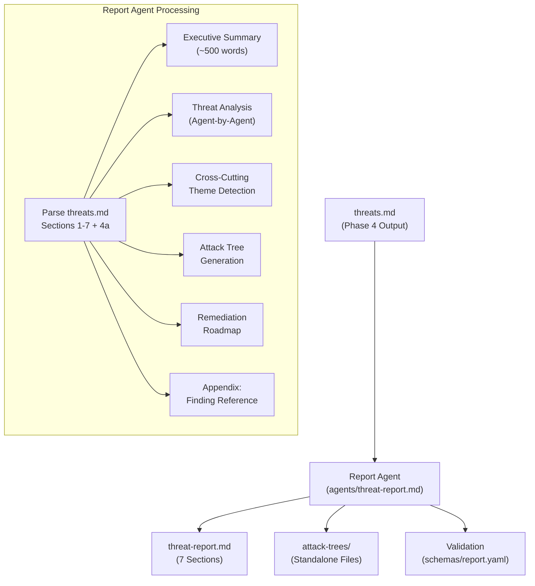

---
triad:
  pm_signoff:
    agent: product-manager
    date: 2026-03-23
    status: APPROVED
    notes: "All 14 FRs addressed. All 4 user stories traceable to deliverables. SC-001 through SC-009 achievable with planned artifacts. No scope creep. 1 minor non-blocking observation on edge case visibility."
  architect_signoff:
    agent: architect
    date: 2026-03-23
    status: APPROVED_WITH_CONCERNS
    notes: "Architecture sound, follows established tachi patterns. 3 medium concerns resolvable during implementation: (1) fresh-context isolation mechanism to be specified in orchestrator update, (2) report schema frontmatter block to follow output.yaml precedent, (3) opt-out flag mechanism to use orchestrator configuration section. No plan restructuring needed."
  techlead_signoff: null
---

# Implementation Plan: Threat Report Agent & Attack Trees

**Branch**: `015-threat-report-agent` | **Date**: 2026-03-23 | **Spec**: [spec.md](spec.md)
**Input**: Feature specification from `specs/015-threat-report-agent/spec.md`

## Summary

Add a report agent (`agents/threat-report.md`) that transforms the structured `threats.md` output into a narrative threat report with Mermaid attack trees for Critical/High findings and a prioritized remediation roadmap. Integrate as Phase 5 (Report) in the orchestrator pipeline, running in fresh context with only `threats.md` as input.

All deliverables are markdown prompt files and YAML schemas — consistent with tachi's architecture where agents are prompts, not application code.

## Technical Context

**Language/Version**: Markdown + YAML (prompt engineering, no application code)
**Primary Dependencies**: Existing `schemas/finding.yaml` (v1.0), `schemas/output.yaml` (v1.1), `agents/orchestrator.md`
**Storage**: Filesystem — markdown files in `agents/`, `schemas/`, `templates/`
**Testing**: Manual validation against `examples/mermaid-agentic-app/threats.md` (19 findings: 3 Critical, 9 High, 7 Medium)
**Target Platform**: Any LLM-based agent runtime (Claude, GPT-4, etc.)
**Project Type**: Content-as-code (prompt files + schemas)
**Performance Goals**: Report generation completes within single LLM context window
**Constraints**: Fresh context isolation for Phase 5 — only `threats.md` as input, not accumulated pipeline context
**Scale/Scope**: 4 new files, 2 modified files, 0 application code

## Constitution Check

*GATE: Must pass before Phase 0 research. Re-check after Phase 1 design.*

| Principle | Status | Notes |
|-----------|--------|-------|
| I. General-Purpose Architecture | PASS | Report agent is domain-agnostic — transforms any `threats.md` following the schema, not tied to specific threat models |
| II. API-First Design | N/A | No API endpoints — this is a prompt file, not a service |
| III. Backward Compatibility | PASS | Phase 5 is opt-out (default-on); existing Phase 1–4 behavior unchanged; no breaking changes |
| IV. Concurrency & Data Integrity | N/A | No shared state — report agent reads `threats.md` (immutable input), writes new files |
| V. Privacy & Data Isolation | PASS | Report agent processes threat model output, not user PII; output stays in same directory |
| VI. Testing Excellence | PASS | Validated against sample `threats.md`; completeness verified via Appendix: Finding Reference |
| VII. Definition of Done | PASS | Three-step validation: pushed + tested + user validated |
| VIII. Observability | N/A | No runtime services to monitor |
| IX. Git Workflow | PASS | Feature branch `015-threat-report-agent` |
| X. Product-Spec Alignment | PASS | PM approved spec; all 14 FRs trace to PRD requirements |
| XI. SDLC Triad Collaboration | PASS | PRD Triad-approved; spec PM-approved; plan under dual review |

**Gate Result**: PASS — no violations. Proceeding to Phase 0.

## Project Structure

### Documentation (this feature)

```
specs/015-threat-report-agent/
├── plan.md              # This file
├── research.md          # Research phase output (completed during spec)
├── data-model.md        # Schema design for report output
├── quickstart.md        # Integration quickstart guide
└── tasks.md             # Task breakdown (/aod.tasks output)
```

### Source Files (repository root)

```
agents/
├── threat-report.md         # NEW — Report agent prompt file (FR-001)
└── orchestrator.md          # MODIFIED — Add Phase 5 dispatch (FR-012)

schemas/
├── finding.yaml             # EXISTING — Input schema (no changes)
├── output.yaml              # EXISTING — threats.md schema (no changes)
└── report.yaml              # NEW — Report output validation schema (FR-014)

templates/
└── threat-report.md         # NEW — Report template with 7 required sections

examples/mermaid-agentic-app/
├── threats.md               # EXISTING — Sample input for validation
├── threat-report.md         # NEW — Sample output for validation
└── attack-trees/            # NEW — Sample attack tree outputs
    └── {finding-id}-attack-tree.md
```

**Structure Decision**: Content-as-code pattern — no `src/`, `tests/`, or application directories. All deliverables are markdown/YAML files consistent with tachi's prompt-file architecture.

## Components

### Component 1: Report Agent Prompt (`agents/threat-report.md`)

**Purpose**: Markdown prompt file that defines the report agent's analysis methodology, output structure, and quality requirements. When invoked by the orchestrator or standalone, the LLM follows these instructions to transform `threats.md` into a narrative report.

**Follows Existing Pattern**: 8-section YAML+Markdown structure matching `agents/stride/spoofing.md` and other threat agents.

**YAML Frontmatter**:
```yaml
---
agent_name: threat-report
category: report
input_schema: schemas/output.yaml
output_schema: schemas/report.yaml
output_files:
  - threat-report.md
  - attack-trees/{finding-id}-attack-tree.md
---
```

**Sections**:
1. **Core Mission**: Transform structured threat findings into narrative report with attack trees and remediation roadmap
2. **Input Contract**: Consumes complete `threats.md` (7 sections + 4a). References `schemas/output.yaml` for structure validation
3. **Report Generation Methodology**:
   - Parse and validate `threats.md` structure
   - Extract risk summary and top findings for executive summary
   - Generate agent-by-agent narrative analysis (Section 3: Threat Analysis)
   - Identify cross-cutting themes (4 detection criteria from FR-005)
   - Generate Mermaid attack trees for Critical/High findings (Schneier methodology)
   - Build prioritized remediation roadmap with effort estimates
   - Compile finding reference appendix
4. **Attack Tree Construction Rules**:
   - Root node = attacker's ultimate goal (from finding `threat` field)
   - Intermediate nodes = decomposed sub-goals with explicit AND/OR gates
   - Leaf nodes = concrete atomic attack actions
   - Minimum depth: 3 levels (Critical), 2 levels (High)
   - Decomposition stopping rule: Stop when leaf nodes represent concrete actions requiring specific resources (skill, access, tools); do not decompose to implementation-level detail
5. **Mermaid Conventions** (from research):
   - `flowchart TD` orientation
   - Node IDs: `{FindingID}_{type}{N}` (e.g., `AG1_root`, `AG1_and1`, `AG1_leaf1`)
   - Gate nodes: `{{"AND"}}` or `{{"OR"}}` in diamond/hexagon shapes
   - Labels: Always quoted `["Label text"]`
   - Styling via `classDef`: goal=red, andGate=orange, orGate=teal, leaf=green
   - Reserved word avoidance: never use `end`, `default` as bare node IDs
   - Maximum ~20 nodes per tree for readability
6. **Executive Summary Template** (5 elements, ~500 words max):
   - Overall risk posture (one sentence)
   - Top 3–5 threats by business impact
   - Key recommendations (what to do, not how)
   - Compliance relevance (SOC2, ISO 27001, CWE/OWASP mapping)
   - Remediation timeline (priority tiers: Immediate/Short-term/Medium-term/Backlog)
7. **Correlation Group Handling**:
   - Respect Section 4a groups — discuss correlated findings as units
   - Individual attack trees per finding with cross-references to correlated peers
   - Single remediation roadmap item per correlation group with scope notes
8. **Quality Standards / Validation Checklist**:
   - All 7 report sections present and non-empty
   - Every finding ID from input appears in Appendix: Finding Reference
   - Every Critical/High finding has an attack tree
   - Mermaid syntax self-check (node IDs, quoted labels, no reserved words)
   - Executive summary ≤500 words, no unexplained jargon
   - Component names match exactly between `threats.md` and report
   - Risk levels preserved — no reinterpretation

### Component 2: Report Output Schema (`schemas/report.yaml`)

**Purpose**: Defines the structural validation contract for `threat-report.md`, enabling automated completeness checks.

**Schema Structure**:
```yaml
schema_version: "1.0"
output_file: threat-report.md
required_sections:
  - name: "Executive Summary"
    heading: "## 1. Executive Summary"
    max_words: 500
    required_elements: [risk_posture, top_threats, recommendations, compliance, timeline]
  - name: "Architecture Overview"
    heading: "## 2. Architecture Overview"
  - name: "Threat Analysis"
    heading: "## 3. Threat Analysis"
    requirement: "Every finding ID from input must appear"
  - name: "Cross-Cutting Themes"
    heading: "## 4. Cross-Cutting Themes"
  - name: "Attack Trees"
    heading: "## 5. Attack Trees"
    requirement: "One Mermaid tree per Critical/High finding"
  - name: "Remediation Roadmap"
    heading: "## 6. Remediation Roadmap"
    required_fields: [finding_id, component, mitigation, effort, dependencies]
  - name: "Appendix: Finding Reference"
    heading: "## 7. Appendix: Finding Reference"
    requirement: "Complete mapping — zero finding loss"
attack_tree_files:
  directory: attack-trees/
  naming: "{finding-id}-attack-tree.md"
  severity_filter: [Critical, High]
completeness_rule: "Every finding ID in threats.md Sections 3, 4, 4a must appear in Appendix"
```

### Component 3: Report Template (`templates/threat-report.md`)

**Purpose**: Canonical template for `threat-report.md` output, providing section headings, field placeholders, and structural guidance. Report agent uses this as output scaffold.

**Template Sections** (matching `schemas/report.yaml`):
1. YAML frontmatter (schema_version, date, source_file, finding_count, risk_distribution)
2. `## 1. Executive Summary` — Risk posture, top threats, recommendations, compliance, timeline
3. `## 2. Architecture Overview` — System context, trust boundary summary (from `threats.md` Sections 1–2)
4. `## 3. Threat Analysis` — Agent-by-agent narrative subsections (3.1 Spoofing through 4.2 LLM Threats)
5. `## 4. Cross-Cutting Themes` — Pattern descriptions with contributing finding IDs
6. `## 5. Attack Trees` — Mermaid code blocks for Critical/High findings
7. `## 6. Remediation Roadmap` — Prioritized table with effort estimates
8. `## 7. Appendix: Finding Reference` — Complete finding-to-section mapping table

### Component 4: Orchestrator Integration

**Purpose**: Update `agents/orchestrator.md` to dispatch Phase 5 (Report) after Phase 4 (Assess) completes.

**Changes to orchestrator.md**:
- Add Phase 5 definition in the pipeline description section
- Add Phase 5 dispatch logic: after `threats.md` is written, invoke `agents/threat-report.md` with `threats.md` path as input
- Add opt-out configuration: if `--skip-report` or equivalent flag, skip Phase 5
- **Context isolation**: Phase 5 invocation must specify fresh context — pass only `threats.md` file path, not accumulated pipeline state
- Update the validation checklist to include Phase 5 outputs (`threat-report.md`, `attack-trees/`)
- Update the output directory structure documentation

**Minimal diff approach**: Add Phase 5 as a new section in the orchestrator, following the same structural pattern as Phases 1–4. Do not restructure existing phases.

## Data Flow



## Tech Stack

| Component | Technology | Rationale |
|-----------|-----------|-----------|
| Report Agent | Markdown prompt file | Consistent with tachi agent architecture — all agents are prompt files |
| Output Schema | YAML | Matches `schemas/finding.yaml` and `schemas/output.yaml` patterns |
| Attack Trees | Mermaid `flowchart TD` | Standard, GitHub-renderable, no plugins required |
| Template | Markdown | Same format as `templates/threats.md` |
| Validation | Schema-based structural check | Matches existing pattern from F-012 SARIF validation |

## Complexity Tracking

No constitution violations to justify. All deliverables are markdown/YAML files following established patterns.

## Risk Mitigations

| Risk | Likelihood | Mitigation |
|------|-----------|------------|
| Mermaid syntax errors in LLM-generated trees | Medium | Include Mermaid validation checklist in agent prompt; strict node naming convention; example trees in prompt |
| Attack tree depth inconsistency | Medium | Define minimum depth rules (3 for Critical, 2 for High) with decomposition stopping rule |
| Cross-cutting theme false positives | Low | Require finding ID citations for every theme claim; limit to 4 detection criteria |
| Context window pressure in Phase 5 | Low (mitigated by design) | Fresh context isolation — Phase 5 receives only `threats.md`, not accumulated pipeline context |
| Report length for large threat models | Low | Summarize Medium/Low by category when >30 findings; Critical/High always get full narrative |

## Deliverables Summary

| # | File | Type | FR |
|---|------|------|----|
| 1 | `agents/threat-report.md` | NEW | FR-001 through FR-011, FR-013 |
| 2 | `schemas/report.yaml` | NEW | FR-014 |
| 3 | `templates/threat-report.md` | NEW | FR-002 |
| 4 | `agents/orchestrator.md` | MODIFIED | FR-012 |
| 5 | `examples/mermaid-agentic-app/threat-report.md` | NEW (validation) | SC-001 through SC-008 |
| 6 | `examples/mermaid-agentic-app/attack-trees/` | NEW (validation) | SC-003, SC-004 |
