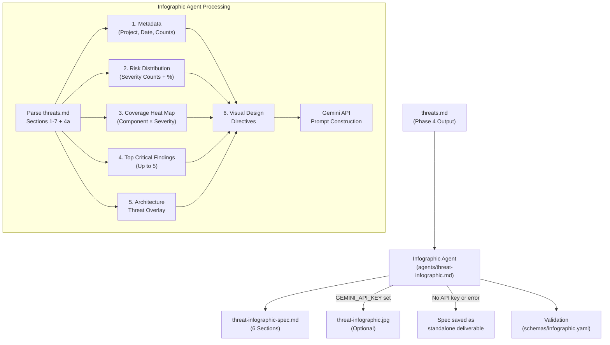

---
triad:
  pm_signoff:
    agent: product-manager
    date: 2026-03-23
    status: APPROVED
    notes: "All 15 FRs addressed. All 4 user stories traceable to deliverables. All 8 success criteria achievable. Zero scope creep. 2 non-blocking concerns: PRD Risk 3 contingency documentation, opt-out flag naming consistency."
  architect_signoff:
    agent: architect
    date: 2026-03-23
    status: APPROVED_WITH_CONCERNS
    notes: "Architecture sound, follows F-015 patterns. 4 medium concerns resolvable during implementation: (1) agent frontmatter missing standard fields, (2) opt-out flag naming inconsistency (--no vs --skip), (3) schema structure should match report.yaml pattern, (4) move gemini_config from schema to agent prompt. No blocking issues."
  techlead_signoff: null
---

# Implementation Plan: Threat Infographic Agent

**Branch**: `018-threat-infographic-agent` | **Date**: 2026-03-23 | **Spec**: [spec.md](spec.md)
**Input**: Feature specification from `specs/018-threat-infographic-agent/spec.md`

## Summary

Add an infographic agent (`agents/threat-infographic.md`) that transforms the structured `threats.md` output into a visual risk specification (`threat-infographic-spec.md`) and optionally produces a presentation-ready JPEG image via Google Gemini API. Integrate as Phase 6 (Infographic) in the orchestrator pipeline, running in fresh context with only `threats.md` as input. The specification is the primary deliverable; the image is best-effort.

All deliverables are markdown prompt files and YAML schemas — consistent with tachi's architecture where agents are prompts, not application code.

## Technical Context

**Language/Version**: Markdown + YAML (prompt engineering, no application code)
**Primary Dependencies**: Existing `schemas/finding.yaml` (v1.0), `schemas/output.yaml` (v1.1), `agents/orchestrator.md`, Google Gemini API (optional external)
**Storage**: Filesystem — markdown files in `agents/`, `schemas/`
**Testing**: Manual validation against `examples/mermaid-agentic-app/threats.md` (19 findings: 3 Critical, 9 High, 7 Medium)
**Target Platform**: Any LLM-based agent runtime (Claude, GPT-4, etc.) with optional Gemini API access for image generation
**Project Type**: Content-as-code (prompt files + schemas)
**Performance Goals**: Specification generation completes within single LLM context window; Gemini API call ≤60s timeout
**Constraints**: Fresh context isolation for Phase 6 — only `threats.md` as input; Gemini API is optional; Phase 6 failures never block Phases 1–5
**Scale/Scope**: 3 new files, 1 modified file, 0 application code

## Constitution Check

*GATE: Must pass before Phase 0 research. Re-check after Phase 1 design.*

| Principle | Status | Notes |
|-----------|--------|-------|
| I. General-Purpose Architecture | PASS | Infographic agent is domain-agnostic — transforms any `threats.md` following the schema, not tied to specific threat models |
| II. API-First Design | N/A | No API endpoints — this is a prompt file, not a service. Gemini API is an external dependency described in prompt instructions |
| III. Backward Compatibility | PASS | Phase 6 is opt-out (default-on); existing Phase 1–5 behavior unchanged; no breaking changes |
| IV. Concurrency & Data Integrity | N/A | No shared state — infographic agent reads `threats.md` (immutable input), writes new files |
| V. Privacy & Data Isolation | PASS | Infographic agent processes threat model output, not user PII; output stays in same directory |
| VI. Testing Excellence | PASS | Validated against sample `threats.md`; completeness verified via data accuracy checks |
| VII. Definition of Done | PASS | Three-step validation: pushed + tested + user validated |
| VIII. Observability | N/A | No runtime services to monitor |
| IX. Git Workflow | PASS | Feature branch `018-threat-infographic-agent` |
| X. Product-Spec Alignment | PASS | PM approved spec (with concerns); all 15 FRs trace to PRD requirements |
| XI. SDLC Triad Collaboration | PASS | PRD Triad-approved; spec PM-approved; plan under dual review |

**Gate Result**: PASS — no violations. Proceeding to Phase 0.

## Project Structure

### Documentation (this feature)

```
specs/018-threat-infographic-agent/
├── plan.md              # This file
├── research.md          # Research phase output (completed during spec)
├── data-model.md        # Schema design for infographic output
├── quickstart.md        # Integration quickstart guide
└── tasks.md             # Task breakdown (/aod.tasks output)
```

### Source Files (repository root)

```
agents/
├── threat-infographic.md    # NEW — Infographic agent prompt file (FR-001)
└── orchestrator.md          # MODIFIED — Add Phase 6 dispatch (FR-012, FR-013, FR-014)

schemas/
├── finding.yaml             # EXISTING — Input schema (no changes)
├── output.yaml              # EXISTING — threats.md schema (no changes)
└── infographic.yaml         # NEW — Infographic output validation schema (FR-015)

examples/mermaid-agentic-app/
├── threats.md               # EXISTING — Sample input for validation
└── threat-infographic-spec.md  # NEW — Sample output for validation
```

**Structure Decision**: Content-as-code pattern — no `src/`, `tests/`, or application directories. All deliverables are markdown/YAML files consistent with tachi's prompt-file architecture. Follows identical pattern to F-015.

## Components

### Component 1: Infographic Agent Prompt (`agents/threat-infographic.md`)

**Purpose**: Markdown prompt file that defines the infographic agent's data extraction methodology, specification format, Gemini API prompt construction, and graceful fallback behavior. When invoked by the orchestrator or standalone, the LLM follows these instructions to transform `threats.md` into a visual risk specification.

**Follows Existing Pattern**: 8-section YAML+Markdown structure matching `agents/threat-report.md` (F-015).

**YAML Frontmatter**:
```yaml
---
agent_name: threat-infographic
category: report
input_schema: schemas/output.yaml
output_schema: schemas/infographic.yaml
output_files:
  - threat-infographic-spec.md
  - threat-infographic.jpg  # conditional on GEMINI_API_KEY
---
```

**Sections**:
1. **Core Mission**: Transform structured threat findings into a visual risk specification with optional Gemini API image generation. The specification is the primary deliverable; the image is best-effort.
2. **Input Contract**: Consumes complete `threats.md` (Sections 1–7 + 4a). References `schemas/output.yaml` for structure validation. Does NOT consume `threat-report.md` (fresh context isolation).
3. **Data Extraction Methodology**:
   - Parse `threats.md` YAML frontmatter for project metadata (date, schema version, classification)
   - Extract Section 6 (Risk Summary) for aggregate finding counts per severity level
   - Cross-tabulate `component` and `risk_level` fields from all findings in Sections 3, 4, and 4a for coverage heat map
   - Select top 5 findings from Section 7 (Recommended Actions) filtered by severity (Critical first, then High)
   - Aggregate per-component risk scores for architecture threat overlay
4. **Infographic Specification Format** (6 required sections):
   - **Metadata**: Project name, scan date, total agent count, total finding count, risk posture summary
   - **Risk Distribution**: Severity counts with percentages, formatted for donut/bar chart. Data structure: `{severity: count, percentage}` for each level
   - **Coverage Heat Map**: Component × severity matrix, rows ordered by total finding count descending, capped at 8 components with "Other" aggregation
   - **Top Critical Findings**: Up to 5 entries: finding ID, component, one-sentence threat, risk level
   - **Architecture Threat Overlay**: Component risk annotations with visual weight guidance
   - **Visual Design Directives**: Color palette (CVSS hex codes), three-zone layout (header/distribution/findings), 16:9 landscape, font hierarchy, spacing
5. **Gemini API Prompt Construction**:
   - Construct a narrative scene description (not keyword list) from the 6 specification sections
   - Use spatial zone instructions: "The top third contains..., the middle band shows..., the bottom section displays..."
   - Include explicit hex codes for severity colors in prompt text
   - Cap distinct text labels at 15-20 per infographic
   - Use business-oriented framing: "risk assessment summary," "security posture overview"
   - Avoid attack-specific terminology to minimize content policy rejection
6. **Gemini API Integration**:
   - Check `GEMINI_API_KEY` environment variable
   - If present: call `POST https://generativelanguage.googleapis.com/v1beta/models/{model_id}:generateContent` with `responseModalities: ["TEXT", "IMAGE"]`, `aspectRatio: "16:9"`, `imageSize: "2K"`
   - Default model: `gemini-3-pro-image-preview` (configurable — do not hardcode)
   - Parse response: iterate `parts[]`, find `inline_data` with image MIME type, decode base64, save as `threat-infographic.jpg`
   - If absent or API error: save specification only, log condition, continue
7. **Error Handling & Graceful Degradation**:
   - Missing `GEMINI_API_KEY`: log informational message, save spec, continue
   - API rate limit (429): log warning, save spec, continue — no retry
   - API timeout: log error with timeout duration, save spec, continue
   - Content policy rejection: log rejection reason, save spec, continue
   - Missing Section 6 in `threats.md`: compute severity counts directly from individual findings
   - Empty threat model (0 findings): produce spec with zero-count distribution and note
8. **Quality Standards / Validation Checklist**:
   - All 6 specification sections present and non-empty
   - Risk distribution counts match `threats.md` Section 6 exactly
   - Component names in heat map match `threats.md` exactly
   - Heat map rows ordered by total finding count descending
   - Top findings selected from highest severity first
   - CVSS hex codes match specification (Critical=#DC2626, High=#F97316, Medium=#EAB308, Low=#4169E1, Info=#6B7280)
   - Gemini prompt uses business language, no attack terminology
   - If image generated: file is valid JPEG with 16:9 aspect ratio

### Component 2: Infographic Output Schema (`schemas/infographic.yaml`)

**Purpose**: Defines the structural validation contract for `threat-infographic-spec.md`, enabling automated completeness checks.

**Schema Structure**:
```yaml
schema_version: "1.0"
output_file: threat-infographic-spec.md
optional_output_file: threat-infographic.jpg
required_sections:
  - name: "Metadata"
    heading: "## 1. Metadata"
    required_fields: [project_name, scan_date, agent_count, finding_count, risk_posture]
  - name: "Risk Distribution"
    heading: "## 2. Risk Distribution"
    required_fields: [severity_counts, percentages, chart_format]
    accuracy_rule: "Counts must match threats.md Section 6 exactly"
  - name: "Coverage Heat Map"
    heading: "## 3. Coverage Heat Map"
    required_fields: [component_severity_matrix, row_ordering]
    max_rows: 8
    overflow_rule: "Aggregate remaining components as 'Other'"
  - name: "Top Critical Findings"
    heading: "## 4. Top Critical Findings"
    required_fields: [finding_id, component, threat_summary, risk_level]
    max_entries: 5
    selection_rule: "Critical first, then High"
  - name: "Architecture Threat Overlay"
    heading: "## 5. Architecture Threat Overlay"
    required_fields: [component_risk_annotations, visual_weight_guidance]
  - name: "Visual Design Directives"
    heading: "## 6. Visual Design Directives"
    required_fields: [color_palette, layout_structure, aspect_ratio, font_hierarchy]
color_palette:
  critical: "#DC2626"
  high: "#F97316"
  medium: "#EAB308"
  low: "#4169E1"
  info: "#6B7280"
layout:
  aspect_ratio: "16:9"
  orientation: landscape
  zones: [header, distribution, findings]
gemini_config:
  default_model: "gemini-3-pro-image-preview"
  resolution: "2K"
  fallback_model: "gemini-3.1-flash-image-preview"
completeness_rule: "Risk distribution counts must match threats.md Section 6"
```

### Component 3: Orchestrator Integration

**Purpose**: Update `agents/orchestrator.md` to dispatch Phase 6 (Infographic) after Phase 5 (Report) completes.

**Changes to orchestrator.md**:

1. **YAML frontmatter update**:
   - Add `infographic: agents/threat-infographic.md` to `references.agents`
   - Add `infographic: schemas/infographic.yaml` to `references.schemas`
   - Update `description` to mention Phase 6

2. **Pipeline description update** (line ~48):
   - Add: `6. **Phase 6 -- Infographic** (optional, default-on): Invoke the infographic agent to generate a visual risk specification and optional presentation-ready image.`

3. **Output Format Specification update** (line ~80):
   - Add `threat-infographic-spec.md` and `threat-infographic.jpg` to the output file list
   - Add conditional note: "(Phase 6, default-on) when Phase 6 is enabled"

4. **Output Structural Validation Checklist update** (after Phase 5 section, ~line 1204):
   - Add Phase 6 validation checks:
     ```
     #### Phase 6 Outputs (when Phase 6 is enabled)
     - [ ] `threat-infographic-spec.md` exists in the output directory
     - [ ] `threat-infographic-spec.md` contains all 6 required sections
     - [ ] Risk distribution counts match `threats.md` Section 6
     - [ ] If `GEMINI_API_KEY` is set: `threat-infographic.jpg` exists and is valid JPEG
     - [ ] If `GEMINI_API_KEY` is not set: informational message logged, no image file expected
     ```

5. **New Phase 6 section** (after Phase 5 section, ~line 1767):
   - Phase 6 dispatch following identical structure to Phase 5:
     - Check opt-out (`--no-infographic` flag or `TACHI_SKIP_INFOGRAPHIC=true` env var or `infographic: false` config)
     - Fresh-context invocation with only `threats.md` path
     - Context isolation boundary using `<infographic-input>` tags
     - Output placement in same directory
     - Completion criteria
   - Opt-out configuration section matching Phase 5 pattern
   - **Pipeline isolation**: explicit statement that Phase 6 failures do NOT invalidate Phase 1–5 outputs

**Minimal diff approach**: Add Phase 6 as a new section following Phase 5, using identical structural patterns. Do not restructure existing phases.

## Data Flow



## Tech Stack

| Component | Technology | Rationale |
|-----------|-----------|-----------|
| Infographic Agent | Markdown prompt file | Consistent with tachi agent architecture — all agents are prompt files |
| Output Schema | YAML | Matches `schemas/finding.yaml` and `schemas/output.yaml` patterns |
| Image Generation | Google Gemini API (`gemini-3-pro-image-preview`) | Best-in-class text rendering for data-dense infographics; reasoning-based composition |
| Specification Format | Markdown (6 sections) | Human-readable, designer-consumable, Gemini-promptable |
| Validation | Schema-based structural check | Matches existing pattern from F-012 SARIF and F-015 report validation |

## Complexity Tracking

No constitution violations to justify. All deliverables are markdown/YAML files following established patterns.

## Risk Mitigations

| Risk | Likelihood | Mitigation |
|------|-----------|------------|
| Gemini image quality for data-dense infographics | Medium | Spec is primary deliverable; image is best-effort. Prompt uses simplified 5-6 key metrics, not full threat model. Short labels (2-4 words). |
| Gemini API content policy rejection | Low | Business-oriented framing ("risk assessment summary"), avoid attack terminology in prompt |
| Data accuracy in risk distribution | Low | Agent validates counts against `threats.md` Section 6 before writing spec |
| Heat map overflow (many components) | Low | Cap at 8 components with "Other" aggregation; ordered by total finding count |
| Context window pressure in Phase 6 | Low (mitigated by design) | Fresh context isolation — Phase 6 receives only `threats.md`, not accumulated pipeline context |
| Gemini model deprecation | Low | Model ID is configurable in schema, not hardcoded in agent prompt |

## Open Questions Resolved

| Question | Decision | Rationale |
|----------|----------|-----------|
| Gemini model/endpoint | `gemini-3-pro-image-preview` (configurable) | Best text rendering and reasoning-based composition for data-dense layouts; configurable for future model updates |
| Heat map component limit | Top 8 components, "Other" aggregation | Balances completeness with visual clarity; 8 rows fit cleanly in a single heat map |
| Layout format | 16:9 landscape | Matches standard presentation slide format (PowerPoint, Google Slides, Keynote) |
| SVG fallback | Deferred to future feature | MVP uses JPEG via Gemini; spec serves as manual rendering guide |
| Opt-out flag naming | `--no-infographic` + `TACHI_SKIP_INFOGRAPHIC=true` | Matches PRD specification; PM concern about `--skip-infographic` vs `--no-infographic` noted for consistency review |
| CVSS color palette | Modern hex codes (#DC2626, #F97316, #EAB308, #4169E1) | Research-grounded; more visually accessible than raw primary colors; same semantic meaning |

## Deliverables Summary

| # | File | Type | FR |
|---|------|------|----|
| 1 | `agents/threat-infographic.md` | NEW | FR-001 through FR-011, FR-013 |
| 2 | `schemas/infographic.yaml` | NEW | FR-015 |
| 3 | `agents/orchestrator.md` | MODIFIED | FR-012, FR-013, FR-014 |
| 4 | `examples/mermaid-agentic-app/threat-infographic-spec.md` | NEW (validation) | SC-001 through SC-003, SC-008 |
