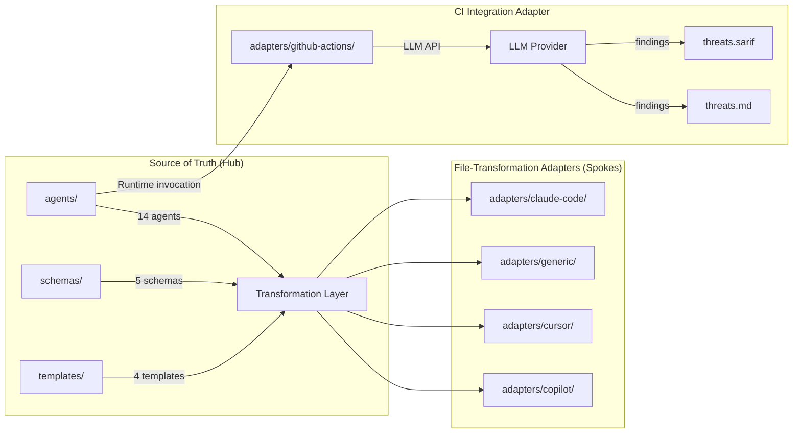

---
triad:
  pm_signoff:
    agent: product-manager
    date: 2026-03-23
    status: APPROVED_WITH_CONCERNS
    notes: "All 10 FRs covered, 5/5 user stories traceable, P0/P1 priorities correct. Concerns: (1) Verify Copilot instructions mechanism loads alongside agent invocations before building. (2) Generic adapter orchestrator conversion is justified FR-002 exception — now documented."
  architect_signoff:
    agent: architect
    date: 2026-03-23
    status: APPROVED_WITH_CONCERNS
    notes: "Hub-and-spoke correctly applied, transformation rules preserve interface contract, constitution compliant. Concerns addressed: path rewriting examples added for all platforms, 120K chars/30K tokens corrected, metadata section format specified, VERSION uses commit SHA."
  techlead_signoff: null
---

# Implementation Plan: Platform Adapters

**Branch**: `021-platform-adapters` | **Date**: 2026-03-23 | **Spec**: [spec.md](spec.md)
**Input**: Feature specification from `specs/021-platform-adapters/spec.md`

## Summary

Create 5 platform adapters that transform tachi's core threat agent definitions from `agents/` into native formats for Claude Code, Cursor, Copilot, GitHub Actions, and generic LLM usage. File-transformation adapters (Claude Code, Cursor, Copilot, Generic) preserve 100% of prompt content with only metadata and path transformations. The GitHub Actions adapter is architecturally distinct — a CI workflow that invokes agents via LLM API at runtime.

## Technical Context

**Language/Version**: Markdown, YAML, Bash (for VERSION file generation)
**Primary Dependencies**: None (adapters are static content files; GitHub Actions adapter uses `codeql/upload-sarif@v3`)
**Storage**: Filesystem (markdown and YAML files)
**Testing**: Manual verification — content comparison between source agents and adapter files, output parity testing via threat analysis runs
**Target Platform**: Cross-platform (Claude Code, Cursor, Copilot, GitHub Actions, any LLM)
**Project Type**: Content transformation (no application code)
**Constraints**: Copilot 30,000-character prompt body limit; orchestrator is ~120K characters (~30K tokens); threat-report is ~43K characters (~11K tokens)
**Scale/Scope**: 14 core agents transformed into 5 platform-specific formats, plus schemas and templates

## Constitution Check

*GATE: Must pass before Phase 0 research. Re-check after Phase 1 design.*

| Principle | Status | Notes |
|-----------|--------|-------|
| I. General-Purpose Architecture | PASS | Core agents remain platform-neutral; adapters are derived artifacts |
| II. API-First Design | N/A | No API involved — adapters are static file transformations |
| III. Backward Compatibility | PASS | Core `agents/` directory unchanged; adapters are additive |
| IV. Concurrency & Data Integrity | N/A | No state mutations or concurrent access |
| V. Privacy & Data Isolation | PASS | No PII in agent files; no external data flows |
| VI. Testing Excellence | PASS | Manual verification via content comparison and output parity testing |
| VII. Definition of Done | PASS | Installation verification + output parity + user validation |
| VIII. Observability | N/A | No runtime services |
| IX. Git Workflow | PASS | Feature branch `021-platform-adapters` |
| X. Product-Spec Alignment | PASS | PRD → spec → plan flow with dual sign-off |
| XI. SDLC Triad | PASS | Triad governance followed throughout |

No violations. No complexity tracking needed.

## Components

### Component 1: Adapter Directory Structure

**Location**: `adapters/` (coexisting with existing knowledge-system config files)
**Type**: New subdirectories

Platform adapter directories are added alongside existing `adapters/` content (ContextLoading.yaml, ScoringRubric.md, Presets/, Terms/). No existing files are modified or relocated.

```
adapters/
├── ContextLoading.yaml     # Existing (knowledge-system config)
├── ProjectMeta.yaml        # Existing
├── ScoringRubric.md        # Existing
├── Presets/                 # Existing
├── Terms/                   # Existing
├── README.md               # Updated to document both purposes
├── claude-code/            # NEW — P0 Sprint 1
│   ├── README.md           # Installation instructions
│   ├── VERSION             # Source SHA + agent manifest
│   └── agents/             # Transformed agent files
│       ├── orchestrator.md
│       ├── spoofing.md
│       ├── tampering.md
│       ├── repudiation.md
│       ├── info-disclosure.md
│       ├── denial-of-service.md
│       ├── privilege-escalation.md
│       ├── prompt-injection.md
│       ├── data-poisoning.md
│       ├── model-theft.md
│       ├── agent-autonomy.md
│       ├── tool-abuse.md
│       ├── threat-report.md
│       └── threat-infographic.md
├── generic/                # NEW — P0 Sprint 1
│   ├── README.md           # Sequential + programmatic instructions
│   ├── VERSION
│   └── prompts/            # Self-contained prompt files
│       ├── 00-orchestrator.md
│       ├── 01-spoofing.md
│       ├── 02-tampering.md
│       ├── 03-repudiation.md
│       ├── 04-info-disclosure.md
│       ├── 05-denial-of-service.md
│       ├── 06-privilege-escalation.md
│       ├── 07-prompt-injection.md
│       ├── 08-data-poisoning.md
│       ├── 09-model-theft.md
│       ├── 10-agent-autonomy.md
│       ├── 11-tool-abuse.md
│       ├── 12-threat-report.md
│       └── 13-threat-infographic.md
├── cursor/                 # NEW — P1 Sprint 2
│   ├── README.md
│   ├── VERSION
│   └── rules/              # .mdc rule files
│       ├── orchestrator.mdc
│       ├── spoofing.mdc
│       └── ... (14 files total)
├── copilot/                # NEW — P1 Sprint 2
│   ├── README.md
│   ├── VERSION
│   └── agents/             # .agent.md files
│       ├── orchestrator.agent.md
│       ├── spoofing.agent.md
│       └── ... (14 files total, with size constraint handling)
└── github-actions/         # NEW — P1 Sprint 2
    ├── README.md
    ├── VERSION
    └── tachi-threat-model.yml
```

### Component 2: Claude Code Adapter (P0)

**Location**: `adapters/claude-code/`
**Type**: New files

**Transformation rules**:
- **Frontmatter**: Replace tachi's custom frontmatter (`agent_name`, `category`, `threat_class`, `dfd_targets`, `owasp_references`, `output_schema`) with Claude Code's required fields (`name`, `description`). Preserve all tachi metadata as a `## Metadata` section in the markdown body.
- **Agent name mapping**: `agent_name` value becomes `name` (with `tachi-` prefix for namespacing, e.g., `tachi-spoofing`)
- **Description**: Auto-generate from `category` + `threat_class` + purpose section (e.g., "STRIDE Spoofing threat agent — identifies authentication bypass and identity spoofing threats")
- **Body**: Preserve 100% of markdown body content unchanged
- **Path references**: Rewrite relative paths from project root to resolve from `.claude/agents/tachi/` installation location. References to `schemas/` and `templates/` become `../../../schemas/finding.yaml` (3 levels up from `.claude/agents/tachi/` to project root). References to sibling agents become flat (e.g., `agents/stride/spoofing.md` → `spoofing.md`)
- **Orchestrator special handling**: The orchestrator's `references.agents` paths must be rewritten to point to sibling files in the same directory (e.g., `agents/stride/spoofing.md` → `spoofing.md`)
- **Metadata section format**: Tachi-specific frontmatter fields are relocated to a `## Metadata` section at the top of the body, using a consistent YAML code block:
  ```
  ## Metadata
  ```yaml
  category: stride
  threat_class: S
  dfd_targets: [External Entity, Process]
  owasp_references: [...]
  output_schema: schemas/finding.yaml
  ```
  ```

**Installation**: Single `cp -r adapters/claude-code/agents/ .claude/agents/tachi/` command.

### Component 3: Generic Adapter (P0)

**Location**: `adapters/generic/`
**Type**: New files

**Transformation rules**:
- **Frontmatter**: Strip all YAML frontmatter. Agent metadata is not useful in a chat UI context.
- **Numbering**: Prefix each file with execution order number (`00-` through `13-`)
- **Self-contained**: Each prompt file must include all context needed for execution. Add a "How to Use" header explaining what input to provide and what output to expect.
- **FR-002 exception (justified)**: The generic adapter's orchestrator conversion from dispatch coordinator to sequential workflow guide is the one case where prompt logic is modified. This is a justified exception because the generic adapter serves a fundamentally different execution model (sequential manual invocation) where agent dispatch instructions are meaningless. All other agents preserve 100% of prompt content.
- **Orchestrator**: Convert from a dispatch coordinator to a sequential workflow guide. Replace Agent tool dispatch instructions with numbered steps: "Step 1: Run the Spoofing analysis prompt. Step 2: Run the Tampering analysis prompt..."
- **Template variables**: Add `{{ARCHITECTURE_INPUT}}` placeholder where the user provides their architecture diagram
- **Path references**: Remove all internal path references since files are self-contained

**Two usage modes documented in README.md**:
1. **Sequential (chat UI)**: Copy-paste each numbered prompt file, feeding architecture input to the orchestrator first, then each threat agent
2. **Programmatic (API)**: Example curl/Python code showing how to chain API calls

### Component 4: Cursor Adapter (P1)

**Location**: `adapters/cursor/`
**Type**: New files

**Transformation rules**:
- **Extension**: `.mdc` (Cursor's recommended format)
- **Frontmatter**: Replace tachi frontmatter with Cursor's 3 fields:
  - `description`: Auto-generated from agent purpose (for Agent Requested matching)
  - `globs`: Empty (threat agents are not file-type specific)
  - `alwaysApply`: `false` for threat agents, `true` for orchestrator
- **Orchestrator**: Set `alwaysApply: true` so it's always in context. Body must explain Cursor's context injection model (no active dispatch — user must reference threat agents explicitly)
- **Threat agents**: Set as Agent Requested (description set, globs empty, alwaysApply false). Cursor's agent decides relevance based on description.
- **Body**: Preserve 100% of prompt content
- **Metadata section**: Same `## Metadata` YAML code block format as Claude Code adapter
- **Path references**: Rewrite to resolve from `.cursor/rules/tachi/` installation location. References to `schemas/` become `../../../schemas/finding.yaml` (3 levels up from `.cursor/rules/tachi/` to project root)

**Behavioral difference**: Cursor has no agent dispatch mechanism. Threat agents are passive context, not active subagents. The adapter README must document this difference and explain the invocation workflow.

### Component 5: Copilot Adapter (P1)

**Location**: `adapters/copilot/`
**Type**: New files

**Transformation rules**:
- **Extension**: `.agent.md` (Copilot's custom agent format)
- **Frontmatter**: Replace tachi frontmatter with Copilot's schema:
  - `name`: `tachi-{agent_name}` (e.g., `tachi-spoofing`)
  - `description`: Auto-generated from agent purpose
  - `user-invocable`: `true` for orchestrator, `false` for threat agents
- **Orchestrator**: Use `agents` field to declare spawnable threat agents. Use `handoffs` field to model the dispatch workflow.
- **Body**: Preserve 100% of prompt content
- **Metadata section**: Same `## Metadata` YAML code block format as Claude Code and Cursor adapters
- **Path references**: Rewrite to resolve from `.github/agents/tachi/` installation location. References to `schemas/` become `../../../schemas/finding.yaml` (3 levels up from `.github/agents/tachi/` to project root)

**Size constraint handling**:
- Orchestrator (120K chars) far exceeds 30K limit. Strategy: split into a dispatcher agent (under 30K) that references a `tachi-orchestrator-context.md` instructions file in `.github/instructions/`. The instructions file provides full orchestrator context via Copilot's instructions mechanism.
- threat-report.md (43K chars) exceeds 30K limit. Strategy: same split — compact agent file + instructions file.
- All other agents (5-13K chars) fit within the 30K limit.

### Component 6: GitHub Actions Adapter (P1)

**Location**: `adapters/github-actions/`
**Type**: New files

**Architecturally distinct** from file-transformation adapters. This is a CI workflow that invokes tachi agents via LLM API at runtime.

**Workflow design** (`tachi-threat-model.yml`):
- **Trigger**: `on: pull_request` with `paths:` filter matching configurable architecture file patterns (default: `docs/architecture/**`, `*.mermaid`, `*.puml`)
- **Inputs**: `LLM_API_KEY` (secret), `architecture-path` (configurable), `llm-provider` (default: `anthropic`), `llm-model` (default: model with 200K+ context)
- **Steps**:
  1. Checkout repository
  2. Read architecture input file
  3. Invoke orchestrator via LLM API (single large-context call with full orchestrator prompt + architecture input)
  4. Parse orchestrator output for individual threat findings
  5. Generate `threats.md` from findings using output template
  6. Generate `threats.sarif` from findings using SARIF template
  7. Upload `threats.sarif` via `codeql/upload-sarif@v3` with `category: tachi-threat-model`
  8. Upload `threats.md` as workflow artifact
- **Error handling**: Fail gracefully on API errors with clear messages. Retry once on rate limit (429) with exponential backoff.
- **SARIF requirements**: Include `partialFingerprints.primaryLocationLineHash` to prevent duplicate alerts across runs. Conform to SARIF 2.1.0 with 10MB gzipped limit.

**LLM API strategy for 120K+ token orchestrator**:
- Recommend models with 200K+ context windows (Claude 3.5/4 at 200K, Gemini at 1M+)
- Single API call approach (no chunking) — the orchestrator is designed as a monolithic prompt
- Document minimum context window requirements in README

### Component 7: VERSION File Format

**Location**: `adapters/{platform}/VERSION` (one per adapter)
**Type**: New files

```yaml
source_version: abc1234  # Git commit SHA at time of adapter generation
generated_date: 2026-03-23
agent_manifest:
  - file: orchestrator.md
    source: agents/orchestrator.md
    sha256: e3b0c44298fc1c...
  - file: spoofing.md
    source: agents/stride/spoofing.md
    sha256: a1b2c3d4e5f6...
  # ... (14 entries total)
```

**Generation**: Manual during adapter creation. Compute SHA-256 checksums of source agent files. Record the Git SHA of the `agents/` directory tree object.

**Drift detection**: Compare VERSION file checksums against current `agents/` files. Mismatch indicates adapters need regeneration. Full automation is out of scope for MVP.

## Data Flow



## Tech Stack

| Technology | Purpose | Justification |
|------------|---------|---------------|
| Markdown | Agent prompt files | Native format for all target platforms |
| YAML | Frontmatter metadata, VERSION manifest | Standard for config in all target platforms |
| Bash | VERSION file generation script | Lightweight, no runtime dependencies |
| GitHub Actions YAML | CI workflow definition | Standard for GitHub CI/CD |
| `codeql/upload-sarif@v3` | SARIF upload to Code Scanning | GitHub's official SARIF upload action |

## Transformation Rules Summary

| Source Field | Claude Code | Cursor (.mdc) | Copilot (.agent.md) | Generic | GitHub Actions |
|--------------|-------------|---------------|---------------------|---------|----------------|
| `agent_name` | `name: tachi-{value}` | N/A | `name: tachi-{value}` | Stripped | N/A |
| `category` | In description | In description | In description | Stripped | N/A |
| `threat_class` | Moved to body | Moved to body | Moved to body | Stripped | N/A |
| `dfd_targets` | Moved to body | Moved to body | Moved to body | Stripped | N/A |
| `owasp_references` | Moved to body | Moved to body | Moved to body | Stripped | N/A |
| `output_schema` | Moved to body | Moved to body | Moved to body | Stripped | N/A |
| Body content | 100% preserved | 100% preserved | 100% preserved | 100% preserved | N/A (API prompt) |
| Path references | Rewritten to `.claude/agents/tachi/` relative | Rewritten to `.cursor/rules/tachi/` relative | Rewritten to `.github/agents/tachi/` relative | Removed (self-contained) | N/A |

## Project Structure

### Documentation (this feature)

```
specs/021-platform-adapters/
├── plan.md              # This file
├── research.md          # Research phase output
├── spec.md              # Feature specification
├── checklists/
│   └── requirements.md  # Spec quality checklist
└── tasks.md             # Task breakdown (pending)
```

### Source (repository root)

```
adapters/
├── claude-code/         # P0 — Sprint 1
│   ├── README.md
│   ├── VERSION
│   └── agents/          # 14 transformed agent .md files
├── generic/             # P0 — Sprint 1
│   ├── README.md
│   ├── VERSION
│   └── prompts/         # 14 numbered prompt .md files
├── cursor/              # P1 — Sprint 2
│   ├── README.md
│   ├── VERSION
│   └── rules/           # 14 .mdc rule files
├── copilot/             # P1 — Sprint 2
│   ├── README.md
│   ├── VERSION
│   └── agents/          # 14 .agent.md files (+ instructions for oversized agents)
└── github-actions/      # P1 — Sprint 2
    ├── README.md
    ├── VERSION
    └── tachi-threat-model.yml
```

**Structure Decision**: Flat adapter subdirectories under existing `adapters/` root. Each adapter is self-contained with its own README, VERSION, and platform-specific agent files. No shared code between adapters (each is independently installable).

## Complexity Tracking

No constitution violations. No complexity justification needed.
