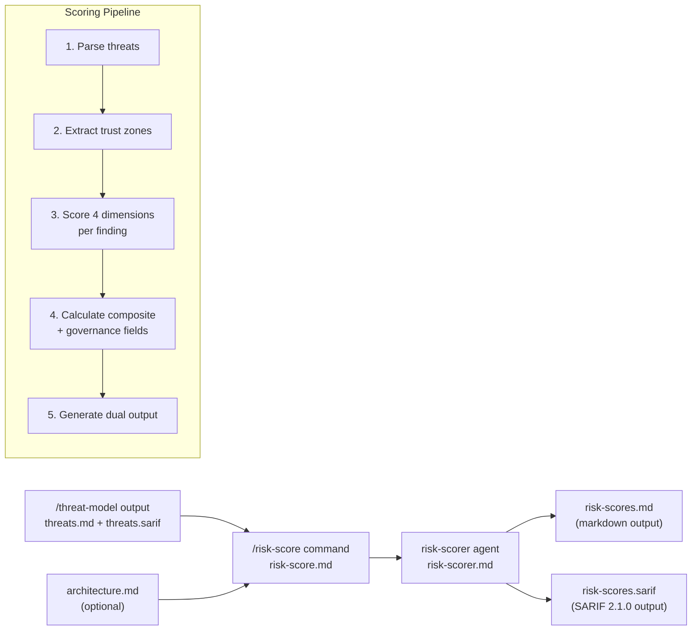

---
triad:
  pm_signoff:
    agent: product-manager
    date: 2026-03-27
    status: APPROVED
    notes: "All 17 FRs covered, 5 user stories traceable, no scope creep. SC-001 differentiation should exclude correlated peer groups."
  architect_signoff:
    agent: architect
    date: 2026-03-27
    status: APPROVED_WITH_CONCERNS
    notes: "Architecturally sound. Addressed: Note band consolidated into Low, input precedence (threats.md canonical), agentic CVSS default adjusted (PR:L), SARIF taxonomy preservation added."
  techlead_signoff: null  # Added by /aod.tasks
---

# Implementation Plan: Quantitative Risk Scoring

**Branch**: `035-quantitative-risk-scoring` | **Date**: 2026-03-27 | **Spec**: [spec.md](spec.md)
**Input**: Feature specification from `/specs/035-quantitative-risk-scoring/spec.md`

## Summary

Add a `/risk-score` command and scoring agent that enriches existing `/threat-model` output with four-dimensional quantitative risk scores (CVSS 3.1, exploitability, scalability, reachability), producing `risk-scores.md` and `risk-scores.sarif` with governance fields for remediation tracking.

tachi is a prompt engineering/agent orchestration toolkit — all deliverables are markdown and YAML files (commands, agents, schemas, templates). No compiled code, no build system, no database.

## Technical Context

**Language/Version**: Markdown + YAML (prompt engineering; no compiled code)
**Primary Dependencies**: Claude Code agent framework (`.claude/agents/`, `.claude/commands/`)
**Storage**: Local filesystem (markdown/YAML files co-located with threat model output)
**Testing**: Manual validation against `examples/agentic-app/` sample report; SARIF schema validation
**Target Platform**: Any system running Claude Code with tachi agents installed
**Project Type**: Agent orchestration toolkit (markdown-based)
**Performance Goals**: < 60s for 50 threats, < 5 min for 200 threats
**Constraints**: No external API dependencies; all scoring via LLM analysis; SARIF 2.1.0 compliance
**Scale/Scope**: Processes up to 200 threat findings per run

## Constitution Check

*GATE: Must pass before Phase 0 research. Re-check after Phase 1 design.*

| Principle | Status | Notes |
|-----------|--------|-------|
| I. General-Purpose Architecture | PASS | `/risk-score` is domain-agnostic scoring infrastructure, not security-specific logic in core |
| II. API-First Design | N/A | CLI command, not API endpoint — tachi is a local toolkit |
| III. Backward Compatibility | PASS | Additive feature — new command and agent; no modification to existing `/threat-model` output |
| IV. Concurrency & Data Integrity | N/A | Single-agent command processing one threat model at a time |
| V. Privacy & Data Isolation | PASS | Local filesystem only; no PII in scoring output |
| VI. Testing Excellence | PASS | Validation against example corpus; SARIF schema validation |
| VII. Definition of Done | PASS | Will follow DoD checklist at `/aod.deliver` |
| VIII. Observability | PASS | Clear error messages for missing input, malformed threats, missing architecture |
| IX. Git Workflow | PASS | Feature branch `035-quantitative-risk-scoring` created |
| X. Product-Spec Alignment | PASS | Spec has PM sign-off (APPROVED_WITH_CONCERNS) |
| XI. SDLC Triad Collaboration | PASS | Following full Triad workflow |

No violations. No complexity tracking needed.

## Components

### New Files

| File | Purpose | Pattern Reference |
|------|---------|-------------------|
| `.claude/commands/risk-score.md` | Command definition — flag parsing, validation, agent invocation, output summary | `.claude/commands/threat-model.md` |
| `.claude/agents/tachi/risk-scorer.md` | Scoring agent — threat parsing, 4-dimension scoring, composite calculation, output generation | `.claude/agents/tachi/orchestrator.md` (phases 3-4) |
| `schemas/risk-scoring.yaml` | Scored finding schema — extends `finding.yaml` with scoring and governance fields | `schemas/finding.yaml` |
| `templates/risk-scores.md` | Markdown output template — executive summary, scored threat table, methodology | `templates/threats.md` |
| `templates/risk-scores.sarif` | SARIF output template — extended property bag with scoring properties | `templates/threats.sarif` |
| `adapters/claude-code/commands/risk-score.md` | Adapter copy of command for distribution | `adapters/claude-code/commands/threat-model.md` |
| `adapters/claude-code/agents/risk-scorer.md` | Adapter copy of agent for distribution | `adapters/claude-code/agents/orchestrator.md` |

### Modified Files

| File | Change | Reason |
|------|--------|--------|
| `adapters/claude-code/agents/references/sarif-generation.md` | Add risk-scoring SARIF property bag section | Document how `risk-scores.sarif` extends `threats.sarif` with scoring properties |
| `schemas/finding.yaml` | Add optional scored finding extension block | Define scoring fields as optional extension (backward compatible) |

### Unchanged Files (Input Dependencies)

| File | Role |
|------|------|
| `schemas/output.yaml` | Severity band definitions (Critical 9.0-10.0, High 7.0-8.9, etc.) — consumed, not modified |
| `.claude/agents/tachi/orchestrator.md` | Produces `threats.md`/`threats.sarif` — upstream dependency, not modified |
| `templates/threats.md` | Existing threat model template — upstream, not modified |
| `templates/threats.sarif` | Existing SARIF template — upstream, not modified |

## Data Flow



### Command Flow (`/risk-score`)

1. **Parse flags**: `--output-dir`, input file path
2. **Validate**: Check `threats.md` or `threats.sarif` exists; check tachi agents installed
3. **Locate input**: Auto-detect input format. Precedence: `threats.md` is canonical source; `threats.sarif` is fallback when markdown is unavailable
4. **Invoke risk-scorer agent**: Pass input path, optional architecture.md path
5. **Agent scores findings**: 4-dimension scoring → composite → governance fields
6. **Generate output**: Write `risk-scores.md` and `risk-scores.sarif` to input directory
7. **Display summary**: Severity band distribution, file paths, next steps

### Agent Pipeline (`risk-scorer.md`)

1. **Parse Phase**: Extract findings from `threats.md` (markdown tables) or `threats.sarif` (JSON). Preserve all original metadata (ID, component, category, description, mitigation, references).
2. **Trust Zone Phase**: Extract trust zone table from `threats.md` Section 2. If available, supplement with `architecture.md` for authentication/network exposure context. Map components to reachability baseline.
3. **Scoring Phase**: For each finding, assess four dimensions:
   - **CVSS 3.1 Base** (0.0-10.0): Map threat category + description to CVSS vector (AV, AC, PR, UI, S, C, I, A). Use category-level default vectors as baseline, refined per-threat by description analysis. Store full vector string for auditability.
   - **Exploitability** (0.0-10.0): Assess known technique existence, attack complexity, tooling availability, skill level required. Include AI-specific guidance for agentic/LLM categories.
   - **Scalability** (0.0-10.0): Assess scriptability, target scope, resource requirements, detection difficulty.
   - **Reachability** (0.0-10.0): Derive from trust zone mapping. Untrusted/External zones = 8.0-10.0, Semi-Trusted/Application = 4.0-7.0, Trusted/Internal = 1.0-4.0. Default 5.0 with warning if no trust data.
4. **Composite Phase**: Calculate `Composite = (0.35 x CVSS) + (0.30 x Exploitability) + (0.15 x Scalability) + (0.20 x Reachability)`. Map to severity band. Generate governance fields (owner, SLA, disposition, review date).
5. **Correlation Phase**: For Section 4a correlation groups, score the primary finding; correlated peers inherit the primary's scores.
6. **Output Phase**: Generate `risk-scores.md` from template (executive summary, scored table, methodology). Generate `risk-scores.sarif` with extended property bag (`security-severity` = composite score as string, plus scoring dimension properties). Preserve SARIF fingerprints for alert continuity. Preserve SARIF taxonomies (`run.taxonomies[]`, `supportedTaxonomies[]`, rule `relationships[]`) from source `threats.sarif` to avoid feature regression.

## Tech Stack

| Layer | Technology | Rationale |
|-------|-----------|-----------|
| Command layer | Markdown command file (`.claude/commands/`) | Follows existing `/threat-model` command pattern |
| Agent layer | Markdown agent file (`.claude/agents/tachi/`) | Follows existing threat agent pattern |
| Schema layer | YAML schema files (`schemas/`) | Follows existing `finding.yaml` and `output.yaml` patterns |
| Template layer | Markdown + SARIF JSON templates (`templates/`) | Follows existing `threats.md` and `threats.sarif` template patterns |
| Distribution | Adapter copy (`adapters/claude-code/`) | Follows existing adapter distribution pattern |

## Schema Design

### Scored Finding Extension (`schemas/risk-scoring.yaml`)

```yaml
schema_version: "1.0"

scored_finding:
  extends: finding  # All fields from finding.yaml, plus:

  cvss_base:
    type: number
    range: [0.0, 10.0]
    description: "CVSS 3.1 base score"

  cvss_vector:
    type: string
    pattern: "^CVSS:3\\.1/AV:[NALP]/AC:[LH]/PR:[NLH]/UI:[NR]/S:[UC]/C:[NLH]/I:[NLH]/A:[NLH]$"
    description: "Full CVSS 3.1 vector string for auditability"

  exploitability:
    type: number
    range: [0.0, 10.0]
    description: "Exploitability assessment score"

  scalability:
    type: number
    range: [0.0, 10.0]
    description: "Scalability assessment score"

  reachability:
    type: number
    range: [0.0, 10.0]
    description: "Reachability assessment score"

  composite_score:
    type: number
    range: [0.0, 10.0]
    description: "Weighted composite: (0.35*CVSS) + (0.30*Exploitability) + (0.15*Scalability) + (0.20*Reachability)"

  severity_band:
    type: string
    enum: [Critical, High, Medium, Low]
    description: >
      Mapped from composite_score per output.yaml CVSS ranges.
      Note: output.yaml defines 5 bands (Critical/High/Medium/Low/Note).
      For scoring, Note is consolidated into Low (0.0-3.9) since
      composite scores always produce a meaningful numeric value.

  risk_owner:
    type: string
    default: "Unassigned"

  remediation_sla:
    type: string
    description: "Severity-driven default: Critical=24h, High=7d, Medium=30d, Low=90d"

  risk_disposition:
    type: string
    enum: [Mitigate, Review, Accept, Transfer]
    default_mapping:
      Critical: Mitigate
      High: Mitigate
      Medium: Review
      Low: Review

  review_date:
    type: string
    format: "YYYY-MM-DD"
    description: "Scoring date + SLA duration"

# Default CVSS 3.1 Vectors per Threat Category
category_defaults:
  spoofing:     "CVSS:3.1/AV:N/AC:L/PR:N/UI:N/S:U/C:H/I:L/A:N"   # Auth bypass
  tampering:    "CVSS:3.1/AV:N/AC:L/PR:L/UI:N/S:U/C:N/I:H/A:L"   # Data modification
  repudiation:  "CVSS:3.1/AV:N/AC:L/PR:L/UI:N/S:U/C:N/I:L/A:N"   # Audit evasion
  info-disclosure: "CVSS:3.1/AV:N/AC:L/PR:L/UI:N/S:U/C:H/I:N/A:N" # Data exposure
  denial-of-service: "CVSS:3.1/AV:N/AC:L/PR:N/UI:N/S:U/C:N/I:N/A:H" # Resource exhaustion
  privilege-escalation: "CVSS:3.1/AV:N/AC:L/PR:L/UI:N/S:C/C:H/I:H/A:H" # Privilege gain
  agentic:      "CVSS:3.1/AV:N/AC:L/PR:L/UI:N/S:C/C:H/I:H/A:L"   # Agent misuse (PR:L to avoid ceiling effect)
  llm:          "CVSS:3.1/AV:N/AC:L/PR:N/UI:R/S:C/C:H/I:H/A:N"   # Prompt injection

# Composite Weights
weights:
  cvss_base: 0.35
  exploitability: 0.30
  scalability: 0.15
  reachability: 0.20

# Severity Bands (aligned with schemas/output.yaml)
severity_bands:
  Critical: { min: 9.0, max: 10.0, sla: "24h", disposition: "Mitigate" }
  High:     { min: 7.0, max: 8.9,  sla: "7d",  disposition: "Mitigate" }
  Medium:   { min: 4.0, max: 6.9,  sla: "30d", disposition: "Review" }
  Low:      { min: 0.0, max: 3.9,  sla: "90d", disposition: "Review" }
```

### SARIF Property Bag Extension

Per-result properties in `risk-scores.sarif`:

```json
{
  "properties": {
    "security-severity": "7.8",
    "cvss-base-score": "8.1",
    "cvss-vector": "CVSS:3.1/AV:N/AC:L/PR:N/UI:R/S:U/C:H/I:H/A:N",
    "exploitability": "7.5",
    "scalability": "6.0",
    "reachability": "8.0",
    "composite-weights": "0.35/0.30/0.15/0.20",
    "risk-owner": "Unassigned",
    "remediation-sla": "7d",
    "risk-disposition": "Mitigate",
    "review-date": "2026-04-03"
  }
}
```

Rule-level `security-severity` set to the maximum composite score among that rule's findings.

## Implementation Phases

### Wave 1: Foundation (Schema + Agent Core)

| Deliverable | Description |
|-------------|-------------|
| `schemas/risk-scoring.yaml` | Scored finding schema with category defaults, weights, severity bands |
| `.claude/agents/tachi/risk-scorer.md` | Core scoring agent — threat parsing, 4-dimension scoring, composite calculation, dual output generation |
| `templates/risk-scores.md` | Markdown output template with executive summary, scored threat table, methodology section |
| `templates/risk-scores.sarif` | SARIF output template with extended property bag |

**Gate**: Agent produces correct scored output for `examples/agentic-app/sample-report/threats.md`

### Wave 2: Command + Integration

| Deliverable | Description |
|-------------|-------------|
| `.claude/commands/risk-score.md` | Command definition — flag parsing, validation, agent invocation, summary |
| `adapters/claude-code/agents/risk-scorer.md` | Adapter copy of scoring agent |
| `adapters/claude-code/commands/risk-score.md` | Adapter copy of command |
| `adapters/claude-code/agents/references/sarif-generation.md` | Updated with risk-scoring SARIF section |
| `schemas/finding.yaml` | Add optional scored finding extension reference |

**Gate**: `/risk-score` command end-to-end against example threat model

### Wave 3: Validation + Documentation

| Deliverable | Description |
|-------------|-------------|
| Example output: `examples/agentic-app/sample-report/risk-scores.md` | Reference scored output for validation and documentation |
| Example output: `examples/agentic-app/sample-report/risk-scores.sarif` | Reference SARIF scored output |
| SARIF schema validation | Validate `risk-scores.sarif` against SARIF 2.1.0 JSON schema |
| Score differentiation check | Verify >= 80% of previously-identical-rated threats receive different composites |
| Reproducibility check | Verify same input produces scores within +/- 0.5 per dimension |

**Gate**: All success criteria from spec validated

## Risk Mitigations

| Risk | Mitigation | Contingency |
|------|-----------|-------------|
| CVSS mapping consistency for AI threats | Define tachi-specific default vectors in `risk-scoring.yaml` for agentic/LLM categories | Fall back to category-level defaults if per-threat refinement proves inconsistent |
| Trust boundary parsing variability | Use trust zone table from `threats.md` Section 2 (already structured) as primary source | Default reachability 5.0 with warning if trust data unavailable |
| Score clustering (most threats 5.0-7.0) | Validate against example corpus; tune category defaults if distribution is too narrow | Adjust weights or add floor/ceiling rules in Phase 2 |
| Context window pressure (>100 findings) | Structured output format minimizes token overhead per finding | Batch scoring into per-category sub-invocations if single-pass exceeds limits |
| Reproducibility tolerance (+/- 0.5) | Temperature 0 for all scoring; structured prompts with reference examples | Document tolerance as inherent to LLM-based analysis; exact determinism not guaranteed across model versions |

## Project Structure

### Documentation (this feature)

```
specs/035-quantitative-risk-scoring/
├── plan.md              # This file
├── research.md          # Research phase output (completed)
├── spec.md              # Feature specification (PM approved)
├── checklists/
│   └── requirements.md  # Spec quality checklist
└── tasks.md             # Task breakdown (pending)
```

### Source Code (repository root)

```
.claude/
├── commands/
│   └── risk-score.md           # NEW: /risk-score command definition
└── agents/
    └── tachi/
        └── risk-scorer.md      # NEW: Scoring agent

adapters/claude-code/
├── commands/
│   └── risk-score.md           # NEW: Adapter command copy
├── agents/
│   └── risk-scorer.md          # NEW: Adapter agent copy
└── references/
    └── sarif-generation.md     # MODIFIED: Add risk-scoring SARIF section

schemas/
├── finding.yaml                # MODIFIED: Add optional scored extension ref
└── risk-scoring.yaml           # NEW: Scored finding schema + weights + bands

templates/
├── risk-scores.md              # NEW: Markdown output template
└── risk-scores.sarif           # NEW: SARIF output template

examples/agentic-app/sample-report/
├── risk-scores.md              # NEW: Reference scored output
└── risk-scores.sarif           # NEW: Reference SARIF scored output
```

**Structure Decision**: No compiled source code. All deliverables are markdown/YAML agent orchestration files following existing tachi patterns. The "source" directories are `.claude/commands/`, `.claude/agents/tachi/`, `schemas/`, and `templates/`.

## Complexity Tracking

No constitution violations. No complexity justifications needed.
