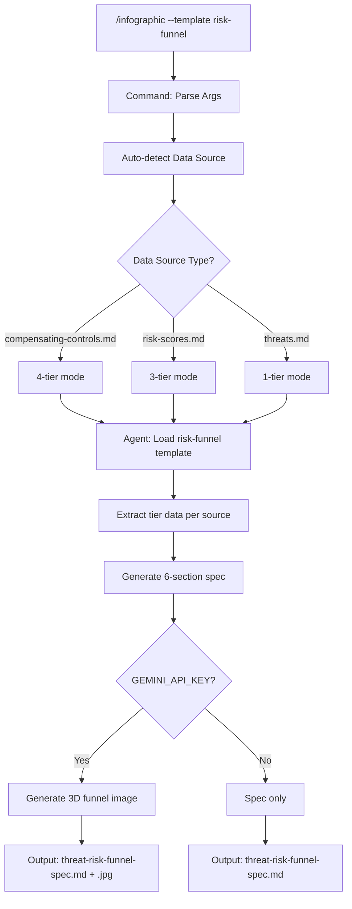

---
triad:
  pm_signoff:
    agent: product-manager
    date: 2026-03-28
    status: APPROVED
    notes: "All spec requirements covered. Components map to user stories. No scope creep. Success criteria achievable with planned approach."
  architect_signoff:
    agent: architect
    date: 2026-03-28
    status: APPROVED_WITH_CONCERNS
    notes: "Architecturally sound additive change. 3 concerns: (C-1 Low) conditional Tier 3 label in 3-tier mode not explicit in zone spec, (C-2 Low) pre-existing schema-template color palette divergence, (C-3 Info) architect sign-off now provided."
  techlead_signoff: null
---

# Implementation Plan: Risk Reduction Funnel Infographic Template

**Branch**: `053-risk-reduction-funnel` | **Date**: 2026-03-28 | **Spec**: [spec.md](spec.md)
**Input**: Feature specification from `specs/053-risk-reduction-funnel/spec.md`

## Summary

Add a `risk-funnel` template to the tachi infographic system that visualizes the progressive risk reduction pipeline as a 4-tier vertical funnel. The implementation requires three deliverables: (1) a new design template file following the established 9-section pattern, (2) template registration in the infographic agent, and (3) template registration in the infographic command. The agent already supports multi-template generation and 3-tier data source auto-detection — no architectural changes required.

## Technical Context

**Language/Version**: Markdown + YAML (methodology template, not application code)
**Primary Dependencies**: Existing infographic agent (`.claude/agents/tachi/threat-infographic.md`), Gemini API for image generation
**Storage**: Local filesystem — markdown template files, markdown spec output, JPEG image output
**Testing**: Manual validation against example threat model outputs in `examples/`
**Target Platform**: Any LLM agent capable of following structured markdown prompts
**Project Type**: Single project (knowledge system / methodology template)
**Performance Goals**: Spec generation < 10 seconds, image generation < 60 seconds (consistent with existing templates)
**Constraints**: Schema v1.0 compatibility (6 sections), fresh context isolation (ADR-010), spec-first architecture (ADR-014), no attack terminology in Gemini prompts
**Scale/Scope**: 3 files modified/created, ~400 lines of template content

## Constitution Check

*GATE: Must pass before Phase 0 research. Re-check after Phase 1 design.*

| Principle | Status | Notes |
|-----------|--------|-------|
| I. General-Purpose Architecture | PASS | Template is domain-specific to threat modeling but extends existing infographic pattern — no core component changes |
| III. Backward Compatibility | PASS | Additive change only — existing templates unaffected, `--template all` includes new template |
| VII. Definition of Done | PASS | 3-step validation: spec accuracy verification, manual test with example output, user-validated funnel image |
| IX. Git Workflow | PASS | Feature branch `053-risk-reduction-funnel` created, PR required |
| X. Product-Spec Alignment | PASS | PRD-053 approved with full Triad sign-off, spec PM-approved |

No violations. No complexity justifications required.

## Project Structure

### Documentation (this feature)

```
specs/053-risk-reduction-funnel/
├── plan.md              # This file
├── research.md          # Research phase output (completed)
├── spec.md              # Feature specification (PM-approved)
├── checklists/
│   └── requirements.md  # Spec quality checklist
└── tasks.md             # Task breakdown (pending)
```

### Source Files (change surface)

```
.claude/agents/tachi/
├── threat-infographic.md                          # UPDATE: template registry + data extraction for risk-funnel
└── templates/
    ├── infographic-baseball-card.md               # UNCHANGED (reference pattern)
    ├── infographic-system-architecture.md          # UNCHANGED (reference pattern)
    └── infographic-risk-funnel.md                  # NEW: 4-tier funnel design template

.claude/commands/
└── infographic.md                                  # UPDATE: add risk-funnel to valid template list
```

**Structure Decision**: No new directories needed. The template follows the exact file placement pattern of existing templates. All changes are within the existing `.claude/agents/tachi/` and `.claude/commands/` directories.

## Components

### Component 1: Design Template (`infographic-risk-funnel.md`)

**Purpose**: Define the complete visual specification for the risk reduction funnel — layout, colors, typography, zone specs, and Gemini prompt.

**Location**: `.claude/agents/tachi/templates/infographic-risk-funnel.md`

**Structure** (9 mandatory sections following existing template pattern):

1. **Frontmatter Comment**
   ```markdown
   # Threat Infographic Design Template: Risk Reduction Funnel
   > **Purpose**: Locked-in visual design for a 4-tier risk reduction funnel.
   > MUST follow this layout. Only data values change between runs — structure stays fixed.
   ```

2. **ASCII Layout Diagram** — 16:9 landscape showing:
   ```
   ┌───────────────────────────────────────────────────────┐
   │ HEADER (~8%)                                          │
   │ Title: "Risk Reduction Funnel" | Project | Date       │
   ├───────────────────────────────────────────┬───────────┤
   │ FUNNEL ZONE (~62%)                        │ METRICS   │
   │ ┌─────────────────────────────────────┐   │ SIDEBAR   │
   │ │ ▓▓▓▓▓▓▓▓▓▓ Tier 1 (100%) ▓▓▓▓▓▓▓▓ │   │ (~20%w)   │
   │ │  ▓▓▓▓▓▓▓▓ Tier 2 (~75%) ▓▓▓▓▓▓▓   │   │           │
   │ │    ▓▓▓▓▓▓ Tier 3 (~50%) ▓▓▓▓▓     │   │ Total     │
   │ │      ▓▓▓▓ Tier 4 (~30%) ▓▓▓       │   │ Reduction │
   │ └─────────────────────────────────────┘   │ Coverage  │
   │ Tier labels (left-aligned)                │           │
   ├───────────────────────────────────────────┴───────────┤
   │ FOOTER (~5%)                                          │
   │ "Generated by Tachi Threat Modeling Framework..."    │
   └───────────────────────────────────────────────────────┘
   ```

3. **Style Table** — Dark theme consistent with baseball-card:
   - Background: Dark Navy (#1E293B)
   - Aspect ratio: 16:9 landscape
   - Card radius: 12px, shadow: 0 4px 12px rgba(0,0,0,0.3)
   - Aesthetic: Premium executive boardroom, photorealistic 3D funnel

4. **Color Palette** — Standard severity colors + funnel-specific:
   - Critical: #DC2626, High: #EA580C, Medium: #CA8A04, Low: #2563EB, Note: #6B7280
   - Funnel gradient: tier-to-tier transitions using severity-based coloring
   - Ghost tier: #475569 (Slate-600) with 20% opacity, dashed border
   - Sidebar background: #334155 (Slate-700)

5. **Typography** — Same hierarchy as baseball-card template

6. **Zone Specifications** — 4 zones:
   - **HEADER**: Title (32px bold), project name, date, confidential badge
   - **FUNNEL**: 4 trapezoid tiers with labels, widths, gradient connectors
     - Each tier specification: label, width calculation, data content, color mapping
     - Ghost tier specification: dashed outline, CTA text, 20% opacity
     - Tier connectors: gradient transitions between adjacent tiers
   - **METRICS SIDEBAR**: Right-aligned panel with aggregate statistics
     - 4-tier mode: Total Findings, Risk Reduction %, Control Coverage %, severity breakdown
     - 3-tier mode: Total Findings, severity distribution, "N/A" for unavailable metrics
     - 1-tier mode: Total Findings, severity counts only
   - **FOOTER**: Attribution line

7. **Gemini Prompt Template** — Code block with placeholders:
   - Opens with aesthetic intent: photorealistic 3D funnel, premium glass-like material
   - `{project_name}`, `{date}`, `{total_findings}`
   - `{funnel_tier_data}` — per-tier: label, width, data values, color
   - `{sidebar_metrics}` — aggregate statistics
   - `{ghost_tier_instructions}` — conditional rendering for unavailable tiers
   - Professional business language, no attack terminology

8. **Gemini API Configuration**:
   ```yaml
   model: "gemini-3-pro-image-preview"
   fallback_model: "gemini-3.1-flash-image-preview"
   response_modalities: ["TEXT", "IMAGE"]
   aspect_ratio: "16:9"
   image_size: "2K"
   ```

9. **Accessibility**: Color + label distinction, 4.5:1 contrast ratio, text-based severity identification

### Component 2: Agent Registry Update

**File**: `.claude/agents/tachi/threat-infographic.md`

**Changes**:

1. **Metadata YAML block** — Add template entry:
   ```yaml
   templates:
     baseball-card: .claude/agents/tachi/templates/infographic-baseball-card.md
     system-architecture: .claude/agents/tachi/templates/infographic-system-architecture.md
     risk-funnel: .claude/agents/tachi/templates/infographic-risk-funnel.md
   ```

2. **Description** — Update to mention three templates (from two)

3. **Available Templates table** — Add row:
   ```
   | `risk-funnel` | `threat-risk-funnel-spec.md` + `threat-risk-funnel.jpg` | 4-tier vertical funnel showing progressive risk reduction: threats identified → inherent risk scored → controls applied → residual risk |
   ```

4. **Template `all` behavior** — Update to generate three templates sequentially: Baseball Card, System Architecture, Risk Funnel

5. **Data extraction for risk-funnel** — Add funnel-specific extraction instructions:
   - Section 5 (Architecture Threat Overlay) uses new "funnel-tier" format
   - Tier width calculation: proportional to finding count/risk volume at each stage
   - Minimum 10% narrowing per tier enforced
   - Graceful degradation logic for 4/3/1 tier modes
   - Ghost tier rendering instructions

### Component 3: Command Registry Update

**File**: `.claude/commands/infographic.md`

**Changes**:

1. **Valid template values** — Add `risk-funnel`:
   ```
   Valid values: baseball-card, system-architecture, risk-funnel, all
   ```

2. **Invalid template error message** — Update to include `risk-funnel` in the list

3. **`all` description** — Update to note three templates generated

## Data Flow



## Tech Stack

| Layer | Technology | Purpose |
|-------|-----------|---------|
| Template | Markdown | Design specification with ASCII layout, zone specs, Gemini prompt |
| Agent | Markdown prompt | Data extraction, spec generation, image pipeline |
| Command | Markdown prompt | CLI entry point, argument parsing, data source detection |
| Image | Gemini API | Photorealistic 3D funnel rendering (best-effort) |
| Schema | YAML | Output validation (infographic.yaml v1.0) |

## Complexity Tracking

No violations. No complexity justifications required.
