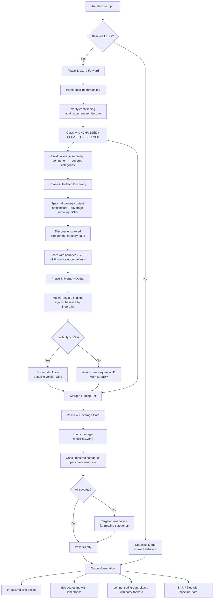

---
triad:
  pm_signoff:
    agent: product-manager
    date: 2026-03-31
    status: APPROVED
    notes: "Plan covers all 20 FRs, all 6 user stories, all 4 pipeline phases. Scope contained. Backward compatibility preserved. Previous spec concern (US-074-5 merge) resolved by explicit RESOLVED section in output templates."
  architect_signoff:
    agent: architect
    date: 2026-03-31
    status: APPROVED_WITH_CONCERNS
    notes: "4-phase architecture technically sound. 2 medium items for task decomposition: (1) primaryLocationLineHash role should be documented as validation signal not discriminator, (2) >80% similarity metric must specify deterministic algorithm per ADR-012. 5 low items addressable during implementation."
  techlead_signoff: null
---

# Implementation Plan: Baseline-Aware Pipeline

**Branch**: `074-baseline-aware-pipeline` | **Date**: 2026-03-31 | **Spec**: [spec.md](spec.md)
**Input**: Feature specification from `specs/074-baseline-aware-pipeline/spec.md`

## Summary

Transform tachi's stateless threat modeling pipeline into a baseline-aware pipeline with stable finding IDs, score inheritance, delta annotations, and coverage assurance across runs. The implementation modifies agent definitions, skill domain knowledge, YAML schemas, and output templates — no application code. The 4-phase pipeline (Carry-Forward → Isolated Discovery → Merge+Dedup → Coverage Gate) is orchestrated through enhanced agent prompt instructions and schema-driven validation.

## Technical Context

**Language/Version**: Markdown, YAML (agent/skill/schema/template definitions — no compiled code)
**Primary Dependencies**: Existing tachi pipeline (orchestrator, risk-scorer, control-analyzer agents + skills)
**Storage**: File-based (markdown + YAML + SARIF JSON) — constitutional requirement
**Testing**: Manual pipeline execution against example architectures (second-brain-mcp, agentic-app)
**Target Platform**: Claude Code CLI (any platform)
**Project Type**: Knowledge system — agent definitions, skills, schemas, templates
**Performance Goals**: Baseline loading <5s, total overhead <15%, coverage gate <2s/component
**Constraints**: Backward compatible (no baseline = identical to current behavior), additive output changes only
**Scale/Scope**: 8 schema categories, 11 threat agents, 3 pipeline commands, 6 output templates (3 markdown + 3 SARIF)

## Constitution Check

*GATE: Must pass before Phase 0 research. Re-check after Phase 1 design.*

| Principle | Status | Notes |
|-----------|--------|-------|
| I. General-Purpose Architecture | PASS | Pipeline enhancement is domain-agnostic — baseline awareness applies to any threat model, not security-specific |
| II. API-First Design | N/A | No API layer — this is agent/skill/schema work |
| III. Backward Compatibility | PASS | First run without baseline is identical to current behavior. Additive frontmatter and delta annotations. No breaking changes to SARIF structure |
| IV. Concurrency & Data Integrity | PASS | File-based state with deterministic fingerprints. No concurrent write concerns — pipeline runs are sequential |
| V. Privacy & Data Isolation | N/A | No new data exposure — findings are already in output files |
| VI. Testing Excellence | PASS | Validated against second-brain-mcp (real-world variance case) and agentic-app example |
| VII. Definition of Done | PASS | DoD checklist in PRD with 15 verification items |
| VIII. Observability & Root Cause | PASS | Coverage gate produces observable warnings. Delta annotations provide audit trail |
| IX. Git Workflow | PASS | Feature branch `074-baseline-aware-pipeline` with PR workflow |
| X. Product-Spec Alignment | PASS | PM approved spec (APPROVED_WITH_CONCERNS). Dual sign-off on this plan |
| XI. SDLC Triad Collaboration | PASS | Full Triad governance: PM spec sign-off → PM+Architect plan sign-off → Triple tasks sign-off |

## Components

### Component 1: Schema Extensions

Extend existing YAML schemas to support baseline-aware fields.

**Files modified**:
- `schemas/finding.yaml` — Add `delta_status` (NEW/UNCHANGED/UPDATED/RESOLVED), `baseline_run_id` (string, nullable)
- `schemas/risk-scoring.yaml` — Add `score_source` (inherited/fresh), `score_bounds` (object with min/max per category)
- `schemas/compensating-controls.yaml` — Add `control_carry_forward` (boolean), `rescan_scope` (full/incremental)

**New file**:
- `schemas/coverage-checklists.yaml` — Required threat categories per DFD element type. Maps component types (External Entity, Process, Data Store, Data Flow) and AI subtypes (LLM Process, MCP Server) to minimum threat categories.

### Component 2: Orchestrator Agent Enhancement

Enhance the tachi orchestrator agent to implement the 4-phase baseline-aware pipeline.

**File modified**: `.claude/agents/tachi/orchestrator.md`

**Changes**:
- **Phase 0 (new)**: Baseline Detection — detect and parse previous `threats.md` from output directory or `--baseline` path. Extract finding registry (IDs, categories, components, fingerprints).
- **Phase 1 modification**: After scoping, inject baseline context into threat agents. Agents verify each baseline finding against current architecture → classify as UNCHANGED, UPDATED, or RESOLVED.
- **Phase 2 modification**: After carry-forward, spawn isolated discovery context with coverage summary only (component names + covered categories). Discovery agents receive architecture + coverage summary, NOT full finding text.
- **Phase 3 (new)**: Merge + Dedup — match Phase 2 findings against baseline by (component, threat_category, `primaryLocationLineHash`). Similarity >80% = duplicate (baseline wins). New findings get sequential IDs after highest existing per category.
- **Phase 4 (new)**: Coverage Gate — load `schemas/coverage-checklists.yaml`, check merged findings against required categories per component type. Flag gaps, trigger targeted re-analysis for missing categories.
- **Phase 5 modification**: Report phase injects delta annotations and baseline frontmatter into output.

### Component 3: Risk Scorer Agent Enhancement

Enhance the risk scorer to support score inheritance and bounded scoring.

**File modified**: `.claude/agents/tachi/risk-scorer.md`

**Changes**:
- Inherit composite scores, CVSS vectors, and governance fields for `[UNCHANGED]` findings (zero drift)
- Re-score `[UPDATED]` findings fresh (full 4-dimensional scoring)
- Bound `[NEW]` finding CVSS base scores within ±1.0 of category defaults from `schemas/risk-scoring.yaml`
- Carry forward governance fields (risk_owner, remediation_sla, risk_disposition, review_date) for persisting findings
- Add `score_source` field to output: "inherited" for UNCHANGED, "fresh" for NEW/UPDATED

### Component 4: Control Analyzer Agent Enhancement

Enhance the control analyzer to support incremental re-scanning.

**File modified**: `.claude/agents/tachi/control-analyzer.md`

**Changes**:
- Carry forward control status, evidence, and residual risk for `[UNCHANGED]` findings
- Re-scan only files associated with `[NEW]` or `[UPDATED]` findings
- Preserve control evidence for unchanged findings (no re-detection needed)
- Add `control_carry_forward` flag to output

### Component 5: Skill Domain Knowledge Updates

Update skill files with baseline-aware domain knowledge.

**Files modified**:
- `.claude/skills/tachi-orchestration/SKILL.md` — Add 4-phase baseline orchestration rules, baseline detection logic, merge/dedup algorithm, coverage gate specification
- `.claude/skills/tachi-risk-scoring/SKILL.md` — Add score inheritance rules, bounded scoring specification, score_source field
- `.claude/skills/tachi-control-analysis/SKILL.md` — Add carry-forward rules, incremental re-scan specification

### Component 6: Output Template Updates

Enhance output templates to include delta annotations and baseline metadata.

**Files modified**:
- `templates/tachi/output-schemas/threats.md` — Add baseline frontmatter block, delta column in threat tables, `[RESOLVED]` section, coverage gate results section
- `templates/tachi/output-schemas/risk-scores.md` — Add score_source column, baseline reference in frontmatter
- `templates/tachi/output-schemas/compensating-controls.md` — Add control_carry_forward column, rescan_scope in frontmatter

**SARIF template updates**:
- `templates/tachi/output-schemas/threats.sarif` — Add `baselineRunId` to `partialFingerprints`, add `baselineState` property per result (new/unchanged/updated/absent)
- `templates/tachi/output-schemas/risk-scores.sarif` — Add score_source property
- `templates/tachi/output-schemas/compensating-controls.sarif` — Add carry_forward property

## Data Flow



## Tech Stack

| Layer | Technology | Purpose |
|-------|-----------|---------|
| Agent definitions | Markdown (`.claude/agents/tachi/`) | Pipeline orchestration logic |
| Skill domain knowledge | Markdown (`.claude/skills/tachi-*/`) | Scoring rules, control analysis, SARIF spec |
| Schemas | YAML (`schemas/`) | Finding IR, scoring, controls, coverage checklists |
| Output templates | Markdown + JSON (`templates/tachi/output-schemas/`) | Structured output formats |
| Correlation | SARIF 2.1.0 `partialFingerprints` | Cross-run finding matching |
| Validation | Example architectures (`examples/`) | Integration testing |

## Project Structure

### Documentation (this feature)

```
specs/074-baseline-aware-pipeline/
├── plan.md              # This file
├── research.md          # Research phase output (completed)
├── data-model.md        # Schema extension design
├── quickstart.md        # Validation guide
├── checklists/          # Quality checklists
│   └── requirements.md  # Spec quality checklist
└── tasks.md             # Task breakdown (next)
```

### Source (repository root — files modified by this feature)

```
schemas/
├── finding.yaml                 # MODIFIED: +delta_status, +baseline_run_id
├── risk-scoring.yaml            # MODIFIED: +score_source, +score_bounds
├── compensating-controls.yaml   # MODIFIED: +control_carry_forward, +rescan_scope
└── coverage-checklists.yaml     # NEW: required categories per component type

.claude/agents/tachi/
├── orchestrator.md              # MODIFIED: 4-phase baseline pipeline
├── risk-scorer.md               # MODIFIED: score inheritance + bounding
└── control-analyzer.md          # MODIFIED: incremental re-scan

.claude/skills/
├── tachi-orchestration/SKILL.md # MODIFIED: baseline orchestration rules
├── tachi-risk-scoring/SKILL.md  # MODIFIED: inheritance + bounding rules
└── tachi-control-analysis/SKILL.md # MODIFIED: carry-forward rules

templates/tachi/output-schemas/
├── threats.md                   # MODIFIED: +baseline frontmatter, +delta column, +coverage gate
├── risk-scores.md               # MODIFIED: +score_source column, +baseline ref
├── compensating-controls.md     # MODIFIED: +carry-forward column, +rescan scope
├── threats.sarif                # MODIFIED: +baselineState, +baselineRunId
├── risk-scores.sarif            # MODIFIED: +score_source property
└── compensating-controls.sarif  # MODIFIED: +carry_forward property
```

**Structure Decision**: Knowledge system project — all deliverables are agent/skill/schema/template files. No application source code directories needed.

## Complexity Tracking

No constitution violations requiring justification. All changes are additive extensions to existing patterns.
