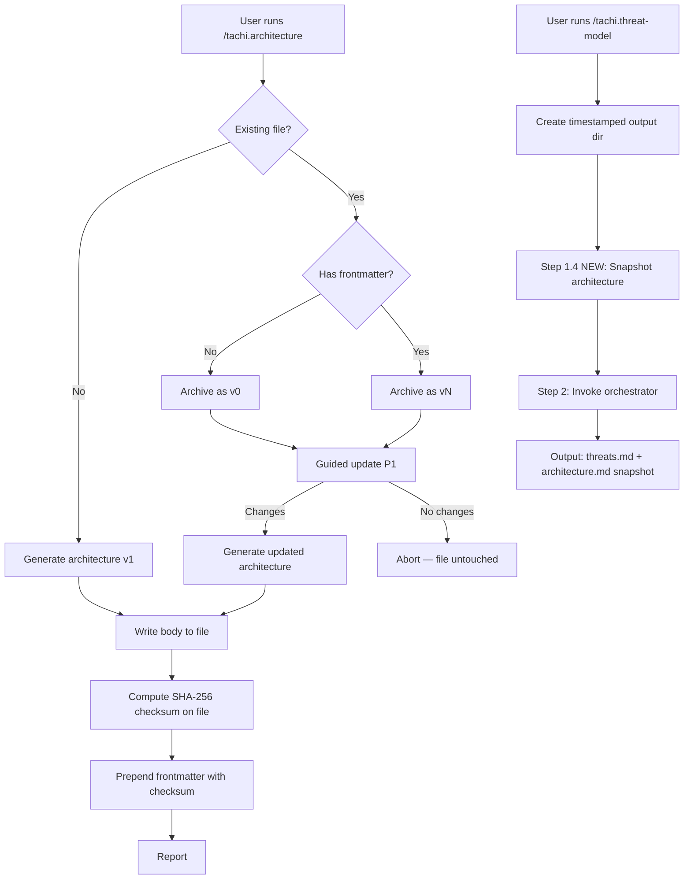

---
triad:
  pm_signoff:
    agent: product-manager
    date: 2026-04-09
    status: APPROVED_WITH_CONCERNS
    notes: "22/22 FRs addressed. All 4 user stories mapped. No scope creep. 2 non-blocking concerns: (L) FR-009 idempotency not explicit in Step 0a — noted for implementation; (L) Phase 4 validation gaps for SC-002 multi-run and SC-007 guided description — added validation steps 8-10."
  architect_signoff:
    agent: architect
    date: 2026-04-09
    status: APPROVED_WITH_CONCERNS
    notes: "9 findings (6 PASS, 2 CONCERN, 1 ADVISORY, 0 blocking). Concerns addressed: (M) Step numbering updated to match actual command structure; (M) Mermaid diagram corrected for abort path and checksum-before-frontmatter order. Advisory: two-pass write pattern specified for checksum computation."
  techlead_signoff: null
---

# Implementation Plan: Architecture Lifecycle Command

**Branch**: `120-architecture-lifecycle-command` | **Date**: 2026-04-09 | **Spec**: [spec.md](spec.md)
**Input**: Feature specification from `specs/120-architecture-lifecycle-command/spec.md`

## Summary

Add version lifecycle management to architecture files produced by `/tachi.architecture` (YAML frontmatter, version archive, guided updates) and automatic architecture snapshots to `/tachi.threat-model` output folders. Two command files are modified; no downstream pipeline changes required.

## Technical Context

**Language/Version**: Markdown command files (Claude Code agent instructions) + Bash (shasum invocation)
**Primary Dependencies**: None new — uses existing Bash tool, Read/Write tools, and file copy operations
**Storage**: Local filesystem — architecture files, `.archive/` directories, threat model output folders
**Testing**: Manual validation against 3 example architectures + scenario walkthroughs
**Target Platform**: macOS, Linux (local-first, single-user)
**Project Type**: Knowledge system — command file modifications (no application code)
**Performance Goals**: Archive copy <1s, snapshot copy <1s, frontmatter parsing <100ms (all trivially met by local file operations)
**Constraints**: No new dependencies, no schema changes to existing outputs, backward compatible with legacy architecture files
**Scale/Scope**: 2 command files modified, 0 agent files modified, 0 parser files modified

## Constitution Check

*GATE: Must pass before Phase 0 research. Re-check after Phase 1 design.*

| Principle | Status | Notes |
|-----------|--------|-------|
| I. General-Purpose Architecture | PASS | Feature is domain-agnostic — works with any architecture file, any project |
| II. API-First Design | N/A | No API changes — command file modifications only |
| III. Backward Compatibility | PASS | Legacy files without frontmatter treated as v0; examples unchanged; downstream unaffected |
| IV. Concurrency & Data Integrity | PASS | Local-first single-user; archive is append-only; no locking needed |
| V. Privacy & Data Isolation | N/A | No network operations, no shared state |
| VI. Testing Excellence | PASS | Validation against 3 example architectures; scenario walkthroughs for all user stories |
| VII. Definition of Done | PASS | DoD checklist will be applied at /aod.deliver |
| VIII. Observability & RCA | N/A | Command files — no runtime logging |
| IX. Git Workflow | PASS | Feature branch created; PR required before merge |
| X. Product-Spec Alignment | PASS | Spec has PM sign-off; plan will have dual sign-off |
| XI. SDLC Triad Collaboration | PASS | Full Triad workflow in progress |

No violations. No complexity tracking needed.

## Project Structure

### Documentation (this feature)

```
specs/120-architecture-lifecycle-command/
├── plan.md              # This file
├── research.md          # Spec-phase research
├── plan-research.md     # Plan-phase technical decisions
├── checklists/
│   └── requirements.md  # Quality checklist
├── reviews/
│   └── pm-spec-review.md
├── spec.md              # Feature specification
└── tasks.md             # Task breakdown (pending)
```

### Source Code (files modified)

```
.claude/commands/
├── tachi.architecture.md    # MODIFIED — add lifecycle management (Part 1)
└── tachi.threat-model.md    # MODIFIED — add snapshot step (Part 2)
```

**Structure Decision**: This is a knowledge system project — no application source code. All changes are to markdown command files that define agent behavior. No new files are created in the command structure.

## Components

### Part 1: Architecture Lifecycle Management (`/tachi.architecture`)

The existing 4-step command (Determine Scope → Analyze → Generate → Report) is extended with lifecycle management. The new flow:

```
Step 0: Detect Existing File
  ├── No existing file → Step 1 (Determine Scope) — existing behavior
  └── Existing file detected → Step 0a: Read & Parse Frontmatter
       ├── Has frontmatter → Extract version, prepare archive
       └── No frontmatter (legacy) → Treat as v0, prepare archive
            └── Step 0b: Archive Current Version
                 └── Copy to {parent_dir}/.archive/v{N}/{filename}
                      └── Step 0c: Guided Update Mode (P1)
                           └── Present categories, collect changes
                                └── Step 1-3: Existing behavior (with update context)
                                     └── Step 3a: Inject Frontmatter
                                          └── version, date, description, checksum, previous_version
                                               └── Step 4: Report (existing, updated)
```

#### Step 0: Detect Existing File (NEW)
1. Check if the output path already has an architecture file
2. If exists: read the file and check for YAML frontmatter (`---` delimiters)
3. Parse frontmatter fields: `version`, `date`, `description`, `checksum`, `previous_version`
4. If no frontmatter: treat as version 0 (legacy migration)
5. If no existing file: proceed to Step 1 as a fresh generation (version will be 1)

#### Step 0a: Archive Current Version (NEW)
1. Determine archive path: `{parent_dir}/.archive/v{N}/{filename}`
   - `{parent_dir}` = directory containing the architecture file
   - `{N}` = current version number (0 for legacy files, extracted version for managed files)
   - `{filename}` = architecture filename (default: `architecture.md`)
2. Create archive directory if it doesn't exist: `mkdir -p {parent_dir}/.archive/v{N}/`
3. Copy the complete current file (including frontmatter) to the archive location
4. Display: `Archived v{N} to {archive_path}`

#### Step 0b: Guided Update Mode (NEW — P1)
1. Display current architecture summary (components, flows, boundaries from existing file)
2. Present guided update categories in sequence:
   - New services/components added?
   - Components removed or decommissioned?
   - Data flows changed (new connections, protocol changes)?
   - Trust boundaries modified?
   - External entities added/removed?
   - AI capabilities changed (new models, tools, agents)?
3. For each category: user can provide changes or skip
4. Collect all changes as context for the generation step
5. If user indicates no changes across all categories: abort update, leave file untouched

#### Step 3a: Inject Frontmatter (NEW)
After architecture content is generated (Step 3), prepend YAML frontmatter:

```yaml
---
version: {N+1}
date: {YYYY-MM-DD}
description: "{change_summary}"
checksum: sha256:{hash}
previous_version: {archive_path_or_null}
---
```

**Checksum computation** (two-pass write pattern): First, write the markdown body to the output file without frontmatter. Then run `shasum -a 256` on the file to get the hash. Finally, prepend the assembled frontmatter (including the computed checksum) to the file. This avoids echo/pipe issues with large markdown bodies containing special characters.

**Version logic**:
- First-time generation (no existing file): `version: 1`, `previous_version: null`
- Legacy file upgrade (no frontmatter): `version: 1`, legacy archived as v0, `previous_version: .archive/v0/{filename}`
- Managed update (has frontmatter with version N): `version: N+1`, `previous_version: .archive/v{N}/{filename}`

### Part 2: Architecture Snapshot in Threat Model (`/tachi.threat-model`)

A single new step inserted into the existing command between output directory creation (Step 0 item 7 computes the timestamp; Step 1 item 3 creates the directory) and Step 2 (orchestrator invocation).

#### Step 1.4: Architecture Snapshot (NEW)
1. Check if the architecture file at `{architecture_path}` exists
2. If exists: copy the file verbatim to `{output_dir}/{architecture_filename}`
   - Preserve all content including frontmatter
   - Use the original filename (default: `architecture.md`)
3. If does not exist: skip silently (Step 2 validation will handle the missing file error)
4. Display when copied: `Architecture snapshot: {output_dir}/{architecture_filename}`

**Integration point**: This step runs after the timestamped output folder is created (current Step 1 item 3 in `tachi.threat-model.md`) and before the orchestrator is invoked (Step 2). The snapshot is informational — the orchestrator receives architecture content via `<architecture-input>` tags (existing behavior, unchanged).

## Data Flow



## Tech Stack

| Component | Technology | Purpose |
|-----------|-----------|---------|
| Command files | Markdown (Claude Code) | Agent instruction format |
| Archive copy | Bash `cp` via tool | File preservation |
| Directory creation | Bash `mkdir -p` via tool | Archive/output folder setup |
| Checksum | Bash `shasum -a 256` via tool | Content integrity hash |
| Frontmatter | YAML | Version metadata format |

## Implementation Phases

### Phase 1: Architecture Command Lifecycle (P0)
**Scope**: FR-001 through FR-011, FR-020 (frontmatter + archive + version logic)

Modify `.claude/commands/tachi.architecture.md`:
1. Add Step 0 (detect existing file, parse frontmatter)
2. Add Step 0a (archive current version)
3. Add Step 3a (inject frontmatter with version, date, description, checksum, previous_version)
4. Update Step 4 (report — include version info and archive location)

**Acceptance**: Architecture files have valid frontmatter; version increments correctly; archive contains previous versions.

### Phase 2: Threat Model Snapshot (P0)
**Scope**: FR-012 through FR-016 (snapshot in threat model output)

Modify `.claude/commands/tachi.threat-model.md`:
1. Add Step 1.4 (architecture snapshot between Step 1.3 and Step 2)
2. Update Step 3 report to show architecture snapshot in file list

**Acceptance**: Threat model output folders contain verbatim architecture snapshot.

### Phase 3: Guided Update Mode (P1)
**Scope**: FR-017 through FR-019 (guided update experience)

Modify `.claude/commands/tachi.architecture.md`:
1. Add Step 0b (guided update mode after archive, before generation)
2. Present update categories, collect changes
3. Pass changes as context to generation step
4. Populate `description` frontmatter field from changes

**Acceptance**: Guided mode presents categories; changes are reflected in output and description field.

### Phase 4: Validation (P0)
**Scope**: FR-021, FR-022, SC-001 through SC-007

Validate across all scenarios:
1. First-time generation produces v1 with frontmatter
2. Update on managed file produces v{N+1} with archive
3. Legacy file upgrade archives as v0, produces v1
4. Threat model snapshot present in output folder
5. All 3 example architectures work as input without frontmatter
6. Downstream pipeline stages unaffected
7. Checksum verification (recompute matches frontmatter value)
8. Multi-run validation: 3 consecutive runs produce archive with v1, v2 entries (SC-002)
9. Guided update description accuracy: verify description field reflects actual changes (SC-007)
10. Archive idempotency: re-running after a failed update overwrites same version (FR-009)

## Risks and Mitigations

| Risk | Likelihood | Impact | Mitigation |
|------|-----------|--------|------------|
| Frontmatter breaks orchestrator parsing | Low | Medium | Orchestrator receives content via `<architecture-input>` tags — frontmatter is free text to the format detector. Validate with examples. |
| Archive path conflicts | Low | Low | `.archive/` uses dot-prefix convention. Document for users. |
| `shasum` unavailable | Low | Low | Document `sha256sum` as Linux alternative in command file comments. |
| Guided update mode complexity | Medium | Low | P1 priority — core versioning works without it. Can ship P0 features first. |

## Dependencies

- **Feature 074** (Baseline-Aware Pipeline): Provides timestamped output folder structure — SHIPPED
- **Feature 121** (tachi.* Namespace): Provides `/tachi.architecture` command location — SHIPPED
- **No blocking dependencies**: Both prerequisites are already merged to main.
