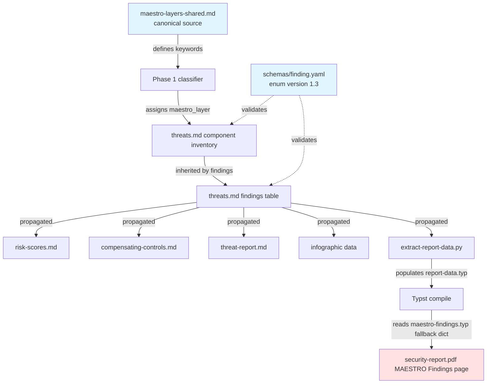

---
triad:
  pm_signoff:
    agent: product-manager
    date: 2026-04-10
    status: APPROVED
    notes: "Plan faithfully translates spec + PRD into 4-wave execution with zero Phase 2/3/4 leakage. All 8 spec user stories traceable to W0/W1/W2/W3 tasks. All 5 architect conditions from PRD attempt 2 mapped to named plan elements. Historical exclusions correctly applied. Validation stack catches byte-determinism, regressions, silent misses, cross-file drift. AD-3 creates enduring contributor guardrail."
  architect_signoff:
    agent: architect
    date: 2026-04-10
    status: APPROVED_WITH_CONCERNS
    notes: "All prior PRD-review deferred conditions honored (verbatim Ordering Rationale W1-T1, release-please W3-T9, FR-9 exclusions, README lines, enum rule in ADR-020). AD-1 through AD-4 technically sound. Byte-determinism gate adequate. CRITICAL GAP addressed in revision: 6 foundation files added (W1-T9 through W1-T14) — output-schemas threats.md, risk-scores.md, compensating-controls.md, threat-report.md, infographic-maestro-stack.md, infographic-maestro-heatmap.md. HIGH addressed: W2-T6 now specifies explicit 6-step /tachi.* command sequence. MEDIUM addressed: W1 ordering rationale clarified (documentation-level vs runtime), Risks 7 and 8 added, W2-T6 reassigned to senior-backend-engineer. Schema version bump cascade now covered by W0-T8 grep pattern 8. Scope updated from ~29 to ~35 files. LOW nits (AD-3 CI divergence check, git diff stat validation, Principle III refinement) acceptable as-is — may be addressed in future follow-up."
  techlead_signoff: null  # Added by /aod.tasks
---

# Implementation Plan: MAESTRO Canonical Layer Correctness Fix

**Branch**: `136-maestro-canonical-layer` | **Date**: 2026-04-10 | **Spec**: [spec.md](./spec.md)
**Input**: Feature specification from `specs/136-maestro-canonical-layer/spec.md`
**Research**: [research.md](./research.md) (completed during /aod.spec)
**Discovery Report**: [discovery-report.md](./discovery-report.md) (produced by Wave 0)

---

## Summary

Primary requirement: Align all MAESTRO layer references in tachi with the canonical CSA seven-layer taxonomy. Rename L5/L6/L7 (Security → Evaluation and Observability, Agent Ecosystem → Security and Compliance, User Interface → Agent Ecosystem), correct the acronym expansion, reassign keywords, bump schema enum 1.2 → 1.3, fix the pre-existing "Integration Services" third-way bug in the Typst template, regenerate all example outputs and PDF baselines (byte-deterministic via `SOURCE_DATE_EPOCH=1700000000`), update golden test fixtures, and document the breaking change in CHANGELOG.

Technical approach: Pure data/template refresh — the pipeline is data-driven (verified in research.md). No Python script changes. Four waves of work: **Wave 0** (discovery sweep, no edits), **Wave 1** (foundation files — shared ref, schema, Typst templates, pipeline docs, ADRs, README), **Wave 2** (parallel example regeneration using existing test_backward_compatibility.py invocation pattern + golden fixture regeneration), **Wave 3** (validation — pytest, backward compat, grep for leftover references, agentic-app manual spot check).

---

## Technical Context

**Language/Version**: Python 3.12+ (existing, unchanged), Typst (existing, unchanged), Bash (existing, unchanged)
**Primary Dependencies**: None changed. Existing: `scripts/extract-*.py` (Python stdlib only, zero deps per ADR-017), `templates/tachi/security-report/*.typ` (Typst), pytest 8.x + pytest-cov 4.x (dev-only, from Feature 128 bootstrap)
**Storage**: Markdown + YAML files on disk. No database, no new storage.
**Testing**: pytest suite (150+ tests from Feature 128, located in `tests/scripts/`). The byte-determinism gate is `tests/scripts/test_backward_compatibility.py` invoked with `SOURCE_DATE_EPOCH=1700000000` per ADR-021.
**Target Platform**: Developer machines running tachi pipeline (macOS, Linux). No runtime platform change.
**Project Type**: Single project (tachi methodology template). Layout follows the existing `scripts/`, `schemas/`, `templates/`, `examples/`, `tests/`, `docs/`, `.claude/` structure.
**Performance Goals**: Same as baseline — Phase 1 classification O(components × keywords × layers). New L5 keyword set adds ~11 keywords to evaluate (~2% runtime increase, negligible).
**Constraints**: Single-coordinated PR constraint (Wave 0 discovery report is the mitigation). Byte-determinism for 5 PDF baselines (SOURCE_DATE_EPOCH convention reused from ADR-021). Intentionally breaking at schema enum level (1.2 → 1.3 minor bump ships inside tachi v4.10.0 per release-please-config.json).
**Scale/Scope**: ~35 files touched (updated after architect review — 12 foundation/template files including newly-discovered output-schemas and infographic templates, ~17 example files, 2 golden fixtures, CHANGELOG, discovery report). Original estimate was ~29 before the architect's plan review identified 6 additional template files.

---

## Constitution Check

*GATE: Must pass before implementation begins. Re-checked after design.*

### I. General-Purpose Architecture ✅
No security-specific logic is added to core tachi components. The fix operates on the existing MAESTRO taxonomy overlay without introducing any domain-specific assumptions. The correctness fix IS the point — no new hardcoded assumptions.

### II. API-First Design ✅
No API changes in this feature. The only "contract" affected is the `schemas/finding.yaml` enum — a pure data contract change. Schema version bump 1.2 → 1.3 signals the breaking enum-value change. Not an API change, so no OpenAPI/Swagger updates needed.

### III. Backward Compatibility ⚠️ (intentionally broken at schema enum level)
**Justification**: This is a correctness fix where the old enum values were factually wrong (L5 "Security" contradicts canonical CSA "Evaluation and Observability"). A compatibility shim would perpetuate the error. The CHANGELOG migration note and schema version bump are the accountability mechanisms. The local `.aod/` file workflow continues to work — users who already ran tachi will see the new values when they re-run the pipeline.

### IV. Concurrency & Data Integrity ✅
No concurrency concerns. This is file-level content replacement, not runtime state.

### V. Privacy & Data Isolation ✅
No privacy impact. No changes to data handling, encryption, auth, or rate limiting.

### VI. Testing Excellence ✅
All affected files covered by existing Feature 128 pytest suite (150+ tests) and the `test_backward_compatibility.py` byte-determinism gate. FR-033 mandates the byte-determinism test passes. FR-032 mandates all existing tests continue to pass. No new test infrastructure needed; existing coverage is sufficient.

### VII. Definition of Done ✅
- **Pushed to Production**: N/A — this is a tachi template change, not a production service
- **Tested**: Automated tests (pytest + backward compat) + manual spot-check (agentic-app)
- **User Validated**: /aod.analyze passes, grep for old names returns zero, manual review of regenerated agentic-app PDF

### VIII. Observability & Root Cause Analysis ✅
No new code paths to instrument. The fix itself is the resolution to the root cause (three misnamed layers + a third divergent Typst name). Per Principle VIII, this is captured as a correctness learning: the original Feature 084 + 091 work introduced silent divergence between the shared reference and the Typst template.

### IX. Git Workflow & Feature Branching ✅
Branch: `136-maestro-canonical-layer` (created by setup-plan.sh). Single-coordinated PR constraint documented in spec US-7. Conventional commit format will be used.

### X. Product-Spec Alignment & Architecture Review ✅
PRD approved (PM + Architect + Team-Lead with APPROVED_WITH_CONCERNS). Spec PM-approved on first attempt. This plan will be dual-signed (PM + Architect).

### XI. SDLC Triad Collaboration ✅
PM has authored PRD and spec. Architect reviewed PRD (attempt 2 APPROVED_WITH_CONCERNS). Team-lead reviewed PRD (APPROVED_WITH_CONCERNS). All conditions from PRD review are addressed in this plan.

**Constitution Gate: PASSED** (one intentional constraint violation on Principle III, justified above and accepted per architect PRD review)

---

## Project Structure

### Documentation (this feature)

```
specs/136-maestro-canonical-layer/
├── plan.md                  # This file (/aod.project-plan output)
├── spec.md                  # Feature specification (PM-approved)
├── research.md              # Codebase + architecture research (pre-spec)
├── discovery-report.md      # Wave 0 grep sweep output (produced during build)
├── checklists/
│   └── requirements.md      # Spec quality checklist (completed)
└── tasks.md                 # Task breakdown (produced by /aod.tasks)
```

No `data-model.md`, `contracts/`, or `quickstart.md` are needed — this is a correctness fix with no new data entities, no new APIs, and no new user-facing commands to document.

### Source Code (repository root — all existing)

```
tachi/
├── .claude/
│   └── skills/
│       ├── tachi-shared/
│       │   └── references/
│       │       ├── maestro-layers-shared.md    # PRIMARY TARGET
│       │       └── finding-format-shared.md    # line 64
│       └── tachi-orchestration/
│           └── references/
│               └── dispatch-rules.md           # line 149
├── schemas/
│   └── finding.yaml                             # enum lines 131-132, version line 13
├── templates/
│   └── tachi/
│       └── security-report/
│           ├── maestro-findings.typ             # lines 121, 132-134
│           └── main.typ                         # line 293
├── examples/                                    # 6 example architectures
│   ├── agentic-app/
│   │   ├── threats.md
│   │   └── sample-report/                      # full pipeline (10+ files)
│   ├── ascii-web-api/
│   │   ├── threats.md
│   │   └── security-report.pdf.baseline
│   ├── free-text-microservice/
│   │   ├── threats.md
│   │   └── security-report.pdf.baseline
│   ├── mermaid-agentic-app/
│   │   ├── threats.md
│   │   ├── threat-report.md
│   │   ├── threat-infographic-spec.md
│   │   ├── attack-trees/
│   │   └── security-report.pdf.baseline
│   ├── microservices/
│   │   ├── threats.md
│   │   └── security-report.pdf.baseline
│   └── web-app/
│       ├── threats.md
│       └── security-report.pdf.baseline
├── tests/
│   └── scripts/
│       ├── test_backward_compatibility.py     # byte-determinism gate
│       └── fixtures/
│           └── golden/
│               ├── maestro-heatmap.json        # regenerate
│               └── maestro-stack.json          # regenerate
├── docs/
│   └── architecture/
│       └── 02_ADRs/
│           ├── ADR-019-shared-definitions...  # optional one-line rule (decided below)
│           └── ADR-020-maestro-layer...       # line 123 + revision note
├── README.md                                    # lines 260-262
└── CHANGELOG.md                                 # new entry
```

**Structure Decision**: No new directories. All changes operate on existing files. The spec directory gets one new file (`discovery-report.md`) produced by Wave 0.

---

## Phase 0: Content Architecture (No Separate research.md)

Research was completed during /aod.spec and saved to [research.md](./research.md). This plan references that research directly and does not duplicate content.

**Key research outcomes** (summarized for plan context):

1. **Pipeline is fully data-driven** — scripts/extract-*.py have no hardcoded layer name matching. No Python code changes are needed for the fix. (Section 1 of research.md)

2. **test_backward_compatibility.py exists and uses SOURCE_DATE_EPOCH=1700000000** — this is the byte-determinism gate (ADR-021 convention). Excludes agentic-app per Feature 128. (Section 2 of research.md)

3. **release-please targets minor track** — current version v4.9.2, schema 1.2 → 1.3 fits cleanly inside next minor release (v4.10.0). (Section 4 of research.md)

4. **Golden fixtures limited to 2 files** — `maestro-heatmap.json` and `maestro-stack.json` are the only MAESTRO-related golden fixtures. (Section 3 of research.md)

5. **No automated regeneration script exists** — regeneration uses the invocation pattern from `test_backward_compatibility.py` (extract-report-data.py → typst compile). (Section 6 of research.md)

6. **ADR-019 does not contain the enum-value-only rule** — the one-line rule for minor schema bumps needs a home. This plan locates it in ADR-020's revision note (see "Architecture Decisions" below).

7. **agentic-app example has an Audit Logger component with a Tampering finding (T-3)** — this is the known candidate for spec US-2 validation. No STRIDE Repudiation finding exists organically. (Section 8 of research.md + architect PRD review)

---

## Phase 1: Components, Data Flow, Tech Stack

### Components

No new components. The fix touches existing components:

**Tachi Taxonomy Layer** (single source of truth):
- `.claude/skills/tachi-shared/references/maestro-layers-shared.md` — canonical definition
- `.claude/skills/tachi-shared/references/finding-format-shared.md` — cross-reference

**Schema Layer**:
- `schemas/finding.yaml` — machine-readable enum

**Pipeline Documentation Layer**:
- `.claude/skills/tachi-orchestration/references/dispatch-rules.md` — orchestrator dispatch example

**PDF Rendering Layer**:
- `templates/tachi/security-report/maestro-findings.typ` — MAESTRO Findings page (contains the pre-existing "Integration Services" bug)
- `templates/tachi/security-report/main.typ` — executive summary prose

**Repository Documentation Layer**:
- `README.md` — developer-facing layer table
- `docs/architecture/02_ADRs/ADR-020-maestro-layer-classification.md` — architectural decision record
- `CHANGELOG.md` — release note

**Example Output Layer**:
- `examples/*/threats.md` (6 files)
- `examples/*/security-report.pdf.baseline` (5 files, excludes agentic-app)
- `examples/agentic-app/sample-report/*` (full pipeline, manually regenerated)
- `examples/mermaid-agentic-app/{threat-report.md,threat-infographic-spec.md}` (additional artifacts)

**Test Fixture Layer**:
- `tests/scripts/fixtures/golden/maestro-heatmap.json`
- `tests/scripts/fixtures/golden/maestro-stack.json`

### Data Flow



**Data flow change**: None structurally. The same flow carries new layer name strings from the canonical source through to the PDF output. The `maestro-findings.typ` fallback dictionary (bottom-right) is the only place where a hardcoded lookup exists — and it's a fallback for when `layer-name` data is missing, which should never happen in the normal flow. Fixing the fallback dictionary removes the pre-existing "Integration Services" bug regardless.

### Tech Stack

No stack changes. Reuses:
- **Python stdlib** (extraction scripts — zero dependencies per ADR-017)
- **Typst** (PDF report template engine, already in use)
- **pytest + pytest-cov** (developer-only test runner from Feature 128)
- **bash scripts** (existing `.aod/scripts/bash/*` helpers)
- **SOURCE_DATE_EPOCH convention** (ADR-021, reused for byte-determinism)
- **release-please** (existing workflow, v4.10.0 target)

---

## Phase 2: Wave Ordering and Task Decomposition (Preview for /aod.tasks)

The plan is decomposed into 4 waves. Tasks are enumerated at high level here; `/aod.tasks` will produce atomic per-wave task breakdown in `tasks.md`.

### Wave 0: Pre-Edit Discovery Sweep (MANDATORY)

**Goal**: Produce `specs/136-maestro-canonical-layer/discovery-report.md` capturing every hardcoded reference that must change. Must run before any file edits.

**Tasks** (summary — full atomic tasks in tasks.md):

- W0-T1: Run grep pattern 1 — `"User Interface"` — across codebase (excluding `docs/product/02_PRD/084-*`, `docs/product/02_PRD/091-*`, `specs/084-*/`, `specs/091-*/`, `.git/`, `archive/`)
- W0-T2: Run grep pattern 2 — `"Security Toolkit for Reasoning and Orchestration"` — same exclusions
- W0-T3: Run grep pattern 3 — `"Integration Services"` — same exclusions (catches the Typst third-way bug)
- W0-T4: Run grep pattern 4 — `"L5 — Security"` and `"L5 Security"` (with and without em dash) — same exclusions
- W0-T5: Run grep pattern 5 — `"L6 — Agent Ecosystem"` and `"L6 Agent Ecosystem"` — same exclusions
- W0-T6: Run grep pattern 6 — `"L7 — User Interface"` and `"L7 User Interface"` — same exclusions
- W0-T7: `dashboard` keyword pre-validation — scan `examples/*/threats.md` and `examples/*/architecture.md` (where present) for component names containing "dashboard" without other observability keywords. Document whether any ambiguity exists and the resolution chosen.
- W0-T8: **NEW — added after architect plan review**. Run grep pattern 8 — `schema_version: "1.2"` and `schema_version: 1.2` — across the entire repo (same exclusions) to find all hardcoded schema version references that need bumping alongside the primary `schemas/finding.yaml` file.
- W0-T9: Write `discovery-report.md` consolidating all grep results, annotating each file as "update in Wave 1", "update in Wave 2", or "historical — excluded per FR-45/46"
- W0-T10: Validate scope: confirm the file count in the discovery report matches the ~35-file realistic estimate (updated after architect plan review). If significantly higher (e.g., >45), flag for architect consultation before proceeding to Wave 1.

**Agent assignment**: `senior-backend-engineer` (code-savvy search + scope validation)

**Exit criteria**: `discovery-report.md` committed; file list matches realistic estimate; `dashboard` ambiguity resolved or documented.

### Wave 1: Foundation Edits (Sequential — order matters)

**Goal**: Update the foundation files (shared reference, schema, Typst templates, pipeline docs, ADRs, README) in a specific order so downstream Wave 2 regeneration reads from correct sources.

**Order constraint**: Shared reference → schema → output-schema templates → Typst templates → infographic templates → pipeline docs → repo docs. The sequential order reflects **documentation-level dependencies**, not runtime dependencies: extraction scripts are data-driven and do not read the shared reference at runtime (verified in research.md section 1). The true runtime dependency in Wave 2 is the orchestrator LLM agent for W2-T6 (agentic-app regeneration), which reads the shared reference via the Read tool during its classification work. For the mechanical PDF baseline regeneration (W2-T1 through W2-T5), the only dependency is that the Typst template (W1-T4) has been updated before `typst compile` runs.

**Tasks** (summary):

- W1-T1: Update `.claude/skills/tachi-shared/references/maestro-layers-shared.md`:
  - Line 17: Replace acronym with `"Multi-Agent Environment, Security, Threat, Risk, and Outcome"`
  - Seven-Layer Taxonomy table: rename L5 → "Evaluation and Observability", L6 → "Security and Compliance", L7 → "Agent Ecosystem"; update descriptions and example components per canonical CSA sources
  - Keyword tables: add new L5 section (11 keywords per FR-004); move existing L5 Security keywords to L6 (per FR-005); merge existing L6 Agent Ecosystem + L7 User Interface keywords into new L7 (per FR-006)
  - Ordering Rationale section (lines 34-42): **replace with the verbatim text below** (addressing architect L2 concern from PRD review):

    > **Ordering Rationale (new verbatim text)**:
    >
    > The L1-L7 evaluation order follows a specificity gradient from most specific to most general, with observability placed before security to ensure detective controls are classified correctly.
    >
    > - **L1 (Foundation Models)** is evaluated first because foundation model keywords (LLM, GPT, Claude, Gemini, inference engine) are the most specific and least ambiguous — they rarely match components at other layers.
    > - **L2 (Data Operations)** follows because data pipeline keywords (vector, RAG, embedding, dataset) are domain-specific to data handling infrastructure.
    > - **L3 (Agent Frameworks)** is next because agent orchestration keywords (orchestrator, planner, tool dispatch, MCP server) are specific to agentic orchestration layers.
    > - **L4 (Deployment Infrastructure)** is evaluated in the middle because infrastructure keywords (container, load balancer, API gateway) are common but clearly scoped to runtime deployment.
    > - **L5 (Evaluation and Observability)** is evaluated before L6 Security so that detective control keywords (audit log, monitoring, SIEM, anomaly detection, telemetry) classify to the observability layer rather than being misrouted to security. This ordering resolves the semantic ambiguity where "audit log" could match either layer — first-match-wins with L5-before-L6 gives the correct observability classification.
    > - **L6 (Security and Compliance)** is evaluated after L5 because security keywords (auth, WAF, firewall, guardrail, RBAC, IAM) are specific to preventive controls and access enforcement. Components matching both L5 and L6 keywords classify to L5 first (e.g., "security audit log" → L5 via `audit log` match).
    > - **L7 (Agent Ecosystem)** is evaluated last because it is the broadest catch-all — covering multi-agent coordination (multi-agent, swarm, delegation), agent-to-agent protocols, and human-agent interaction (chat UI, dashboard, API endpoint, web portal). Keywords here are the most general and could potentially match components at other layers, so L7 evaluates last to avoid capturing specific components that belong elsewhere.
    >
    > **WARNING**: Changing keyword order changes classification. The L5-before-L6 ordering is load-bearing for canonical MAESTRO observability/security separation. Test against all six example architectures after any modification to the keyword table.

  - (This verbatim text addresses the architect's L2 deferral from PRD review attempt 2.)

- W1-T2: Update `.claude/skills/tachi-shared/references/finding-format-shared.md` line 64 to match the new canonical enum values.

- W1-T3: Update `schemas/finding.yaml`:
  - Line 13: `schema_version: "1.3"` (bumped from "1.2")
  - Lines 131-132: Update `maestro_layer` enum to `"L5 — Evaluation and Observability"`, `"L6 — Security and Compliance"`, `"L7 — Agent Ecosystem"`
  - Add a comment near the enum: `# Updated in Feature 136 to align with canonical CSA MAESTRO. See CHANGELOG.md for migration notes.`

- W1-T4: Update `templates/tachi/security-report/maestro-findings.typ`:
  - Line 121 prose: Replace "User Interface (L7)" with "Agent Ecosystem (L7)"
  - Lines 132-134 fallback dict: 
    - `"L5": "Evaluation and Observability"`
    - `"L6": "Security and Compliance"`  **(corrects the pre-existing "Integration Services" bug)**
    - `"L7": "Agent Ecosystem"`

- W1-T5: Update `templates/tachi/security-report/main.typ` line 293 prose — replace "through User Interface (L7)" with "through Agent Ecosystem (L7)".

- W1-T6: Update `.claude/skills/tachi-orchestration/references/dispatch-rules.md` line 149 — change the example row to use "L7 — Agent Ecosystem" instead of "L7 — User Interface".

- W1-T7: Update `docs/architecture/02_ADRs/ADR-020-maestro-layer-classification.md`:
  - Line 123 acronym: Replace with canonical expansion
  - Add a "Revision History" section at the bottom (or near the top) with the following entry:

    > **2026-04-10 (Feature 136)**: Layer names for L5, L6, L7 aligned with canonical CSA MAESTRO taxonomy per the Ken Huang authoritative definition. L5 renamed from "Security" to "Evaluation and Observability", L6 renamed from "Agent Ecosystem" to "Security and Compliance", L7 renamed from "User Interface" to "Agent Ecosystem". Acronym expansion corrected to "Multi-Agent Environment, Security, Threat, Risk, and Outcome". Schema version bumped from 1.2 to 1.3 to signal the breaking enum-value change. See `docs/product/02_PRD/136-maestro-canonical-layer-correctness-fix-2026-04-10.md` for full context.
    >
    > **Schema versioning rule** (established for this feature): Enum-value-only breaking changes to `schemas/finding.yaml` warrant a minor schema bump (x.y+1), not a major bump, provided the schema shape and required fields are unchanged. The CHANGELOG migration note is the accountability mechanism for downstream consumers. This rule applies to future enum-value corrections.

  - (This addresses the architect's M2 concern from PRD review — the enum-value rule lives in ADR-020 as a Revision History note rather than ADR-019, because it's tightly coupled to the MAESTRO-specific breaking change.)

- W1-T8: Update `README.md` lines 260-262 to show canonical L5/L6/L7 names:
  ```markdown
  | L5 | Evaluation and Observability | Audit logging, monitoring, anomaly detection, forensics |
  | L6 | Security and Compliance | Auth, guardrails, rate limiting, encryption, IAM |
  | L7 | Agent Ecosystem | Multi-agent coordination, delegation, chat UIs, API endpoints |
  ```

- W1-T9: **NEW — added after architect plan review**. Update `templates/tachi/output-schemas/threats.md` (6 occurrences of `schema_version` "1.2" + 6 occurrences of old layer names in the schema example tables) — bump schema_version references to 1.3 and update layer name examples to canonical values

- W1-T10: **NEW**. Update `templates/tachi/output-schemas/risk-scores.md` — update layer name references to canonical values

- W1-T11: **NEW**. Update `templates/tachi/output-schemas/compensating-controls.md` — update layer name references to canonical values

- W1-T12: **NEW**. Update `templates/tachi/output-schemas/threat-report.md` — update layer name references to canonical values

- W1-T13: **NEW**. Update `templates/tachi/infographics/infographic-maestro-stack.md` (lines 20, 22, 24, 113 per architect grep) — update layer name references to canonical values. This file is the template spec consumed by the tachi-infographic skill.

- W1-T14: **NEW**. Update `templates/tachi/infographics/infographic-maestro-heatmap.md` (lines 33-35, 139-141, 187 per architect grep) — update layer name references to canonical values

**Agent assignment**: `senior-backend-engineer` (code-aware text manipulation, verifies Typst syntax)

**Exit criteria**: All 14 W1 tasks completed, a grep for old layer names across the foundation files returns zero matches, schema_version references read "1.3" everywhere.

### Wave 2: Parallel Regeneration (can run in parallel after Wave 1 completes)

**Goal**: Regenerate all example outputs, golden fixtures, and PDF baselines to use canonical layer names.

**Parallelism**: Tasks within this wave can run in parallel — each targets a different example directory or fixture. No inter-task dependencies.

**Tasks** (summary):

- W2-T1: Regenerate `examples/web-app/threats.md` + `security-report.pdf.baseline` using `SOURCE_DATE_EPOCH=1700000000`
- W2-T2: Regenerate `examples/microservices/threats.md` + `security-report.pdf.baseline` using `SOURCE_DATE_EPOCH=1700000000`
- W2-T3: Regenerate `examples/ascii-web-api/threats.md` + `security-report.pdf.baseline` using `SOURCE_DATE_EPOCH=1700000000`
- W2-T4: Regenerate `examples/free-text-microservice/threats.md` + `security-report.pdf.baseline` using `SOURCE_DATE_EPOCH=1700000000`
- W2-T5: Regenerate `examples/mermaid-agentic-app/threats.md` + `threat-report.md` + `threat-infographic-spec.md` + `security-report.pdf.baseline` + `attack-trees/` using `SOURCE_DATE_EPOCH=1700000000`
- W2-T6: Regenerate `examples/agentic-app/threats.md` + full `sample-report/` pipeline (threats.md, risk-scores.md, risk-scores.sarif, compensating-controls.md, threat-report.md, security-report.pdf, threat-*.jpg, threat-*-spec.md, threats.sarif, attack-trees/) — this is the manual spot-check example. **Explicit command sequence** (added after architect plan review):

  ```bash
  cd examples/agentic-app/
  # Step 1: Threat model (reads architecture.md, produces threats.md + sample-report/threats.md + threats.sarif)
  /tachi.threat-model architecture.md

  # Step 2: Risk scoring (reads sample-report/threats.md, produces sample-report/risk-scores.md + .sarif)
  /tachi.risk-score sample-report/threats.md

  # Step 3: Compensating controls (reads sample-report/risk-scores.md, produces sample-report/compensating-controls.md)
  /tachi.compensating-controls sample-report/risk-scores.md ../../  # target codebase = tachi repo root

  # Step 4: Threat report (reads all prior, produces sample-report/threat-report.md + attack-trees/)
  /tachi.threat-model --narrative sample-report/

  # Step 5: Infographics (produces threat-*.jpg + threat-*-spec.md)
  /tachi.infographic all --target sample-report/

  # Step 6: Security report PDF with SOURCE_DATE_EPOCH for visual determinism of non-Gemini content
  SOURCE_DATE_EPOCH=1700000000 /tachi.security-report sample-report/
  ```

  **Note on determinism**: agentic-app is excluded from test_backward_compatibility.py precisely because the Gemini-generated infographic JPEGs introduce non-determinism. SOURCE_DATE_EPOCH pins timestamps for the deterministic parts (PDF metadata, Typst output) but the JPEGs themselves will differ across runs. This is the reason for the Feature 128 exclusion and is acceptable for the manual spot-check validation path.
- W2-T7: Regenerate `tests/scripts/fixtures/golden/maestro-heatmap.json`
- W2-T8: Regenerate `tests/scripts/fixtures/golden/maestro-stack.json`

**Regeneration command pattern** (from research.md section 6):

```bash
# For non-agentic-app examples (covered by test_backward_compatibility.py)
SOURCE_DATE_EPOCH=1700000000 python scripts/extract-report-data.py \
  --target-dir examples/{example-name} \
  --output templates/tachi/security-report/report-data.typ \
  --template-dir templates/tachi/security-report

SOURCE_DATE_EPOCH=1700000000 typst compile templates/tachi/security-report/main.typ \
  examples/{example-name}/security-report.pdf.baseline

# For agentic-app (excluded from byte-determinism gate, manual spot-check)
# Run the full pipeline against examples/agentic-app/architecture.md, 
# placing outputs in examples/agentic-app/sample-report/
# Command sequence TBD in tasks.md based on existing pipeline invocation pattern

# For golden fixtures
# The fixtures are data files — regenerate by running extract-infographic-data.py
# against the relevant example and copying the JSON output, or by manual edit
```

**Agent assignment** (adjusted after architect plan review):
- `devops` for PDF baseline determinism on W2-T1 through W2-T5 (non-agentic-app examples — mechanical SOURCE_DATE_EPOCH + typst compile pattern)
- `senior-backend-engineer` for W2-T6 (agentic-app full pipeline — requires LLM orchestrator invocation, not just PDF compile; devops assignment was incorrect since this task needs skill invocation capability)
- `tester` for fixture regeneration W2-T7–W2-T8

**Exit criteria**: All example outputs show canonical layer names; all 5 non-agentic-app baselines are byte-deterministic (rerun produces identical bytes); both golden fixtures updated; grep for old names across all touched files returns zero.

### Wave 3: Validation and Documentation

**Goal**: Validate the fix end-to-end, update CHANGELOG, run `/aod.analyze`.

**Tasks** (summary):

- W3-T1: Run `pytest tests/scripts/test_backward_compatibility.py` with `SOURCE_DATE_EPOCH=1700000000` in the environment — must pass for all 5 non-agentic-app baselines
- W3-T2: Run full pytest suite (`pytest tests/`) — 100% pass rate required
- W3-T3: Run test_backward_compatibility.py a second time — idempotency check (must still pass)
- W3-T4: Manual spot-check — open `examples/agentic-app/sample-report/security-report.pdf` and verify MAESTRO Findings page shows canonical layer names. Verify at least one finding in "L5 — Evaluation and Observability" targets the Audit Logger component.
- W3-T5: Run `/aod.analyze` — must pass with no MAESTRO-related inconsistencies
- W3-T6: Grep for old layer names across entire repo (excluding historical PRDs/specs and the archive/ directory) — must return zero matches
- W3-T7: Grep for old acronym expansion "Security Toolkit for Reasoning and Orchestration" — must return zero matches
- W3-T8: Write `CHANGELOG.md` entry following the structure specified in spec FR-036–FR-040:

  ```markdown
  ### Feature 136 — MAESTRO Canonical Layer Correctness Fix

  **Type**: Correctness fix (not a new feature). Aligns tachi's MAESTRO taxonomy with canonical CSA Ken Huang seven-layer framework.

  **Breaking change**: `schemas/finding.yaml` schema version bumped from 1.2 to 1.3. Downstream consumers of the `maestro_layer` enum must update:

  | Old Value | New Value |
  |-----------|-----------|
  | `"L5 — Security"` | `"L5 — Evaluation and Observability"` |
  | `"L6 — Agent Ecosystem"` | `"L6 — Security and Compliance"` |
  | `"L7 — User Interface"` | `"L7 — Agent Ecosystem"` |

  **Acronym correction**: The MAESTRO acronym expansion in `.claude/skills/tachi-shared/references/maestro-layers-shared.md` corrected from "Multi-Agent Environment Security Toolkit for Reasoning and Orchestration" (non-canonical) to "Multi-Agent Environment, Security, Threat, Risk, and Outcome" (canonical CSA form).

  **Pre-existing Typst bug fixed**: `templates/tachi/security-report/maestro-findings.typ` fallback dictionary had a third divergent layer name for L6 ("Integration Services") that matched neither the shared reference nor the canonical spec. Corrected to "Security and Compliance" alongside the canonical rename.

  **Downstream migration**: Dashboards, scripts, or tooling hardcoded against the old enum values must update. The schema version bump (1.2 → 1.3) signals the breaking change to version-aware consumers. No runtime compatibility shim is provided — this is an intentional correctness fix.

  **Example outputs regenerated**: All six example architectures (web-app, microservices, ascii-web-api, mermaid-agentic-app, free-text-microservice, agentic-app) have their `threats.md` and PDF baselines regenerated with canonical layer names.

  **References**:
  - PRD: `docs/product/02_PRD/136-maestro-canonical-layer-correctness-fix-2026-04-10.md`
  - Spec: `specs/136-maestro-canonical-layer/spec.md`
  - ADR-020 revision: `docs/architecture/02_ADRs/ADR-020-maestro-layer-classification.md`
  ```

- W3-T9: Verify release-please minor track target — confirm `release-please-config.json` and `.release-please-manifest.json` show tachi v4.9.2 current, next release will be minor (v4.10.0), schema bump ships inside v4.10.0. Add a note in the CHANGELOG entry if this assumption is violated.

**Agent assignment**: `tester` for test execution (W3-T1–W3-T5), `senior-backend-engineer` for CHANGELOG authoring (W3-T8) and release-please verification (W3-T9), `code-reviewer` for final review before PR creation

**Exit criteria**: All tests pass, CHANGELOG updated, /aod.analyze clean, manual spot-check passes, final grep returns zero stale references.

---

## Architecture Decisions

### AD-1: Schema Version Bump 1.2 → 1.3 (Minor, Not Major)

**Decision**: Bump `schema_version` in `schemas/finding.yaml` from "1.2" to "1.3" — a minor version bump, not a major.

**Rationale**:
- The schema shape and required fields are unchanged — only three enum values are renamed
- The tachi release-please workflow targets the minor version track (v4.9.2 → v4.10.0)
- A major bump (1.2 → 2.0) would force a tachi major release (v4.x → v5.0), which is disproportionate to the scope of the change
- Downstream consumers get explicit migration guidance via CHANGELOG; the version bump is the signal
- This establishes a precedent for future enum-value corrections: minor bumps for enum-only breaking changes (documented in ADR-020 Revision History)

**Alternatives considered**:
- **1.2 → 2.0 (major)**: Rejected because the schema shape is unchanged and the tachi version track is minor
- **1.2 → 1.2.1 (patch)**: Rejected because patches imply non-breaking fixes; enum value changes ARE breaking at the consumer level

### AD-2: Enum-Value Rule in ADR-020, Not ADR-019

**Decision**: Add the one-line rule ("Enum-value-only breaking changes warrant a minor schema bump") as part of the ADR-020 Revision History note, not as a standalone update to ADR-019.

**Rationale**:
- ADR-019 is about "Shared Cross-Agent Definitions and Model Field Governance" — tangentially related but not specifically about schema versioning
- The rule is directly tied to the MAESTRO enum change that triggered it; keeping the rule close to the decision it applies to is cleaner
- ADR-020 already gets a Revision History note for this feature — adding one additional paragraph to the same note is less invasive than splitting across two ADRs
- Future enum-value changes can reference this precedent via ADR-020

**Alternatives considered**:
- **ADR-019 update**: Rejected because ADR-019's scope is shared definitions governance, not schema versioning
- **New ADR-022**: Rejected because creating a new ADR for a one-line rule is disproportionate; the rule is a precedent, not a standalone decision

### AD-3: Typst Template Fallback Dictionary — Authoritative or Fallback?

**Decision**: Treat the `maestro-findings.typ` fallback dictionary as authoritative reference data, not "fallback". Ensure it matches the shared reference exactly.

**Rationale**:
- The pre-existing "Integration Services" bug shows that "fallback" semantics are dangerous — the fallback dict silently diverged from the shared reference and nobody noticed
- Making the dict authoritative for the Typst rendering path ensures consistency
- Future feature work that touches MAESTRO layers MUST update both the shared reference AND the Typst dict in the same PR — this is documented in ADR-020's Revision History

**Alternatives considered**:
- **Remove the fallback dict entirely**: Rejected because removing it would require ensuring every data path populates `layer-name`, which is out of scope for this correctness fix. Fix the bug now, defer the refactor.
- **Generate the Typst dict from the shared reference at build time**: Rejected as out of scope — would require a new build step and adds complexity for marginal benefit

### AD-4: Wave Ordering — Wave 0 Mandatory, Waves 2+ Parallelizable

**Decision**: Wave 0 discovery sweep is sequential and mandatory before Wave 1. Wave 1 foundation edits are sequential internally but can be a single commit. Wave 2 regeneration tasks are parallelizable. Wave 3 validation is sequential (each task depends on prior task completion).

**Rationale**:
- Wave 0 is the scope-completeness gate; if we edit files before knowing the full scope, we risk missing references
- Wave 1 foundation edits are sequential because downstream files (schema, Typst, docs) reference upstream (shared reference)
- Wave 2 regeneration targets different example directories with no inter-dependencies — trivially parallelizable
- Wave 3 validation has dependencies (test → grep → CHANGELOG → release-please check)

**Alternatives considered**:
- **Skip Wave 0**: Rejected because the architect's PRD review explicitly mandated it (team-lead H4 concern)
- **Combine Waves 1 and 2**: Rejected because Wave 2 READS from Wave 1 outputs; combining would break the single-source-of-truth flow

---

## Complexity Tracking

*Only constitutional or architectural violations that must be justified.*

| Violation | Why Needed | Simpler Alternative Rejected Because |
|-----------|------------|-------------------------------------|
| **Breaking change to schemas/finding.yaml enum** (Principle III: Backward Compatibility) | The old enum values were factually wrong (L5 "Security" contradicts canonical CSA "Evaluation and Observability"). A compatibility shim would perpetuate the error. This is a correctness fix, not a gradual migration. | A runtime shim mapping old enum values to new ones would silently mask the bug and confuse downstream consumers. The schema version bump + CHANGELOG migration note is the standard accountability mechanism. |
| **Single-coordinated-PR constraint** (enables scope creep risk) | Partial updates would leave the codebase in an inconsistent state — the shared reference would be canonical while example outputs still showed old names. This is worse than a temporary large PR. | Splitting the PR into multiple smaller PRs would require intermediate commits where some files are canonical and others are not — an invalid state for a correctness fix. Wave 0 discovery report is the mitigation for the large-PR risk. |
| **Intentional "Integration Services" third-way bug cleanup** | The Typst template contained a pre-existing third divergent name that wasn't in the spec's original scope. Fixing it alongside the canonical rename is more efficient than a separate follow-up PR. | A separate follow-up PR would require a second round of Triad review and delay the full correctness fix. The "Integration Services" bug is tightly coupled to the canonical rename — fixing both together is the correct scope boundary. |

---

## Risks and Mitigations

**Risk 1: Byte-determinism breaks on PDF baseline regeneration**
- **Likelihood**: Low (SOURCE_DATE_EPOCH convention is established via ADR-021, already validated in Feature 128)
- **Impact**: Medium (PR becomes noisy/unreviewable)
- **Mitigation**: Run test_backward_compatibility.py twice (idempotency check) before committing baselines; if determinism fails, debug the pipeline before continuing

**Risk 2: Wave 0 misses a hardcoded reference**
- **Likelihood**: Low (pre-review grep already confirmed the main references; Wave 0 repeats with 7 patterns)
- **Impact**: Medium (post-merge follow-up PR needed)
- **Mitigation**: Wave 0 exit criteria includes scope validation; Wave 3 includes a final grep pass

**Risk 3: `dashboard` keyword misclassifies an example component**
- **Likelihood**: Low (research confirmed no obvious conflict)
- **Impact**: Low (one example output differs from expected)
- **Mitigation**: Wave 0 W0-T7 pre-validates dashboard matches; Wave 2 regeneration surfaces any classification surprises; Wave 3 manual spot-check catches any late misclassification

**Risk 4: pytest regressions in the 150+ Feature 128 test suite**
- **Likelihood**: Low (the fix doesn't touch Python code)
- **Impact**: Medium (blocks merge)
- **Mitigation**: Wave 3 W3-T2 runs the full suite; if it fails, the test is updated to match the canonical values (not the old ones)

**Risk 5: Release-please workflow triggers unexpected behavior on schema bump**
- **Likelihood**: Low
- **Impact**: Medium
- **Mitigation**: Wave 3 W3-T9 explicitly verifies the minor-track assumption; if violated, the architect is consulted before merge

**Risk 6: Historical PRD/spec exclusion is misinterpreted**
- **Likelihood**: Very low (clearly documented in spec FR-045, FR-046)
- **Impact**: Low
- **Mitigation**: Wave 0 grep explicitly excludes `docs/product/02_PRD/084-*`, `docs/product/02_PRD/091-*`, `specs/084-*/`, `specs/091-*/` — any match in these directories is annotated "historical — excluded" in the discovery report

**Risk 7: agentic-app sample-report content drift** (added after architect plan review)
- **Likelihood**: Medium
- **Impact**: Medium (sample-report is user-facing documentation; drift would confuse adopters)
- **Mitigation**: W2-T6 uses the explicit 6-step command sequence (/tachi.threat-model → /tachi.risk-score → /tachi.compensating-controls → narrative → /tachi.infographic → /tachi.security-report). The command sequence is documented in W2-T6 so `/aod.tasks` can produce atomic steps. Manual spot-check in W3-T4 verifies the MAESTRO Findings page content.
- **Contingency**: If sample-report content diverges unexpectedly (e.g., a different finding structure), compare against the committed baseline git diff — only layer name changes should appear. Flag any semantic changes for architect consultation before committing.

**Risk 8: Schema version drift across files** (added after architect plan review)
- **Likelihood**: Medium (at least 6 places reference schema_version "1.2" across `schemas/finding.yaml` and `templates/tachi/output-schemas/threats.md`; there may be more)
- **Impact**: Low (if a version is missed, it's a documentation inconsistency, not a runtime failure — the schema is not enforced programmatically)
- **Mitigation**: W1-T3 bumps the primary schema to "1.3". W1-T9 through W1-T12 update the output-schema templates. Wave 0 grep pattern 8 (added): search for literal `schema_version: "1.2"` and `schema_version: 1.2` across the entire repo to find any additional references.
- **Contingency**: If Wave 0 finds more schema_version references than the 12 currently enumerated, update the discovery report and extend Wave 1 accordingly.

---

## Agent Assignments (Preview for /aod.tasks)

Per the team-lead review of the PRD (attempt 1 APPROVED_WITH_CONCERNS):

| Agent | Workload % | Primary Responsibilities |
|-------|-----------|-------------------------|
| `senior-backend-engineer` | 60% | Wave 0 discovery sweep, Wave 1 foundation edits (shared ref, schema, Typst, docs), Wave 3 CHANGELOG + release-please verification |
| `devops` | 20% | Wave 2 PDF baseline regeneration with SOURCE_DATE_EPOCH handling |
| `tester` | 15% | Wave 2 golden fixture regeneration, Wave 3 pytest + backward compat runs, manual spot-check |
| `code-reviewer` | 5% | Final review before PR creation — verify scope discipline, check for missed references |

No agent exceeds 80% workload. The team-lead's original agent distribution (senior-backend-engineer 75%, devops 10%, tester 10%, code-reviewer 5%) is adjusted slightly to give devops more explicit ownership of PDF baselines given the byte-determinism constraint.

**Team-lead review criterion**: Plan is feasible in 2-3 working days with this distribution. No single agent is overloaded.

---

## Post-Design Constitution Re-Check

Re-evaluating the Constitution Check after Phase 1 design is complete:

- I. General-Purpose Architecture: ✅ (no domain-specific logic added)
- II. API-First Design: ✅ (no API changes, schema version bump signals breaking change)
- III. Backward Compatibility: ⚠️ Intentionally broken at enum level — justified in Complexity Tracking, accepted by architect during PRD review
- IV. Concurrency & Data Integrity: ✅ (file-level content replacement only)
- V. Privacy & Data Isolation: ✅
- VI. Testing Excellence: ✅ (existing test coverage sufficient; byte-determinism gate explicit)
- VII. Definition of Done: ✅ (test + grep + spot-check + CHANGELOG + analyze)
- VIII. Observability & Root Cause Analysis: ✅ (root cause documented in PRD)
- IX. Git Workflow: ✅ (feature branch, conventional commits, single PR)
- X. Product-Spec Alignment: ✅ (PRD approved, spec PM-approved, plan awaiting dual sign-off)
- XI. SDLC Triad Collaboration: ✅ (all concerns from PRD review addressed in plan)

**Post-Design Constitution Gate: PASSED**

---

## Exit Criteria for Plan

- [x] All PRD Functional Requirements mapped to Wave 1-3 tasks
- [x] All architect PRD review conditions addressed: verbatim Ordering Rationale text (W1-T1), release-please verification (W3-T9), FR-9 exclusions extended (W0 exclusions), README line numbers correct (W1-T8), ADR-019/020 enum rule location (AD-2)
- [x] All team-lead PRD review conditions addressed: mandatory Wave 0 (Wave 0 exit criteria), realistic file count (~29), agent distribution, schema bump → release-please verification
- [x] All PM spec review concerns addressed: SC-007 fuzzy pytest count (accepted), SC-015 release-coordination clarity (addressed in AD-1)
- [x] Constitution Check passes (pre-design and post-design)
- [x] Complexity Tracking justifies each violation
- [x] Risks documented with mitigations
- [x] Wave ordering locked (W0 → W1 → W2 parallel → W3)

Ready for Triad dual sign-off (PM + Architect).
