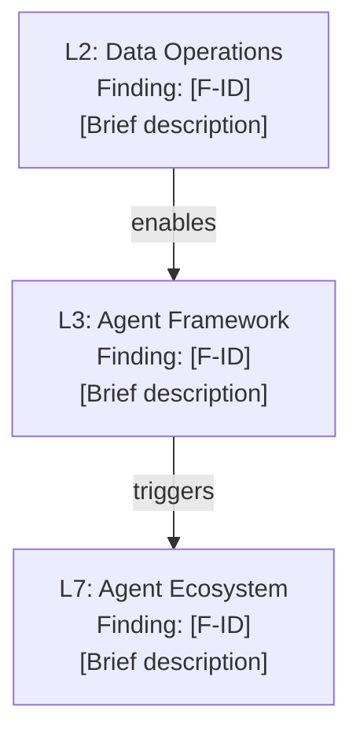

---
triad:
  pm_signoff:
    agent: product-manager
    date: 2026-04-12
    status: APPROVED_WITH_CONCERNS
    notes: "16/17 FRs explicitly covered; all 6 user stories addressable. 4 LOW concerns: FR-015 independence invariant (addressed), main.typ defaults (addressed), SC-006 performance test (noted for tasks), semantic relationship signal (addressed)."
  architect_signoff:
    agent: architect
    date: 2026-04-12
    status: APPROVED_WITH_CONCERNS
    notes: "3 MEDIUM addressed: (1) Phase 3.5 input/output contract and threat-report interface change documented, (2) PDF page placement specified to line-level in main.typ with defaults block, (3) orchestrator context window risk added to risk table. 5 LOW for task implementation: Phase 3.5 naming, parser function location, CorrelationSignal schema scope, mmdc preflight extension, threat-report input contract docs."
  techlead_signoff: null
---

# Implementation Plan: MAESTRO Phase 2 — Cross-Layer Attack Chain Analysis

**Branch**: `141-maestro-phase-2` | **Date**: 2026-04-12 | **Spec**: [spec.md](spec.md)
**Input**: Feature specification from `specs/141-maestro-phase-2/spec.md`

## Summary

Add a post-finding cross-layer correlation phase (Phase 3.5) to the orchestrator pipeline that identifies attack chains spanning multiple MAESTRO layers. Produces three outputs: a structured attack-chains artifact, a narrative Attack Chains section in the threat report, and visual chain diagram pages in the PDF security report. Rule-based correlation using component lineage, data flow dependencies, and layer adjacency as signals. Deterministic by construction (ADR-021 compliant). All output is conditional on `has-attack-chains` for backward compatibility.

## Technical Context

**Language/Version**: Python 3.11 (extraction scripts), Typst (PDF templates), Markdown (agent files, schemas)
**Primary Dependencies**: stdlib-only Python scripts (zero runtime dependencies per project constraint), Typst CLI, mmdc (Mermaid CLI, hard prerequisite per ADR-022)
**Storage**: File-based (markdown artifacts, YAML schemas)
**Testing**: pytest >= 8.0 (established in Feature 128), backward-compatibility PDF baselines under SOURCE_DATE_EPOCH=1700000000 (ADR-021)
**Target Platform**: Local CLI (any OS with Python 3.11+, Typst, optional mmdc)
**Project Type**: Knowledge system / methodology template (no application code)
**Performance Goals**: Correlation phase < 10s for architectures with < 100 findings
**Constraints**: Deterministic output (ADR-021), backward compatible (Constitution Principle III), mmdc hard prerequisite for chain diagrams (ADR-022), zero new runtime dependencies
**Scale/Scope**: 6 example architectures, 50-70 findings typical per architecture, max 7-layer chains (one per MAESTRO layer)

## Constitution Check

*GATE: Must pass before Phase 0 research. Re-check after Phase 1 design.*

| Principle | Status | Notes |
|-----------|--------|-------|
| III. Backward Compatibility | PASS | All new output gated by `has-attack-chains` boolean. 5 existing PDFs byte-identical when no chains detected. |
| VI. Testing Excellence | PASS | pytest tests for correlation engine, Typst template rendering, backward-compat PDF baselines. |
| VII. Definition of Done | PASS | 12-item DoD checklist in PRD; all items map to testable tasks. |
| IX. Git Workflow | PASS | Feature branch `141-maestro-phase-2`; conventional commits; PR before merge. |
| X. Product-Spec Alignment | PASS | PRD 141 approved (PM + Architect + Team-Lead). Spec approved (PM APPROVED_WITH_CONCERNS). |

No violations. No Complexity Tracking entries needed.

## Project Structure

### Documentation (this feature)

```
specs/141-maestro-phase-2/
├── plan.md              # This file
├── research.md          # Research phase output (completed during /aod.spec)
├── data-model.md        # Attack chain entity model and schema design
└── tasks.md             # Task breakdown (/aod.tasks output)
```

### Source Code (repository root)

```
# Files modified or created by this feature:

.claude/agents/tachi/
└── orchestrator.md                          # Phase 3.5 insertion (cross-layer correlation)

.claude/agents/tachi/
└── threat-report.md                         # New Section 6: Attack Chains narrative

.claude/skills/tachi-shared/references/
└── attack-chain-patterns-shared.md          # NEW: correlation pattern lookup table

.claude/skills/tachi-orchestration/references/
├── dispatch-rules.md                        # Update: Phase 3.5 documentation
└── output-schemas.md                        # Update: attack-chains.md artifact schema

schemas/
└── attack-chain.yaml                        # NEW: chain schema v1.0

scripts/
├── tachi_parsers.py                         # NEW: parse_attack_chains() function
└── extract-report-data.py                   # NEW: chain data extraction + Mermaid rendering

templates/tachi/security-report/
├── attack-chain.typ                         # NEW: chain diagram page template
└── main.typ                                 # Update: import + conditional page sequencing

.claude/commands/
└── tachi.security-report.md                 # Update: attack-chains artifact detection

docs/architecture/02_ADRs/
└── ADR-020-maestro-layer-classification.md  # Update: Phase 2 cross-layer correlation

examples/
├── agentic-app/                             # Chain demonstration (regenerated with chains)
│   └── attack-chains.md                     # NEW: chain artifact
├── mermaid-agentic-app/                     # Regenerated (may have chains)
│   └── attack-chains.md                     # NEW: chain artifact (if chains detected)
└── {web-app,microservices,ascii-web-api,free-text-microservice}/
    └── (regenerated, no chain artifact expected)

tests/scripts/
├── test_attack_chains.py                    # NEW: correlation engine unit tests
├── test_attack_chain_extraction.py          # NEW: extract-report-data chain extraction tests
└── test_backward_compatibility.py           # Update: add chain-aware baseline assertions
```

**Structure Decision**: Extends existing project structure. No new directories created at the top level. All changes follow established patterns: agent files in `.claude/agents/tachi/`, shared references in `.claude/skills/tachi-shared/references/`, schemas in `schemas/`, scripts in `scripts/`, templates in `templates/tachi/security-report/`, tests in `tests/scripts/`.

## Components

### Component 1: Cross-Layer Correlation Engine (Orchestrator Phase 3.5)

**Location**: `.claude/agents/tachi/orchestrator.md` (Phase 3.5 insertion after existing correlation detection)

**Responsibility**: After Phase 3 table assembly and Section 4a correlation detection, analyze findings across MAESTRO layers to identify cross-layer attack chains. Produces the attack-chains data structure consumed by downstream phases.

**Input Contract**:
- Reads the **Phase 1 component inventory** (component names, types, MAESTRO layer assignments) and **data flow graph** (source → target component relationships) from the architecture description, already parsed during Phase 1 Scope
- Reads the deduplicated finding IR from Phase 3 (each finding has `component`, `maestro_layer`, `stride_category`, `severity`)
- Loads `attack-chain-patterns-shared.md` for the deterministic transition lookup table
- Phase 3.5 operates on deduplicated findings IR only — not raw agent output — bounding input size for context management

**Output Contract**:
- Produces `attack-chains.md` artifact (conditional on chain detection)
- Sets `has-attack-chains` boolean consumed by Phase 5 (threat-report agent) and PDF pipeline
- **Interface change**: threat-report agent input expands from "threats.md only" to "threats.md + attack-chains.md" — the agent's Section 6 is conditional on `attack-chains.md` existence

**Independence Invariant (FR-015)**: Phase 3.5 cross-layer chains and Phase 3 Section 4a intra-component correlation groups are independent grouping mechanisms. A finding may appear in both without conflict. Phase 3.5 does not read, modify, or depend on Section 4a output.

**Design**:
- Operates on the deduplicated finding intermediate representation (IR) with `maestro_layer` assignments
- Groups findings by target component and MAESTRO layer
- Applies correlation signals in priority order (the fourth PRD signal — "semantic relationship" — is implemented as the deterministic lookup table in `attack-chain-patterns-shared.md`, not interpretive judgment):
  1. **Component lineage**: Findings targeting components connected by data flows in the architecture description
  2. **Data flow dependency**: Findings on components sharing data flow paths
  3. **Layer adjacency + structural**: Findings in adjacent MAESTRO layers (L(n) to L(n+1)) where at least one structural relationship exists
- Assembles chains as ordered finding sequences forming coherent attack progressions
- Filters: retain only chains spanning 2+ layers with at least one Critical or High finding
- Ranks: severity descending, then chain length descending, then chain ID alphabetical ascending
- Caps surfaced chains at top 5; full list in artifact
- Sets `has-attack-chains` boolean for conditional downstream inclusion

**Correlation Pattern Lookup Table** (stored in `attack-chain-patterns-shared.md`):
- Maps (STRIDE category, MAESTRO layer) pairs to valid successor (STRIDE category, MAESTRO layer) pairs
- Rule-based, deterministic, auditable
- Example: (Tampering, L2 Data Operations) -> (Spoofing, L3 Agent Framework) is a valid chain link because data poisoning at L2 enables workflow hijack via corrupted context at L3

**Chain-Breaking Control Heuristic**:
- For each chain, identify the structurally central finding (the node whose removal maximally disconnects the chain)
- For chains with 2 links: the middle finding is the chain-breaking point
- For chains with 3+ links: the finding with the highest betweenness centrality in the chain graph
- Mark as heuristic with disclaimer — structural centrality, not verified control effectiveness

### Component 2: Attack Chains Artifact Schema

**Location**: `schemas/attack-chain.yaml` (new file, v1.0)

**Schema Design**:
```yaml
schema_version: "1.0"
# Producers: orchestrator (Phase 3.5)
# Consumers: threat-report agent, extract-report-data.py, extract-infographic-data.py
```

**Artifact Structure** (`attack-chains.md`):
- YAML frontmatter: schema_version, generation metadata
- Section 1: Chain Summary table (Chain ID, Layers, Max Severity, Finding Count, Initial Exploit, Business Impact)
- Section 2: Chain Details (per chain: title, layer progression, member findings with roles, attack progression narrative, chain-breaking controls)
- Conditional: only produced when `has-attack-chains` is true

### Component 3: Threat Report Attack Chains Section

**Location**: `.claude/agents/tachi/threat-report.md` (new Section 6: Cross-Layer Attack Chains)

**Design**:
- New section placed after existing Section 5 (Attack Trees)
- Follows existing narrative generation pattern: load reference file on-demand, scan findings by `maestro_layer`, synthesize grouped narrative
- Each chain narrative: 150-300 words covering initial exploit, intermediate cascades with causal transitions ("enables," "triggers," "manifests as"), and business impact
- Chains ordered by severity (Critical first), then chain length
- Section conditional on `has-attack-chains`

### Component 4: PDF Attack Chain Pages

**Location**: `templates/tachi/security-report/attack-chain.typ` (new), `scripts/extract-report-data.py` (extended)

**Typst Template Design** (`attack-chain.typ`):
- Portrait layout (A4/Letter)
- Header: Chain ID badge + chain title + layer progression string (e.g., "L2 -> L3 -> L7")
- Diagram section: Rendered Mermaid PNG showing vertical MAESTRO layer stack (L1 top, L7 bottom) with downward attack progression arrows between affected layers
- Narrative section: Condensed chain walkthrough (subset of full narrative)
- Footer: Impacted finding IDs list + standard page numbering
- Uses MAESTRO layer color scheme (distinct from attack tree red/orange/green)

**Mermaid Diagram Template**:


**Python Extraction** (`extract-report-data.py`):
- New `parse_attack_chains()` function in `tachi_parsers.py`: parses `attack-chains.md` artifact into structured data
- Mermaid generation: build flowchart TD diagrams from chain data, one per chain
- Rendering: reuse existing `render_mermaid_to_png()` with ThreadPoolExecutor, mmdc preflight, error aggregation
- Typst data injection: chain entries with `id`, `title`, `layers`, `max-severity`, `has-image`, `image-path`, `narrative`, `finding-ids`
- Gate: `has-attack-chains` boolean in main.typ

**Page Placement**: Immediately after the Attack Path Analysis section in `main.typ` (currently line ~235), with its own section divider. This places chain diagrams as analytical content alongside attack trees, before the infographic pages and MAESTRO Findings section. The insertion uses the same conditional pattern: `#if has-attack-chains { ... }`. The `has-attack-chains` default value must be declared in the main.typ Section 2b defaults block (same pattern as `has-attack-trees`, `has-maestro-data`).

### Component 5: Shared Reference — Correlation Patterns

**Location**: `.claude/skills/tachi-shared/references/attack-chain-patterns-shared.md`

**Content**:
- Canonical (STRIDE category, MAESTRO layer) -> (STRIDE category, MAESTRO layer) transition table
- Organized by source layer (L1 through L7), listing valid target layers and the STRIDE categories that enable the transition
- Causal vocabulary per transition type ("enables," "triggers," "shifts," "manifests as")
- Chain assembly rules: minimum 2 layers, at least one Critical/High finding, component lineage or data flow required
- Chain-breaking heuristic algorithm description

**Consumed by**: Orchestrator (Phase 3.5), threat-report agent (Section 6 narrative generation)

## Data Flow

```
Architecture Description + Findings IR (Phase 3 output)
    │
    ▼
[Phase 3.5: Cross-Layer Correlation Engine]
    │ Reads: attack-chain-patterns-shared.md (correlation rules)
    │ Reads: maestro-layers-shared.md (layer definitions)
    │ Input: deduplicated findings with maestro_layer assignments
    │ Input: architecture component relationships, data flows
    │
    ├──► attack-chains.md (new artifact, conditional)
    │        │
    │        ├──► threat-report agent Section 6 (narrative)
    │        │        │
    │        │        ▼
    │        │    threat-report.md (updated with Attack Chains section)
    │        │
    │        └──► extract-report-data.py (chain extraction + Mermaid)
    │                 │
    │                 ├──► Mermaid .md files (generated, temporary)
    │                 │        │
    │                 │        ▼ render_mermaid_to_png()
    │                 │    PNG images (rendered chain diagrams)
    │                 │
    │                 └──► Typst data (chain entries injected into main.typ)
    │                          │
    │                          ▼
    │                      attack-chain.typ pages (PDF output)
    │
    └──► has-attack-chains boolean (gates all downstream)
```

## Tech Stack

| Layer | Technology | Justification |
|-------|-----------|---------------|
| Correlation Engine | Orchestrator agent (markdown instructions) | Matches existing pipeline phase pattern; no new runtime dependency |
| Pattern Storage | Shared reference file (markdown) | Matches existing tachi-shared pattern (maestro-layers-shared.md, severity-bands-shared.md) |
| Schema | YAML (attack-chain.yaml) | Matches existing schema convention (finding.yaml, infographic.yaml) |
| Artifact Parsing | Python 3.11 stdlib | Matches existing tachi_parsers.py pattern; zero-dependency constraint |
| Diagram Rendering | mmdc (Mermaid CLI) | Reuses Feature 112 pipeline; ADR-022 hard prerequisite |
| PDF Template | Typst | Matches existing attack-path.typ pattern |
| Testing | pytest >= 8.0 | Established in Feature 128; backward-compat baselines per ADR-021 |

## Testing Strategy

### Unit Tests (`tests/scripts/test_attack_chains.py`)
- Correlation engine logic: chain detection from mock finding sets
- Edge cases: single-layer findings (no chains), all-Unclassified findings, maximum 7-layer chain
- Chain ranking: verify severity > length > alphabetical ordering
- Chain-breaking heuristic: verify structural centrality identification
- Determinism: same input produces identical output across runs

### Integration Tests (`tests/scripts/test_attack_chain_extraction.py`)
- `parse_attack_chains()`: parse a complete attack-chains.md artifact
- Mermaid diagram generation: verify flowchart TD syntax from chain data
- Extract-report-data chain extraction: verify Typst data structure
- End-to-end: architecture → correlation → artifact → extraction → Typst data

### Backward Compatibility Tests (`tests/scripts/test_backward_compatibility.py`)
- 5 existing baseline PDFs byte-identical under SOURCE_DATE_EPOCH=1700000000
- agentic-app regenerated as chain demonstration (intentionally different)
- Architectures without chains: no attack-chains.md artifact, no chain sections in report/PDF

## Security Considerations

- No new external API calls (rule-based correlation is local)
- No new secrets or credentials
- Chain-breaking control recommendations are heuristic — explicitly disclaimed to prevent over-reliance
- Attack chain data contains the same sensitivity level as existing findings — no elevation
- mmdc subprocess execution follows existing sanitization pattern from Feature 112

## Migration & Backward Compatibility

- **New artifact**: `attack-chains.md` is conditional — only produced when chains exist
- **Report section**: "Attack Chains" section conditional on `has-attack-chains`
- **PDF pages**: Chain diagram pages conditional on `has-attack-chains`
- **Schema**: New `attack-chain.yaml` v1.0 — no changes to existing `finding.yaml` v1.3
- **Examples**: 5 of 6 examples expected to remain chain-free (byte-identical PDFs). agentic-app regenerated as chain demo.
- **Pipeline**: Phase 3.5 is additive — existing phases 1-5 unchanged
- **No breaking changes**: All new output is gated; existing consumers unaffected

## ADR Updates

### ADR-020: MAESTRO Layer Classification (Update)
- Add "Phase 2: Cross-Layer Correlation" section documenting the transition from passive taxonomy overlay to active cross-layer analysis
- Document the correlation architecture: Phase 3.5 placement, rule-based pattern matching, chain assembly algorithm
- Cross-reference attack-chain.yaml schema
- Update Decision section: MAESTRO now includes both passive layer tagging (Phase 1) and active cross-layer correlation (Phase 3.5)

## Risks & Mitigations

| Risk | Likelihood | Impact | Mitigation |
|------|-----------|--------|------------|
| False positive chains (spurious correlations) | Medium | High | Conservative correlation rules requiring structural relationship + layer adjacency; validate against all 6 examples |
| Chain explosion (too many chains) | Medium | Medium | Cap at top 5 surfaced; full list in artifact only |
| Mermaid flowchart limitations for layer-stack diagrams | Low | Low | Design fixed vertical template; max 7 nodes (one per layer) |
| Correlation pattern table incomplete | Medium | Medium | Start with high-confidence patterns from CSA canonical examples; expand based on example validation |
| Orchestrator context window pressure | Medium | Medium | Phase 3.5 operates on deduplicated findings IR (not raw agent output), bounding input size. For 70+ finding architectures, the correlation pattern table and chain assembly logic add ~2-3K tokens to context. Mitigated by the existing Phase 3 dedup step reducing finding count before Phase 3.5 runs. |
