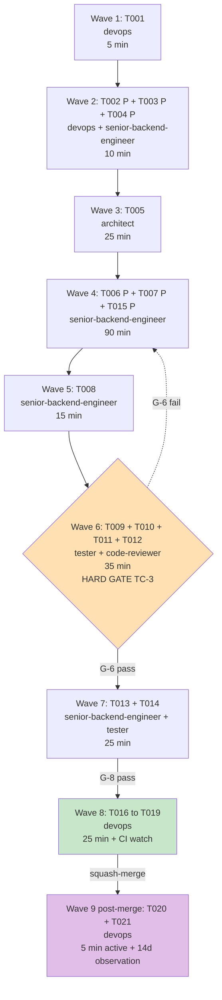

# Agent Assignments — Feature 250 Adversarial Unit Extraction Hot-Fix

**Branch**: `250-adversarial-unit-extraction-hotfix` | **Draft PR**: [#253](https://github.com/davidmatousek/tachi/pull/253)
**Total tasks**: 21 across 5 phases | **Active build waves**: 7 | **Post-merge waves**: 2

---

## 1. Agent Assignment Matrix

Every task T001..T021 is mapped to exactly one agent from the registry at `.claude/agents/_README.md`. Only the canonical names appear: `senior-backend-engineer`, `tester`, `devops`, `code-reviewer`, `web-researcher`, `frontend-developer`, `security-analyst`, `architect`, `product-manager`, `ux-ui-designer`, `debugger`, `orchestrator`. No invented labels.

| Task | Agent | Phase | Type | Rationale |
|------|-------|-------|------|-----------|
| T001 | devops | 1 — Setup | Sequential | Branch + draft PR confirmation via `git`/`gh` is devops surface (no code authoring). |
| T002 | devops | 1 — Setup | Parallel [P] | Tooling/version verification on dev workstation. |
| T003 | senior-backend-engineer | 1 — Setup | Parallel [P] | Source-line audit of pytest module — engineer-level familiarity with the deletion-block anchors. |
| T004 | senior-backend-engineer | 1 — Setup | Parallel [P] | Bash-shim cited-offset verification in `template-substitute.sh` — engineer-level familiarity with the load-bearing invariant. |
| T005 | architect | 2 — Foundational | Sequential prereq | Six-document context floor read (PRD baseline + plan + 2 contracts + data-model + quickstart). Architect agent owns technical-baseline comprehension and TC-4 scope-fence interpretation. **Blocks T006/T007/T008**. |
| T006 | senior-backend-engineer | 3 — US1 impl | Parallel [P] | Author new pytest module `test_template_substitute_unit.py` (8 cases). Bash subprocess + LC_ALL=C pinning + R-4 mitigation — backend-engineer surface. |
| T007 | senior-backend-engineer | 3 — US1 impl | Parallel [P] | Author new pytest module `test_init_input_unit.py` (5 cases incl. canary). Process-substitution + R-1 pipe-subshell mitigation — backend-engineer surface. |
| T008 | senior-backend-engineer | 3 — US1 impl | Sequential | Delete-block surgery in `test_init_sh_adversarial.py` (lines 41–162). Same engineer who authored T006/T007 has the byte-level context. |
| T009 | tester | 3 — US1 verify | Sequential | Local pytest run with `--durations=0 --timeout=15 -v` across 3 modules. QA owns test-execution + per-case wall-time observation. **Gate before T016 commit (TC-3).** |
| T010 | code-reviewer | 3 — US1 verify | Sequential | FR-003 zero-import grep verification on new modules. Reviewer surface — verifies the engineer didn't smuggle in integration helpers. |
| T011 | code-reviewer | 3 — US1 verify | Sequential | FR-005/FR-019/FR-021 byte-unchanged `git diff main` verification across 6 scope-fenced files. Reviewer surface — TC-4 scope enforcement. |
| T012 | code-reviewer | 3 — US1 verify | Sequential | FR-014 init.sh-invocation-count audit (target: 5 retained call sites). Reviewer surface — counts and documents. |
| T013 | senior-backend-engineer | 4 — US2 verify | Parallel-eligible | **bash 5.x required** — local dev workstation reports bash 3.2; agent must switch shells (Linux container, devcontainer, or WSL). Substitution-shim deliberate-fault matrix (8-case PASS/FAIL split per FR-010). Backend-engineer surface because of shell-switching prerequisite; tester would be valid if bash 5.x were natively available. |
| T014 | tester | 4 — US2 verify | Parallel-eligible | Input-validator deliberate-fault demonstration. Bash-version-agnostic (no `patsub_replacement` dependency). QA surface — observes failure mode and stderr classification. |
| T015 | senior-backend-engineer | 5 — Polish | Parallel [P] | Author permanent CI smoke `test_substitute_shim_canary.py` (TC-1). New unit-level pytest module — backend-engineer surface. May run in parallel with Phase 3/4. |
| T016 | devops | 5 — Ship | Sequential | Single atomic-PR commit (TC-3) — `git add` + Conventional-Commits-formatted `git commit`. Devops surface — release-plumbing-aware. **Hard-blocked behind T009 local pytest pass.** |
| T017 | devops | 5 — Ship | Sequential | `git push origin 250-adversarial-unit-extraction-hotfix` to draft PR #253. |
| T018 | devops | 5 — Ship | Sequential | `gh pr checks 253 --watch` for both matrix legs; record `macos-latest` init.sh-suite duration vs. baseline 25314246672. |
| T019 | devops | 5 — Ship | Sequential | Verify PR title Conventional-Commits format; `gh pr ready 253`. Per `.claude/rules/git-workflow.md` enforcement points. |
| T020 | devops | 5 — Post-merge | **Post-merge / observation window** | Within ~30s of squash-merge: confirm release-please PR opened, else push `fix(250):` empty release-marker commit. Outside the 4–6 hr active build envelope — flagged for /aod.deliver follow-up. |
| T021 | devops | 5 — Post-merge | **Post-merge / observation window (days 1–14)** | Track 5 consecutive merges to `main` for SC-002/SC-004/SC-005 sustained KPIs. Recorded in delivery retrospective during /aod.deliver. Outside the active build envelope. |

### Workload distribution (active build only, T001–T019)

| Agent | Tasks | Share | Status |
|-------|-------|-------|--------|
| senior-backend-engineer | T003, T004, T006, T007, T008, T013, T015 | 7 / 19 (37%) | Heavy authoring — within the 60% triad-signoff cap |
| devops | T001, T002, T016, T017, T018, T019 | 6 / 19 (32%) | Pre-flight + ship steps |
| code-reviewer | T010, T011, T012 | 3 / 19 (16%) | Scope-fence verification triple |
| architect | T005 | 1 / 19 (5%) | Foundational context floor |
| tester | T009, T014 | 2 / 19 (10%) | Local pytest gate + input-validator demo |

No agent exceeds the 80%-loaded ceiling. The 60% concentration band that the triad signoff cited (senior-backend-engineer ~60% of authoring-class tasks) holds: of the 9 authoring-class tasks (T003/T004/T006/T007/T008/T013/T014/T015 + T009 execution), senior-backend-engineer owns 7. T013's bash 5.x routing pulled it out of tester's column into senior-backend-engineer's column — the only deviation from the triad-cited shape.

---

## 2. Parallel Execution Waves

The wave decomposition respects the dependency graph in `tasks.md` §Phase Dependencies and §Within Each User Story. Square-bracketed `[P]` tasks within the same wave are genuinely parallel — different files, no shared state.

### Wave 1 — Pre-flight branch confirmation (sequential prereq)

Single task that gates everything downstream by confirming the branch and draft PR are correctly configured. If T001 fails, no other wave is safe to run because the entire delivery assumes branch `250-adversarial-unit-extraction-hotfix` and draft PR #253 exist.

- **Tasks**: T001
- **Agent**: devops
- **Estimate**: 5 min
- **Gate before next wave**: branch + PR confirmation pass.

### Wave 2 — Setup parallel triple (parallel)

Three independent verifications: bash version, pytest module line-count, and bash-shim line-offset. None modifies any file; all three are pure observation. They produce the audit metadata referenced later in T013 (bash version) and T008 (deletion anchors).

- **Tasks**: T002 [P], T003 [P], T004 [P]
- **Agents**: devops (T002), senior-backend-engineer (T003, T004)
- **Estimate**: 10 min wall (max of three parallel)
- **Gate before next wave**: T003 reports `wc -l` = 288; T004 reports the shim at line 64; T002 records bash version in `.aod/results/deliberate-fault-matrix-250.md` header.

### Wave 3 — Foundational context floor (sequential prereq)

The architect performs the six-document read in a single context to internalize the architect technical baseline, plan components, both function contracts, the data-model schemas, and the quickstart procedure. This wave exists because TC-4 requires the implementer to understand the MUST_NOT scope fences before authoring any new test code — silent scope drift is the failure mode being prevented.

- **Tasks**: T005
- **Agent**: architect
- **Estimate**: 25 min
- **Gate before next wave**: architect confirms understanding of process-substitution mandate (R-1, FR-006), LC_ALL=C pinning (R-4, FR-008), module-load canary contract (FR-007), zero-import constraint (FR-003), MUST_NOT scope fences (FR-019..FR-022, TC-4), and atomic-PR ordering (TC-3).

### Wave 4 — Authoring parallel pair + canary (parallel)

The two new pytest modules and the permanent CI canary are independent files with no shared state. T006 and T007 are explicitly marked `[P]` in tasks.md §Parallel Opportunities. T015 is also marked `[P]` and can run in parallel with Phase 3/4 — bringing it forward into Wave 4 lets the canary commit ride along with the main authoring effort and reduces wall-clock time without violating the dependency graph.

- **Tasks**: T006 [P] (substitute unit, 8 cases), T007 [P] (input unit, 5 cases incl. canary), T015 [P] (shim canary)
- **Agent**: senior-backend-engineer (all three — same engineer in three terminals, or three engineer subagents in parallel)
- **Estimate**: 90 min wall (max of three parallel; T006 ~75 min, T007 ~85 min, T015 ~15 min)
- **Gate before next wave**: all three new modules exist and are syntactically valid Python. No imports of `init_sh_helpers`. No references to `run_init_in_clone` / `clone_into_tmpdir` / `scripts/init.sh`. T015 asserts the substring `shopt -u patsub_replacement` is present in the helper.

### Wave 5 — Delete-block surgery (sequential)

Once T006/T007 are stable, the engineer performs the delete-block surgery in `test_init_sh_adversarial.py`. This must be sequential after Wave 4 because the engineer needs to know the new modules cover the cases being deleted before deleting them — running it in parallel would risk deleting cases that the new modules failed to cover, causing a coverage gap.

- **Tasks**: T008
- **Agent**: senior-backend-engineer
- **Estimate**: 15 min
- **Gate before next wave**: `git diff main -- tests/scripts/test_init_sh_adversarial.py` shows ONE contiguous deletion block (lines 41–162), ZERO additions, ZERO whitespace-only changes outside the block. Lines 1–39, 165–227, 229–288 byte-unchanged.

### Wave 6 — Local verification gate (sequential, hard pre-commit)

The local pytest run is the critical TC-3 gate: T016's commit MUST NOT happen before T009 confirms green locally. Following T009, the three verifications T010/T011/T012 enforce FR-003 (zero init.sh refs), FR-005/FR-019/FR-021 (six-file scope fence), and FR-014 (invocation count drop 17→5). All four tasks share the same context — a freshly-edited working tree — and run sequentially to share the audit log.

- **Tasks**: T009 (local pytest), T010 (grep verification), T011 (git-diff verification), T012 (invocation-count audit)
- **Agents**: tester (T009), code-reviewer (T010, T011, T012)
- **Estimate**: 35 min wall (T009 ~10 min, T010 ~5 min, T011 ~5 min, T012 ~15 min)
- **Gate before next wave (HARD GATE for TC-3)**: T009 reports 8+5+2 = 15 tests pass with per-case wall time ≤2.0s; T010 grep returns zero matches; T011 git-diff returns no output; T012 records the 5 retained init.sh call sites in `.aod/results/init-sh-invocation-audit-250.md`. **No commit until all four conditions hold.**

### Wave 7 — Deliberate-fault matrix pair (parallel-eligible, conventionally serialised)

The deliberate-fault demonstrations for both helpers — T013 (substitution shim) and T014 (input validator) — are independent on the dev shell and could run in parallel on two terminals, but the audit log file is shared, so they're conventionally serialised. T013 carries the bash 5.x dependency and is routed to senior-backend-engineer because the local dev workstation reports bash 3.2 (Wave 2 confirmed it); the agent must switch shells (Linux container / devcontainer / WSL).

- **Tasks**: T013 (substitution shim deliberate-fault — bash 5.x required), T014 (input-validator deliberate-fault)
- **Agents**: senior-backend-engineer (T013 — bash 5.x shell-switch), tester (T014)
- **Estimate**: 25 min wall (T013 ~15 min incl. shell switch, T014 ~10 min, serialised)
- **Gate before next wave**: T013 records the 8-case FAIL/PASS matrix per FR-010 in `.aod/results/deliberate-fault-matrix-250.md`; T014 appends the input-validator demonstration log under a "## Input-validator regression demonstration" section.

### Wave 8 — Atomic ship (sequential)

Single-commit atomic PR per TC-3. The four-step ship sequence — stage+commit, push, watch CI, mark ready — is strictly sequential. T016 carries the Conventional-Commits subject `fix(250): extract adversarial unit tests — eliminate cold-cache CI flake` per `.claude/rules/git-workflow.md`. T018 records the measured `macos-latest` init.sh-suite duration vs. the baseline 30–40 min band — confirming SC-002 (≤15 min) and SC-005 (≥25 min savings).

- **Tasks**: T016 (atomic commit), T017 (push), T018 (CI watch + duration record), T019 (PR ready)
- **Agent**: devops
- **Estimate**: 25 min wall + CI watch time (the CI watch in T018 is asynchronous wait; on `macos-latest` post-fix target ≤15 min, both legs in parallel ~15–20 min total)
- **Gate before next wave**: PR #253 marked ready for review with both matrix legs green; squash-merge to `main` is the trigger for Wave 9.

### Wave 9 — Post-merge release verification (post-merge / observation window — outside active build)

Flagged outside the 4–6 hr active build envelope. T020 fires within ~30s of squash-merge and is short (≤5 min); T021 spans days 1–14 of post-merge observation and is recorded during /aod.deliver, not during the build.

- **Tasks**: T020 (release-please PR confirmation), T021 (5-merge sustained KPI tracking, days 1–14)
- **Agent**: devops
- **Estimate**: T020 ≤5 min active; T021 observation-only (no active wall time during build phase) — handed off to /aod.deliver retrospective per tasks.md T021 closure clause.

---

## 3. Quality Gates Between Waves

The wave-to-wave gates encode the hard constraints from `tasks.md` and the PRD's MUST_NOT scope fences. Each gate names the verification command(s) that must pass before the next wave begins. The TC-3 atomic-PR gate at Wave 6 → Wave 8 is the most consequential — premature commit would land an incomplete or scope-violating change on the branch.

| Gate | Between waves | Verification | Blocks if failed |
|------|---------------|--------------|------------------|
| G-1 | W1 → W2 | T001 reports correct branch + draft PR open | All downstream waves |
| G-2 | W2 → W3 | T003 = 288 lines; T004 = shim at line 64; T002 records bash version | T013 routing decision (W7) |
| G-3 | W3 → W4 | Architect confirms 6-document context floor read | All authoring waves |
| G-4 | W4 → W5 | 3 modules syntactically valid; zero forbidden imports/refs | W5 delete-block surgery |
| G-5 | W5 → W6 | T008 git-diff shows single deletion block; preserved blocks byte-unchanged | W6 local pytest gate |
| **G-6 (TC-3 HARD GATE)** | **W6 → W8** | **T009 = 15 tests pass + per-case ≤2s; T010 grep returns zero; T011 diff returns empty; T012 invocation-count audit recorded** | **W8 atomic commit (no commit before this gate passes — TC-3)** |
| G-7 | W6 → W7 | Same as G-6 (W7 also requires the local suite to be green to demonstrate fault-matrix delta) | W7 deliberate-fault matrix |
| G-8 | W7 → W8 | Both T013 + T014 audit logs written to `.aod/results/deliberate-fault-matrix-250.md` | W8 atomic commit (only after G-6 AND G-8) |
| G-9 | W8 → W9 | PR #253 squash-merged to `main` with both matrix legs green; SC-002 ≤15 min confirmed | W9 release-please verification |

**TC-3 enforcement summary**: G-6 is the gate that makes TC-3 verifiable. The Wave 6 sequence — local pytest pass + zero-import grep + scope-fence diff + invocation-count audit — must all hold before T016 stages and commits. If G-6 fails, the implementer reverts to W4/W5 to fix the deviation. There is no path from W4/W5 directly to W8.

---

## 4. Time Estimates Per Wave

The PRD-approved size-S envelope is 4–6 wall-hours of active build (excluding post-merge observation). The triad signoff at `tasks.md` line 21 cited 3.25–5.0 hr active across 21 tasks across 5 phases. Distribution across the 8 active waves (W1–W8) and the 1 post-merge wave (W9) follows.

| Wave | Tasks | Active wall time | Cumulative |
|------|-------|------------------|------------|
| W1 — Pre-flight | T001 | 5 min | 5 min |
| W2 — Setup parallel | T002 + T003 + T004 | 10 min | 15 min |
| W3 — Foundational | T005 | 25 min | 40 min |
| W4 — Authoring parallel | T006 + T007 + T015 | 90 min | 130 min |
| W5 — Delete-block | T008 | 15 min | 145 min |
| W6 — Local verification | T009 + T010 + T011 + T012 | 35 min | 180 min |
| W7 — Deliberate-fault | T013 + T014 | 25 min | 205 min |
| W8 — Atomic ship | T016 + T017 + T018 + T019 | 25 min + CI watch ~15 min | 245 min (4 hr 5 min) |
| **Active build subtotal** | T001–T019 (19 tasks) | **~4 hr 5 min** | **Within 4–6 hr envelope** |
| W9 — Post-merge | T020 (≤5 min active) + T021 (observation, days 1–14) | T020: 5 min; T021: handoff to /aod.deliver | — |

**Envelope verification**: 4 hr 5 min lands in the lower half of the 4–6 hr size-S band, leaving headroom for: T013 shell-switch friction (bash 5.x devcontainer setup if first time), CI watch variance on `macos-latest` (target ≤15 min but cold-cache could still exhibit per-leg variance under the new unit-only path), and W6 audit-log writing time. If T013 shell-switch encounters an unexpected blocker (no devcontainer available; WSL config), escalate to team-lead; do not silently bypass the bash 5.x requirement, as FR-010 / SC-006 audit completeness depends on it.

---

## 5. Critical-Path Summary

The single longest dependency chain through the 21 tasks, traversed as a topological path through the dependency graph, is:

```
T001  →  T005  →  T006  →  T008  →  T009  →  T010  →  T011  →  T012  →  T013  →  T016  →  T017  →  T018  →  T019  →  T020  →  T021
(W1)    (W3)    (W4)    (W5)    (W6 gate)                       (W7)    (W8 atomic ship sequential)            (W9 post-merge)
```

In words: pre-flight branch confirmation → architect context floor read → engineer authors `test_template_substitute_unit.py` → engineer delete-blocks `test_init_sh_adversarial.py` → tester runs local pytest gate (TC-3 enforcement point) → reviewer triples (grep + diff + invocation count) → engineer runs bash 5.x deliberate-fault matrix → devops atomic commit → push → watch CI → mark ready → post-merge release-please verification → 14-day sustained KPI tracking.

The path traverses all 5 phases sequentially because TC-3 forbids splitting the delivery and TC-4 forbids parallel scope-fence violations. The parallel opportunities (T002/T003/T004 in W2, T006/T007/T015 in W4) shorten wall-clock time within waves but do not shorten the critical path itself.

**Critical-path duration estimate**: ~4 hr 5 min active + post-merge observation (T021 spans 14 days but is observation-only, not active build time). If the W6 gate (G-6) fails on first attempt, add ~30–60 min for re-author/re-run cycle. If T013 shell-switch is non-trivial (no bash 5.x environment ready), add ~15–30 min of devcontainer setup or escalate to team-lead.

---

## 6. Wave Graph (Mermaid)



The dashed feedback loop W6 → W4 captures the G-6-fail case: if local pytest fails or scope-fence verification reports any deviation, the engineer reverts to Wave 4 to fix the authoring before re-attempting the gate. There is no path that bypasses W6 to reach W8.

---

## 7. Constraint Compliance Confirmation

The three explicit constraints from the team-lead invocation are all satisfied:

- **TC-3 atomic-PR ordering**: Wave 8 (T016 commit) is hard-gated behind Wave 6 (T009 local pytest pass + scope-fence verifications). Section 3 codifies this as gate G-6, the one explicitly labelled "HARD GATE". The mermaid diagram visualises the W6 → W4 feedback loop on G-6 fail. The entire delivery is one PR — Wave 8 is sequential, no incremental delivery path.

- **T013 bash 5.x dependency**: Local dev workstation confirmed bash 3.2 via Wave 2 / T002. T013 is therefore routed to `senior-backend-engineer` (who can switch shells via Linux container, devcontainer, or WSL) rather than to `tester`. The bash 5.x requirement is documented in Section 1 (assignment table rationale column), Section 4 (envelope-verification headroom note), and Section 5 (critical-path duration adjustment). T014 remains with `tester` as it is bash-version-agnostic.

- **T020/T021 post-merge flagging**: Section 1 row marks T020 as "Post-merge / observation window" and T021 as "Post-merge / observation window (days 1–14)". Wave 9 in Section 2 is explicitly named "post-merge / observation window — outside active build" and excluded from the 4 hr 5 min active subtotal in Section 4. The mermaid diagram styles W9 separately. T021 is explicitly handed off to the /aod.deliver retrospective per tasks.md T021 closure clause.

---

**End of Agent Assignments — Feature 250**
