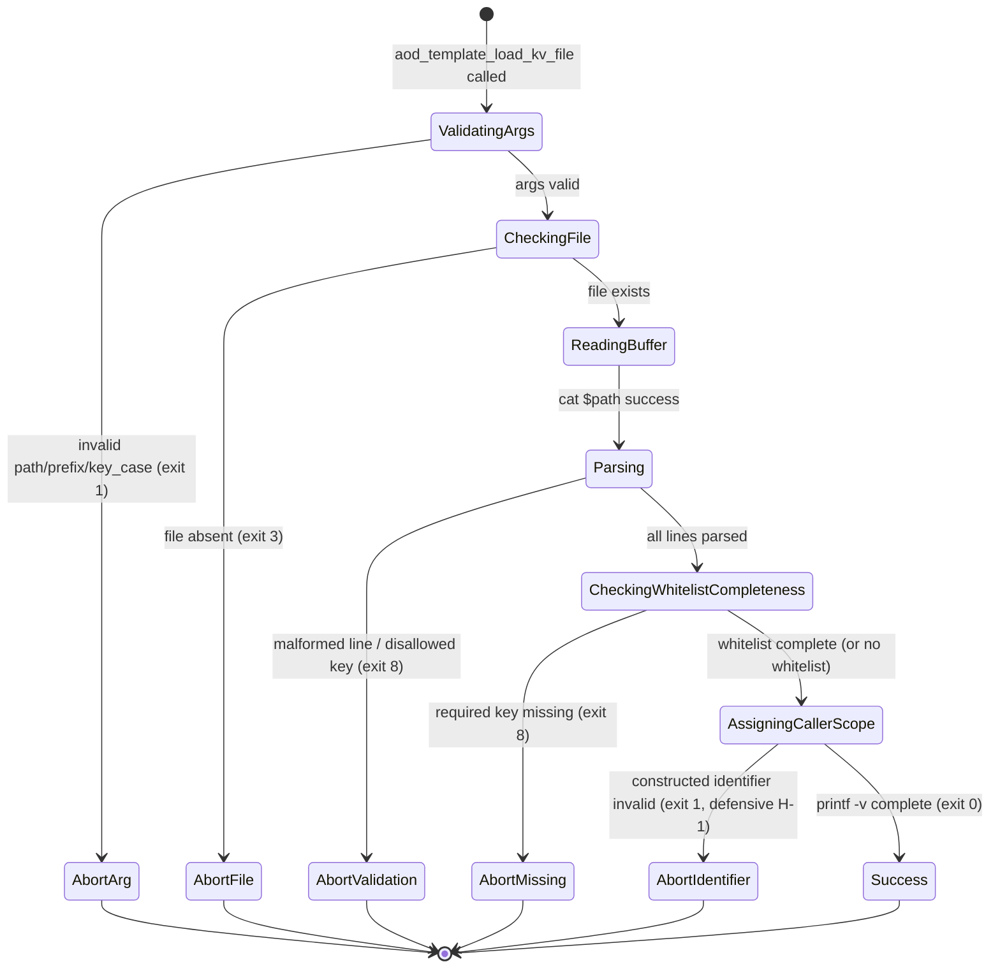

# Data Model: F-2 Source-Pattern Hardening

**Feature**: 256
**Date**: 2026-05-04
**Spec reference**: [spec.md](spec.md)
**Plan reference**: [plan.md](plan.md)

---

## Overview

F-2's "data" entities are **configuration files**, **contract markdown**, and **vulnerability events** — not domain objects. Bash 3.2 compatibility constrains the runtime types to scalars (no associative arrays); the loader's only structural data are bash indexed arrays and scalars.

---

## Entities

### E-1: Stack-Pack Defaults File

**Path**: `stacks/<pack>/defaults.env` (e.g., `stacks/nextjs-supabase/defaults.env`)
**Format**: KV (`KEY=VALUE` per line)
**Read by**: `aod_template_load_kv_file` from `init.sh:106` (post-F-2)
**Lifecycle**: Static (committed to repo); read-only at adopter init time

**Canonical key set** (locked under the F-2 contract):

| Key | Required | Value Shape | Example |
|-----|----------|-------------|---------|
| `TECH_STACK` | Yes | Allowlist string (alphanum + `._/:@+=-`) | `nextjs` |
| `TECH_STACK_DATABASE` | Yes | Allowlist string | `supabase` |
| `TECH_STACK_VECTOR` | Yes | Allowlist string | `pgvector` |
| `TECH_STACK_AUTH` | Yes | Allowlist string | `supabase` |
| `CLOUD_PROVIDER` | Yes | Allowlist string | `vercel` |

**Validation** (per FR-001 regex):
- Each line matches `^[A-Z_][A-Z_0-9]*=("[^"$\\\`]*"|'[^']*'|[A-Za-z0-9._/:@+=-]*)$` — anchored, uppercase KEY, value either double-quoted-without-metachars, single-quoted-anything, or unquoted-allowlisted-charset.
- Comment lines (`#` after leading-whitespace strip) and blank lines are skipped.
- CRLF line endings tolerated (per B-3); leading whitespace tolerated (per B-3 path-a).

**Caller-scope variables**: `STACK_TECH_STACK`, `STACK_TECH_STACK_DATABASE`, `STACK_TECH_STACK_VECTOR`, `STACK_TECH_STACK_AUTH`, `STACK_CLOUD_PROVIDER` (with `STACK_` prefix per FR-002).

**Whitelist enforcement**: REQUIRED at this site (per Q-2 ruling) — defense-in-depth against tampered packs adding new keys.

**File mode**: 0644 (committed to repo).

**Lockstep contract**: any future stack-pack key addition requires updating BOTH `STACK_PACK_ALLOWED_KEYS` array in `init.sh` AND `contracts/stack-pack-defaults-schema.md` in lockstep (analogous to F-1 canonical-12 lockstep contract for personalization placeholders).

### E-2: Version File

**Path**: `.aod/aod-kit-version`
**Format**: KV (lowercase keys per existing writer contract)
**Read by**: `aod_template_load_kv_file` from `template-git.sh:561` (post-F-2 primary read) and `:485-515` (writer round-trip block at `:501`)
**Lifecycle**: Per-adopter; written by `aod_template_write_version_file` at install/update time; read on every `/aod.update`

**Canonical key set** (locked under the existing version-file writer contract):

| Key | Required | Value Shape | Example |
|-----|----------|-------------|---------|
| `version` | Yes (may be empty) | Semver-shaped string OR empty (per B-1) | `4.28.0` or `` (bare form for non-tagged commits) |
| `sha` | Yes | Hex git SHA | `abc123def456...` |
| `updated_at` | Yes | ISO 8601 timestamp | `2026-05-04T12:00:00Z` |
| `upstream_url` | Yes | git URL | `https://github.com/davidmatousek/tachi.git` |
| `manifest_sha256` | Yes | sha256 hex | `def789...` |

**Validation** (per FR-001 regex with `<key_case>=lower`):
- Each line matches `^[a-z_][a-z_0-9]*=("[^"$\\\`]*"|'[^']*'|[A-Za-z0-9._/:@+=-]*)$` — anchored, lowercase KEY (key_case=lower mode per Q-2.5).
- The bare `version=` line (empty unquoted) MUST pass per B-1 (`*` quantifier on the unquoted value class, NOT `+`).
- Per-field regex validators at `template-git.sh:568+` run AFTER the load — unchanged behavior.

**Caller-scope variables**: `version`, `sha`, `updated_at`, `upstream_url`, `manifest_sha256` (no prefix; `<var_prefix>=""`).

**Whitelist enforcement**: NOT used at this site (per Q-2 ruling) — the per-field regex validators provide stronger field-shape checking than a generic whitelist would.

**File mode**: 0644.

### E-3: Personalization Snapshot

**Path**: `.aod/personalization.env`
**Format**: KV (uppercase keys per existing writer contract)
**Read by**: `aod_template_load_kv_file` via `aod_template_load_personalization_env` (Site D collapsed body) — post-F-2
**Lifecycle**: Per-adopter; written by `init.sh` at first run; read by `init.sh` (post-F-2 reorder per F-1) and `update.sh`
**Gitignore posture**: Local-only by default per F-1 (gitignored at `.gitignore:222`); F-2 inherits, no change.

**Canonical key set** (locked F-1 contract):

12 KEYs (or 13 if F-1 Option (a) `PROJECT_PATH` was implemented): `PROJECT_NAME`, `PROJECT_DESCRIPTION`, `GITHUB_ORG`, `GITHUB_REPO`, `AI_AGENT`, `TECH_STACK`, `TECH_STACK_DATABASE`, `TECH_STACK_VECTOR`, `TECH_STACK_AUTH`, `RATIFICATION_DATE`, `CURRENT_DATE`, `CLOUD_PROVIDER` (per F-1 ADR-038).

**Validation** (per FR-001 regex with `<key_case>=upper` default):
- Each line matches `^[A-Z_][A-Z_0-9]*=("[^"$\\\`]*"|'[^']*'|[A-Za-z0-9._/:@+=-]*)$`.
- The regex's value class **implicitly excludes** literal newline and NUL — replaces F-1's explicit newline / NUL detection at `:228-232` with regex-level rejection.

**Caller-scope variables**: `AOD_PERSONALIZATION_<KEY>` (with `AOD_PERSONALIZATION_` prefix per FR-005).

**Whitelist enforcement**: REQUIRED at this site (per Q-2 ruling) — the canonical-12 lockstep contract IS the whitelist. The whitelist is provided as the array name `AOD_CANONICAL_PLACEHOLDERS` (existing F-1 array at `template-substitute.sh:50-63`).

**File mode**: 0600 recommended (per H-2 defense-in-depth note in ADR-040 §Decision).

### E-4: `AOD_FETCH_TIMEOUT` Environment Variable

**Type**: scalar string (validated as positive integer)
**Default**: 60 (seconds)
**Validation regex**: `^[1-9][0-9]*$` (rejects `0`, leading-zero values, negatives, non-integers per Q-3 footgun ruling)
**Caller**: `aod_template_fetch_upstream` in `.aod/scripts/bash/template-git.sh:102-104` (post-F-2)
**Behavior**: invalid → exit 1 with `[aod] ERROR: AOD_FETCH_TIMEOUT must be a positive integer (got: <value>)`; valid → used as `sleep <N>` argument in watchdog subshell.

### E-5: Vulnerability Event Log

**Path**: `.security/vulnerabilities.jsonl`
**Format**: JSON Lines (one JSON object per line)
**Schema**: existing schema preserved (per NFR-005 — zero `finding.yaml` schema bump)

**F-2 adds 5 `REMEDIATED` events post-merge**:

| vuln_id | Severity | Owner | Status (post-merge) |
|---------|----------|-------|---------------------|
| TACHI-VULN-6f5a95085056 | HIGH | A03 Injection | DETECTED → REMEDIATED |
| TACHI-VULN-bf5496e9fcdf | HIGH | A03 Injection | DETECTED → REMEDIATED |
| TACHI-VULN-9a7512071b4a | MEDIUM | A03 Injection | DETECTED → REMEDIATED |
| TACHI-VULN-4dc6cf8f88ea | MEDIUM | A03 Injection (TOCTOU) | DETECTED → REMEDIATED |
| TACHI-VULN-851fd6a21ba9 | LOW | Availability | DETECTED → REMEDIATED |

**Event fields per existing schema** (no F-2 changes):
- `vuln_id`, `event_type` (`REMEDIATED`), `timestamp` (ISO 8601), `merge_sha` (squash-merge SHA), `feature_id` (`F-2` / `256`), `pr_number` (`257`).

### E-6: ADR-040

**Path**: `docs/architecture/02_ADRs/ADR-040-config-file-parsing-hardening.md`
**Format**: Markdown (per ADR-000-template)
**Lifecycle**: Dual-commit (Proposed → Accepted) per Q-6 + F-1 ADR-038 precedent

**Sections** (per FR-007):
- Status (Proposed first commit; Accepted second commit after Stream 5 verification)
- Context
- Decision (7 decision items per plan §Stream 3)
- Alternatives Considered (6 alternatives per M-5)
- Consequences (canonical fixture set; benchmark methodology; awk micro-opt rejection; ADR-038 relationship; F-1 contract amendment)
- Related Findings (5 vuln_ids)
- References (LinkedIn web archive snapshot, F-1 ADR-038, F-250 ADR-039)

**Numbering**: ADR-040 (next available; ADR-039 is current latest from F-250).

### E-7: F-1 Helper (`init-input.sh`) — Modified

**Path**: `.aod/scripts/bash/init-input.sh`
**Function**: `aod_init_read_validated <prompt> <var_name> <max_len>`
**F-2 modification** (per FR-004 AC-4.7, B-2 Path R-2): the validator is extended to additionally reject `$`, `\`, backtick at the prompt boundary (alongside existing newline / NUL / control / over-length checks).

**Rationale**: enables removal of the writer escape pass at `template-substitute.sh:566-571` — values are guaranteed metachar-free at the F-1 prompt, so the writer round-trip needs no escape pass.

**CHANGELOG ripple** (per FR-008 AC-8.4): one-time contract amendment documented with adopter migration guidance.

---

## State Transitions

### Library Function Internal States



**Key invariant**: between `Parsing` and `AssigningCallerScope`, NO caller-scope variable is mutated. The function is **two-pass**: parse + validate first, then assign. Failure in any state before `AssigningCallerScope` returns with no caller-scope side effect.

### Vulnerability Event Lifecycle

```
DETECTED → REMEDIATED  (F-2 squash-merge appends 5 such transitions)
```

### ADR-040 Lifecycle

```
[draft, uncommitted] → Proposed (Stream 3 first commit)
Proposed → Accepted (Stream 5 verification; post-CI matrix green; pre-merge)
```

---

## Validation Rules Summary

| Field/Entity | Rule | Source |
|---|---|---|
| `<path>` | Non-empty string | FR-001 step 1 |
| `<var_prefix>` | `^[A-Z_][A-Z_0-9]*$` or empty | FR-001 step 1 |
| `<allowed_keys_array_name>` | Names existing bash array (verified via `${!var+set}`) | FR-001 step 1 |
| `<key_case>` | `upper` or `lower` only | FR-001 step 1 + Q-2.5 |
| Each line in file | Matches anchored KEY=VALUE regex (mode-dependent) | FR-001 step 5 |
| Each KEY (with whitelist) | Member of named array | FR-001 step 6 |
| All whitelisted keys | Present in parsed set (completeness check) | FR-001 step 6 |
| Constructed identifier `${prefix}${KEY}` | `^[A-Za-z_][A-Za-z_0-9]*$` (defensive H-1) | FR-001 step 7 |
| `AOD_FETCH_TIMEOUT` | `^[1-9][0-9]*$` positive integer | FR-006 + Q-3 |

---

## Bash 3.2 Type Constraints

- **Scalars only** (no associative arrays); whitelist arrays are bash indexed arrays.
- **No `mapfile` / `readarray`**: per-line iteration uses `while IFS= read -r line` on a here-string `<<< "$content"`.
- **No `${var,,}` lowercase expansion**: per-line lowercase comparisons (if needed) use `[[ "$x" =~ ^[a-z_] ]]` regex match instead.
- **No `&>` shorthand**: redirections use explicit `2>&1` and `>&2`.
- **`${!var}` indirect expansion is bash 3.2 compatible for scalars only** — used in FR-004 read-side `eval` removal (`${!var_name:-}` and `${!var_name}`).

---

## Cross-References

- Spec entity definitions: [spec.md §Key Entities](spec.md#key-entities)
- FR-001 regex breakdown: [spec.md FR-001](spec.md#functional-requirements)
- ADR-040 dual-commit pattern: [plan.md Stream 3](plan.md#stream-3--adr-040--release-trigger-independent-05-075-days-per-m-5)
- Q-2.5 `<key_case>` ruling: [PRD §Open Question Resolutions Q-2.5](../../docs/product/02_PRD/256-source-pattern-hardening-2026-05-04.md)
- F-1 canonical placeholder array: `.aod/scripts/bash/template-substitute.sh:50-63`
- F-1 ADR-038 (validation triplet pattern): `docs/architecture/02_ADRs/ADR-038-placeholder-substitution-strategy.md`
