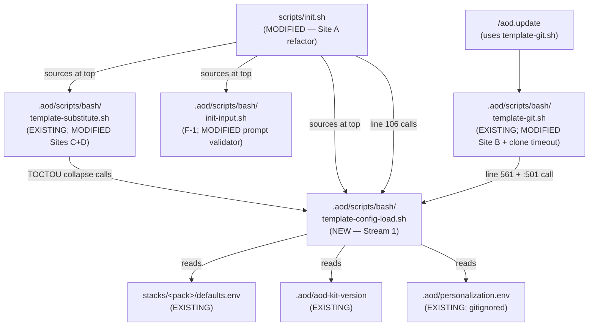

---
triad:
  pm_signoff:
    agent: product-manager
    date: 2026-05-04
    status: APPROVED
    notes: "Plan faithfully reflects PRD v1.1 + PM-approved spec. All 9 FRs, 6 NFRs, 15 SCs map to 5 Streams with clear deliverables. Q-1..Q-6 adjudications all folded in (single-PR default + Day-5 conversion lever; whitelist A+D required B optional; key_case upper/lower only; AOD_FETCH_TIMEOUT=0 rejected exit 1; sibling-file placement; tiered perf ladder w/ awk rejected; ADR-040 dual-commit). Constitution Check passes 11/11 applicable principles with Principle IV strengthened-by-TOCTOU framing. Phase 1 artifacts (data-model, contracts/, quickstart) correctly named as deliverables. F-1 contract amendment threaded through Stream 2 Site C + CHANGELOG (FR-008 AC-8.4). Risks R-1..R-8 enumerated with severity + mitigations. Stream pre-decomposition adequate for /aod.tasks. Five informational observations noted (non-blocking) covering lint scoping, Day-5 17-vs-27 threshold, Site C ordering. Full review: .aod/results/product-manager-plan.md."
  architect_signoff:
    agent: architect
    date: 2026-05-04
    status: APPROVED
    notes: "All 13 evaluation criteria PASS. Plan faithfully encodes every PRD v1.1 adjudication (B-1, B-2, B-3, H-1, H-2, H-3, H-4, M-1, M-3, M-5, L-1, L-2, Q-1..Q-6) without drift. Library architecture sound (read-buffer → strict-KV-regex → printf -v two-pass; bash 3.2 verified; internal eval carve-out properly bounded per ADR-040 Decision Item 7). Regex correctness verified including B-1 zero-or-more quantifier supporting bare KEY= form. B-3 here-string + path-a leading-whitespace strip. TOCTOU framing properly conservative ('collapsed' not 'eliminated'). H-1 defensive identifier check covered with Test-1 case 17. H-3 function name correct throughout (no incorrect aod_template_validate_version_content reference). H-4 strict semantic equivalence at :558 (no :- default). B-2 Path R-2 both halves present (writer escape removal + F-1 prompt validator amendment + CHANGELOG). Clone timeout pattern correct on all 7 sub-criteria. ADR-040 has 7 Decision items + 6 Alternatives + dual-commit. pytest-via-subprocess (NOT bats); session-scoped hanging_upstream fixture. Stream dependency graph + slip-watch authority correct. Constitution: 10 PASS, 1 N/A, no Complexity Tracking. 3 optional observations (non-blocking). Full review: .aod/results/architect-plan.md."
  techlead_signoff: null  # Added by /aod.tasks
---

# Implementation Plan: Source-Pattern Hardening (BLP-02 Wave 2)

**Branch**: `256-source-pattern-hardening` | **Date**: 2026-05-04 | **Spec**: [spec.md](spec.md)
**Input**: Feature specification from `/specs/256-source-pattern-hardening/spec.md`

## Summary

Build a new canonical config-load library (`aod_template_load_kv_file` in `.aod/scripts/bash/template-config-load.sh`) implementing **read-buffer → strict-KV-regex → `printf -v`** behavior; refactor four `source` / `eval` call sites onto it (init.sh:106 defaults.env, template-git.sh:561 + :485-515 aod-kit-version, template-substitute.sh:217/249/536/558 eval removal, template-substitute.sh:162-209 TOCTOU collapse); remove the writer escape pass at `template-substitute.sh:566-571` (B-2 Path R-2); amend F-1's `aod_init_read_validated` to additionally reject `$`/`\`/backtick at the prompt boundary; add a portable `git clone` timeout in `aod_template_fetch_upstream` (`AOD_FETCH_TIMEOUT` env var, default 60s, `=0` rejected per Q-3); author public ADR-040 in dual-commit (Proposed → Accepted) pattern; trigger release-please via Conventional-Commits PR title with belt-and-suspenders post-merge verification. Single squash-merged PR closes 5 `/security` vulns (2 HIGH + 2 MEDIUM + 1 LOW). Test runner: pytest-via-subprocess on existing macOS+Linux CI matrix (NOT bats) per F-1 BLOCKING B-1.

## Technical Context

**Language/Version**: bash 3.2+ (macOS-default 3.2.57) AND bash 4+ (Linux 5.x) for the new `template-config-load.sh` library, all four refactored bash files, and the F-1 `init-input.sh` amendment; Python 3.x (existing) for pytest test runners. **No bash-4-only features** in any code path (no associative arrays, no `mapfile`/`readarray`, no `${var,,}` lowercase expansion).
**Primary Dependencies**: bash builtins only — `cat`, `printf -v`, `[[`, `=~`, parameter expansion `${var}`, indirect expansion `${!var}` (scalars only), here-strings `<<<`, command substitution `$(...)`, while-read loops, `&` background, `wait`, `kill`, `sleep`, `trap`. Existing `aod_template_substitute_placeholders` + `aod_template_load_personalization_env` + `aod_template_assert_no_residual` from `.aod/scripts/bash/template-substitute.sh` (re-used by Site D refactor); existing `aod_init_read_validated` from `.aod/scripts/bash/init-input.sh` (F-1 helper, amended in F-2's PR per B-2 Path R-2). pytest (existing dev dependency). **Empty diff** on `pyproject.toml`, `requirements*.txt`, `package.json` per NFR-002.
**Storage**: Filesystem only — config files (`stacks/<pack>/defaults.env`, `.aod/aod-kit-version`, `.aod/personalization.env`), `.aod/scripts/bash/template-config-load.sh` (new sourced library), `.security/vulnerabilities.jsonl` (REMEDIATED events appended post-merge), `tests/fixtures/config-load/{valid,adversarial}/` (NEW fixture trees). No DB, no vector store.
**Testing**: pytest-via-subprocess (NOT bats) per F-1 BLOCKING B-1 precedent. Five new test files at `tests/scripts/test_template_config_load_*.py` and adjacent paths; new fixtures at `tests/fixtures/config-load/`; `tests/scripts/conftest.py` modified to add session-scoped `hanging_upstream` fixture (per M-3 + F-250 ADR-039 fixture-scope canon). Existing CI matrix runs all five.
**Target Platform**: cross-platform — macOS-latest (bash 3.2.57 default) AND ubuntu-latest (bash 5.x). Existing GitHub Actions matrix runs both; F-2 adds tests to the already-running matrix without authoring a new workflow file.
**Project Type**: methodology template (single repo, no application backend/frontend — adopters bring their own code). Bash scripts + markdown templates + YAML config + Python tests + Markdown ADR.
**Performance Goals**: NFR-004 — init duration on canonical fixture set MUST NOT regress by more than **25% under default conditions** vs current `source`-path baseline. Stream 1 Day 1 benchmark mandatory; recorded in ADR-040 §Consequences. Methodology: 100 invocations × 4 fixtures × p50/p95; per-file delta (NOT aggregate); warm/cold cache reported separately. Threshold ladder: ≤5% holds at 10%; 5-25% loosens to 25%; 25-50% requires Team-Lead approval + ADR-040 §Consequences security tradeoff rationale; >50% triggers PM re-scope per Q-5 ruling.
**Constraints**: bash 3.2 compatibility (NFR-001); zero new runtime dependencies (NFR-002); backward-compatible KV format for valid input (NFR-003); zero `finding.yaml` schema bump (NFR-005); no agent files / no orchestrator changes (NFR-006); 9.5 working days active + 1.5d buffer (PRD Timeline); 11d hard ceiling preserved via Day-5 conversion-lever (NOT buffer expansion); single-PR delivery (Q-1 default; F-2a/F-2b split is the slip-watch contingency).
**Scale/Scope**: 5 vuln_ids closed (2 HIGH + 2 MEDIUM + 1 LOW); 1 new sourced library (`template-config-load.sh`); 1 canonical function (`aod_template_load_kv_file`); 4 refactored call sites (Sites A-D); 1 clone-timeout site; 1 F-1 contract amendment (`aod_init_read_validated` extended); 1 new ADR (ADR-040); 5 new pytest files; 2 NEW test fixture directories (`config-load/valid/`, `config-load/adversarial/`); 1 fixture regeneration script; ~700-1100 LOC PR (single squash-merge). Canonical fixture set: 4 real config files (`stacks/nextjs-supabase/defaults.env`, `stacks/fastapi-react/defaults.env`, recorded-valid `aod-kit-version`, recorded-valid `personalization.env`).

## Constitution Check

*GATE: Must pass before Phase 0 research. Re-check after Phase 1 design.*

Per `.aod/memory/constitution.md`. Eleven principles applicable; the rest are N/A (API design / concurrency / data-isolation are SaaS-platform concerns; F-2 is a template-only change).

| Principle | Status | Justification |
|-----------|--------|---------------|
| **I. General-Purpose Architecture** | ✓ PASS | `aod_template_load_kv_file` is domain-agnostic — no security-specific or use-case-specific code introduced. The function is a generic config-file parser usable by any future config-load site (US-2 explicit acceptance). |
| **II. API-First Design** | N/A | No API surface changes. F-2 is a shell-script + library + ADR change; no endpoints added/modified; no `finding.yaml` schema bump (NFR-005). |
| **III. Backward Compatibility (NON-NEGOTIABLE)** | ✓ PASS | The new loader accepts the **exact KV format** that the existing `source` paths accepted for valid input (NFR-003). Adopters with valid, well-formed config files see zero behavior change. The semantics tightening rejects exactly what was previously implicit code-smell (command substitution, parameter expansion, escape sequences, embedded shell metachars in unquoted values). CHANGELOG (per FR-008 AC-8.4) documents the F-1 contract amendment for adopters whose `PROJECT_NAME`/`PROJECT_DESCRIPTION` contains `$`, `\`, or backtick. |
| **IV. Concurrency & Data Integrity** | ✓ PASS | TOCTOU collapse at Site D (FR-005) materially improves data-integrity posture: `aod_template_load_kv_file` reads the file once via `cat` into an in-memory buffer; the validate-then-assign pass operates on the buffer, not on the file path. ADR-040 §Decision documents the residual race window (cat-opens-once mitigation; race window collapsed from "between two operations" to "before cat opens"). |
| **V. Privacy & Data Isolation** | ✓ PASS | F-2 inherits F-1's gitignore-default for `.aod/personalization.env` (no F-2 change). The new library does not log file contents on success path; rejection error messages truncate offending content to 80 chars to avoid leaking large adopter-private values. |
| **VI. Testing Excellence** | ✓ PASS | 5-test Regression Protection Plan + Test-6 manual smoke + Test-7 post-merge re-scan; Test-1 has ≥27 cases including B-3 cases 19-23 (CRLF/leading-whitespace/trailing-newline/no-trailing-newline/blank-line-followed-by-content); pytest-via-subprocess on existing macOS+Linux CI matrix; test-first authorship per Stream 1 sequencing (`test_template_config_load_unit.py` lands with the library). |
| **VII. Definition of Done (NON-NEGOTIABLE)** | ✓ PASS | Spec includes 15 SCs covering vuln closure, primitive correctness, adversarial rejection, clone timeout, perf benchmark, ADR/governance/release, cross-cutting; `/aod.deliver` validates pre-merge. Belt-and-suspenders release-please verification per FR-008. |
| **VIII. Observability & RCA** | ✓ PASS | 5 `REMEDIATED` events in `.security/vulnerabilities.jsonl` carry merge SHA + timestamp — full audit trail. ADR-040 documents the root-cause migration (source-with-validate-after-source → read-then-validate-then-assign) per Five Whys discipline. CHANGELOG entry documents the F-1 contract amendment with adopter migration guidance. |
| **IX. Git Workflow & Feature Branching (NON-NEGOTIABLE)** | ✓ PASS | Feature branch `256-source-pattern-hardening` created; draft PR #257 already opened at plan stage; conventional-commits PR title `feat(256): harden source-pattern surface — bash source/eval → KV parser + clone timeout`; release-please verification per `.claude/rules/git-workflow.md` (F-212 incident pattern). |
| **X. Product-Spec Alignment + Architecture Review (NON-NEGOTIABLE)** | ✓ PASS | PRD with full Triad sign-off (v1.1 final — PM APPROVED, Architect APPROVED Pass 1.5, Team-Lead APPROVED_WITH_CONCERNS Pass 1); spec.md PM-APPROVED 2026-05-04; this plan.md will receive dual sign-off; tasks.md will receive triple sign-off. |
| **XI. SDLC Triad Collaboration** | ✓ PASS | PM/Architect/Team-Lead chain enforced via `/aod.plan` orchestration. PRD already has all three Triad sign-offs; plan dual sign-off + tasks triple sign-off complete the chain. |

**Pre-Phase-0 verdict**: PASS — no violations; no Complexity Tracking entries needed.

## Project Structure

### Documentation (this feature)

```
specs/256-source-pattern-hardening/
├── plan.md              # This file (/aod.project-plan output)
├── research.md          # Already authored by /aod.spec
├── spec.md              # PM-approved 2026-05-04
├── data-model.md        # Phase 1 artifact (this iteration)
├── quickstart.md        # Phase 1 artifact (this iteration)
├── contracts/           # Phase 1 artifact (this iteration)
│   ├── config-load-helper-contract.md       # NEW — aod_template_load_kv_file contract
│   └── stack-pack-defaults-schema.md        # NEW — canonical key set for stacks/<pack>/defaults.env (Stream 1 deliverable)
├── checklists/
│   └── requirements.md  # Spec quality checklist (already authored)
└── tasks.md             # Task breakdown (/aod.tasks output, next sub-step)
```

### Source Code (repository root)

```
.aod/
├── scripts/
│   └── bash/
│       ├── template-config-load.sh    # NEW — aod_template_load_kv_file primitive (Stream 1)
│       ├── template-substitute.sh     # MODIFIED — eval removal (FR-004); writer escape pass removed (FR-004 AC-4.6); aod_template_load_personalization_env body collapsed (FR-005)
│       ├── template-git.sh            # MODIFIED — aod_template_read_version_file + aod_template_write_version_file:485-515 source replaced with library call (FR-003); aod_template_fetch_upstream wrapped with clone timeout + watchdog SIGINT trap (FR-006)
│       └── init-input.sh              # MODIFIED — aod_init_read_validated extended to reject $/\\/backtick at prompt boundary (FR-004 AC-4.7, B-2 Path R-2 + F-1 contract amendment)
└── aod-kit-version                    # EXISTING — read by aod_template_read_version_file via library post-F-2

scripts/
└── init.sh                            # MODIFIED — line 106 source defaults.env replaced with aod_template_load_kv_file call + STACK_PACK_ALLOWED_KEYS whitelist (FR-002); template-config-load.sh source added at top alongside template-substitute.sh + init-input.sh sources

stacks/
├── nextjs-supabase/
│   └── defaults.env                   # EXISTING — read by aod_template_load_kv_file post-F-2
└── fastapi-react/
    └── defaults.env                   # EXISTING — read by aod_template_load_kv_file post-F-2

contracts/
├── stack-pack-defaults-schema.md      # NEW — moved from specs/256-*/contracts/ during Stream 1
└── personalization-schema.md          # EXISTING — F-2 adds note about loader change at §Loader Implementation; no contract shape change

docs/
└── architecture/
    └── 02_ADRs/
        └── ADR-040-config-file-parsing-hardening.md  # NEW — dual-commit Proposed → Accepted (Stream 3)

CHANGELOG.md                           # MODIFIED — v4.x entry: new library + 4 refactored sites + clone timeout + F-1 contract amendment (FR-008 AC-8.4)

.security/
└── vulnerabilities.jsonl              # MODIFIED — 5 REMEDIATED events appended post-merge (SC-001)

tests/
├── scripts/
│   ├── conftest.py                    # MODIFIED — session-scoped hanging_upstream fixture added (FR-009 AC-9.5)
│   ├── test_template_config_load_unit.py        # NEW — Test-1 (≥27 cases on aod_template_load_kv_file in isolation)
│   ├── test_template_config_load_integration.py # NEW — Test-2 (adversarial across 4 sites + H-2 TOCTOU residual fixture)
│   ├── test_template_git_clone_timeout.py       # NEW — Test-3 (timeout + writer→reader round-trip per H-3)
│   ├── test_init_sh_defaults_env.py             # NEW — Test-4 (init.sh end-to-end with refactored Site A)
│   └── test_template_substitute_lint_no_eval.py # NEW — Test-5 (eval removal verification + future-PR-blocker lint)
└── fixtures/
    ├── config-load/
    │   ├── valid/                    # NEW — valid KV fixtures (B-1 empty unquoted, CRLF, leading-whitespace, no-trailing-newline)
    │   └── adversarial/              # NEW — adversarial KV fixtures, each with `# DO NOT SOURCE` header (per L-2)
    └── regenerate-config-load-baseline.sh        # NEW — fixture regeneration script (per F-1 M-5 precedent)
```

**Structure Decision**: tachi is a methodology template (single repo, no application code split). The structure follows existing conventions: `.aod/scripts/bash/` for sourced bash libraries (sibling to existing `template-*.sh` library files; new `template-config-load.sh` is the 7th sibling library); `tests/scripts/` for pytest tests targeting bash scripts via `subprocess.run`; `docs/architecture/02_ADRs/` for sequentially-numbered ADRs (ADR-040 is next; ADR-039 is current latest from F-250). Q-4 sibling-file placement adjudicated by Architect + Team-Lead concur.

## Architecture Approach

### Five Implementation Streams

The work decomposes into five streams matching PRD §Timeline. Stream 1 is the critical path; Streams 3+4 advance independently in parallel; Stream 2 blocks on Stream 1 landing the library; Stream 5 follows Streams 1+2.

#### Stream 1 — Library Bring-Up (Critical Path, 2.5 days per H-1)

**Goal**: Author `aod_template_load_kv_file` library + unit tests + `contracts/stack-pack-defaults-schema.md`; record Day 1 benchmark.

**Components**:

1. **New file `.aod/scripts/bash/template-config-load.sh`** (Q-4 Option a sibling placement). Function signature, exit codes, regex, and behavior per FR-001. Two-pass structure: first pass parses + validates + stages (key, value) pairs in temporary scoping helpers; second pass applies defensive identifier check + `printf -v` to caller scope. No `eval` of file content.

   **Internal `eval` carve-out** (audit clarity): the only `eval` in the function is internal — `eval "local keys=(\"\${${allowed_keys_array_name}[@]}\")"` for bash 3.2-compatible indirect array access (no `${!array[@]}` array expansion in 3.2). The argument is the **whitelist array NAME** which arrives from a step-1-validated argument; it is NOT user-supplied content. ADR-040 §Decision Item 7 documents this carve-out — "no `eval` of file content" remains the inviolable rule; the internal `eval` of an internal array name is the bounded exception.

2. **NEW contract `contracts/stack-pack-defaults-schema.md`** (Stream 1 deliverable):
   - Documents the canonical key set: `TECH_STACK`, `TECH_STACK_DATABASE`, `TECH_STACK_VECTOR`, `TECH_STACK_AUTH`, `CLOUD_PROVIDER`.
   - Value-shape rules per FR-001 regex (alphanumeric + `._/:@+=-` for unquoted; double-quoted-without-metachars for quoted; single-quoted-anything for single-quoted).
   - Lockstep contract: any future stack-pack key addition requires updating BOTH the array `STACK_PACK_ALLOWED_KEYS` in `init.sh` AND this contract document.
   - Reference: F-1's `contracts/personalization-schema.md` pattern.

3. **NEW unit tests `tests/scripts/test_template_config_load_unit.py`** (Test-1 first pass — Stream 1 deliverable for green-light condition 1 of Day-5 slip-watch):
   - 27 cases per FR-009 AC-9.2 (valid, invalid, whitelist, lower-mode, defensive identifier, missing-arg, file-absent, B-3 cases 19-23 CRLF/leading-whitespace/trailing/no-trailing/empty-unquoted-bare-form).
   - Test infrastructure: pytest fixtures + subprocess invocation per F-1 precedent.

4. **Day-1 benchmark** (NFR-004 + SC-010): time `aod_template_load_kv_file` against the canonical fixture set (4 real config files: `stacks/nextjs-supabase/defaults.env`, `stacks/fastapi-react/defaults.env`, recorded-valid `aod-kit-version`, recorded-valid `personalization.env`). Methodology: 100 invocations × 4 fixtures × p50/p95; per-file delta NOT aggregate; warm-cache + cold-cache separate. Apply NFR-004 escalation rules; record numbers in ADR-040 §Consequences (Stream 3).

**Deliverables**: new `.aod/scripts/bash/template-config-load.sh`; new `contracts/stack-pack-defaults-schema.md`; new `tests/scripts/test_template_config_load_unit.py` (≥17/17 cases passing on macOS bash 3.2 — Day-5 slip-watch GREEN-LIGHT condition 1); benchmark numbers staged for ADR-040.

#### Stream 2 — Refactor 4 Call Sites (Critical Path, 2.5-2.75 days per H-2; blocks on Stream 1)

**Goal**: Replace `source` / `eval` at four call sites with `aod_template_load_kv_file` invocations; remove writer escape pass; amend F-1 prompt validator.

**Components** (per PRD FR-2, FR-3, FR-4, FR-5):

1. **Site A — `init.sh:106` defaults.env (0.5d, FR-002)**:
   - Source the new library at the top of `init.sh` alongside existing `template-substitute.sh` + `init-input.sh` sources (file-existence guard with clear error if missing).
   - Replace `source "stacks/$SELECTED_PACK/defaults.env"` with:
     ```bash
     STACK_PACK_ALLOWED_KEYS=(TECH_STACK TECH_STACK_DATABASE TECH_STACK_VECTOR TECH_STACK_AUTH CLOUD_PROVIDER)
     aod_template_load_kv_file "stacks/$SELECTED_PACK/defaults.env" "STACK_" STACK_PACK_ALLOWED_KEYS
     ```
   - Rename pass: downstream code in `init.sh` that read `$TECH_STACK` / `$CLOUD_PROVIDER` (etc.) directly is migrated to read `$STACK_TECH_STACK` / `$STACK_CLOUD_PROVIDER`.

2. **Site B — `template-git.sh:561` and `:501` aod-kit-version (0.75d, FR-003; per H-3)**:
   - Site B-primary (`aod_template_read_version_file:544`): replace `source "$path"` at `:561` with `aod_template_load_kv_file "$path" "" "" lower`. Existing per-field validators at `:568+` run unchanged after the load.
   - Site B-roundtrip (`aod_template_write_version_file:485-515`, inner block at `:501`): replace `source "$tmp_path" 2>/dev/null` with the same library call (lowercase mode); existing post-load missing-field detection runs unchanged.
   - Empty-value support (B-1): the bare `version=` line passes the regex's zero-or-more quantifier `*` for the unquoted value class.

3. **Site C — `template-substitute.sh:217, :249, :536, :558` eval removal + writer escape pass removal at `:566-571` (0.5d, FR-004)**:
   - Read-side `:217`, `:536` (with `:-` default-to-empty): replace `eval "val=\"\${$key:-}\""` with `local var_name="$key"; local val="${!var_name:-}"`.
   - Read-side `:558` (NO `:-` default per H-4 — strict semantic equivalence): replace `eval "val=\"\${$key}\""` with `local var_name="$key"; local val="${!var_name}"`.
   - Write-side `:249`: replace `eval "AOD_PERSONALIZATION_${key}=\"\$val\""` with `printf -v "AOD_PERSONALIZATION_${key}" '%s' "$val"`.
   - Writer escape pass at `:566-571`: REMOVE the four-line `\\`/`"`/`$`/backtick escape block; emit `printf '%s="%s"\n' "$key" "$val" >> "$tmp_path"` directly.
   - **F-1 contract amendment** (`init-input.sh` per B-2 Path R-2): extend the validator to additionally reject `$`, `\`, backtick at the prompt boundary. CHANGELOG (per FR-008 AC-8.4) documents this one-time contract amendment with adopter migration guidance.

4. **Site D — `template-substitute.sh:162-209` TOCTOU collapse (0.75-1.0d, FR-005)**:
   - Replace the entire 47-line `aod_template_load_personalization_env` body with ~7 lines of delegation to `aod_template_load_kv_file "$path" "AOD_PERSONALIZATION_" AOD_CANONICAL_PLACEHOLDERS`.
   - Behavior preserved: missing-path → 1 (unchanged); file-absent → 3 (unchanged via library); validation-failure → 8 (unchanged; regex implicitly excludes literal newline + NUL); missing-key detection → 8 (unchanged; via whitelist mechanism); caller-scope variables `AOD_PERSONALIZATION_<KEY>` populated (unchanged).

**Deliverables**: modified `scripts/init.sh`; modified `.aod/scripts/bash/template-git.sh` (Sites B-primary + B-roundtrip); modified `.aod/scripts/bash/template-substitute.sh` (Sites C + D); modified `.aod/scripts/bash/init-input.sh` (F-1 amendment).

#### Stream 3 — ADR-040 + Release Trigger (Independent, 0.5-0.75 days per M-5)

**Goal**: Author ADR-040 in dual-commit pattern (Proposed → Accepted); verify Conventional-Commits PR title; document belt-and-suspenders post-merge verification.

**Components** (per PRD FR-7, FR-8):

1. **`docs/architecture/02_ADRs/ADR-040-config-file-parsing-hardening.md`** — dual-commit (Proposed → Accepted) per Q-6 + F-1 ADR-038 precedent:
   - **Status**: Proposed (Stream 3 first commit) → Accepted (Stream 5 verification commit, post-CI matrix green, pre-merge).
   - **Context**: The four `source` / `eval` config-file sites in tachi's bash library; the F-1 substitution-surface precedent; Daniel Wood's 2026-05-02 LinkedIn note (which named the substitution surface but extends to any source-without-validation pattern).
   - **Decision** — adopt **read-buffer → strict-KV-regex → `printf -v`** as canonical config-file load pattern across `init.sh`, `template-git.sh`, and `template-substitute.sh`. New library file: `.aod/scripts/bash/template-config-load.sh` exposing `aod_template_load_kv_file`. Decision items:
     1. Pattern: read-buffer (`cat $path`) → strict-KV-regex (per-line `=~` against anchored alternation) → `printf -v` assignment.
     2. The regex (lines reproduced from PRD FR-1 step 5).
     3. Q-1 (single-PR vs split) rationale: single-PR by default; F-2a/F-2b split is the Day-5 slip-watch contingency lever.
     4. Q-3 (`AOD_FETCH_TIMEOUT=0` footgun) rationale: rejected with exit 1 — adopters should not be able to silently disable the protection F-2 is closing.
     5. H-2 (TOCTOU residual race window framing): `cat` opens-once mitigation; race window collapsed from "between two operations" to "before cat opens"; defense-in-depth via 0600 mode on `.aod/personalization.env`.
     6. F-1 prompt validator amendment (B-2 Path R-2): `aod_init_read_validated` extended to reject `$`, `\`, backtick — enables writer escape pass removal.
     7. Internal `eval` carve-out (audit clarity): the `eval "local keys=..."` inside `aod_template_load_kv_file` operates on a known-trusted internal-caller array name from a step-1-validated argument; this is the only `eval` in the library and its scope is bounded — "no `eval` of file content" remains the inviolable rule.
   - **Alternatives considered** (six per M-5):
     1. **JSON config format** — REJECTED. New runtime dep (`jq`); breaks `contracts/personalization-schema.md` adopter contract; bash has no native JSON parser.
     2. **TOML config format** — REJECTED. Same reasoning as JSON; TOML parsers even less ubiquitous.
     3. **Individual point-fixes per site** — REJECTED. Four bespoke validators duplicating logic; future-site additions invent a fifth pattern; F-2 explicitly building the library to avoid this.
     4. **Bash sourcing in `set -r` restricted-shell** — REJECTED. Restricted-shell prevents `cd` and PATH modification but does NOT prevent in-process bash code execution within the restricted shell (command substitution still works); security improvement is illusory.
     5. **`bash -r -c` external invocation** — REJECTED. Forks a subshell; breaks caller-scope assignment (the whole point of `source`); requires parsing subshell output and assigning in caller scope — which is exactly what FR-1 does without the fork.
     6. **Source-then-`declare -p` diff** — REJECTED (per M-5). Pattern: `source` then compare `declare -p` output before/after to detect newly-defined variables. The malicious code has already RUN by the time the diff runs; this keeps file-as-code semantics. The architectural inversion is "data, not code" — diffing-after-source defeats the purpose.
   - **Consequences**:
     - One canonical pattern; bash 3.2 compatibility preserved; literal-string assignment by `printf -v`.
     - Performance benchmark per SC-010: canonical fixture set (`stacks/nextjs-supabase/defaults.env`, `stacks/fastapi-react/defaults.env`, recorded-valid `aod-kit-version`, recorded-valid `personalization.env`); methodology (100 inv × 4 fixtures × p50/p95; per-file delta; warm/cold cache); F-2 perf disposition per Q-5 ladder.
     - Awk micro-optimization REJECTED (BSD vs GNU awk variance contradicts NFR-002; complexity creep on a security-load primitive that must be audit-readable).
     - Relationship to ADR-038 (substitution canon + config-load canon share the regex-validate → reject-on-mismatch → `printf -v` assignment validation triplet).
     - F-1 contract amendment per B-2 Path R-2: `aod_init_read_validated` extended; CHANGELOG entry tied to F-2.
     - TOCTOU residual race window framing (per H-2): documented for audit clarity.
   - **Related findings**: TACHI-VULN-{6f5a95085056, bf5496e9fcdf, 9a7512071b4a, 4dc6cf8f88ea, 851fd6a21ba9} — 5 vuln_ids closed.
   - **References**: web archive snapshot of Daniel Wood's 2026-05-02 LinkedIn thread; F-1 ADR-038; F-250 ADR-039.

2. **PR title** at draft creation (already set on PR #257): `feat(256): harden source-pattern surface — bash source/eval → KV parser + clone timeout`. Pre-merge re-verification per FR-008 AC-8.1.

3. **Belt-and-suspenders post-merge verification** (per `.claude/rules/git-workflow.md`): `gh pr list --state open --search "release-please" --limit 3` within ~30s post-merge; if empty, push empty marker commit `feat(256): source-pattern hardening — release marker`. **Manual operator action at /aod.deliver**, not in this PR.

**Deliverables**: new `docs/architecture/02_ADRs/ADR-040-config-file-parsing-hardening.md` (Proposed → Accepted dual-commit); CHANGELOG entry staged.

#### Stream 4 — Clone Timeout + Watchdog SIGINT Trap (Independent, 1.0 day)

**Goal**: Wrap `git clone` in `aod_template_fetch_upstream` with portable bash background+kill watchdog; add SIGINT trap; smoke-test against fast-clone + hanging-clone fixtures.

**Components** (per PRD FR-6 + L-1):

1. **`aod_template_fetch_upstream` modification** in `.aod/scripts/bash/template-git.sh:102-104`:
   - Validate `AOD_FETCH_TIMEOUT` against `^[1-9][0-9]*$` (Q-3 rejects `=0`/non-integer with exit 1).
   - Background the `git clone --depth=1 ...` invocation; capture `clone_pid`.
   - Spawn watchdog subshell `( sleep "$fetch_timeout" && kill -TERM "$clone_pid" 2>/dev/null ) &`; capture `watchdog_pid`.
   - Install SIGINT/SIGTERM/EXIT trap (per L-1) to clean up the watchdog if outer script is interrupted.
   - `wait "$clone_pid"`; capture `clone_rc`.
   - Cleanup the watchdog (it may still be running if clone finished fast).
   - If `clone_rc` is 143 (SIGTERM) or 130 (SIGINT) → cleanup `destdir`, emit timeout error, return 9.
   - Otherwise return 0 (or whatever rc the clone produced).

2. **Bash 3.2 compatibility verification**: `&`, `wait`, `kill`, `sleep`, `=~`, command substitution `$(...)`, `trap` — all bash 3.2 compatible. Smoke-test on macOS bash 3.2.57 local.

3. **Smoke tests** (Stream 4 deliverable for Day-5 slip-watch GREEN-LIGHT condition 4):
   - Fast clone (succeeds normally): exit 0 + no zombie watchdog process.
   - Hanging clone (`AOD_FETCH_TIMEOUT=3` against TCP listener that accepts but never responds): exit 9 + `destdir` removed + stderr error message.

**Deliverables**: modified `.aod/scripts/bash/template-git.sh:102-104` (clone timeout + watchdog + SIGINT trap); smoke-test results recorded for Day-5 slip-watch.

#### Stream 5 — Test Infrastructure (Critical-Path-Trailing, 3.0 days; depends on Streams 1+2)

**Goal**: Author 5 pytest test files; build adversarial fixture corpus; record canonical baseline; provide regeneration script. Existing CI matrix runs the new tests automatically.

**Components** (per PRD FR-9 + Test-1 through Test-5):

1. **`tests/scripts/test_template_config_load_unit.py` (Test-1)** — first pass authored in Stream 1; full ≥27 cases land in Stream 5:
   - 1-5: Valid KV (no whitelist) — KEY=value, KEY="quoted", KEY='single-quoted', KEY=path/with/slashes, KEY=email@example.com.
   - 6: Valid KV (with whitelist) — all keys present.
   - 7: Invalid — command substitution `KEY="$(rm -rf /)"`.
   - 8: Invalid — unbalanced quote.
   - 9: Invalid — backtick.
   - 10: Invalid — embedded `$`.
   - 11: Invalid — KEY with lowercase (in upper-mode site).
   - 12: Invalid — missing whitelisted key.
   - 13: Invalid — line with only KEY and no `=`.
   - 14: Invalid — value with embedded literal newline.
   - 15: Invalid — value with embedded NUL.
   - 16: Bare `KEY=` (empty unquoted) — passes per B-1.
   - 17: Defensive identifier check — invalid `<var_prefix>` rejected (H-1).
   - 18: Empty-value PASS (B-1).
   - 19-23: B-3 cases — trailing-newline / no-trailing-newline / CRLF / leading-whitespace / blank-line-followed-by-content.
   - 24: Missing-arg behavior (`<path>` empty).
   - 25: File-absent behavior.
   - 26: `<key_case>=lower` regex variant — accepts `version=4.28.0`, rejects `VERSION=4.28.0`.
   - 27: `<key_case>=mixed` rejection (per Q-2.5).

2. **`tests/scripts/test_template_config_load_integration.py` (Test-2)** — adversarial across all four refactored sites:
   - Site A (init.sh defaults.env): malicious-pack fixture with `CUSTOM_HOOK="$(touch /tmp/F-256-pwned)"`; expect exit 8 + no /tmp file created.
   - Site B (template-git.sh aod-kit-version): malformed-version fixture with `version='1.0'; touch /tmp/F-256-pwned`; expect exit 8.
   - Site C (template-substitute.sh eval removal): `grep -c '\beval\b'` returns 0 verification.
   - Site D (template-substitute.sh TOCTOU): file-swap-during-load race fixture (M-1 framing precision + H-2 TOCTOU residual fixture).

3. **`tests/scripts/test_template_git_clone_timeout.py` (Test-3)** — clone timeout behavior + writer→reader round-trip per H-3 + hanging-listener fixture per M-3:
   - `hanging_upstream` session-scoped pytest fixture in `conftest.py` (per F-250 ADR-039 fixture-scope canon).
   - Test cases: hanging fixture with AOD_FETCH_TIMEOUT=3 → exit 9 within ~3-4s; same with AOD_FETCH_TIMEOUT=10 → exit 9 at ~10s; AOD_FETCH_TIMEOUT=0 → exit 1; AOD_FETCH_TIMEOUT=abc → exit 1; fast clone → exit 0.

4. **`tests/scripts/test_init_sh_defaults_env.py` (Test-4)** — init.sh end-to-end:
   - Each shipped stack pack loads cleanly (Day-5 slip-watch GREEN-LIGHT condition 2 — `nextjs-supabase` + `fastapi-react` baseline).
   - Malicious-pack fixture rejected exit 8.

5. **`tests/scripts/test_template_substitute_lint_no_eval.py` (Test-5)** — eval removal verification:
   - `grep -c '\beval\b' .aod/scripts/bash/template-substitute.sh` returns 0.
   - Future-PR-blocker lint: any new `eval` introduction fails this test (canonical-pattern enforcement).

6. **`tests/scripts/conftest.py` modification** — add session-scoped `hanging_upstream` fixture per M-3 + F-250 ADR-039 fixture-scope canon. Use Python `socket` module to bind a TCP listener that accepts but never responds; tear down at session end.

7. **`tests/fixtures/config-load/valid/`** — valid KV fixtures (B-1 empty-unquoted, B-3 CRLF/leading-whitespace/no-trailing-newline cases).

8. **`tests/fixtures/config-load/adversarial/`** — adversarial KV fixtures, each with `# DO NOT SOURCE` header (per L-2 — defensive against accidental copy-paste use).

9. **`tests/fixtures/regenerate-config-load-baseline.sh`** — fixture regeneration script (per F-1 M-5 precedent):
   - Generate the canonical fixture set from current contracts.
   - Document: regenerate when whitelist changes; do NOT regenerate to mask a regex regression.

**Deliverables**: 5 new pytest test files; `tests/fixtures/config-load/{valid,adversarial}/` directories; `tests/fixtures/regenerate-config-load-baseline.sh`; CI matrix runs all five on macos-latest + ubuntu-latest with no new workflow file.

### Critical Path & Slip-Watch

#### Day-5 Slip-Watch Checkpoint (Mon 2026-05-11 EOD)

**Conditions checked at Day-5 EOD**:

1. **Stream 1 unit tests green on macOS bash 3.2.57**: `tests/scripts/test_template_config_load_unit.py` runs via subprocess on macOS-latest CI; ≥17/17 cases pass. **GREEN-LIGHT condition** for Stream 2 to begin in earnest.
2. **Stream 2 Site A green on Linux**: `init.sh:106` refactor implemented; `tests/scripts/test_init_sh_defaults_env.py` Test-4 case 1 (each shipped stack pack loads) passes on ubuntu-latest. **CHECK** — partial credit if at least one stack pack loads cleanly.
3. **ADR-040 draft committed (Status: Proposed)**: `docs/architecture/02_ADRs/ADR-040-config-file-parsing-hardening.md` exists on the feature branch with §Context + §Decision + §Alternatives Considered (6 alternatives including new alternative f per M-5) drafted. **GREEN-LIGHT condition** for Stream 3 close-out.
4. **Stream 4 clone timeout: watchdog pattern compiles and unit-runs on macOS bash 3.2**: smoke test against a fast clone (succeeds normally) AND a hanging clone (times out at AOD_FETCH_TIMEOUT=3) on macOS local. **GREEN-LIGHT condition** for Stream 4 → Stream 5 hand-off.

**Slip-watch action if any condition fails**:

- **One condition red**: continue but flag for Day 6 escalation.
- **Two conditions red**: Team-Lead escalates to PM. Recovery levers in priority order:
  1. **Convert to Q-1 split** (F-2a-first): ship library + 2 sites by Day 8; defer F-2b to follow-on PR with own calendar. Schedule recovery: 3-4d.
  2. **Drop Q-2.5 `<key_case>` parameter**: defer the lowercase-key support for `aod-kit-version` to a follow-on; F-2 ships uppercase-only. Schedule recovery: 0.5d.
  3. **Drop clone timeout**: defer Stream 4 entirely to a follow-on PR. Schedule recovery: 1d + 1d test budget.
- **Three+ conditions red**: this is a structural slip. Escalate to PM immediately; do not attempt to recover within the 11d ceiling.

#### Day-8 Secondary Checkpoint (Wed 2026-05-13 EOD)

- All Stream 1+2 sites refactored + green; Stream 5 tests authored (≥80% case coverage); Stream 3 ADR-040 transitioning to Accepted.
- If Stream 5 isn't green on macOS + Linux by Day 8 EOD, the Day-9 merge target is at risk. Use Day 9 as soak day; merge at Day 10-11 within the hard ceiling.

#### Reabsorption Authority

Team-Lead retains explicit authority during build to reabsorb Stream 3 (ADR-040 drafting, compressed via FR-7 alternatives pre-enumerated) → Stream 1 (+0.5d per H-1) and Stream 2 (+0.5-0.75d per H-2) if Day-5 checkpoint shows H-1/H-2 sizing slipping. Beyond that scope (e.g., Stream 4 → Stream 5), Team-Lead escalates to PM.

### Threading & Dependencies

```
Day 1            Day 2-4              Day 5 ───────  Day 6-7         Day 8 ───────   Day 9
─────            ───────              ─────────────  ───────         ─────────────   ─────
Stream 1 ███████████ (library + contract + Day-1 benchmark + unit-tests-pass-1) ──┐
Stream 2          ████████████ (Sites A/B/C/D refactor) ──── Day 5 GREEN ────────┐│
Stream 3   ████ (ADR-040 Proposed) ─── Day 5 GREEN ─────  ── Day 8 Accepted ────┐││
Stream 4    ████ (clone timeout + SIGINT) ─── Day 5 GREEN ─────────────────────┐│││
Stream 5                ████████████████████ (5 test files + fixtures + baseline) ─── Day 8 GREEN ─── Day 9 merge target
                                                                               ││││
                                                                               └┴┴┴── Day-5 slip-watch
                                                                                      Day-8 secondary
                                                                                      Day-11 hard ceiling
```

**Quantified totals** (per M-2):
- **Single-agent serial**: 2.5 + 2.75 + 0.75 + 1.0 + 3.0 = **9.75d active**.
- **Single-agent with task interleaving (recommended)**: max(Stream 1 + Stream 2, Stream 3 + Stream 4) + Stream 5 = max(5.25d, 1.75d) + 3.0d = 8.25d + 0.5d context-switch overhead = **8.75d active**.
- **Buffer floor: 12.5%** = 1.5d on 9.5d active = **11d hard ceiling** preserved via Day-5 slip-watch conversion-lever (NOT buffer expansion).

## Risks & Mitigations (cross-reference PRD §Risks + Spec §Risks)

| Risk | Severity | Mitigation Plan |
|------|----------|-----------------|
| R-1 bash 3.2 incompatibility in `aod_template_load_kv_file` | MEDIUM | Code review checklist for bash-4-only features; CI matrix runs macOS bash 3.2.57; primitives verified bash 3.2 compatible (`${!var}` scalar indirect, `printf -v`, here-string `<<<`, `=~`); Day-5 slip-watch GREEN condition 1 enforces |
| R-2 Performance regression on canonical fixture | MEDIUM | NFR-004 + SC-010 measurable threshold ladder (≤5% / 5-25% / 25-50% / >50% per Q-5); awk micro-opt rejected per Q-5 ruling (audit-readability); Stream 1 Day-1 benchmark mandatory; numbers recorded in ADR-040 §Consequences |
| R-3 Writer-reader round-trip break (escape pass removal) | MEDIUM | F-1 `aod_init_read_validated` amendment in F-2's PR (rejecting `$`, `\`, backtick at prompt boundary); writer round-trip preserved without negotiation; Test-2 includes round-trip case |
| R-4 Watchdog process-leak on outer-script SIGINT | MEDIUM | `trap 'kill "$watchdog_pid_local" 2>/dev/null' INT TERM EXIT` in `aod_template_fetch_upstream` (per L-1); cleanup verified by Stream 4 smoke tests |
| R-5 Hanging-listener fixture flakiness | LOW | 0.5d M-3 budget allocated; fallback TCP-stall fixture if needed; session-scoped pytest fixture per F-250 ADR-039 |
| R-6 Adopter with non-KV bash in `defaults.env` | LOW | Clear rejection error message + CHANGELOG migration guidance; the contract has always been KV-format (PRD §Constitution Alignment III) |
| R-7 release-please skip | LOW | FR-008 belt-and-suspenders empty-marker commit pattern (F-212 incident lesson) |
| R-8 Internal `eval` carve-out blurs the "no eval" rule | LOW | ADR-040 §Decision Item 7 explicitly documents the carve-out; `eval` operates on a known-trusted internal-caller array name from a step-1-validated argument; the carve-out's scope is bounded; CI lint test (`test_template_substitute_lint_no_eval.py`) enforces zero `eval` in `template-substitute.sh` (NOT `template-config-load.sh`); future code review must justify any new internal `eval` |

## Phase 0 — Research

**Status**: COMPLETE. The /aod.spec phase already authored a comprehensive [research.md](research.md) combining four parallel research agent outputs (knowledge base, codebase, architecture, web). All NEEDS CLARIFICATION items from the spec are resolved (the spec has 0 markers per the requirements checklist). No additional research needed at the plan stage.

**Research summary** (see [research.md](research.md) for full):

| Decision | Rationale | Alternatives Rejected |
|----------|-----------|-----------------------|
| `aod_template_load_kv_file` in new file `.aod/scripts/bash/template-config-load.sh` (Q-4 Option a) | Sibling to existing `template-*.sh` library convention; F-1 set the precedent (`init-input.sh`); deviation requires explicit justification, not present here | Co-located with `template-validate.sh` (conflates path safety with KV parsing; 600+ line file harder to test); inline in `init.sh` (poor reusability across the four call sites) |
| Read-buffer → strict-KV-regex → `printf -v` (FR-001 pattern) | Bash 3.2-compatible primitives; zero new runtime deps; data-not-code architectural inversion; F-1's validation-triplet pattern adapted to non-interactive file-parse | JSON / TOML config (new dep, breaks adopter contract); per-site point-fixes (duplication); `set -r` restricted shell (illusory security); `bash -r -c` external (breaks caller-scope); source-then-`declare -p` diff (malicious code already ran) |
| Indirect scalar expansion `${!var_name}` for read-side eval removal | Bash 3.2 compatible for scalar indirection; semantic equivalent of `eval "val=\"\${$key:-}\""`; H-4 strict semantic equivalence at `:558` (no `:-` default) | `declare -n` namerefs (bash 4.3+ only — fails NFR-001); keep `eval` (no improvement) |
| `<key_case>` parameter with `upper`/`lower` ONLY (NOT `mixed`) per Q-2.5 | Two sharp documented modes; mixed-case invites case-insensitive content with illusory security; the version-file is the only known lowercase site | Mixed mode (illusory security; future caller could load case-insensitive content); upper-only (forces version-file to break its existing contract) |
| Single-PR delivery (Q-1 default) with Day-5 slip-watch conversion-lever | Architectural coherence; library-then-adoption sequencing internal to feature branch (not PR-boundary); release-please cadence matches F-1 demonstrated norm; 9d vs 13d split | F-2a/F-2b split (worse schedule; muddies ADR canon); reserved as slip-watch contingency |
| `AOD_FETCH_TIMEOUT=0` REJECTED with exit 1 (Q-3) | F-2's threat model is "indefinite hang in CI"; permitting `=0` reintroduces the failure mode F-2 is closing; escape hatch already exists (`AOD_FETCH_TIMEOUT=600` for legit slow networks) | Permit `=0` as "no timeout" (footgun; adopters set in shell rc without realizing protection disabled) |
| pytest-via-subprocess (NOT bats) per F-1 BLOCKING B-1 precedent | Repo has zero `.bats` files; existing pytest matrix on macos-latest + ubuntu-latest already runs; bats CI bootstrap is ~1d out-of-scope; F-1 already-adjudicated for tachi | bats-core (greenfield CI bootstrap; out of scope) |
| Tiered perf threshold ladder (≤5% / 5-25% / 25-50% / >50%) with awk micro-opt rejected per Q-5 | Per-line regex match + per-line whitelist lookup is O(N) where N is line count; canonical fixtures bounded N<50; awk introduces BSD vs GNU variance + complexity creep on a security-load primitive | Awk micro-optimization (BSD vs GNU awk feature differences contradict NFR-002; audit-readability concern) |
| ADR-040 dual-commit Proposed → Accepted per Q-6 + F-1 ADR-038 precedent | Reviewers see ADR intent early without irreversible commitment; Accepted promotion folds in Stream 1 benchmark numbers; F-1 ADR-038 set the precedent (Wave 3 T034 Proposed; Wave 5 T036 Accepted) | Single-commit Accepted (loses deliberation trail; Decision Item 2 needs benchmark numbers from SC-010) |
| F-1 contract amendment IN F-2's PR (NOT F-1's) per B-2 Path R-2 | Change is required where the work happens (F-2 removes the writer escape pass); putting in F-1 retroactively requires F-1 amendment commit | Amend F-1 retroactively (requires separate amendment commit, fragments cadence); leave F-1 alone (writer escape pass cannot be removed) |

## Phase 1 — Design Artifacts

### data-model.md

The "data" entities for F-2 are configuration files and contract-bearing markdown — not domain objects. The data-model.md will document:

- **Stack-pack defaults file** (`stacks/<pack>/defaults.env`): KEY=VALUE shape, 5 canonical keys (`TECH_STACK`, `TECH_STACK_DATABASE`, `TECH_STACK_VECTOR`, `TECH_STACK_AUTH`, `CLOUD_PROVIDER`), validation rules (uppercase regex; quoted-without-metachars or unquoted-allowlisted-charset), file-mode 0644.
- **Version file** (`.aod/aod-kit-version`): KEY=VALUE shape, 5 canonical lowercase keys (`version`, `sha`, `updated_at`, `upstream_url`, `manifest_sha256`), bare `version=` empty-unquoted form supported per B-1.
- **Personalization snapshot** (`.aod/personalization.env`): unchanged from F-1; 12 canonical KEYs; `AOD_CANONICAL_PLACEHOLDERS` array as whitelist.
- **`AOD_FETCH_TIMEOUT` env var**: positive-integer regex `^[1-9][0-9]*$`; rejection of `0`, leading-zero values, negatives, non-integers.
- **Vulnerability event log shape** (`.security/vulnerabilities.jsonl`): event types `DETECTED`, `REMEDIATED`, `WONTFIX`; fields per existing schema (no schema bump per NFR-005); F-2 appends 5 `REMEDIATED` events post-merge with merge SHA + timestamp.
- **ADR-040 shape**: standard ADR template per ADR-000-template; dual-commit Proposed → Accepted lifecycle; sections (Status, Context, Decision Items 1-7, Alternatives Considered with 6 enumerated rejections, Consequences with benchmark methodology + canonical fixture set, Related Findings (5 vuln_ids), References (LinkedIn web archive snapshot, F-1 ADR-038, F-250 ADR-039)).

(Full data-model.md to be authored in this iteration's contracts pass.)

### contracts/

Per FR-001, the new `aod_template_load_kv_file` library function has a contract surface that the implementation MUST honor. Captured in `contracts/config-load-helper-contract.md`:

- **Function**: `aod_template_load_kv_file <path> <var_prefix> [<allowed_keys_array_name>] [<key_case>]`
- **Inputs**: 2 required positional args + 2 optional. `<path>` (file path); `<var_prefix>` (bash identifier prefix or empty); `<allowed_keys_array_name>` (name of bash array, optional); `<key_case>` (`upper` or `lower`, default `upper`).
- **Pre-condition**: `<var_prefix>` matches `^[A-Z_][A-Z_0-9]*$` or is empty; `<allowed_keys_array_name>` (if provided) names an existing bash array; `<key_case>` is `upper` or `lower`.
- **Behavior**: read-buffer (`cat $path`) → strict-KV-regex per line (with CRLF / leading-whitespace / blank / comment skipping) → whitelist check (if provided) → `printf -v` assignment with defensive identifier check.
- **Output**: writes errors to stderr; sets caller-scope variables `${var_prefix}${KEY}` on success.
- **Exit codes**: 0 (success), 1 (argument error including invalid key_case or constructed identifier failing defensive check), 3 (file absent / unreadable), 8 (validation failure — malformed line, disallowed key, missing whitelisted key).
- **Bash compatibility**: 3.2.57+. No associative arrays. No `mapfile`. No `${var,,}`.
- **No partial assignment**: validation pass completes (or fails) before any caller-scope variable is set.
- **No `eval` of file content**: the only `eval` in the function is internal (audit-clarity carve-out per ADR-040 Decision Item 7) — operates on the whitelist array name from a step-1-validated argument.

The new `contracts/stack-pack-defaults-schema.md` (Stream 1 deliverable) documents:
- The canonical key set (5 keys for stack packs).
- Value-shape rules per FR-001 regex.
- Lockstep contract with `STACK_PACK_ALLOWED_KEYS` array in `init.sh`.
- Migration guidance for adopters whose contributed packs include non-canonical keys.

(Full contracts/config-load-helper-contract.md and contracts/stack-pack-defaults-schema.md to be authored in this iteration.)

### quickstart.md

A maintainer-facing quickstart that captures the post-F-2 config-load flow:

1. Clone tachi fresh.
2. Run `./scripts/init.sh`.
3. Answer prompts (PROJECT_NAME, PROJECT_DESCRIPTION, GITHUB_ORG, GITHUB_REPO) — the F-1 prompt validator now also rejects `$`, `\`, backtick at the prompt boundary.
4. Pick a stack pack (e.g., `nextjs-supabase`).
5. Observe: `.aod/personalization.env` written; `aod_template_load_kv_file` parses `stacks/nextjs-supabase/defaults.env` via the canonical pattern; caller-scope `STACK_TECH_STACK`, `STACK_CLOUD_PROVIDER` etc. are populated; downstream code uses `STACK_*` prefix.
6. Run `/aod.update` weekly: `aod_template_fetch_upstream` clones with 60s timeout (override via `AOD_FETCH_TIMEOUT`); `aod_template_read_version_file` parses `.aod/aod-kit-version` via canonical pattern in lowercase mode; per-field validators run as before.
7. Adopter migration check: if your `PROJECT_NAME` or `PROJECT_DESCRIPTION` contains `$`, `\`, or backtick, the F-1 amendment now rejects at prompt boundary — choose a metachar-free name.

(Full quickstart.md to be authored in this iteration.)

### Agent Context Update

Run `.aod/scripts/bash/update-agent-context.sh claude` to update `.claude/CLAUDE.md` (or equivalent) with the new bash 3.2 compatibility constraint extension and the `aod_template_load_kv_file` helper convention. Existing F-1 entry (`aod_init_read_validated`) is augmented with the F-2 amendment note (rejects `$`, `\`, backtick at prompt boundary).

## Constitution Re-Check (Post-Phase-1)

After Phase 1 design artifacts are authored, re-evaluate the Constitution Check table. **No design decision in Phase 1 introduces a new constitutional violation**:

- I (General-Purpose) — preserved; `aod_template_load_kv_file` is generic.
- III (Backward Compat) — preserved; KV format unchanged for valid input; CHANGELOG documents the F-1 amendment migration path.
- IV (Concurrency & Data Integrity) — strengthened by TOCTOU collapse at Site D.
- VI (Testing) — strengthened by 5-test plan + ≥27 cases on Test-1 + adversarial corpus.
- IX (Git Workflow) — preserved; draft PR #257 already opened.
- X (Triad alignment) — preserved; this plan.md will receive dual sign-off.

**Post-Phase-1 verdict**: PASS. Complexity Tracking remains empty.

## Complexity Tracking

| Violation | Why Needed | Simpler Alternative Rejected Because |
|-----------|------------|-------------------------------------|
| (none) | — | — |

## Open Questions

All six PRD-stage open questions (Q-1..Q-6) have been adjudicated and folded into the spec + plan. Pass 1.5 Architect APPROVED the v1.1 PRD; Pass 1 Team-Lead APPROVED_WITH_CONCERNS (concerns folded in). **Plan-stage open questions: none.**

## Components

The post-F-2 architecture surface adds one new bash library and modifies four existing files:



**New library responsibility**: `aod_template_load_kv_file` is the **sole entry point** for config-file loading post-F-2. Future config-load sites adopt this function rather than inventing per-site validation (US-2 acceptance contract).

## Data Flow

```mermaid
sequenceDiagram
    participant Caller as init.sh / template-git.sh / template-substitute.sh
    participant Lib as aod_template_load_kv_file
    participant File as Config file (defaults.env / aod-kit-version / personalization.env)
    participant Scope as Caller scope

    Caller->>Lib: aod_template_load_kv_file(path, prefix, [whitelist], [key_case])
    Lib->>Lib: validate args (path / prefix / key_case)
    alt args invalid
        Lib-->>Caller: exit 1
    end
    Lib->>File: cat $path (single read; TOCTOU mitigation per H-2)
    alt file absent
        Lib-->>Caller: exit 3
    end
    Lib->>Lib: per-line iteration (CRLF strip, leading-whitespace strip, skip blank/comment)
    loop for each line
        Lib->>Lib: regex match (upper or lower mode per key_case)
        alt regex fail
            Lib-->>Caller: exit 8 + truncated content
        end
        alt whitelist provided
            Lib->>Lib: check key in whitelist
            alt key not in whitelist
                Lib-->>Caller: exit 8 + disallowed key
            end
        end
        Lib->>Lib: stage (key, value) pair (no caller-scope mutation yet)
    end
    alt whitelist completeness check fails
        Lib-->>Caller: exit 8 + missing key
    end
    Lib->>Lib: defensive identifier check on (prefix + key)
    Lib->>Scope: printf -v "${prefix}${key}" '%s' "$value" (for each pair)
    Lib-->>Caller: exit 0
```

**Key invariants**:
- File is opened once (`cat`); attacker race window collapsed to "before cat opens".
- No partial assignment — all validation must pass before any caller-scope mutation.
- File content is treated as data, not code (no bash interpretation at any point).

## Tech Stack

- **Language**: bash 3.2.57+ (macOS default) AND bash 4+ (Linux); Python 3.x (existing) for tests.
- **Primary tools**: bash builtins (`cat`, `printf -v`, `[[`, `=~`, `${!var}`, here-strings `<<<`, `&`, `wait`, `kill`, `sleep`, `trap`).
- **Testing**: pytest (existing) via subprocess; pytest fixtures (session-scoped `hanging_upstream` per F-250 ADR-039).
- **CI**: GitHub Actions matrix (macos-latest bash 3.2.57 + ubuntu-latest bash 5.x); existing workflow file; F-2 adds tests to the already-running matrix.
- **No new runtime deps**: empty diff on `pyproject.toml`, `requirements*.txt`, `package.json` per NFR-002.
- **Documentation**: Markdown ADR (ADR-040 dual-commit Proposed → Accepted); CHANGELOG.md entry; new `contracts/stack-pack-defaults-schema.md`.

## References

- **PRD**: [docs/product/02_PRD/256-source-pattern-hardening-2026-05-04.md](../../docs/product/02_PRD/256-source-pattern-hardening-2026-05-04.md)
- **Spec**: [spec.md](spec.md) (PM APPROVED 2026-05-04)
- **Research**: [research.md](research.md)
- **Constitution**: [.aod/memory/constitution.md](../../.aod/memory/constitution.md)
- **F-1 spec/plan/tasks** (mirror structure): [specs/248-substitution-surface-hardening/](../248-substitution-surface-hardening/)
- **F-1 ADR-038 (validation-triplet pattern)**: [docs/architecture/02_ADRs/ADR-038-placeholder-substitution-strategy.md](../../docs/architecture/02_ADRs/ADR-038-placeholder-substitution-strategy.md)
- **F-250 ADR-039 (test architecture canon)**: [docs/architecture/02_ADRs/ADR-039-test-architecture-fixture-scope-and-asymmetric-baseline.md](../../docs/architecture/02_ADRs/ADR-039-test-architecture-fixture-scope-and-asymmetric-baseline.md)
- **F-1 helper (validation-triplet precedent)**: [.aod/scripts/bash/init-input.sh](../../.aod/scripts/bash/init-input.sh) (`aod_init_read_validated`)
- **ADR template**: [docs/architecture/02_ADRs/ADR-000-template.md](../../docs/architecture/02_ADRs/ADR-000-template.md)
- **Git workflow rules**: [.claude/rules/git-workflow.md](../../.claude/rules/git-workflow.md) (release-please verification pattern; F-212 incident reference)
- **BLP-02 strategy**: `_internal/strategy/BLP-02-enterprise-hardening.md` (if present)
- **Draft PR**: [#257](https://github.com/davidmatousek/tachi/pull/257) (opened at plan stage; will be retitled at deliver stage if needed)
