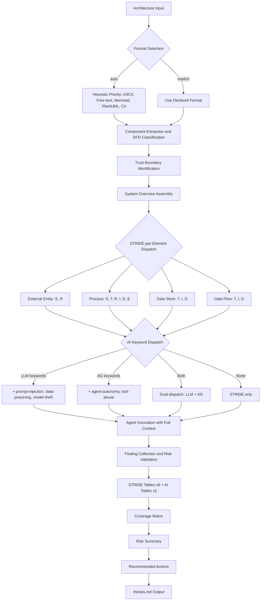
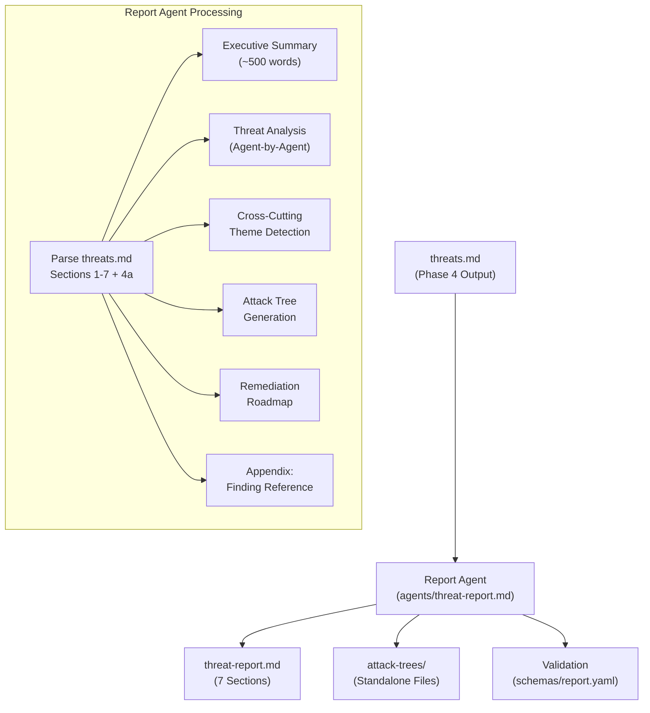
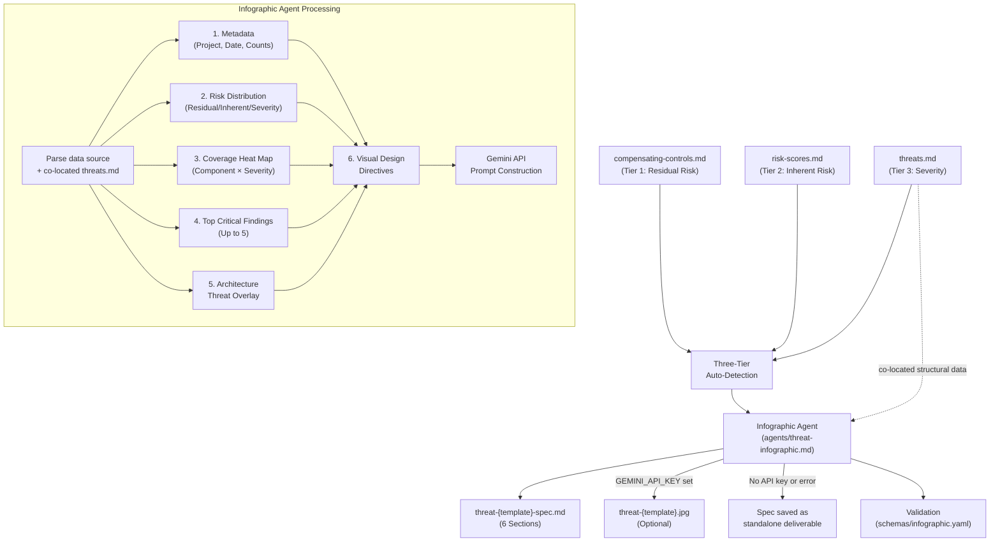
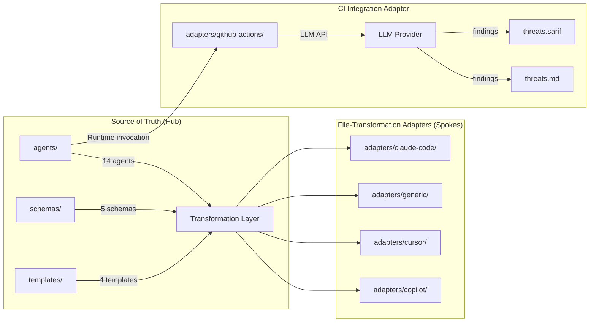
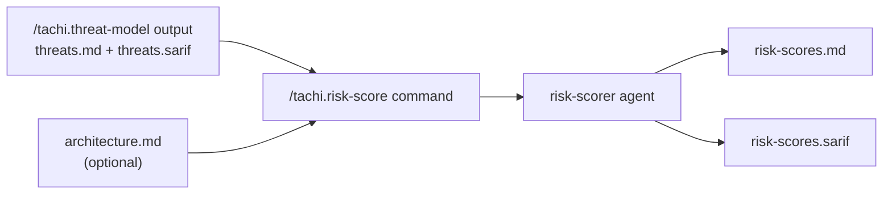
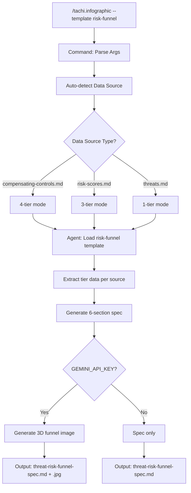
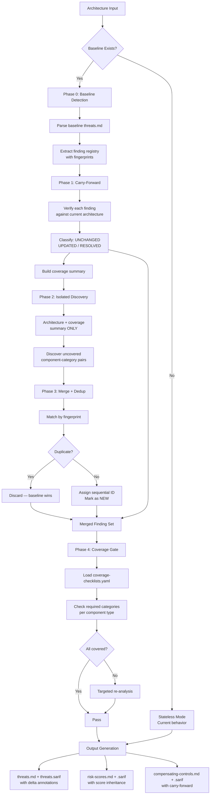
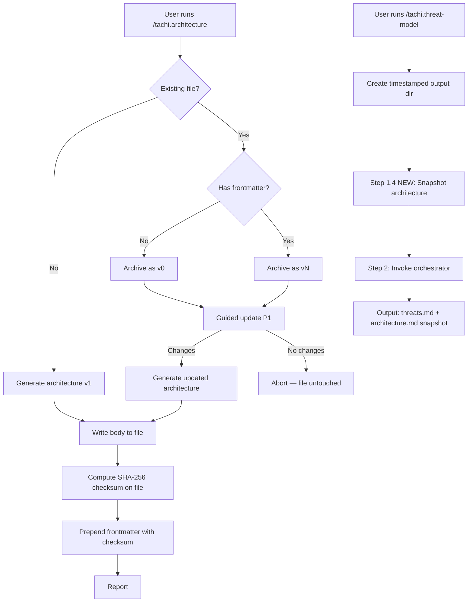
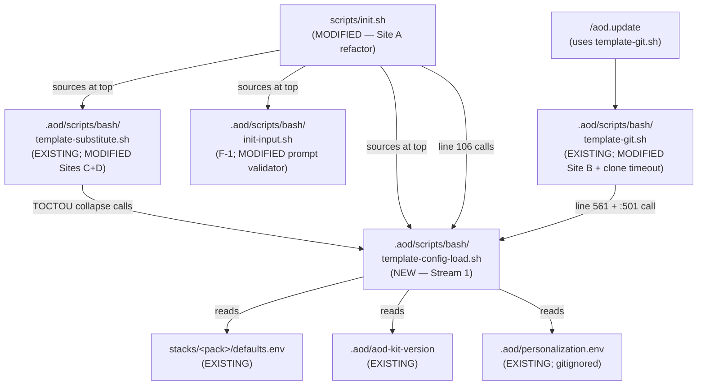

# System Design

Auto-generated from approved plan.md files. Each feature section captures component architecture and data flow at the time of planning approval.

---

### Feature 180: F-A1 Taxonomy Crosswalk Collection

## Components

This feature does not add or modify runtime components. The deliverable is a machine-readable reference data directory consumed by no pipeline stage at F-A1 — F-A2 (finding-level source attribution) and F-B (coverage attestation report section) are the planned downstream consumers.

| Component | Type | File Path | Change Type | Rationale |
|-----------|------|-----------|-------------|-----------|
| Taxonomy catalog + crosswalk directory | New reference-data directory | `schemas/taxonomy/` | Create (9 files) | Spec FR-001/FR-002 — machine-readable foundation for downstream cross-framework ID resolution |
| 5 external framework catalog YAMLs | New data files | `schemas/taxonomy/{owasp,mitre-attack,mitre-atlas,nist-ai-rmf,cwe}.yaml` | Create | Spec FR-015/FR-017/FR-020/FR-021 — 5-field `{id, full_id, name, url, cwe_refs}` shape per FR-003; OWASP ≥60, MITRE ATT&CK ≥38, MITRE ATLAS ≥12 (7 seed + 5 curated AML.T0058-T0062), NIST AI RMF = 72 exactly (GOVERN 19 + MAP 18 + MEASURE 22 + MANAGE 13, primary-source-corrected from historical 68), CWE ≥53 (41 seed + 12 net-new from CWE Top 25 2025) |
| 2 tachi pseudo-taxonomy catalog YAMLs | New data files | `schemas/taxonomy/{tachi-control-category,tachi-stride-ai-category}.yaml` | Create | Spec FR-018/FR-019 — 8 canonical control-category slugs (seeded from `.claude/skills/tachi-control-analysis/references/control-categories.md`) + 11 STRIDE+AI category slugs (6 STRIDE + 5 AI, seeded from `.claude/skills/tachi-shared/references/stride-categories-shared.md`) |
| Crosswalk edge file | New data file | `schemas/taxonomy/crosswalk.yaml` | Create (526 primary edges) | Spec FR-009/FR-025 — 5-field edge shape `{source: {taxonomy, id}, target: {taxonomy, id}, edge_type, confidence, citation}`; ≥500 primary-edge floor under R3 Tier 1 default (achieved 526); `related` and `superseded` edges deferred to follow-on Issue |
| Curation methodology README | New documentation | `schemas/taxonomy/README.md` | Create | Spec FR-033 — §Purpose (with runnable Python snippet), §Harvest methodology, §Per-framework provenance (7 sections), §Confidence calibration rubric with anti-drift rule, §Canonical-URL conventions, §Update procedures (5 external frameworks), §Crosswalk methodology, §Single-source-of-truth cross-reference to `nist-ai-rmf-mapping.md`, §"What F-A1 does NOT give you today" subsection naming deferred downstream capabilities (F-A2, F-B, agent-reference migration, Surface C transcription) |
| Referential integrity test suite | New pytest module | `tests/schemas/test_taxonomy_integrity.py` + `tests/schemas/__init__.py` | Create | Spec FR-027 through FR-032 — 4+1 test functions: `test_framework_yamls_load` (FR-028), `test_crosswalk_loads` (FR-029), `test_crosswalk_referential_integrity` (FR-030), `test_citation_shape` (FR-031), optional `test_records_sorted` (FR-032 with numeric-within-function NIST sort clarification) |
| New ADR | New governance record | `docs/architecture/02_ADRs/ADR-027-taxonomy-crosswalk-schema.md` | Create (Proposed→Accepted) | Spec FR-039/FR-040/FR-041 — 8 numbered decisions covering per-item record shape (with unidirectional OWASP→CWE `cwe_refs` rule), per-edge record shape, 7-value `taxonomy` enum, 3-value `edge_type` enum, 3-value `confidence` enum (with anti-drift rule), citation non-empty-and-resolvable rule, Interpretation C single-feature cadence exception bounded to foundation-data features, and Proposed→Accepted dual-commit governance protocol; Proposed at Day 1 Wave 1.1 schema-lock commit; Accepted at PR #181 merge (commit `8b7c7bf`) |
| Cross-reference link on top-level README | Additive edit | `README.md` | Update (1 link) | Spec FR-038a — single link to `schemas/taxonomy/README.md` |
| Cross-reference link on Tech Stack | Additive edit | `docs/architecture/00_Tech_Stack/README.md` | Update (1 link) | Spec FR-038b — single link under Schemas / Standards sections |

**Architectural posture**: additive-only with zero runtime surface-area touch. No existing agent, schema under `schemas/*.yaml` (excluding new `schemas/taxonomy/`), script, template, or example file is modified. The 5 non-agentic example PDFs (web-app, microservices, ascii-web-api, mermaid-agentic-app, free-text-microservice) regenerate byte-identically under `SOURCE_DATE_EPOCH=1700000000` per ADR-021 (spec FR-036 / SC-004 verified via `tests/scripts/test_backward_compatibility.py`). Zero new runtime dependencies — `pyyaml` and `pytest` were already declared in `requirements-dev.txt` per Feature 128.

**Scope amendments during implementation** (both recorded in ADR-027 Revision History):
- **NIST Subcategory count 68 → 72** (pm_signoff_amendment_1): Day 2 harvest of the authoritative NIST AI RMF 1.0 Playbook pages (airc.nist.gov, fetched 2026-04-17) surfaced 72 Subcategories (GOVERN 19 + MAP 18 + MEASURE 22 + MANAGE 13), not the 68 historically cited in the PRD era. Amendment approved under FR-024 primary-source-correction discipline; FR-022 transcribed IDs (MAP 4.2, MEASURE 2.6-2.10, MANAGE 1.3, MANAGE 2.4, GOVERN 1.4) remain within the 68-subset ⊂ 72-superset, so no ADR-025 or `nist-ai-rmf-mapping.md` edits required.
- **Surface C scope narrow 41 → 27 edges** (pm_signoff_amendment_2): T023 implementation surfaced that Surface C row identifiers (NIST AI 600-1 §2.X GAI Risks) are structurally distinct from AI RMF Subcategories per ADR-025's three-surface structure and cannot be represented under the closed 7-value `taxonomy` enum or in `nist-ai-rmf.yaml` (which holds AI RMF 1.0 Subcategories only). Option (c) selected: defer Surface C to follow-on Issue F-A1.1 which will add `nist-ai-600-1` as an 8th taxonomy enum value, author `schemas/taxonomy/nist-ai-600-1.yaml` with 12 GAI risk records, and transcribe the 15 Surface C Overlap rows as `tachi-stride-ai-category → nist-ai-600-1` edges. **Total NIST-derived edges in F-A1: 27 (Surface B only)**; Surface C transcription deferred to F-A1.1.

**Follow-on Issues filed on PR #181 merge**: (1) F-A1.1 — add `nist-ai-600-1` as 8th taxonomy enum value + author 12-record GAI Risk catalog + transcribe 15 Surface C edges (0.5-1 day, schema-minor additive release); (2) F-A1.2 — `related` and `superseded` edge expansion beyond the F-A1 `primary`-only floor; (3) F-A1.3 — periodic citation URL link-rot monitoring for the external-framework URLs recorded in the 526-edge crosswalk.

## Data Flow

**No runtime data flow changes.** F-A1 is a reference-data authoring feature. The data is consumed offline by adopter integrations and by downstream F-A2 / F-B features that have not yet shipped.

### Author-time flow (implementer's workflow)

```
Day 1 (parallel 3-agent execution — schema freeze + first catalog + spike)
  architect    → freeze schema via data-model.md + contracts/ + ADR-027 Proposed
  senior-backend-engineer → author owasp.yaml ≥60 items (6 OWASP lists)
  web-researcher → 50-edge diverse-slice spike (10 OWASP↔CWE + 10 ATT&CK↔CWE
                   + 10 ATT&CK↔ATLAS + 10 LLM↔NIST + 10 Agentic↔MITRE)
                 → measure per-edge authoring time → R3 tier decision
                   (Tier 1 default ≥500 / Tier 2 ≥300 / Tier 3 ≥150)

Day 2 (parallel — external frameworks + pseudo-taxonomies + citations)
  senior-backend-engineer → author mitre-attack.yaml (38 seed)
                           + mitre-atlas.yaml (7 seed + 5 curated Oct 2025)
                           + cwe.yaml (41 seed + 12 Top 25 2025)
                           + tachi-control-category.yaml (8 slugs)
                           + tachi-stride-ai-category.yaml (11 slugs)
                           + nist-ai-rmf.yaml start (→ 72 Subcategories)
  web-researcher → continue crosswalk citation discovery
  architect    → README.md draft + 2 cross-reference link edits

Day 3 (complete NIST + crosswalk assembly)
  senior-backend-engineer → complete nist-ai-rmf.yaml (72 records)
                           + author ~27 NIST Surface B edges (Surface C deferred per T027 Option c)
                           + assemble crosswalk records
  web-researcher → continue citation harvest toward ≥500
  architect    → finalize README

Day 4 (integrity tests + Accepted ADR + PR open)
  senior-backend-engineer → author tests/schemas/test_taxonomy_integrity.py
                           (authoring MUST occur AFTER all 8 YAMLs committed
                            per Architect F3 sequencing constraint)
  code-reviewer → backward-compat byte-identity verification
  architect    → ADR-027 Proposed→Accepted transition
  team-lead    → PR opened, 3 follow-on Issues filed

Day 5 (PR review + merge)
  PR #181 squash-merged to main (commit 8b7c7bf, 2026-04-17)
  T039 post-merge ADR-027 SHA fill → replaces <pending-T039-post-merge-fill>
```

### Consumer flow (adopter's workflow — post-merge)

```
Adopter integrating tachi output into a downstream system
  → pip install pyyaml
  → python: yaml.safe_load(open('schemas/taxonomy/owasp.yaml'))
  → iterate records to resolve an OWASP ID (e.g., LLM05) to canonical {id, full_id, name, url, cwe_refs}
  → yaml.safe_load(open('schemas/taxonomy/crosswalk.yaml'))
  → filter edges where source.taxonomy == 'owasp' && source.id == 'LLM05'
    to enumerate cross-framework mappings (CWE refs, MITRE ATT&CK
    adversary-objective links, NIST AI RMF subcategory coverage)
  → no text-parsing of agent markdown prose required
```

### Integrity enforcement flow (CI / maintainer workflow)

```
Contributor proposing a new crosswalk edge
  → pytest tests/schemas/test_taxonomy_integrity.py
  → test_framework_yamls_load — record-shape + uniqueness + URL/path validation
  → test_crosswalk_loads      — edge shape + no-duplicate (source, target, edge_type) 3-tuple
  → test_crosswalk_referential_integrity — every source.id / target.id resolves
                                          in the catalog named by source.taxonomy / target.taxonomy;
                                          every enum value in closed 7/3/3-value domains
  → test_citation_shape       — every citation non-empty + URL-regex OR existing file path
  → optional test_records_sorted — alphabetical by id within each catalog YAML;
                                   lexicographic on (source.taxonomy, source.id, target.taxonomy, target.id)
                                   for crosswalk edges; numeric-within-function sort for nist-ai-rmf.yaml
                                   (GOVERN, MANAGE, MAP, MEASURE alphabetical; then X.Y as 2-tuple of ints)
  → merge-time violation → PR blocked with per-finding error message
```

## Tech Stack

### New Dependencies

**None.** This feature introduces zero new runtime or development dependencies. Empty diff on `requirements*.txt`, `pyproject.toml`, `package.json`. `pyyaml>=6.0` and `pytest>=8.0` were already declared in `requirements-dev.txt` per Feature 128 (Q7 / Assumption A6 verified at spec time).

### Tools Used (all pre-existing)

| Tool | Purpose | Source |
|------|---------|--------|
| YAML | Block-style data authoring for 7 catalog files + crosswalk | Native to repository (matches existing `schemas/finding.yaml` / `schemas/attack-chain.yaml` / `schemas/report.yaml` conventions) |
| `pyyaml` | `yaml.safe_load` parsing at integrity-test time and for adopter consumption | Pre-existing in `requirements-dev.txt` per Feature 128 |
| `pytest` | Integrity test suite harness | Pre-existing per Feature 128 |
| `pathlib.Path.is_file()` | Citation file-path existence check (stdlib) | Pre-existing Python 3.11 stdlib |
| `ADR-000-template.md` | ADR-027 authoring scaffold | Pre-existing governance template |

### Standards Consumed

`schemas/taxonomy/` catalog YAMLs reference the following external standards (no runtime dependency on any of them — data is transcribed from authoritative sources at authoring time):

- **OWASP LLM Top 10:2025**, **OWASP Top 10 for Agentic Applications:2026**, **OWASP Top 10:2021**, **OWASP API Security Top 10:2023**, **OWASP Mobile Top 10:2024**, **OWASP Machine Learning Security Top 10:2023**
- **MITRE ATT&CK Enterprise matrix** (38 seed techniques per Feature 082 detection-patterns.md baseline)
- **MITRE ATLAS v5.4** — includes the October 2025 agent techniques AML.T0058-T0062 (curated as a +5 extension beyond the 7-technique seed)
- **NIST AI 100-1 (NIST AI RMF 1.0)** — 72-Subcategory Playbook catalog per airc.nist.gov (primary-source-corrected from historical 68 per pm_signoff_amendment_1)
- **CWE Top 25 (2025)** — published 2025-12-11 by MITRE/CISA (+12 net-new entries beyond the 41-CWE seed)

**No runtime integration.** All 5 external standards are documented in `schemas/taxonomy/README.md` with per-framework provenance (seed source + count, external-curation source, what was added beyond the seed), canonical-URL conventions, and update procedures for future framework revisions. Runtime consumption begins in F-A2 (finding-level source attribution) and F-B (coverage attestation report section) — neither of which has shipped.

---


## Components

This feature does not add or modify runtime components. The deliverable is a content-only example directory that doubles as an integration-test / regression fixture for the MAESTRO pipeline.

| Component | Type | File Path | Change Type | Rationale |
|-----------|------|-----------|-------------|-----------|
| Canonical MAESTRO reference example | New example directory | `examples/maestro-reference/` | Create (content-only) | Spec FR-001/FR-002/FR-003 — adopter-facing canonical walkthrough spanning all 7 MAESTRO layers |
| Hand-authored architecture input | New Mermaid architecture | `examples/maestro-reference/architecture.md` | Create | Spec FR-002/FR-004/FR-005 — 18-component Healthcare CDSS multi-agent scenario satisfying Pre-Execution Architecture Review Checklist (multi-agent gate predicate TRUE; R-01/R-02/R-03 preconditions green) |
| Adopter-facing tour | New README | `examples/maestro-reference/README.md` | Create | Spec FR-003 — 7 required sections (introduction, domain overview with disclaimer, MAESTRO layer coverage table, what to look for in output, reading-order recommendation, compliance posture cross-references to ADR-024 + ADR-025, limitations) |
| Feature 120 version frontmatter | Injected YAML frontmatter | `examples/maestro-reference/architecture.md` (frontmatter block) | Inject last | Spec FR-012 / SC-012 — version "1.0", SHA-256 body checksum, `/tachi.architecture` "create" mode on frozen body |
| Pipeline-generated outputs | Full output artifact set | `examples/maestro-reference/{threats.md, threats.sarif, threat-report.md, risk-scores.md, risk-scores.sarif, compensating-controls.md, compensating-controls.sarif, attack-trees/, attack-chains.md, 6× infographic JPEGs + specs, security-report.pdf, security-report.pdf.baseline}` | Generated | Spec FR-006/FR-007/FR-008 — standard pipeline invocation; demonstrates MAESTRO layer coverage (7/7), cross-layer attack chains (≥1 chain ≥3 layers), agentic pattern analysis (≥3 of 6 canonical patterns) |
| Byte-deterministic PDF baseline | New baseline file | `examples/maestro-reference/security-report.pdf.baseline` | Create | Spec FR-009 / SC-007 — byte-identical regeneration under `SOURCE_DATE_EPOCH=1700000000` per ADR-021 |
| Top-level examples README update | Modify existing file | `examples/README.md` | Update (additive) | Spec FR-010 / SC-006 — canonical MAESTRO walkthrough positioned as recommended first-read for MAESTRO users; existing 6 examples retain listings |
| Backward-compatibility regression fixture | Modify existing test | `tests/scripts/test_backward_compatibility.py` (`BASELINE_EXAMPLES`) | Update (additive) | Spec FR-011 / SC-013 — adds `maestro-reference` as 6th baseline alongside the existing 5 non-multi-agent baselines; conditional on mmdc CI availability (verified in Wave 0) |

**Architectural posture**: additive-only. No existing agent, schema, template, script, or ADR is modified. The five existing non-multi-agent baselines (web-app, microservices, ascii-web-api, mermaid-agentic-app, free-text-microservice) remain byte-identical under `SOURCE_DATE_EPOCH=1700000000` per ADR-021 (spec FR-013 / SC-008). The `agentic-app` example is unchanged (spec FR-014 / SC-009). The 11 STRIDE+AI detection agents stabilized in Feature 082 are unchanged per the zero-edit invariant (ADR-023); the orchestrator is unchanged.

**Strategic positioning**: The maestro-reference example is the canonical first-read teaching artifact that demonstrates the complete MAESTRO umbrella produced end-to-end by a single pipeline run — Phase 1 layer-tagged findings (Features 084/136), Phase 2 cross-layer attack chains (Feature 141), Phase 3 agentic pattern classifications (Feature 142), and Phase 4 + 5 compliance posture (Features 143/144 via ADR-024 + ADR-025 cross-references in the README). It closes the "read this first" gap in tachi's MAESTRO documentation surface. The example is purpose-built to naturally exercise multi-layer chains and multi-pattern findings (≥14 components across all 7 layers, inter-agent data flows, persistent-state components, emergent-behavior descriptions), so future MAESTRO feature work (Phase 2 chain refactor, Phase 3 pattern synthesis tuning, future phases) has a validated regression target without architectural contortion.

## Data Flow

**No runtime data flow changes.** The feature is purely content authoring consuming the existing pipeline.

### Author-time flow (implementer's workflow)

```
Wave 0 (Domain + Structure + CI gates — ≤2h timebox)
  architect + team-lead + PM → lock: domain (Healthcare CDSS),
                                     structure (flat top-level per Y),
                                     mmdc CI availability (verified present)

Wave 1 (Architecture Authorship)
  architect → draft architecture.md body (18 components, 7 layers)
           → static-verify Pre-Execution Architecture Review Checklist:
               (a) multi-agent gate predicate TRUE
               (b) R-01 precondition (inter-agent data flow present)
               (c) R-02 precondition (persistent-state component present)
               (d) R-03 precondition (multi-agent topology + emergent-behavior keywords)
           → freeze body
           → /tachi.architecture create-mode → inject Feature 120 frontmatter last

Wave 2 (Pipeline Invocation — standard command sequence)
  /tachi.threat-model → threats.md + threats.sarif (Phase 1 layer tags, Phase 3 patterns, Phase 3.5 chains)
  /tachi.risk-score → risk-scores.md + risk-scores.sarif (4-dimensional composite per ADR-018)
  /tachi.compensating-controls → compensating-controls.md + .sarif (scanned against tachi repo codebase)
  /tachi.infographic all → 6× JPEGs + co-committed specs
  /tachi.security-report → security-report.pdf + security-report.pdf.baseline

Wave 3 (Adopter-Facing README)
  architect → hand-author README.md with 7 required sections
           → PM reviews for neutral factual tone before commit

Wave 4 (Regression-Fixture Integration — conditional)
  IF mmdc CI available (Wave 0 gate green):
    devops → append "maestro-reference" to BASELINE_EXAMPLES in tests/scripts/test_backward_compatibility.py
          → commit baseline PDF under SOURCE_DATE_EPOCH=1700000000
          → verify byte-identity on rerun
  ELSE:
    FR-011 deferred to follow-up PR per Risk 145.3 contingency

Wave 5 (Top-Level examples/README.md Update)
  architect → add "maestro-reference" row to Standardized Examples table
           → add prominent first-read callout near top of examples/README.md
           → preserve all 6 existing example listings
```

### Read-time flow (adopter's workflow — post-merge)

```
Security engineer evaluating tachi for MAESTRO
  → opens examples/README.md → sees first-read callout pointing at maestro-reference
  → opens examples/maestro-reference/README.md → reads 7-section tour
  → follows reading-order recommendation to threats.md → threat-report.md → attack-chains.md → PDF
  → cross-references ADR-024 (AIVSS posture) + ADR-025 (NIST AI RMF posture) for compliance context
  → optionally inspects architecture.md for component-to-MAESTRO-layer lineage
```

### Regression flow (CI / maintainer workflow)

```
Maintainer adding new MAESTRO-adjacent feature
  → runs pytest tests/scripts/test_backward_compatibility.py with SOURCE_DATE_EPOCH=1700000000
  → maestro-reference is parametrized alongside the other 5 baselines
  → pytest compiles each architecture through the full PDF pipeline
  → compares output byte-for-byte against each committed *.pdf.baseline
  → all 7 MAESTRO layers populated, ≥1 cross-layer chain surfaced, ≥3 agentic patterns populated — regression target invariant
```

## Tech Stack

### New Dependencies

**None.** This feature introduces zero new runtime or development dependencies. Empty diff on `requirements*.txt`, `pyproject.toml`, `package.json`.

### Tools Used (all pre-existing)

| Tool | Purpose | Source |
|------|---------|--------|
| Markdown | `architecture.md` + `README.md` authorship | Native to repository |
| YAML | Feature 120 frontmatter injection on `architecture.md` | Feature 120 lifecycle command |
| `/tachi.architecture` (create mode) | Frontmatter injection on frozen body | Feature 120 |
| `/tachi.threat-model`, `/tachi.risk-score`, `/tachi.compensating-controls`, `/tachi.infographic`, `/tachi.security-report` | Standard pipeline invocation | Feature 121 namespace |
| `mmdc` (Mermaid CLI) | Attack-tree Mermaid → PNG rendering for PDF | Pre-existing per ADR-022 (hard prerequisite when attack trees present) |
| `typst` | PDF compilation | Pre-existing |
| Gemini API | Infographic JPEG generation (one-time cost per regeneration) | Pre-existing per ADR-014 (optional, graceful degradation) |
| `SOURCE_DATE_EPOCH=1700000000` | Byte-deterministic PDF baseline generation | Pre-existing per ADR-021 |
| `pytest` | Backward-compatibility regression fixture | Pre-existing per Feature 128 |

**No new technology introduced.** Content-authoring feature only. Zero schema changes, zero script changes, zero agent changes, zero ADRs added.

---

### Feature 091: Delivery Document Generation

## Components

### Component 1: Delivery Document Template

**File**: `.aod/templates/delivery-template.md`
**Type**: New file
**Purpose**: Standardized template for consistent delivery document generation across all features.

The template defines the mandatory document structure:
- Header: Feature number, name, date, branch, PR
- What Was Delivered: Bullet list of accomplishments
- How to See & Test: Numbered verification steps
- Delivery Metrics: Estimated/actual/variance table
- Surprise Log: Captured during retrospective
- Lessons Learned: Category, text, KB entry reference
- Feedback Loop: New ideas or "None"
- Source Artifacts: Links to spec, plan, tasks, PRD
- Documentation Updates: Agent update summary table
- Cleanup: Checklist of closure steps

### Component 2: Skill Step 9 — Generate delivery.md

**File**: `.claude/skills/~aod-deliver/SKILL.md`
**Type**: Modify existing Step 9
**Purpose**: Replace terminal-only display with file generation + terminal display.

1. Re-read `.aod/templates/delivery-template.md` before generating
2. Resolve specs directory from branch name; create if missing
3. Populate template from retrospective data (Steps 1-8)
4. Write to `specs/{NNN}-*/delivery.md`
5. Fallback: display in terminal if write fails

### Component 3: Command Step 12 — Redirect Closure Report

**File**: `.claude/commands/aod.deliver.md`
**Type**: Modify existing Step 12
**Purpose**: Change closure report target from `.aod/closures/` to `specs/{NNN}-*/delivery.md`.

### Component 4: Command Step 10 — GitHub Closing Comment Update

**File**: `.claude/commands/aod.deliver.md`
**Type**: Modify existing Step 10
**Purpose**: Include delivery document path in GitHub Issue closing comment.

## Data Flow

```
Steps 1-8 (retrospective data collection)
         │
         ▼
   Skill Step 9: Generate delivery.md
         │
         ├── Read .aod/templates/delivery-template.md (re-ground)
         ├── Populate from collected data (accomplishments, metrics, etc.)
         ├── Write to specs/{NNN}-*/delivery.md
         │         │
         │         └── [on failure] Display in terminal as fallback
         ▼
   Command Step 10: Close GitHub Issue
         │
         └── Comment includes: "See: specs/{NNN}-*/delivery.md"
         ▼
   Command Step 12: Verify delivery.md exists (no longer generates closure file)
```

---

### Feature 001: Project Skeleton & Interface Contract

## Components

### Component 1: Agent Prompt Files (Hub)

**Location**: `agents/`
**Type**: New files (11 agent prompts + 1 placeholder)
**Purpose**: Immutable threat agent definitions — the content hub that all outputs derive from.

- `agents/stride/` — 6 STRIDE agents (spoofing, tampering, repudiation, info-disclosure, denial-of-service, privilege-escalation)
- `agents/ai/` — 5 AI agents (prompt-injection, tool-abuse, data-poisoning, model-theft, agent-autonomy)
- `agents/ai/README.md` — 5-agent-to-2-table mapping: AG (agent-autonomy, tool-abuse) and LLM (prompt-injection, data-poisoning, model-theft)
- `agents/orchestrator.md` — Placeholder for F-002

### Component 2: Machine-Readable Schemas

**Location**: `schemas/`
**Type**: New directory with 3 YAML schema files
**Purpose**: Data contracts between agents, templates, and downstream features.

- `schemas/finding.yaml` — IR schema (id, category, component, threat, likelihood, impact, risk_level, mitigation, references, dfd_element_type)
- `schemas/input.yaml` — Input validation (5 formats: ASCII, free-text, Mermaid, PlantUML, C4)
- `schemas/output.yaml` — Output structure (7 sections matching threats.md template)

### Component 3: Interface Contract

**Location**: `docs/INTERFACE-CONTRACT.md`
**Type**: New file
**Purpose**: Single document specifying input formats, STRIDE-per-Element normalization, AI dispatch rules, invocation protocol, and side-effect guarantees.

### Component 4: Output Template

**Location**: `templates/tachi/output-schemas/threats.md`
**Type**: New file
**Purpose**: Canonical template for threat model output with 7 sections: System Overview, Trust Boundaries, STRIDE Tables (6), AI Threat Tables (2), Coverage Matrix, Risk Summary, Recommended Actions.

## Data Flow

```
Architecture Input (5 formats)
        │
        ▼
┌─────────────────────┐
│  Input Validation    │ ◄── schemas/input.yaml
│  (format detection)  │
└────────┬────────────┘
         │
         ▼
┌─────────────────────┐
│  STRIDE-per-Element  │ ◄── INTERFACE-CONTRACT.md
│  Normalization       │     (normalization table)
│  + AI Dispatch       │
└────────┬────────────┘
         │
    ┌────┴─────────┐
    ▼              ▼
┌────────┐   ┌──────────┐
│ STRIDE  │   │ AI Threat │
│ Agents  │   │ Agents    │
│ (6)     │   │ (5)       │
└────┬───┘   └────┬─────┘
     │             │
     ▼             ▼
┌─────────────────────┐
│  Intermediate        │ ◄── schemas/finding.yaml
│  Representation (IR) │     (agent output contract)
│  [Finding objects]   │
└────────┬────────────┘
         │
         ▼
┌─────────────────────┐
│  Template Engine     │ ◄── templates/tachi/output-schemas/threats.md
│  (IR → Output)       │     schemas/output.yaml
└────────┬────────────┘
         │
         ▼
   Threat Model Output
   (threats.md)
```

## Tech Stack

| Technology | Purpose |
|-----------|---------|
| Markdown + YAML | Content format — platform-agnostic, no runtime dependencies |
| OWASP 3x3 Matrix | Risk rating standard — human-interpretable |
| STRIDE-per-Element | Threat methodology — DFD element mapping, O(n) scaling |

---

### Feature 003: Orchestrator Agent

## Components

### Component 1: Orchestrator Prompt File

**File**: `agents/orchestrator.md`
**Type**: Replace placeholder (Feature 001 placeholder replaced with full implementation)
**Purpose**: Central prompt implementing OWASP 4-step threat modeling workflow — parse, classify, dispatch, assemble.

**Internal Structure** (prompt sections):

| Section | OWASP Phase | Responsibility |
|---------|-------------|----------------|
| Frontmatter | — | Agent metadata (agent_name, category, status, version) with explicit references to all schemas, templates, and agent files |
| Role & Purpose | — | Establish orchestrator identity, platform-neutrality, and output constraints |
| Input Sanitization Boundary | — | Mark architecture input as data, not instructions; reject prompt injection attempts within `<architecture-input>` tags |
| Output Format Specification | — | Define 7-section structure (System Overview, Trust Boundaries, STRIDE Tables x6, AI Tables x2, Coverage Matrix, Risk Summary, Recommended Actions) with YAML frontmatter |
| Phase 1: Scope | Scope | Format detection (5 formats with heuristic priority), component extraction with format-specific parsers, DFD classification (4 element types with ambiguous-default-to-Process rule), trust boundary identification, System Overview assembly, **Component Inventory intermediate output with self-check** |
| Phase 2: Determine Threats | Determine Threats | STRIDE-per-Element normalization table (DFD type to applicable categories), AI keyword dispatch rules (LLM keywords, AG keywords, dual-dispatch), agent invocation protocol (parallel + sequential modes with full architecture context payload), **Dispatch Table intermediate output with self-check** |
| Phase 3: Determine Countermeasures | Determine Countermeasures | Agent finding collection, risk_level validation against OWASP 3x3 matrix with correction protocol, STRIDE table assembly (6 tables), AI table assembly (2 tables via 5-agent-to-2-table mapping) |
| Phase 4: Assess | Assess | Coverage matrix generation (finding counts, dash for analyzed-but-clean, empty for not-applicable), risk summary computation (percentages rounded to 1 decimal), recommended actions list (sorted by risk descending, then table order) |
| Error Handling | — | Three terminal errors: UNSUPPORTED_FORMAT (auto-detection fails), NO_COMPONENTS (parsing finds no components or data flows), INVALID_FORMAT_VALUE (format field not in allowed enum); two non-terminal handlers: ambiguous classification annotation, non-conforming finding correction |
| Output Validation | — | Structural integrity checklist: 7 sections present, frontmatter valid, finding IDs sequential, all fields populated, risk levels consistent with OWASP 3x3, cross-section counts match |

## Data Flow



## Tech Stack

| Technology | Purpose |
|-----------|---------|
| Markdown prompt file | Platform-agnostic deliverable — works with any LLM |
| OWASP 4-step process | Industry-standard threat modeling methodology |
| STRIDE-per-Element + AI keywords | Deterministic dispatch rules embedded in prompt |

---

### Feature 005: STRIDE Threat Agents

**Status**: Delivered (2026-03-22) | PR #6 | 41/41 tasks complete

## Components

### Component 1: 6 STRIDE Threat Agent Definitions

**Location**: `agents/stride/`
**Type**: Enhanced existing files (Feature 001 skeleton refined and validated)
**Purpose**: Each agent analyzes architecture input through exactly one STRIDE threat lens, producing component-specific findings conforming to `schemas/finding.yaml`.

| Agent File | Threat Class | DFD Targets | ID Prefix | Key Detection Patterns |
|-----------|-------------|-------------|-----------|----------------------|
| `spoofing.md` | Spoofing (S) | External Entity, Process | S-N | Authentication bypass, credential theft/replay, session hijacking, service impersonation, federated identity attacks |
| `tampering.md` | Tampering (T) | Process, Data Store, Data Flow | T-N | Input validation bypass, data integrity violations, message/payload manipulation, storage tampering, configuration tampering |
| `repudiation.md` | Repudiation (R) | External Entity, Process | R-N | Audit logging gaps, log integrity failures, non-repudiation mechanism absence, timestamp manipulation |
| `info-disclosure.md` | Information Disclosure (I) | Process, Data Store, Data Flow | I-N | Data leaks via error messages, excessive API responses, side-channel exposure, storage access control gaps, transit encryption gaps |
| `denial-of-service.md` | Denial of Service (D) | Process, Data Store, Data Flow | D-N | Resource exhaustion, queue/connection pool saturation, storage flooding, algorithmic complexity attacks, cascading failures |
| `privilege-escalation.md` | Elevation of Privilege (E) | Process | E-N | RBAC/ABAC bypass, horizontal/vertical escalation, default permission over-grants, parameter tampering for privilege gain |

**Agent structure** (canonical per-agent organization):
- YAML frontmatter: `agent_name`, `category`, `threat_class`, `dfd_targets`, `owasp_references`, `output_schema`
- Purpose section: Threat class definition and DFD targeting rationale
- Detection Scope: Targeted DFD element types with patterns and indicators (4-6 subcategories)
- AI-Specific Threat Patterns: Agentic application extensions per STRIDE category
- Finding Template: Concrete example demonstrating component-specific findings
- Risk Computation: OWASP 3x3 matrix application with likelihood/impact guidance
- References: OWASP Top 10 2021, OWASP API Security 2023, CWE, MITRE ATT&CK identifiers

### Component 2: AI-Specific Threat Pattern Extensions

**Location**: Within each `agents/stride/*.md` agent file
**Type**: New sections within existing agents
**Purpose**: Extend classic STRIDE patterns with threats specific to agentic AI applications.

Each STRIDE agent includes an "AI-Specific Threat Patterns" section covering:
- **Spoofing**: LLM API key theft, model identity spoofing, prompt-based identity assumption
- **Tampering**: Training data poisoning, RAG context manipulation, tool response modification
- **Repudiation**: Agentic action audit gaps, tool call logging, autonomous decision accountability
- **Info Disclosure**: Model inversion attacks, embedding leakage, context window data exposure
- **DoS**: LLM token exhaustion, recursive agent loops, unbounded tool execution chains
- **Privilege Escalation**: Agent capability boundary violations, tool permission escalation, MCP server scope creep

### Component 3: OWASP API Security 2023 Cross-References

**Location**: YAML frontmatter `owasp_references` field in each agent file
**Type**: Enhanced metadata
**Purpose**: Cross-reference STRIDE findings with OWASP API Security Top 10 2023 (API1-API10) alongside existing OWASP Top 10 2021, CWE, and MITRE ATT&CK references.

### Agent Validation Framework

The validation approach (used during Feature 005 delivery) has three layers:

**Layer 1: Structural Audit** (per agent)
- Frontmatter fields present and correct (`agent_name`, `category`, `threat_class`, `dfd_targets`, `owasp_references`, `output_schema`)
- Section structure matches canonical organization (purpose, detection scope, patterns, finding template, risk computation, references)
- `dfd_targets` matches STRIDE-per-Element matrix row for this category

**Layer 2: Content Quality** (per agent)
- Detection patterns cover all attack subcategories from PRD FR-7
- Finding template examples demonstrate component-specific threats (not generic)
- Mitigation examples are actionable with specific technology references
- Framework references include OWASP, CWE, and MITRE ATT&CK identifiers

**Layer 3: Integration Validation** (all agents together)
- Run orchestrator against `examples/mermaid-agentic-app/input.md`
- Verify all 6 STRIDE tables have findings in assembled `threats.md`
- Verify coverage matrix shows correct STRIDE-per-Element targeting
- Verify 100% component specificity (zero generic findings)

### STRIDE-per-Element Validation Matrix

| DFD Element | S | T | R | I | D | E |
|-------------|---|---|---|---|---|---|
| **Processes** | X | X | X | X | X | X |
| **Data Flows** | | X | | X | X | |
| **Data Stores** | | X | | X | X | |
| **External Entities** | X | | X | | | |

## Data Flow

```
Architecture Input (any format)
         │
         ▼
┌─────────────────────────────┐
│ Orchestrator (F-003)        │
│  Phase 1: Scope             │
│  - Format detection         │
│  - Component classification │
│  - DFD element assignment   │
└─────────┬───────────────────┘
          │ dispatch per STRIDE-per-Element
          ▼
┌─────────────────────────────┐
│ 6 STRIDE Agents (F-005)     │
│  Each agent:                │
│  1. Receives full arch      │
│  2. Filters by dfd_targets  │
│  3. Applies classic STRIDE  │
│     detection patterns      │
│  4. Applies AI-specific     │
│     threat patterns         │
│  5. Produces findings       │
│     (IR schema)             │
└─────────┬───────────────────┘
          │ findings per schemas/finding.yaml
          ▼
┌─────────────────────────────┐
│ Orchestrator (F-003)        │
│  Phase 3-4: Assemble        │
│  - Validate risk_level      │
│  - Build STRIDE tables      │
│  - Generate coverage matrix │
│  - Compute risk summary     │
└─────────┬───────────────────┘
          │
          ▼
    threats.md output
```

## Tech Stack

| Component | Technology | Justification |
|-----------|-----------|---------------|
| Agent files | Markdown with YAML frontmatter | Platform-neutral, LLM-agnostic prompt format |
| Schema | YAML | Machine-readable validation contract |
| Reference frameworks | OWASP Top 10 2021, OWASP API Security 2023, CWE, MITRE ATT&CK | Industry-standard cross-references for threat findings |
| Validation | Manual review + orchestrator integration run | No automated test framework needed for prompt files |

---

### Feature 007: AI Threat Agents

**Status**: Delivered (2026-03-22) | PR #8 | 48/48 tasks complete

## Components

### Agent Validation Framework

The validation approach follows the three-layer framework proven in F-005 (STRIDE agents):

**Layer 1: Structural Audit** (per agent)
- Frontmatter fields present and correct (`agent_name`, `category`, `threat_class`, `dfd_targets`, `owasp_references`, `output_schema`)
- Section structure matches canonical organization (purpose, detection scope, patterns, finding template, risk computation, references)
- `dfd_targets` matches interface contract AI extension dispatch rules

**Layer 2: Content Quality** (per agent)
- Detection patterns cover all attack subcategories from PRD FR-8
- Finding template examples demonstrate component-specific threats (not generic)
- Mitigation examples are actionable with specific technology references
- Framework references include OWASP AI framework IDs (LLM0x:2025, ASI-xx, MCP-xx:2025)

**Layer 3: Integration Validation** (all agents together)
- Run orchestrator against `examples/mermaid-agentic-app/input.md`
- Verify AG and LLM tables have findings in assembled `threats.md`
- Verify two-layer keyword dispatch and dual-dispatch behavior
- Verify 100% component specificity (zero generic findings)

### AI Agent DFD Targeting Matrix

| Agent | category | threat_class | dfd_targets | OWASP Framework |
|-------|----------|-------------|-------------|-----------------|
| prompt-injection.md | llm | LLM | [Process] | LLM Top 10 v2025 (LLM01) |
| data-poisoning.md | llm | LLM | [Data Store, Data Flow] | LLM Top 10 v2025 (LLM03, LLM04) |
| model-theft.md | llm | LLM | [Data Store, Process] | LLM Top 10 v2025 (LLM10) |
| agent-autonomy.md | agentic | AG | [Process] | Agentic Top 10 (ASI01, ASI06, ASI08, ASI09, ASI10) |
| tool-abuse.md | agentic | AG | [Process] | Agentic Top 10 (ASI02, ASI04), MCP Top 10 (MCP03) |

## Data Flow

```
Architecture Input (any format)
         │
         ▼
┌─────────────────────────────┐
│ Orchestrator (F-003)        │
│  Phase 1: Scope             │
│  - Format detection         │
│  - Component classification │
│  - DFD element assignment   │
└─────────┬───────────────────┘
          │ dispatch per STRIDE-per-Element
          │ + AI keyword dispatch (Layer 1)
          ▼
┌──────────────────┐    ┌──────────────────┐
│ 6 STRIDE Agents  │    │ 5 AI Agents      │
│ (F-005 validated)│    │ (F-007 — this)   │
│                  │    │                  │
│ Each agent:      │    │ Each agent:      │
│ 1. Receives arch │    │ 1. Receives arch │
│ 2. Filters by    │    │ 2. Filters by    │
│    dfd_targets   │    │    dfd_targets   │
│ 3. Applies       │    │ 3. Applies Layer │
│    patterns      │    │    2 keywords    │
│ 4. Produces      │    │ 4. Applies       │
│    findings (IR) │    │    patterns      │
│                  │    │ 5. Produces      │
│                  │    │    findings (IR) │
└────────┬─────────┘    └────────┬─────────┘
         │                       │
         └───────────┬───────────┘
                     │ all findings per schemas/finding.yaml
                     ▼
┌─────────────────────────────┐
│ Orchestrator (F-003)        │
│  Phase 3-4: Assemble        │
│  - Build 6 STRIDE tables    │
│  - Build 2 AI tables        │
│    (AG table + LLM table)   │
│  - Generate coverage matrix │
│  - Compute risk summary     │
└─────────┬───────────────────┘
          │
          ▼
    threats.md output
    (8 threat tables total)
```

## Tech Stack

| Component | Technology | Justification |
|-----------|-----------|---------------|
| Agent files | Markdown with YAML frontmatter | Platform-neutral, LLM-agnostic prompt format; matches F-005 STRIDE pattern |
| Schema | YAML (`schemas/finding.yaml` v1.0) | Machine-readable validation contract; read-only for this feature |
| OWASP references | LLM Top 10 v2025, Agentic Top 10 2026, MCP Top 10 2025 | Three complementary AI security frameworks |
| Validation | Manual review + orchestrator integration run | No automated test framework needed for prompt files |

---

### Feature 010: Deduplication & Risk Rating

**Status**: Delivered (2026-03-22) | PR #11 | 24/24 tasks complete

## Components

### Component 1: Orchestrator Prompt — Correlation Detection Phase

**File**: `agents/orchestrator.md`
**Type**: Extend existing Phase 3 (Determine Countermeasures)
**Purpose**: Add correlation detection logic after all agent findings are collected and risk-validated, before coverage matrix generation.

Five deterministic correlation rules map STRIDE-to-AI category pairs:

| Rule | STRIDE Category | AI Category | Correlation Basis |
|------|----------------|-------------|-------------------|
| CR-1 | Tampering (T) | Data-Poisoning (LLM) | Data integrity |
| CR-2 | Privilege-Escalation (E) | Agent-Autonomy (AG) | Excessive permissions |
| CR-3 | Info-Disclosure (I) | Prompt-Injection (LLM) | Information leakage |
| CR-4 | Repudiation (R) | Agent-Autonomy (AG) | Accountability gaps |
| CR-5 | Denial-of-Service (D) | Tool-Abuse (AG) | Resource exhaustion |

### Component 2: Output Template — Correlated Findings Section (4a)

**File**: `templates/tachi/output-schemas/threats.md`
**Type**: New Section 4a between AI Threat Tables and Coverage Matrix

### Component 3: Output Template — Enhanced Coverage Matrix

**File**: `templates/tachi/output-schemas/threats.md` (Section 5)
**Type**: Modify existing — deduplicated counts, "—" for gaps, "n/a" for not-applicable

### Component 4: Output Template — Risk Calibration Matrix + Deduplicated Risk Summary

**File**: `templates/tachi/output-schemas/threats.md` (Section 6)
**Type**: Add subsection + modify existing counts

### Component 5: Output Schema Update

**File**: `schemas/output.yaml`
**Type**: Add Correlated Findings section schema

### Component 6: Interface Contract Update

**File**: `docs/INTERFACE-CONTRACT.md`
**Type**: Formalize deduplication in Sections 3 + 4

## Data Flow

```
Architecture Input
        │
        ▼
┌─────────────────────────────┐
│ Orchestrator Phase 1-2      │
│ (unchanged)                 │
└────────┬────────────────────┘
         │
    ┌────┴────────┐
    ▼             ▼
┌─────────┐  ┌──────────┐
│ STRIDE   │  │ AI       │
│ Agents   │  │ Agents   │
│ (6)      │  │ (5)      │
└────┬────┘  └────┬─────┘
     └─────┬──────┘
           │ all findings (IR schema)
           ▼
┌─────────────────────────────┐
│ Phase 3 (extended)          │
│ 1. Collect + validate       │
│ 2. Assemble tables          │
│ 3. NEW: Correlation detect  │
│ 4. NEW: Assemble Section 4a │
└────────┬────────────────────┘
         ▼
┌─────────────────────────────┐
│ Phase 4 (modified)          │
│ 1. Coverage matrix (dedup)  │
│ 2. Risk Calibration Matrix  │
│ 3. Risk summary (dedup)     │
│ 4. Recommended actions      │
│ 5. Structural validation    │
└────────┬────────────────────┘
         ▼
   threats.md output
   (7 sections + Section 4a)
```

## Tech Stack

| Technology | Purpose |
|-----------|---------|
| Markdown prompt | Orchestrator prompt extension — platform-agnostic |
| YAML schema | Output validation contract update |
| Markdown template | Output format specification |
| OWASP 3×3 Matrix | Risk calibration documentation (already implemented) |

---

### Feature 012: SARIF Output Generation

**Status**: Delivered (2026-03-22) | PR #13 | 20/20 tasks complete

## Components

### Component 1: Orchestrator Phase 4 Extension

**File**: `agents/orchestrator.md`
**Type**: Extend existing Phase 4 (Assess)
**Purpose**: Add SARIF generation instructions after Output Structural Validation. The orchestrator produces `threats.sarif` alongside `threats.md` using the same finding data collected in Phase 3.

10 sub-sections added:
1. SARIF Generation Instructions
2. Finding IR → SARIF Result Mapping Table (FR-003)
3. Category → Rule ID Mapping Table (FR-004, resolves `info-disclosure` → `information-disclosure`)
4. Severity Mapping Table (FR-005, Note-level fix: `note`/`"0.1"`)
5. SARIF Tool Metadata Template (FR-006)
6. Rule Definition Templates (8 categories with shortDescription, fullDescription, help.text, help.markdown, tags)
7. Correlated Finding Instructions (FR-007, `relatedLocations[]`)
8. Fingerprint Computation (FR-008, SHA-256 of ruleId + component_name)
9. Dual-Location Instructions (FR-011, physicalLocation + logicalLocations)
10. JSON Structural Self-Check (FR-010)

### Component 2: Output Schema Note-Level Fix

**File**: `schemas/output.yaml`
**Type**: Modify existing SARIF Severity Mapping comment block
**Purpose**: Fix Note-level mapping from `none`/`0.0` to `note`/`0.1` per Architect review.

### Component 3: SARIF Reference Template

**File**: `templates/tachi/output-schemas/threats.sarif`
**Type**: New file
**Purpose**: Complete SARIF 2.1.0 reference structure with placeholder values for documentation and structural reference.

## Data Flow

```
Architecture Input (5 formats)
        ↓
Phase 1: Scope (extract components, trust boundaries)
        ↓
Phase 2: Determine Threats (dispatch to STRIDE + AI agents)
        ↓
Phase 3: Countermeasures (collect findings, validate, correlate)
        ↓
Phase 4: Assess
  ├── Coverage Matrix (Section 5)
  ├── Risk Summary (Section 6)
  ├── Recommended Actions (Section 7)
  ├── Output Structural Validation
  └── *** SARIF Generation (NEW) ***
        ├── Map findings → SARIF results
        ├── Map categories → SARIF rules
        ├── Map severity → SARIF levels
        ├── Populate tool metadata
        ├── Map correlations → relatedLocations
        ├── Compute partialFingerprints
        ├── Add dual locations
        └── Run JSON structural self-check
        ↓
Output: threats.md + threats.sarif (same directory)
```

## Tech Stack

| Technology | Purpose |
|-----------|---------|
| Markdown prompt | Orchestrator prompt extension — SARIF generation instructions |
| YAML schema | Output validation contract — Note-level severity fix |
| JSON reference | SARIF 2.1.0 template for structural documentation |
| SARIF 2.1.0 | OASIS standard for static analysis results interchange |

---

### Feature 015: Threat Report Agent & Attack Trees

**Status**: Delivered (2026-03-23) | PR #16 | 29/29 tasks complete

## Components

### Component 1: Report Agent Prompt (`agents/threat-report.md`)

**Type**: New file
**Purpose**: Markdown prompt file defining the report agent's analysis methodology, output structure, and quality requirements. Transforms `threats.md` into a narrative report with Mermaid attack trees and remediation roadmap.

**YAML Frontmatter**: `agent_name: threat-report`, `category: report`, `input_schema: schemas/output.yaml`, `output_schema: schemas/report.yaml`

**8-Section Structure**: Core Mission → Input Contract → Report Generation Methodology → Attack Tree Construction Rules → Mermaid Conventions → Executive Summary Template → Correlation Group Handling → Quality Standards / Validation Checklist

### Component 2: Report Output Schema (`schemas/report.yaml`)

**Type**: New file
**Purpose**: Structural validation contract for `threat-report.md`. Defines 7 required sections, finding reference completeness rules, and attack tree file naming conventions.

### Component 3: Report Template (`templates/tachi/output-schemas/threat-report.md`)

**Type**: New file
**Purpose**: Canonical template for report output with section headings, field placeholders, and structural guidance.

### Component 4: Orchestrator Phase 5 Integration

**File**: `agents/orchestrator.md`
**Type**: Extend existing — add Phase 5 (Report) dispatch
**Purpose**: After Phase 4 (Assess) completes, dispatch report agent with `threats.md` as input in fresh context. Default-on with opt-out configuration.

## Data Flow



## Tech Stack

| Component | Technology | Rationale |
|-----------|-----------|-----------|
| Report Agent | Markdown prompt file | Consistent with tachi agent architecture |
| Output Schema | YAML | Matches existing schema patterns |
| Attack Trees | Mermaid `flowchart TD` | Standard, GitHub-renderable |
| Template | Markdown | Same format as `templates/tachi/output-schemas/threats.md` |

---

### Feature 018: Threat Infographic Agent

**Status**: Delivered (2026-03-23) | PR #19 | 18/18 tasks complete

## Components

### Component 1: Infographic Agent Prompt (`agents/threat-infographic.md`)

**Purpose**: Markdown prompt file that defines the infographic agent's data extraction methodology, specification format, Gemini API prompt construction, and graceful fallback behavior. Invoked via the standalone `/tachi.infographic` command (Feature 039); no longer dispatched by the orchestrator pipeline. Supports three data source extraction paths (Feature 048): `compensating-controls.md` (residual risk from Coverage Matrix sub-tables + co-located `threats.md`), `risk-scores.md` (inherent risk composite scores + co-located `threats.md`), or `threats.md` standalone (qualitative severity counts). Risk labels adapt to source type: "Residual Risk", "Inherent Risk", or "Severity".

**Follows Existing Pattern**: 8-section YAML+Markdown structure matching `agents/threat-report.md` (F-015).

### Component 2: Infographic Output Schema (`schemas/infographic.yaml`)

**Purpose**: Defines the structural validation contract for `threat-infographic-spec.md`, enabling automated completeness checks. Covers 6 required sections: Metadata, Risk Distribution, Coverage Heat Map, Top Critical Findings, Architecture Threat Overlay, and Visual Design Directives.

### Component 3: Standalone `/tachi.infographic` Command (Feature 039)

**Purpose**: Infographic generation extracted from the orchestrator pipeline into a standalone `/tachi.infographic` command (Feature 039). The command auto-detects the richest available data source using a three-tier hierarchy: `compensating-controls.md` > `risk-scores.md` > `threats.md` (Feature 048). Supports explicit file override with content-based type detection and template selection. Enhancement tips guide users toward richer pipeline tiers. The orchestrator pipeline now runs 5 phases only (Phases 1-5). See Feature 039 section below for the standalone command architecture.

## Data Flow



## Tech Stack

| Component | Technology | Rationale |
|-----------|-----------|-----------|
| Infographic Agent | Markdown prompt file | Consistent with tachi agent architecture |
| Output Schema | YAML | Matches existing schema patterns |
| Image Generation | Google Gemini API (`gemini-3-pro-image-preview`) | Best-in-class text rendering for data-dense infographics |
| Specification Format | Markdown (6 sections) | Human-readable, designer-consumable, Gemini-promptable |

---

### Feature 021: Platform Adapters

**Status**: Delivered (2026-03-23) | PR #22 | 40/40 tasks complete

## Architecture Pattern: Hub-and-Spoke Distribution

Feature 021 introduces a **platform adapter layer** that extends tachi's existing hub-and-spoke content model to multi-platform distribution. The core agents (`agents/`) remain the immutable hub -- the single source of truth for all 14 threat agent prompts. Each adapter is a spoke that transforms hub content into a platform-native format without modifying source agent logic.

**Key architectural principles**:
- **Content preservation**: All file-transformation adapters preserve 100% of prompt content. Only metadata format, file extensions, and internal path references change during transformation.
- **Two adapter categories**: File-transformation adapters (Claude Code, Generic, Cursor, Copilot) produce static files for installation into target platform directories. The CI integration adapter (GitHub Actions) invokes agents at runtime via LLM API -- no file transformation occurs.
- **Metadata translation**: Platform-specific frontmatter replaces tachi YAML frontmatter. Tachi-specific metadata (category, threat_class, dfd_targets, owasp_references, output_schema) is preserved in a `## Metadata` body section for file-transformation adapters that support frontmatter (Claude Code, Cursor, Copilot). The generic adapter strips all metadata for self-contained prompts.
- **Path rewriting**: Internal references (schemas, templates, sibling agents) are rewritten based on installation depth from project root. See `specs/021-platform-adapters/conventions.md` for the complete rule set.
- **Drift detection**: Each adapter includes a `VERSION` manifest (source commit SHA, generation timestamp, per-agent SHA-256 checksums) generated by `scripts/generate-adapter-version.sh`.
- **Size-aware splitting**: Copilot enforces a ~30K character limit per agent file. Oversized agents (orchestrator at ~120K chars, threat-report at ~43K chars) are split into a compact `.agent.md` file plus a `.github/instructions/` companion file with the full context.

See [ADR-015](../02_ADRs/ADR-015-platform-adapter-hub-and-spoke-distribution.md) for the formal architectural decision record.

## Components

### Component 1: Adapter Directory Structure

**Location**: `adapters/{platform-name}/` (5 subdirectories under existing `adapters/`)
**Type**: New subdirectories
**Purpose**: Platform-specific transformations of core agents into native formats for Claude Code, Cursor, Copilot, GitHub Actions, and generic LLM usage.

Each adapter contains: platform-specific agent files, installation README, VERSION manifest.

### Component 2: Claude Code Adapter (P0)

**Location**: `adapters/claude-code/`
**Purpose**: Maps 14 agents into `.claude/agents/tachi/` format with Claude Code frontmatter (`name`, `description`). Tachi metadata relocated to `## Metadata` body section. Supports parallel dispatch via Agent tool. Single `cp -r` installation.

### Component 3: Generic Adapter (P0)

**Location**: `adapters/generic/`
**Purpose**: Self-contained numbered prompt files (`00-orchestrator.md` through `13-threat-infographic.md`). Frontmatter stripped, `{{ARCHITECTURE_INPUT}}` placeholders added. Orchestrator converted to sequential workflow guide (justified FR-002 exception). Two usage modes: chat UI copy-paste and programmatic API invocation.

### Component 4: Cursor Adapter (P1)

**Location**: `adapters/cursor/`
**Purpose**: Maps agents to `.cursor/rules/tachi/` as `.mdc` rule files. Orchestrator is `alwaysApply: true`; threat agents are Agent Requested. Behavioral difference: passive context injection, not active dispatch.

### Component 5: Copilot Adapter (P1)

**Location**: `adapters/copilot/`
**Purpose**: Maps agents to `.github/agents/tachi/` as `.agent.md` files. Size constraint handling: orchestrator (120K chars) and threat-report (43K chars) split into compact agent + `.github/instructions/` file. All other agents (5-13K) fit within 30K limit.

### Component 6: GitHub Actions Adapter (P1)

**Location**: `adapters/github-actions/`
**Purpose**: CI workflow (`tachi-threat-model.yml`) triggering on architecture file changes. Invokes orchestrator via LLM API, generates `threats.md` + `threats.sarif`, uploads SARIF to GitHub Code Scanning. Architecturally distinct from file-transformation adapters.

### Component 7: VERSION File

**Location**: `adapters/{platform}/VERSION`
**Purpose**: Drift detection manifest with source commit SHA, generation date, and per-agent SHA-256 checksums.

## Data Flow



## Tech Stack

| Technology | Purpose | Justification |
|------------|---------|---------------|
| Markdown | Agent prompt files | Native format for all target platforms |
| YAML | Frontmatter metadata, VERSION manifest | Standard for config in all target platforms |
| Bash | VERSION file generation script | Lightweight, no runtime dependencies |
| GitHub Actions YAML | CI workflow definition | Standard for GitHub CI/CD |
| `codeql/upload-sarif@v3` | SARIF upload to Code Scanning | GitHub's official SARIF upload action |

---

### Feature 035: Quantitative Risk Scoring

## Components

### Component 1: Risk Score Command

**File**: `.claude/commands/tachi.risk-score.md`
**Type**: New file
**Purpose**: `/tachi.risk-score` command definition — flag parsing, input validation, agent invocation, output summary. Follows the `/tachi.threat-model` command pattern.

### Component 2: Risk Scorer Agent

**File**: `.claude/agents/tachi/risk-scorer.md`
**Type**: New file
**Purpose**: Core scoring agent — parses threat findings, assesses 4 dimensions (CVSS 3.1, exploitability, scalability, reachability), calculates weighted composite, attaches governance fields, generates dual output.

### Component 3: Risk Scoring Schema

**File**: `schemas/risk-scoring.yaml`
**Type**: New file
**Purpose**: Scored finding schema extending `finding.yaml` with scoring dimensions, composite weights, category-level CVSS defaults, and severity band definitions aligned with `output.yaml`.

### Component 4: Output Templates

**Files**: `templates/tachi/output-schemas/risk-scores.md`, `templates/tachi/output-schemas/risk-scores.sarif`
**Type**: New files
**Purpose**: Markdown template (executive summary, scored threat table, methodology section) and SARIF template (extended property bag with per-finding composite scores and governance fields).

### Component 5: Adapter Distribution

**Files**: `adapters/claude-code/commands/tachi.risk-score.md`, `adapters/claude-code/agents/risk-scorer.md`
**Type**: New files
**Purpose**: Adapter copies for Claude Code distribution, following existing adapter pattern.

## Data Flow



Pipeline: Parse threats → Extract trust zones → Score 4 dimensions per finding → Calculate composite + governance → Generate dual output. Input precedence: `threats.md` canonical, `threats.sarif` fallback.

## Tech Stack

| Technology | Purpose | Justification |
|------------|---------|---------------|
| Markdown | Command and agent prompt files | Follows existing tachi agent pattern |
| YAML | Scoring schema, category defaults, weights | Consistent with `finding.yaml`/`output.yaml` |
| SARIF 2.1.0 JSON | Machine-readable scored output | Extends existing `threats.sarif` with scoring properties |
| CVSS 3.1 | Base scoring standard | Industry standard, NVD/GitHub Advisory Database compatible |

---

### Feature 036: Compensating Controls Analysis

**Source**: `specs/036-compensating-controls/plan.md` (approved 2026-03-27)

#### Components

| Artifact | Path | Purpose |
|----------|------|---------|
| Command | `.claude/commands/tachi.compensating-controls.md` | User-facing command orchestrator |
| Agent | `.claude/agents/tachi/control-analyzer.md` | 6-phase analysis agent |
| Schema | `schemas/compensating-controls.yaml` | Control finding IR extension |
| MD Template | `templates/tachi/output-schemas/compensating-controls.md` | Markdown output structure |
| SARIF Template | `templates/tachi/output-schemas/compensating-controls.sarif` | SARIF 2.1.0 output structure |

#### Data Flow

```
risk-scores.md/sarif → Parse → Group by Component → Detect Controls (per-component batch)
     → Map & Classify → Recommend + Residual Risk → Output (MD + SARIF)
```

#### Tech Stack

| Technology | Purpose | Justification |
|------------|---------|---------------|
| Markdown | Command and agent prompt files | Follows `/tachi.risk-score` pattern |
| YAML | Control finding schema | Extends `risk-scoring.yaml` |
| SARIF 2.1.0 JSON | Machine-readable control analysis | Supersedes `risk-scores.sarif` in alert chain |

---

### Feature 039: Standalone Infographic Command

## Components

### Component 1: `/tachi.infographic` Command (NEW)

**File**: `.claude/commands/tachi.infographic.md`
**Pattern**: Follows `/tachi.risk-score` command structure (Step 0 → Step 1 → Step 2 → Step 3)

Steps: Parse flags (`--template`, `--output-dir`) → Detect richest data source via three-tier hierarchy (`compensating-controls.md` > `risk-scores.md` > `threats.md`) → Display enhancement tip for next tier → Invoke infographic agent in fresh context → Report results.

### Component 2: Infographic Agent Enhancement (MODIFY)

**File**: `.claude/agents/tachi/threat-infographic.md`
**Change**: Three-path data extraction (Feature 048) — supports `compensating-controls.md` (residual risk from Coverage Matrix sub-tables), `risk-scores.md` (inherent risk composite scores), or `threats.md` (qualitative severity). When `compensating-controls.md` or `risk-scores.md` is primary, reads co-located `threats.md` for structural/spatial data. Risk labels adapt to source type ("Residual Risk" / "Inherent Risk" / "Severity").

### Component 3: /tachi.threat-model Pipeline Cleanup (MODIFY)

**File**: `.claude/commands/tachi.threat-model.md`
**Change**: Remove Phase 6 (infographic generation), associated flags (`--infographic-template`, `--skip-infographic`), and `TACHI_SKIP_INFOGRAPHIC` env var. Add post-pipeline hint directing users to `/tachi.infographic`.

### Component 4: Orchestrator Phase 6 Removal (MODIFY)

**File**: `.claude/agents/tachi/orchestrator.md`
**Change**: Remove Phase 6 dispatch section, update pipeline phase count from 6 to 5.

### Component 5: Platform Adapter Updates (MODIFY)

Update all adapter variants (Claude Code, Copilot, Cursor, Generic) for orchestrator, threat-model command, and infographic agent to reflect 5-phase pipeline and dual-path extraction.

## Data Flow

```
User → /tachi.infographic → Parse flags → Three-Tier Auto-Detection
         │
    ┌────┼────────────┐
    ▼    ▼            ▼
 compensating-   risk-scores.md   threats.md
 controls.md     + threats.md     (standalone)
 + threats.md        │                │
    │                │                │
    └────────┬───────┘                │
             └────────┬───────────────┘
                      ▼
  Enhancement Tip (next tier suggestion, suppressed for explicit paths)
                      ▼
  Infographic Agent (fresh context)
  → Extract data (residual/inherent/severity) → Apply template → Generate spec → Attempt Gemini image
                      ▼
  threat-{name}-spec.md (labels: Residual Risk / Inherent Risk / Severity)
  + threat-{name}.jpg (optional)
```

#### Tech Stack

| Technology | Purpose | Justification |
|------------|---------|---------------|
| Markdown | Command and agent prompt files | Follows `/tachi.risk-score` command pattern |
| YAML | Infographic schema | Existing `schemas/infographic.yaml` unchanged |
| Gemini API | Optional image generation | Existing integration preserved (ADR-014) |

---

### Feature 048: Infographic Tiered Pipeline Auto-Detection & Residual Risk

**Status**: Delivered (2026-03-28) | PR #49 | 27/27 tasks complete

## Components

### Component 1: `/tachi.infographic` Command — Three-Tier Detection (MODIFY)

**File**: `.claude/commands/tachi.infographic.md`
**Change**: Extended two-tier auto-detection to three-tier hierarchy (`compensating-controls.md` > `risk-scores.md` > `threats.md`). Added content-based type detection for explicit paths (Coverage Matrix header + Residual Score column). Added tiered enhancement tips guiding users toward richer pipeline tiers. Updated error messages to list all three expected file formats. Extended co-location check to trigger for `compensating-controls.md` (same pattern as `risk-scores.md`). Detection-level failures fall through gracefully; extraction-level failures halt with warning.

### Component 2: Infographic Agent — Compensating Controls Extraction Path (MODIFY)

**File**: `.claude/agents/tachi/threat-infographic.md`
**Change**: Added third data source extraction path for `compensating-controls.md`. Residual risk scores extracted from Coverage Matrix sub-tables (Critical, High, Medium, Low severity bands). Risk labels adapt to source type: "Residual Risk" (compensating-controls), "Inherent Risk" (risk-scores), "Severity" (threats). Baseball-card template includes risk reduction percentage in summary zone when compensating-controls is the source. Agent metadata updated with `compensating-controls` data source type declaration.

## Data Flow

```
User → /tachi.infographic [--template] [--output-dir] [explicit-path]
         │
         ▼
  Three-Tier Auto-Detection (or content-based detection for explicit paths)
  Priority: compensating-controls.md > risk-scores.md > threats.md
         │
         ├── Tier 1: compensating-controls.md → residual risk from Coverage Matrix
         ├── Tier 2: risk-scores.md → inherent risk composite scores
         └── Tier 3: threats.md → qualitative severity counts
         │
         ▼
  Enhancement Tip (auto-detect only, suppressed for explicit paths)
  - Tier 3 → "Run /tachi.risk-score for quantitative scores"
  - Tier 2 → "Run /tachi.compensating-controls for residual risk"
  - Tier 1 → "Full pipeline detected — visualizing residual risk"
         │
         ▼
  Co-location check (Tier 1 & 2: threats.md required for structural data)
         │
         ▼
  Infographic Agent (fresh context, primary + secondary files)
  → Extract data → Apply risk labels → Apply template → Generate spec → Attempt Gemini image
         │
         ▼
  threat-{template}-spec.md (labels match source tier)
  + threat-{template}.jpg (optional, Gemini API)
```

#### Tech Stack

| Technology | Purpose | Justification |
|------------|---------|---------------|
| Markdown | Command and agent prompt files | No new technologies; extends existing prompt files |
| Content-based detection | Three-tier hierarchy with header/column markers | Enables explicit path type detection without filename dependency |

---

### Feature 053: Risk Reduction Funnel

## Components

### Component 1: Design Template (`infographic-risk-funnel.md`)

**File**: `templates/tachi/infographics/infographic-risk-funnel.md`
**Type**: New file
**Purpose**: Complete visual specification for 4-tier risk reduction funnel — layout, colors, typography, zone specs, Gemini prompt.

Follows the established 9-section template pattern:
1. Frontmatter comment with purpose statement
2. ASCII layout diagram (16:9 landscape, header + funnel zone + metrics sidebar + footer)
3. Style table (dark theme #1E293B, consistent with baseball-card)
4. Color palette (standard severity colors + ghost tier styling)
5. Typography table
6. Zone specifications (Header, Funnel with 4 tiers, Metrics Sidebar, Footer)
7. Gemini Prompt Template (photorealistic 3D funnel, aesthetic-first)
8. Gemini API Configuration
9. Accessibility section

### Component 2: Agent Registry Update

**File**: `.claude/agents/tachi/threat-infographic.md`
**Type**: Update
**Purpose**: Register risk-funnel template and add funnel-specific data extraction instructions.

Changes: template registry entry, description update, Available Templates table row, `all` behavior (2→3 templates), Section 5 funnel-tier format, graceful degradation logic.

### Component 3: Command Registry Update

**File**: `.claude/commands/tachi.infographic.md`
**Type**: Update
**Purpose**: Add `risk-funnel` as valid `--template` value.

Changes: valid template list, invalid template error message, `all` description.

## Data Flow



## Tech Stack

| Technology | Purpose | Justification |
|------------|---------|---------------|
| Markdown | Design template, agent prompt, command prompt | Extends existing markdown-based template system |
| YAML | Schema validation, API configuration | Consistent with infographic.yaml v1.0 |
| Gemini API | Photorealistic 3D funnel image rendering | Same pipeline as existing templates (best-effort) |

---

### Feature 054: Security Assessment PDF Booklet

## Components

### Component 1: Command File (`security-report.md`)

User-facing entry point following the 4-step command pattern (parse → validate → generate → report). Handles `--output-dir` and `--title` flags, validates Typst installation, auto-detects 8 artifact types in target directory (including `attack-trees/` directory, Feature 112), and invokes the report-assembler agent.

### Component 2: Agent File (`report-assembler.md`)

Orchestrates the report generation pipeline: invokes `scripts/extract-report-data.py` for deterministic markdown-to-Typst data extraction (Feature 067 replaced inline LLM parsing), then invokes `typst compile` to produce `security-report.pdf`. The Python script handles all artifact parsing (YAML frontmatter, markdown tables, section content), 3-tier data source preference for Findings Detail, severity counting, scope extraction, and internal consistency validation.

### Component 3: Schema File (`security-report.yaml`)

Declarative page assembly rules defining artifact detection patterns, page sequence, page dimensions (US Letter portrait + custom 16:9 landscape), data source tiers with tier-specific columns, and conditional inclusion rules.

### Component 4: Typst Templates (`templates/tachi/security-report/`)

Modular rendering templates: `main.typ` (orchestrator with conditional page inclusion), `shared.typ` (severity colors, typography, headers/footers), and per-page modules (`cover.typ`, `executive-summary.typ`, `full-bleed.typ`, `findings-detail.typ`, `control-coverage.typ`, `remediation-roadmap.typ`, `attack-path.typ` -- Feature 112).

## Data Flow

```mermaid
graph LR
    subgraph Input Artifacts
        T[threats.md]
        TR[threat-report.md]
        RS[risk-scores.md]
        CC[compensating-controls.md]
        AT[attack-trees/*.md]
        I1[threat-risk-funnel.jpg]
        I2[threat-baseball-card.jpg]
        I3[threat-system-architecture.jpg]
    end

    subgraph Command
        CMD[/tachi.security-report]
    end

    subgraph Agent
        DET[Artifact Detection]
    end

    subgraph Script["Python Script (deterministic)"]
        PARSE["extract-report-data.py"]
        DATA[report-data.typ]
    end

    subgraph Typst
        MAIN[main.typ]
        PAGES[Page Templates]
        PDF[security-report.pdf]
    end

    T --> CMD
    TR --> CMD
    RS --> CMD
    CC --> CMD
    AT --> CMD
    I1 --> CMD
    I2 --> CMD
    I3 --> CMD

    CMD --> DET
    DET --> PARSE
    PARSE --> DATA
    DATA --> MAIN
    MAIN --> PAGES
    PAGES --> PDF
    I1 --> MAIN
    I2 --> MAIN
    I3 --> MAIN
```

## Tech Stack

| Technology | Purpose | Justification |
|------------|---------|---------------|
| Typst 0.11.x-0.12.x | PDF compilation from templates | No browser dependency, reproducible, portable, native image embedding |
| Markdown | Command and agent specifications | Extends existing tachi command/agent pattern |
| YAML | Page assembly schema | Consistent with existing schemas (output.yaml, infographic.yaml) |

---

### Feature 060: Professional PDF Security Assessment Report with tachi Branding

## Components

### Component 1: Theme Token System
- `theme.typ` — new file centralizing 7 brand colors, 2 logo paths, 3 font stacks
- `shared.typ` — refactored to import theme.typ; retains color aliases (`color-header-bg` → `brand-primary`)
- Severity colors remain as functional constants in shared.typ (not brand tokens)

### Component 2: Heading Migration
- All section titles migrated from `text()` to `heading()` elements across 9 templates
- Enables Typst `outline()` for auto-generated TOC
- Full-bleed pages use `hide(heading(...))` for phantom TOC entries

### Component 3: New Page Templates
- `disclaimer.typ` — legal disclaimer with 4 standard notice sections
- `toc.typ` — auto-generated table of contents via Typst `outline()`
- `methodology.typ` — STRIDE + AI threat categories, visual probability x impact matrix, conditional 4D scoring
- `scope.typ` — component inventory, data flows, trust boundaries from threats.md Sections 1-2

### Component 4: Report Assembler Updates
- New parsing: threats.md Section 1 (components, data flows) and Section 2 (trust boundaries)
- Brand asset detection: `brand/final/*.png` logo files
- Config generation: `report-config.typ` with user overrides
- New report-data.typ variables: scope data arrays, logo paths, visibility flags

### Component 5: Schema Update
- `security-report.yaml` v1.0 → v1.1
- New page types, scope data contract, theme token contract, config variables

## Data Flow

```
threats.md + brand/*.png + optional artifacts
    → Report Assembler (detects artifacts)
    → python3 scripts/extract-report-data.py (deterministic parsing, Feature 067)
    → report-data.typ + report-config.typ
    → Typst compile (main.typ orchestrates 13 page types)
    → security-report.pdf
```

## Tech Stack

| Technology | Version | Purpose |
|------------|---------|---------|
| Typst | 0.11+ | PDF rendering with `outline()`, `image()`, `hide()` |
| PNG | N/A | Brand logo assets (Typst auto-detects PNG vs JPEG from headers); attack tree diagram images rendered by `mmdc` (Feature 112) |
| YAML | N/A | Schema definitions (security-report.yaml v1.1) |

---

### Feature 067: Deterministic Report Data Extraction

## Components

### Component 1: Python Extraction Script (`scripts/extract-report-data.py`)

**Type**: New file
**Purpose**: Deterministic, stdlib-only Python 3.9+ script that replaces LLM-based markdown parsing in the report-assembler agent. Parses all 4 pipeline markdown artifacts (threats.md, risk-scores.md, compensating-controls.md, threat-report.md) using regex-based extraction and writes a complete Typst data file (report-data.typ) with all variable bindings.

Key properties:
- **Byte-identical output**: Same inputs always produce the same report-data.typ (no LLM variance)
- **3-tier severity source**: Tier 1 compensating-controls.md, Tier 2 risk-scores.md, Tier 3 threats.md
- **Internal consistency validation**: Severity sum checks, scope count checks, unique finding ID checks
- **Exit codes**: 0 success, 1 missing required artifact, 2 validation failure

### Component 2: Report Assembler Agent Update (`report-assembler.md`)

**Type**: Modified
**Purpose**: Updated to invoke the Python script instead of performing inline LLM parsing. The agent now handles artifact detection, script invocation, and Typst compilation, while all data extraction is delegated to the deterministic script.

## Data Flow

```
threats.md + optional artifacts (risk-scores.md, compensating-controls.md, threat-report.md)
    → Report Assembler (artifact detection)
    → python3 scripts/extract-report-data.py --target-dir <dir> --output-dir <dir>
    → report-data.typ (deterministic, byte-identical on same inputs)
    → Typst compile (main.typ orchestrates page types)
    → security-report.pdf
```

## Tech Stack

| Technology | Version | Purpose |
|------------|---------|---------|
| Python | 3.9+ (stdlib only) | Deterministic markdown parsing and Typst data generation; zero external dependencies |

---

### Feature 071: Deterministic Infographic Data Extraction

## Components

### Component 1: Shared Parser Module (`scripts/tachi_parsers.py`)

**Type**: New file (extracted from Feature 067's `extract-report-data.py`)
**Purpose**: Shared parser module (~750 lines) providing deterministic parsers for markdown tables, YAML frontmatter, severity distributions, findings, scope data, and compensating controls. Both `extract-report-data.py` and `extract-infographic-data.py` import the same parsing functions, guaranteeing identical interpretation of the same source artifacts across report and infographic pipelines.

Key exports:
- **Table parsing**: `parse_markdown_table()`, `_find_table_with_column()`
- **Frontmatter**: `parse_frontmatter()`, `parse_project_name()`
- **Artifact detection**: `detect_artifacts()`, `determine_tier()`
- **Severity**: `parse_threats_severity()`, `parse_risk_scores_severity()`
- **Findings**: `parse_threats_findings()`, `parse_risk_scores_findings()`
- **Scope/controls**: `parse_scope_data()`, `parse_compensating_controls_md()`, `parse_component_distribution()`
- **Constants**: `SEVERITY_ORDER`, `STRIDE_PREFIXES`, exit codes

### Component 2: Infographic Extraction Script (`scripts/extract-infographic-data.py`)

**Type**: New file (~1,060 lines)
**Purpose**: Deterministic, stdlib-only Python 3.9+ script that replaces LLM-based data extraction in the threat-infographic agent. Parses pipeline markdown artifacts and writes JSON data files with all variable bindings needed by infographic templates (baseball-card, system-architecture, risk-funnel).

Key properties:
- **Byte-identical output**: Same inputs always produce the same JSON (no LLM variance)
- **3-tier data source auto-detection**: Tier 1 compensating-controls.md, Tier 2 risk-scores.md, Tier 3 threats.md
- **Largest Remainder Method**: Integer percentage rounding guaranteeing sums equal exactly 100, with deterministic tie-breaking (lexicographic label order)
- **Per-template data**: Generates template-specific `template_data` object (risk weights for baseball-card, architecture overlay for system-architecture, funnel stages for risk-funnel)
- **Internal consistency validation**: Severity sum checks, finding ID cross-checks, heat map total consistency
- **Exit codes**: 0 success, 1 missing required artifact, 2 validation failure

### Component 3: Threat-Infographic Agent Update (`agents/threat-infographic.md`)

**Type**: Modified
**Purpose**: Updated to invoke the Python extraction script instead of performing inline LLM-based data extraction. The agent now runs `scripts/extract-infographic-data.py`, reads the resulting JSON, and generates the infographic specification. No manual fallback is permitted on script failure (exit code 1 or 2).

### Component 4: Refactored Report Extraction Script (`scripts/extract-report-data.py`)

**Type**: Modified
**Purpose**: Refactored to import shared parsers from `tachi_parsers.py` instead of containing inline implementations. All parsing logic moved to the shared module; the script retains only Typst-specific output formatting.

## Data Flow

```
threats.md + optional artifacts (risk-scores.md, compensating-controls.md)
    → Infographic Agent (template selection)
    → python3 scripts/extract-infographic-data.py --target-dir <dir> --template <name> --output <path>
        → tachi_parsers.py (shared parsing: frontmatter, tables, severity, findings, scope)
    → infographic-data.json (deterministic, byte-identical on same inputs)
    → Agent reads JSON and generates specification
    → threat-{template-name}-spec.md + optional threat-{template-name}.jpg (Gemini API)
```

## Tech Stack

| Technology | Version | Purpose |
|------------|---------|---------|
| Python | 3.9+ (stdlib only) | Deterministic markdown parsing and JSON data generation; zero external dependencies |
| JSON | N/A | Structured data interchange between extraction script and infographic agent |

---

### Feature 074: Baseline-Aware Pipeline

**Status**: Delivered (2026-04-01) | PR #79 | 36/36 tasks complete

## Components

### Component 1: Schema Extensions

**Files modified**: `schemas/finding.yaml`, `schemas/risk-scoring.yaml`, `schemas/compensating-controls.yaml`
**Type**: Extended existing schemas with baseline-aware fields
**Purpose**: Extend the finding IR chain (finding -> scored_finding -> controlled_finding) with delta tracking and score inheritance fields.

| Schema | New Fields | Purpose |
|--------|-----------|---------|
| `finding.yaml` | `delta_status` (NEW/UNCHANGED/UPDATED/RESOLVED), `baseline_run_id` (nullable string) | Finding lifecycle tracking relative to baseline |
| `risk-scoring.yaml` | `score_source` (inherited/fresh), `score_bounds` (min/max object, nullable) | Score inheritance for stable findings, bounded scoring for new findings |
| `compensating-controls.yaml` | `control_carry_forward` (boolean), `rescan_scope` (full/incremental) | Control status inheritance and incremental re-scan scoping |

### Component 2: Coverage Checklists Schema

**File**: `schemas/coverage-checklists.yaml`
**Type**: New file
**Purpose**: Static configuration defining minimum required threat categories per DFD element type. Consumed by the orchestrator's coverage gate (Phase 4) to verify that all required threat categories have been evaluated for each component.

6 component types:
- **Standard DFD types** (4): external_entity (S, R), process (all 6 STRIDE), data_store (T, I, D), data_flow (T, I, D)
- **AI subtypes** (2): llm_process (all STRIDE + llm, detected via keywords: llm, language model, gpt, claude, ai model, inference), mcp_server (all STRIDE + agentic, detected via keywords: mcp, model context protocol, tool server, plugin host)

AI subtype detection takes precedence over standard type when keywords match.

### Component 3: Orchestrator Agent Enhancement

**File modified**: `.claude/agents/tachi/orchestrator.md`
**Type**: Extended existing agent with 4-phase baseline pipeline
**Purpose**: Transform the stateless OWASP pipeline into a baseline-aware pipeline with finding stability, delta annotations, and coverage assurance.

New/modified phases:
- **Phase 0 (new)**: Baseline Detection -- detect baseline from `--baseline` flag or auto-detect existing `threats.md` in output directory. Parse finding registry with fingerprint extraction. Graceful degradation to stateless mode on invalid baseline.
- **Phase 1 (modified)**: Carry-Forward -- verify each baseline finding against current architecture, classify as UNCHANGED/UPDATED/RESOLVED. Build coverage summary (component -> covered categories).
- **Phase 2 (modified)**: Isolated Discovery -- spawn discovery context with architecture + coverage summary only (no full finding text, preventing anchoring bias). Discover uncovered component-category pairs.
- **Phase 3 (new)**: Merge + Dedup -- match Phase 2 findings against baseline by (component, threat_category, primaryLocationLineHash). Duplicate findings discarded (baseline version wins). New findings assigned sequential IDs continuing from highest existing per category.
- **Phase 4 (new)**: Coverage Gate -- load `schemas/coverage-checklists.yaml`, check merged findings against required categories per component type. Flag gaps as warnings, trigger targeted re-analysis for missing categories (single pass, no retry loop).

### Component 4: Risk Scorer Agent Enhancement

**File modified**: `.claude/agents/tachi/risk-scorer.md`
**Type**: Extended existing agent with delta-aware scoring
**Purpose**: Support score inheritance for stable findings and bounded scoring for new findings.

Delta-aware scoring rules:
- **UNCHANGED**: Inherit all scores (composite, CVSS vector, governance fields) verbatim from baseline. `score_source: inherited`.
- **UPDATED**: Re-score fresh using full 4-dimensional model. `score_source: fresh`.
- **NEW**: Score fresh with CVSS base bounded within +/-1.0 of category defaults from `schemas/risk-scoring.yaml`. `score_source: fresh`.
- **RESOLVED**: Retain last-known scores for historical reference.

### Component 5: Control Analyzer Agent Enhancement

**File modified**: `.claude/agents/tachi/control-analyzer.md`
**Type**: Extended existing agent with incremental re-scan
**Purpose**: Support control status carry-forward for stable findings and incremental re-scanning for changed findings.

Carry-forward rules:
- **UNCHANGED**: Carry forward control_status, control_evidence, reduction_factor, and residual_score from baseline. `control_carry_forward: true`.
- **NEW/UPDATED**: Full re-scan against target codebase. `control_carry_forward: false`.
- **Incremental scope**: When `rescan_scope: incremental`, only NEW and UPDATED findings trigger codebase scanning.

### Component 6: Orchestration Skill Domain Knowledge

**Files modified**: `.claude/skills/tachi-orchestration/SKILL.md`, `.claude/skills/tachi-risk-scoring/SKILL.md`, `.claude/skills/tachi-control-analysis/SKILL.md`
**New file**: `.claude/skills/tachi-orchestration/references/baseline-correlation.md`
**Type**: Extended existing skills + new reference file
**Purpose**: Add baseline-aware domain knowledge to the three tachi methodology skills.

| Skill | Updates | New Reference |
|-------|---------|---------------|
| `tachi-orchestration` | Baseline detection rules, finding registry format, coverage gate specification in SKILL.md | `references/baseline-correlation.md` -- file detection priority, finding registry extraction, fingerprint computation, matching algorithm with tie-breaking, delta classification rules, sequential ID assignment, baseline metadata extraction |
| `tachi-risk-scoring` | Score inheritance rules, bounded scoring specification, score_source field derivation | None (rules added to SKILL.md) |
| `tachi-control-analysis` | Carry-forward rules, incremental re-scan specification, rescan_scope derivation | None (rules added to SKILL.md) |

### Component 7: Output Template Updates

**Files modified**: All 6 output templates (3 markdown + 3 SARIF)
**Type**: Extended with baseline-aware sections and properties
**Purpose**: Surface delta annotations, score provenance, and control inheritance in pipeline outputs.

| Template | Baseline Extensions |
|----------|-------------------|
| `threats.md` | Baseline frontmatter block (source, date, finding_count), delta_status column in threat tables, RESOLVED findings section, coverage gate results section |
| `risk-scores.md` | score_source column (inherited/fresh), baseline reference in frontmatter |
| `compensating-controls.md` | control_carry_forward column, rescan_scope in frontmatter |
| `threats.sarif` | `baselineRunId` in partialFingerprints, `baselineState` property per result (new/unchanged/updated/absent) |
| `risk-scores.sarif` | `score_source` property per result |
| `compensating-controls.sarif` | `carry_forward` property per result |

## Data Flow



## Tech Stack

| Technology | Purpose |
|-----------|---------|
| Markdown + YAML | Agent definitions, skill domain knowledge, schema contracts, output templates -- no compiled code |
| SARIF 2.1.0 `partialFingerprints` | Cross-run finding correlation via deterministic SHA-256 fingerprints |
| YAML schema (`coverage-checklists.yaml`) | Static coverage gate configuration -- required categories per component type |

---

### Feature 078: Agent Context Optimization

## Components

### Component 1: Agent Definitions (6 files restructured)

**Files**: `.claude/agents/tachi/{orchestrator,risk-scorer,control-analyzer,threat-report,threat-infographic,report-assembler}.md`
**Type**: Restructured existing files
**Purpose**: Convert 6 monolithic agent prompts to lean definitions containing only orchestration logic, with domain knowledge loaded on-demand from skill references.

Each restructured agent retains: role identity (2-3 lines), workflow skeleton (phases, decision points), skill loading instructions (navigation table + MANDATORY Read at branch points), output format summary, constraints and error handling. Domain-specific content (scoring tables, template specifications, detection patterns, formatting rules) moved to skill reference files.

| Agent | Before | After | Reduction | Skill Target |
|-------|--------|-------|-----------|--------------|
| orchestrator | 1,286 lines | ~500 lines | ~61% | tachi-orchestration |
| risk-scorer | 1,093 lines | ~500 lines | ~54% | tachi-risk-scoring |
| control-analyzer | 973 lines | ~500 lines | ~49% | tachi-control-analysis |
| threat-report | 800 lines | ~300 lines | ~63% | tachi-threat-reporting |
| threat-infographic | 775 lines | ~300 lines | ~61% | tachi-infographics |
| report-assembler | 654 lines | ~300 lines | ~54% | tachi-report-assembly |

### Component 2: Skill Reference Files (15 new + 6 enhanced)

**Directories**: `.claude/skills/tachi-*/references/`
**Type**: New reference files in 4 new skill directories + enhanced references in 2 existing skill directories
**Purpose**: Domain knowledge loaded on-demand via Read tool at specific pipeline phases, following the [On-Demand Reference File Segmentation](../03_patterns/README.md#pattern-on-demand-reference-file-segmentation) pattern.

New skill directories (Feature 078):
- `tachi-report-assembly/references/` -- 3 files: brand-asset-guidelines.md, typst-artifacts.md, typst-template-contract.md
- `tachi-threat-reporting/references/` -- 3 files: narrative-templates.md, attack-tree-construction.md, attack-tree-examples.md
- `tachi-infographics/references/` -- 4 files: infographic-specifications.md, template-specific-formats.md, gemini-prompt-construction.md, visual-design-system.md
- `tachi-shared/references/` -- 3 files: severity-bands-shared.md, stride-categories-shared.md, finding-format-shared.md

Enhanced existing skill directories (Feature 078):
- `tachi-orchestration/references/` -- 5 new files added: format-detection.md, dfd-classification.md, trust-boundaries.md, coverage-requirements.md, coverage-matrix-model.md
- `tachi-risk-scoring/references/` -- 3 new files added: output-formatting.md, reachability-analysis.md, trust-zones.md

### Component 3: Shared Definitions (tachi-shared)

**Directory**: `.claude/skills/tachi-shared/`
**Type**: New skill directory
**Purpose**: Single-source-of-truth reference files consumed by multiple agents, preventing cross-agent drift in severity thresholds, category definitions, and finding format specifications.

| Reference | Consumers | Content |
|-----------|-----------|---------|
| `severity-bands-shared.md` | orchestrator, risk-scorer, control-analyzer | Severity band thresholds, SLA mapping, risk disposition rules |
| `stride-categories-shared.md` | orchestrator, all 6 STRIDE agents | STRIDE+AI category definitions (8 categories), DFD element applicability matrix |
| `finding-format-shared.md` | all 17 agents | Finding IR format specification, required/optional fields, validation rules |

### Component 4: Model Field Governance (17 agents)

**Files**: All `.claude/agents/tachi/*.md` YAML frontmatter
**Type**: Modified existing files (additive)
**Purpose**: Explicit `model: sonnet` field in YAML frontmatter of all 17 agent definitions, enabling intentional model-to-task matching, cost tracking, and reproducibility.

Applies to: 6 STRIDE agents, 5 AI agents, orchestrator, risk-scorer, control-analyzer, threat-report, threat-infographic, report-assembler.

### Component 5: Best Practices Document

**File**: `.claude/agents/tachi/_TACHI_AGENT_BEST_PRACTICES.md`
**Type**: New file
**Purpose**: Codified conventions for agent definition structure, skill reference organization, shared definition governance, and model field assignment. Serves as contributor guide for future agent authoring.

## Data Flow

```
Architecture Description
        |
        v
 Orchestrator Agent (<=500 lines)
  -- Read --> tachi-orchestration/references/   (9 files)
  -- Read --> tachi-shared/references/          (3 files)
        |
        v (dispatches)
 11 Leaf Agents (<=200 lines, unchanged behavior)
  -- Read --> tachi-shared/references/          (finding format, categories)
        |
        v (findings)
 Risk-Scorer Agent (<=500 lines)
  -- Read --> tachi-risk-scoring/references/    (6 files)
  -- Read --> tachi-shared/references/          (severity bands)
        |
        v (scored findings)
 Control-Analyzer Agent (<=500 lines)
  -- Read --> tachi-control-analysis/references/ (3 files)
  -- Read --> tachi-shared/references/          (severity bands)
        |
        v (controls + residual risk)
 Threat-Report Agent (<=300 lines)
  -- Read --> tachi-threat-reporting/references/ (3 files)
        |
 Threat-Infographic Agent (<=300 lines)
  -- Read --> tachi-infographics/references/    (4 files)
        |
 Report-Assembler Agent (<=300 lines)
  -- Read --> tachi-report-assembly/references/ (3 files)
```

## Tech Stack

| Component | Technology | Purpose |
|-----------|-----------|---------|
| Agent definitions | Markdown + YAML frontmatter (with `model:` field) | Orchestration logic, workflow skeletons, model governance |
| Skill references | Markdown | Domain knowledge, templates, patterns |
| Shared references | Markdown | Deduplicated cross-agent definitions (severity, categories, format) |
| Regression testing | Pipeline output comparison | Structural equivalence verification |

---

### Feature 066: Install Script and Version Tagging

## Components

### C1: Install Script (`scripts/install.sh`)

Bash 3.2+ script (~200 lines) that copies all distributable files from a tachi source directory to the target project. Auto-detects source from script location using `${BASH_SOURCE[0]}` pattern (matching `generate-adapter-version.sh`). Supports `--source`, `--version`, and `--help` flags via manual `while/case` parsing.

Key mechanisms:
- Manifest parsing: extracts paths between `<!-- BEGIN MANIFEST -->` / `<!-- END MANIFEST -->` markers
- Version checkout: dirty tree check → record branch → trap EXIT → checkout tag → copy → restore
- File copy: `mkdir -p` + `cp -r` for each manifest path; additive only (never deletes)

### C2: Machine-Parseable Manifest Section

HTML comment-delimited section in `INSTALL_MANIFEST.md` with one distributable path per line. Directories end with `/`, individual files do not. Parsed by the install script instead of the human-readable markdown tables.

### C3: README Quick Start Update

Updated Step 2 with single install command as primary path. Manual `cp -r` commands preserved in collapsible `<details>` block.

### C4: Developer Guide Update

`docs/guides/DEVELOPER_GUIDE_TACHI.md` install section updated to match README.

### C5: Version Tagging

First annotated tag `v4.0.0` on main after PR merge. Enables `git describe --tags --always` for version reporting.

## Data Flow

```
User runs install.sh from target project root
  │
  ├─ 1. Auto-detect SOURCE_DIR from BASH_SOURCE (or --source override)
  ├─ 2. If --version: dirty tree check → record branch → trap EXIT → checkout tag
  ├─ 3. Parse INSTALL_MANIFEST.md (machine-parseable section)
  ├─ 4. For each path: mkdir -p + cp -r → target directory
  ├─ 5. Report: version, file count, source path
  └─ 6. If --version: trap restores original branch on EXIT
```

## Tech Stack

| Layer | Technology | Justification |
|-------|-----------|---------------|
| Script | Bash 3.2+ | macOS default, matches existing tachi scripts |
| File copy | `cp -r`, `mkdir -p` | Standard coreutils, no external deps |
| Version detection | `git describe --tags --always` | Version string from nearest tag |
| Dirty tree check | `git status --porcelain` | Machine-parseable, catches all change types |
| Branch restore | `trap cleanup EXIT` | Guaranteed execution on all exit paths |
| Manifest parsing | `sed`/`awk` between HTML comment markers | No external parser, Bash 3.2 compatible |

---

### Feature 086: Automated Release Tagging

## Components

### Component 1: GitHub Actions Workflow (`.github/workflows/release-please.yml`)

**Purpose**: Triggers release-please on every push to `main` branch.

**Configuration**:
- Trigger: `on: push: branches: [main]`
- Permissions: `contents: write`, `pull-requests: write`
- Action: `googleapis/release-please-action@v4`
- Release type: `simple`

### Component 2: Release Configuration (`release-please-config.json`)

**Purpose**: Controls release-please behavior — release type, CHANGELOG grouping, versioning.

### Component 3: Version Manifest (`.release-please-manifest.json`)

**Purpose**: Tracks current released version. Initial value: `{"." : "4.0.0"}`.

## Data Flow

```
Developer merges PR to main
         │
         ▼
GitHub Actions triggers release-please.yml
         │
         ▼
release-please reads .release-please-manifest.json (current: 4.0.0)
         │
         ▼
Analyzes conventional commits since v4.0.0
         │
         ├─ No releasable commits → Exit (no action)
         │
         └─ Releasable commits found
              │
              ▼
         Creates/updates Release PR
         (PR body = grouped CHANGELOG entries)
              │
              ├─ Maintainer does NOT merge → PR stays open, accumulates
              │
              └─ Maintainer merges Release PR
                   │
                   ▼
              release-please creates:
              1. Git tag (e.g., v4.1.0)
              2. GitHub Release with notes
              3. Updates CHANGELOG.md
              4. Updates .release-please-manifest.json
```

## Tech Stack

| Layer | Technology | Justification |
|-------|-----------|---------------|
| CI/CD | GitHub Actions | Already the platform; zero additional infrastructure |
| Release Automation | release-please v4 | Industry standard (40k+ stars), maintained by Google |
| Configuration | JSON | release-please's native config format |
| Versioning | Semantic Versioning | Matches existing v4.0.0 convention |

---

### Feature 084: MAESTRO Layer Mapping

## Components

### Component 1: MAESTRO Shared Reference File
**File**: `.claude/skills/tachi-shared/references/maestro-layers-shared.md`
**Type**: New file
**Purpose**: Shared reference defining the CSA MAESTRO seven-layer taxonomy with keyword-to-layer mappings for component classification during Phase 1.

### Component 2: Finding IR Schema Extension
**File**: `schemas/finding.yaml`
**Type**: Modification
**Purpose**: Add optional `maestro_layer` field (string enum L1-L7 or "Unclassified", default "Unclassified") to the finding intermediate representation.

### Component 3: Orchestrator Phase 1 Extension
**File**: `.claude/agents/tachi/orchestrator.md`
**Type**: Modification
**Purpose**: Add MAESTRO layer keyword classification after DFD classification in Phase 1. Add MAESTRO Layer column to Component Inventory and Dispatch Table. Add MAESTRO Layer column to STRIDE and AI output tables. Add "Risk by MAESTRO Layer" subsection in Section 6 (Risk Summary).

### Component 4-7: Pipeline Reference Updates
**Files**: `dispatch-rules.md`, `output-schemas.md`, `finding-format-shared.md`, `sarif-specification.md`
**Type**: Modifications
**Purpose**: Update dispatch table format, output table formats, finding IR documentation, and SARIF specification to include MAESTRO layer fields.

### Component 8: Downstream Agent Propagation
**Files**: `risk-scorer.md`, `control-analyzer.md`
**Type**: Modifications
**Purpose**: Add passive `maestro_layer` field propagation (read if present, include in output, default to "Unclassified" if absent).

## Data Flow

```
Architecture Input
       │
       ▼
  Phase 1: Scope
  ├─ Extract components
  ├─ Classify DFD types
  ├─ Classify MAESTRO layers (NEW — keyword matching from shared reference)
  ├─ Produce Component Inventory with MAESTRO Layer column (NEW)
  └─ Produce Dispatch Table with MAESTRO Layer column (NEW)
       │
       ▼
  Phase 2: Determine Threats (UNCHANGED)
       │
       ▼
  Phase 3: Determine Countermeasures
  ├─ Each finding inherits maestro_layer from its target component (NEW)
  └─ Assemble tables with MAESTRO Layer column (NEW)
       │
       ▼
  Phase 4: Assess & Output
  ├─ Risk summary with "Risk by MAESTRO Layer" subsection (NEW)
  └─ SARIF output with maestro-layer tags and properties (NEW)
       │
       ▼
  Downstream: risk-scores.md, compensating-controls.md (passive propagation)
```

## Tech Stack

| Layer | Technology | Justification |
|-------|-----------|---------------|
| Content format | Markdown | Consistent with all existing agent definitions and references |
| Schema format | YAML | Consistent with existing finding.yaml |
| Classification | Keyword matching | Reuses established AI dispatch pattern (case-insensitive substring) |
| Reference framework | CSA MAESTRO | Industry-standard seven-layer taxonomy for agentic AI |

---

### Feature 104: Downstream Baseline Propagation

**Status**: Delivered (2026-04-08) | PR #107 | 18/18 tasks complete

## Components

### Component 1: Shared Parser Extensions

**File modified**: `scripts/tachi_parsers.py`
**Type**: Extended existing module with 3 new/updated functions
**Purpose**: Provide shared baseline metadata and delta lifecycle extraction for all downstream consumers (report and infographic extraction scripts).

| Function | Purpose |
|----------|---------|
| `parse_baseline_frontmatter()` | Extract baseline metadata (source, date, finding_count, run_id) from nested YAML frontmatter block in threats.md. Handles both standard and code-fenced frontmatter delimiters. Returns None values when no baseline is present. |
| `parse_resolved_findings()` | Parse Section 4b Resolved Findings table. Returns list of resolved finding dicts with `delta_status: "RESOLVED"` injected. Returns empty list when Section 4b is absent (first run, no baseline). |
| `parse_threats_findings()` (updated) | Extended to extract optional `delta_status` field from Status column in Section 7 Recommended Actions table. Backward compatible -- omits field when Status column is absent. |

### Component 2: Output Schema Updates

**Files modified**: `templates/tachi/output-schemas/threats.md`, `templates/tachi/output-schemas/threat-report.md`
**Type**: Extended existing output schemas
**Purpose**: Surface baseline lifecycle data in standardized output formats for downstream consumption.

| Template | Changes |
|----------|---------|
| `threats.md` | Section 7 Recommended Actions gains Status column carrying `delta_status` (NEW/UNCHANGED/UPDATED); new Section 8 Delta Summary with finding lifecycle counts, remediation proof, and baseline reference table |
| `threat-report.md` | Schema version bumped 1.0 to 1.1; frontmatter gains `baseline_source`, `baseline_date`, `delta_counts` (new/unchanged/updated/resolved) fields; new Section 8 Delta Summary |

### Component 3: Threat Report Agent Enhancement

**File modified**: `agents/threat-report.md`
**Type**: Extended existing agent with delta-aware narrative generation
**Purpose**: Adapt executive summary, threat analysis, and remediation roadmap narratives to highlight changes since baseline.

Delta-aware narrative rules:
- Executive summary includes baseline comparison paragraph when baseline data is present
- Threat analysis sections annotate individual findings with lifecycle status
- New Section 8 Delta Summary generated with lifecycle breakdown and baseline reference
- Attack tree generation scoped to NEW and UPDATED Critical/High findings (UNCHANGED findings carried from baseline)
- Frontmatter populated with baseline metadata and delta counts from source threats.md

### Component 4: Extraction Script Updates

**Files modified**: `scripts/extract-report-data.py`, `scripts/extract-infographic-data.py`
**Type**: Extended existing extraction scripts with baseline data support
**Purpose**: Propagate baseline metadata and delta lifecycle counts to Typst and JSON data formats for report and infographic rendering.

| Script | Changes |
|--------|---------|
| `extract-report-data.py` | Emits baseline metadata Typst variables (source, date, finding count, run ID), delta lifecycle count variables, and `has-baseline-data` boolean flag for conditional report section inclusion |
| `extract-infographic-data.py` | Emits baseline metadata and delta lifecycle fields in JSON output when baseline data is present in source artifacts |

### Component 5: Command Updates

**Files modified**: `.claude/commands/tachi.infographic.md`, `.claude/commands/tachi.security-report.md`
**Type**: Extended existing commands with baseline data display
**Purpose**: Surface baseline comparison data in infographic specifications and PDF security reports.

| Command | Changes |
|---------|---------|
| `/tachi.infographic` | Baseline metadata passed to infographic templates for delta annotation display |
| `/tachi.security-report` | Baseline data variables available for conditional page inclusion in Typst report |

### Component 6: Report Assembler Agent Enhancement

**File modified**: `.claude/agents/tachi/report-assembler.md`
**Type**: Extended existing agent with baseline data assembly
**Purpose**: Include baseline metadata and delta lifecycle data in PDF security report assembly.

### Component 7: Example Output Regeneration

**Files modified**: All 6 example `threats.md` files, 2 example `threat-report.md` files
**Type**: Regenerated with baseline columns
**Purpose**: Reference implementations updated to demonstrate Section 7 Status column and Section 8 Delta Summary format.

## Data Flow

```
threats.md (with baseline data from Feature 074)
       │
       ├── Section 7: Status column (delta_status per finding)
       ├── Section 8: Delta Summary (lifecycle counts + baseline reference)
       └── Frontmatter: baseline metadata block
       │
       ▼
  ┌────────────────────────────────────────────────────────┐
  │                    tachi_parsers.py                     │
  │  parse_baseline_frontmatter() → baseline metadata      │
  │  parse_resolved_findings()    → resolved finding list   │
  │  parse_threats_findings()     → findings + delta_status │
  └────────────────────────────────────────────────────────┘
       │                                    │
       ▼                                    ▼
  extract-report-data.py            extract-infographic-data.py
  (Typst variables)                 (JSON fields)
       │                                    │
       ▼                                    ▼
  /tachi.security-report                  /tachi.infographic
  (PDF with baseline data)          (spec with delta annotations)
       │
       ▼
  threat-report.md (schema 1.1)
  ├── Frontmatter: baseline_source, baseline_date, delta_counts
  ├── Executive summary: baseline comparison paragraph
  ├── Threat analysis: per-finding lifecycle annotations
  └── Section 8: Delta Summary with lifecycle table
```

## Tech Stack

| Technology | Purpose |
|-----------|---------|
| Python 3.9+ (stdlib only) | Shared parser module and extraction scripts -- no external dependencies |
| Markdown tables | Status column and Delta Summary section as structured data carriers |
| YAML frontmatter | Baseline metadata block in threats.md and threat-report.md |
| Typst data variables | Conditional baseline section inclusion in PDF security reports |
| JSON | Baseline fields in infographic extraction output |

---

### Feature 112: Attack Path Pages in Security Report PDF

**Status**: Delivered (2026-04-09) | PR #115 | 18/18 tasks complete

## Components

### Component 1: Attack Tree Data Extraction

**File modified**: `scripts/extract-report-data.py`
**Type**: Extended existing script with 2 new functions
**Purpose**: Parse attack tree Mermaid files, render to PNG via `mmdc` subprocess, and emit structured data for Typst page rendering.

| Function | Purpose |
|----------|---------|
| `parse_attack_trees()` | Scans `attack-trees/` directory for `*-attack-tree.md` files, extracts finding ID, component, severity from metadata table, extracts Mermaid code block, cross-references finding ID with parsed findings data for authoritative severity and mitigation text, filters to Critical and High findings, orders by severity then finding ID. Constructs narrative from attack tree metadata and node labels, sources remediation from finding mitigation field. |
| `render_mermaid_to_png()` | Checks `mmdc` availability via `shutil.which()`, creates `tempfile.TemporaryDirectory()` for intermediate files, invokes `mmdc -i {id}.mmd -o {id}.png -s 2 -b transparent` per entry, copies PNGs to `attack-trees/` directory for Typst consumption. Graceful fallback: sets `has_image = false` per entry when `mmdc` unavailable or rendering fails; raw Mermaid text displayed instead. |

**Output to `report-data.typ`**: `has-attack-trees` (boolean), `attack-trees` (array of dicts with: id, component, severity, title, image-path, has-image, mermaid-text, narrative, remediation).

### Component 2: Artifact Detection Extension

**File modified**: `scripts/tachi_parsers.py`
**Type**: Extended existing function
**Purpose**: Add `attack-trees/` directory detection to the canonical `detect_artifacts()` entry point, returning `has_attack_trees` boolean and directory path.

### Component 3: Attack Path Typst Page Template

**New file**: `templates/tachi/security-report/attack-path.typ`
**Type**: New file
**Purpose**: Renders one portrait page per attack path entry with severity badge, rendered diagram (or raw Mermaid fallback), narrative explanation, and remediation steps.

Exports `attack-path-page(entry, classification)` function rendering:
- Header with classification bar via `report-header()`
- Severity-colored finding badge (using `severity-color()`) with finding ID and title
- Diagram section (~60% page height): `#image()` if `has-image` is true, `#raw()` monospace block otherwise
- Narrative section: 2-4 sentence attack chain explanation
- Remediation section: Bulleted list of remediation steps
- Standard footer via `report-footer()`

Follows patterns from `maestro-findings.typ`: imports `shared.typ`, exports single function, severity badge helper.

### Component 4: Main Orchestrator Update

**File modified**: `templates/tachi/security-report/main.typ`
**Type**: Modified
**Purpose**: Import `attack-path.typ`, add backward-compatible defaults for `has-attack-trees` and `attack-trees` variables, insert conditional attack path page section after Executive Summary (before infographic pages).

Conditional inclusion:
```typst
#if has-attack-trees and attack-trees.len() > 0 {
  section-divider("Attack Path Analysis", classification: classification)
  for entry in attack-trees {
    page(...)[#attack-path-page(entry: entry, classification: classification)]
  }
}
```

### Component 5: Command and Agent Updates

**Files modified**: `.claude/commands/tachi.security-report.md`, `.claude/agents/tachi/report-assembler.md`
**Type**: Extended existing files
**Purpose**: Add `attack-trees/` directory to artifact detection tables and attack path pages to page listing display.

### Component 6: Example Output Validation

**Files validated**: All 6 example `sample-report/` directories
**Type**: End-to-end pipeline validation
**Purpose**: 2 examples with attack trees (attack path pages rendered), 4 examples without (backward compatible, no attack path pages).

## Data Flow

```
attack-trees/*.md ──┐
                     ├──> extract-report-data.py ──> mmdc (PNG) ──> report-data.typ ──> main.typ ──> PDF
threat-report.md ───┘                                                                    |
                                                                              attack-path.typ
```

1. **Input**: `attack-trees/{id}-attack-tree.md` files (primary) or `threat-report.md` Section 5 (fallback)
2. **Extraction**: `parse_attack_trees()` reads metadata tables + Mermaid code blocks
3. **Rendering**: `render_mermaid_to_png()` converts Mermaid to PNG via `mmdc` subprocess (optional, graceful fallback)
4. **Data binding**: Attack tree entries written to `report-data.typ` as Typst array with `has-attack-trees` boolean gate
5. **Template**: `attack-path.typ` renders each entry as a portrait page with severity badge, diagram, narrative, remediation
6. **Orchestration**: `main.typ` conditionally includes section divider + pages after Executive Summary

## Tech Stack

| Technology | Purpose | Justification |
|-----------|---------|---------------|
| Python 3.9+ (stdlib only) | Attack tree parsing and data extraction | Extends existing `extract-report-data.py` pattern; `shutil.which()` and `subprocess` for mmdc invocation |
| `mmdc` (Mermaid CLI, optional) | Mermaid-to-PNG rendering for diagram embedding | Standard tool for Mermaid rendering; graceful fallback to raw text when unavailable |
| Typst | Attack path page template | Extends existing PDF report template system via hub-first architecture |
| PNG @ 2x scale | Rendered diagram images | Consistent with existing infographic image handling in Typst report |

---

### Feature 121: Rename Tachi Commands to tachi.* Namespace

## Components

### Component 1: Command File Renames

**Purpose**: Rename the 5 primary command files and create 1 new command
**Files**: `.claude/commands/`

| Current File | New File | Action |
|-------------|----------|--------|
| `threat-model.md` | `tachi.threat-model.md` | Rename (git mv) |
| `risk-score.md` | `tachi.risk-score.md` | Rename (git mv) |
| `compensating-controls.md` | `tachi.compensating-controls.md` | Rename (git mv) |
| `infographic.md` | `tachi.infographic.md` | Rename (git mv) |
| `security-report.md` | `tachi.security-report.md` | Rename (git mv) |
| *(new)* | `tachi.architecture.md` | Create (Issue #120) |

### Component 2: Adapter Renames

| Directory | Current File | New File |
|-----------|-------------|----------|
| `adapters/claude-code/commands/` | `threat-model.md` | `tachi.threat-model.md` |
| `adapters/claude-code/commands/` | `infographic.md` | `tachi.infographic.md` |
| `adapters/claude-code/commands/` | `risk-score.md` | `tachi.risk-score.md` |
| `adapters/github-actions/` | `tachi-threat-model.yml` | `tachi.threat-model.yml` |

### Component 3: Cross-Reference Updates

~344 files, ~2,207 references. Three-tier pattern strategy: Tier 1 (slash invocations), Tier 2 (path-qualified file refs), Tier 3 (manual review for bare filenames).

### Component 4: Install Script Cleanup

Deprecated-file removal in `scripts/install.sh` before manifest copy loop. Removes 5 old unprefixed command files from consumer projects on upgrade.

### Component 5: Manifest Update

`INSTALL_MANIFEST.md` updated with 6 `tachi.*` command filenames in both human-readable and machine-parseable sections.

## Data Flow

```
User invokes /tachi.threat-model → threats.md
User invokes /tachi.risk-score → risk-scores.md
User invokes /tachi.compensating-controls → compensating-controls.md
User invokes /tachi.infographic → infographic images
User invokes /tachi.security-report → PDF security report
User invokes /tachi.architecture → architecture.md (pipeline input)
```

Data flow unchanged — only command invocation names change from unprefixed to `tachi.*` prefixed.

## Tech Stack

| Layer | Technology | Purpose |
|-------|-----------|---------|
| Command definitions | Markdown (`.md`) | Slash command behavior |
| Agent definitions | Markdown (`.md`) | AI agent instructions |
| Schemas | YAML (`.yaml`) | Input/output contracts |
| Templates | Typst (`.typ`) + Markdown | PDF report + output format |
| Install script | Bash | File distribution to consumer projects |
| Manifest | Markdown with HTML comments | Machine-parseable file list |

---

### Feature 120: Architecture Lifecycle Command

**Status**: Delivered (2026-04-09) | PR #124 | 23/23 tasks complete

## Components

| Component | Type | Description |
|-----------|------|-------------|
| `/tachi.architecture` command | Markdown command file | Enhanced with lifecycle management: frontmatter generation, version archive, guided update mode |
| `/tachi.threat-model` command | Markdown command file | Extended with architecture snapshot step (Step 1.4) |
| Architecture File | Markdown + YAML frontmatter | Version-tracked architecture description with integrity checksum |
| Archive Directory | Local filesystem | `.archive/vN/` structure preserving previous architecture versions |
| Architecture Snapshot | File copy | Verbatim copy in threat model output folders for traceability |

## Data Flow



## Tech Stack

| Component | Technology | Purpose |
|-----------|-----------|---------|
| Command files | Markdown (Claude Code) | Agent instruction format |
| Archive copy | Bash `cp` via tool | File preservation |
| Directory creation | Bash `mkdir -p` via tool | Archive/output folder setup |
| Checksum | Bash `shasum -a 256` via tool | Content integrity hash |
| Frontmatter | YAML | Version metadata format |

---

### Feature 128: Executive Threat Architecture Infographic

## Components

The feature touches the following logical components of the tachi pipeline:

### Extraction Layer
- **`extract-infographic-data.py`**: Receives `--template executive-architecture`; reads threats.md (with optional risk-scores or compensating-controls for tier upgrade); parses scope data via shared `tachi_parsers.parse_scope_data()`; groups components into architectural layers via existing `_compute_trust_zones()`; filters findings to Critical/High; selects one callout per layer (severity desc → composite score desc → finding ID asc); outputs JSON payload to stdout.
- **`extract-report-data.py`**: Adds new entry in `detect_images()` for `threat-executive-architecture.jpg`; writes `has-executive-architecture` boolean and `executive-architecture-image-path` string into the generated `report-data.typ` file.

### Spec Generation Layer
- **`tachi-threat-infographic` agent (`.claude/agents/tachi/threat-infographic.md`)**: Receives the JSON payload from extraction; renders the six-section markdown spec; constructs the Gemini prompt with portrait orientation, layer ordering, pastel fills, red dashed-border callouts, warning icons, and ≤25-word plain-English narrative instructions.

### Image Generation Layer
- **Existing Gemini integration**: Reused as-is. The agent invokes Gemini with the constructed prompt; on success writes `threat-executive-architecture.jpg` to the output folder; on failure leaves the spec file in place (spec-first per ADR-014).

### PDF Assembly Layer
- **`main.typ`**: Imports `report-data.typ`; conditionally renders the executive architecture page using existing `infographic-page()` (already portrait), gated by `has-executive-architecture`, positioned immediately after Executive Summary and immediately before Attack Path Analysis.
- **`report-assembler` agent**: Documentation update only — adds the new artifact to its detection table.

### Schema and Command Layer
- **`schemas/infographic.yaml`**: Adds `executive-architecture` to the template enumeration with section structure and visual directive constants.
- **`.claude/commands/tachi.infographic.md`**: Adds new template to argparse choices, adds `exec` alias, includes in `all` expansion before MAESTRO additions.
- **`.claude/skills/tachi-infographics/references/`**: New reference doc describing the template, its outputs, and expected behavior.

## Data Flow

```
threats.md (+ optional risk-scores.md / compensating-controls.md)
        │
        ▼
scripts/tachi_parsers.py
   - parse_scope_data() → components, trust_boundaries, data_flows
   - parse_threats_findings() → Critical/High findings with metadata
        │
        ▼
scripts/extract-infographic-data.py (--template executive-architecture)
   1. Detect tier (compensating > risk-scores > threats)
   2. Group components into ArchitecturalLayers via _compute_trust_zones
      OR fall back to DFD type grouping if no zones
   3. Filter findings to Critical/High
   4. Select one callout per layer (severity → score → ID)
   5. Build ExecutiveArchitecturePayload JSON
   6. Emit JSON to stdout
        │
        ▼
.claude/agents/tachi/threat-infographic.md
   1. Read JSON payload
   2. Render threat-executive-architecture-spec.md (6 sections)
   3. Construct Gemini prompt (portrait, layers, callouts, ≤25 words)
   4. Invoke Gemini API
   5. Write threat-executive-architecture.jpg (best-effort)
        │
        ▼
Output folder contents:
   - threat-executive-architecture-spec.md  (always)
   - threat-executive-architecture.jpg      (if Gemini succeeds)
        │
        ▼
scripts/extract-report-data.py
   - detect_images() finds threat-executive-architecture.jpg
   - Writes has-executive-architecture: true and image path
     into report-data.typ
        │
        ▼
Typst compilation (templates/tachi/security-report/main.typ)
   - Imports report-data.typ
   - On encountering `if has-executive-architecture { ... }` after the
     Executive Summary block, calls infographic-page() (portrait)
   - Otherwise skips the page entirely (backward compatibility)
        │
        ▼
Final PDF: pages 1 (cover), 2 (TOC), 3 (Methodology),
4 (Scope), 5 (Executive Summary),
→ 6 (NEW: Executive Threat Architecture)
→ 7+ (Attack Path Analysis, existing infographics, findings, etc.)
```

## Tech Stack

| Layer | Technology | Version | Role in F-128 |
|-------|------------|---------|---------------|
| Extraction | Python | 3.11 | Modify `extract-infographic-data.py` and `extract-report-data.py` |
| Parsing | `tachi_parsers.py` | existing | Reuse for scope data and finding parsing — NO modifications |
| Schema | YAML | 1.2 | Modify `schemas/infographic.yaml` |
| Agent | Markdown | n/a | Modify `.claude/agents/tachi/threat-infographic.md` and `report-assembler.md` |
| Command | Markdown | n/a | Modify `.claude/commands/tachi.infographic.md` |
| Image generation | Gemini API | existing integration | Reuse via agent — NO new API calls or dependencies |
| PDF compilation | Typst | 0.11+ | Modify `main.typ`; reuse `infographic-page()` (no new template function) |
| Testing | pytest | existing | Add unit tests in `tests/scripts/` |

**No new dependencies introduced.**

---

### Feature 136: MAESTRO Canonical Layer Correctness Fix

**Status**: Delivered (2026-04-10) | PR #146 (squash commit 31356fb) | Release v4.10.0

## Components

No new components. This is a data/template refresh feature operating on existing MAESTRO taxonomy infrastructure introduced in Feature 084 and Feature 091. The pipeline is fully data-driven — scripts/extract-*.py have no hardcoded layer name matching, so the fix is pure content replacement across foundation files, templates, and example outputs.

### Component 1: MAESTRO Shared Reference File — Canonical Rename
**File**: `.claude/skills/tachi-shared/references/maestro-layers-shared.md`
**Type**: Modification
**Purpose**: Rename L5/L6/L7 to canonical CSA MAESTRO layer names per the Ken Huang authoritative definition — L5 "Security" → "Evaluation and Observability", L6 "Agent Ecosystem" → "Security and Compliance", L7 "User Interface" → "Agent Ecosystem". Correct the MAESTRO acronym expansion to "Multi-Agent Environment, Security, Threat, Risk, and Outcome". Reassign keyword tables accordingly (add new L5 observability keywords, move legacy L5 security keywords to L6, merge legacy L6/L7 into new L7). Add verbatim Ordering Rationale section explaining L5-before-L6 specificity gradient (load-bearing for detective-vs-preventive control classification).

### Component 2: Finding IR Schema Enum Update
**File**: `schemas/finding.yaml`
**Type**: Modification
**Purpose**: Update `maestro_layer` enum to canonical L5/L6/L7 names. Bump `schema_version` from "1.2" to "1.3" to signal the breaking enum-value change. Establishes the **enum-value-only minor-bump rule**: enum-value-only breaking changes to `schemas/finding.yaml` warrant a minor schema bump (x.y+1), not a major bump, provided the schema shape and required fields are unchanged. Rule documented in ADR-020 Revision History.

### Component 3: Typst Security Report Template — Layer Prose and Fallback Dictionary
**File**: `templates/tachi/security-report/maestro-findings.typ`
**Type**: Modification
**Purpose**: Update MAESTRO Findings page layer prose (line 121 "User Interface (L7)" → "Agent Ecosystem (L7)") and fix pre-existing third-way divergence bug in the fallback dictionary (lines 132-134) where "Integration Services" had crept in as neither the old Feature 084 name nor the canonical CSA name. Fallback dict now matches canonical CSA names exactly.

### Component 4: Typst Full-Bleed Infographic Layout Fix
**File**: `templates/tachi/security-report/full-bleed.typ`
**Type**: Modification
**Purpose**: Constrain image height in `infographic-page()` function to 7.5in with `fit: "contain"` to handle portrait-aspect infographics that would otherwise overflow the page. Fixes a **latent Feature 128 bug** that surfaced when the executive-architecture portrait JPEG was added without height constraint. Scope expansion inside the Feature 136 PR; not a planned deliverable.

### Component 5: ADR-020 Revision History
**File**: `docs/architecture/02_ADRs/ADR-020-maestro-layer-classification.md`
**Type**: Modification
**Purpose**: Add Revision History section documenting the Feature 136 canonical rename and establishing the enum-value-only minor-bump schema versioning rule as an enduring precedent for future enum corrections. References `schemas/finding.yaml` v1.3.

### Component 6: Additional Foundation Files
**Files**: `.claude/skills/tachi-shared/references/finding-format-shared.md`, `.claude/skills/tachi-orchestration/references/dispatch-rules.md`, `.claude/skills/tachi-orchestration/references/output-schemas.md`, `docs/architecture/00_Tech_Stack/README.md`, `templates/tachi/output-schemas/threats.md`, `templates/tachi/infographics/infographic-maestro-stack.md`, `templates/tachi/infographics/infographic-maestro-heatmap.md`, `templates/tachi/security-report/main.typ`, `README.md`, `docs/product/02_PRD/INDEX.md`, `docs/product/_backlog/BACKLOG.md`, `schemas/finding.yaml` — 14 foundation files updated total
**Type**: Modifications
**Purpose**: Propagate canonical layer names across all pipeline documentation, output schemas, infographic templates, and product-facing indices. No runtime pipeline changes required — all updates are content replacement in docs, templates, and references.

### Component 7: Example Output Regeneration
**Files**: `examples/{web-app,microservices,agentic-app,ascii-web-api,mermaid-agentic-app,free-text-microservice}/**` — 6 example architectures regenerated
**Type**: Regeneration
**Purpose**: Regenerate all 6 example threat models and downstream outputs with canonical layer names. 5 example PDFs regenerated byte-deterministically via `SOURCE_DATE_EPOCH=1700000000` (per ADR-021) for backward-compatibility baseline validation. 1 example (agentic-app) intentionally excluded from byte-determinism test per Feature 128 convention.

### Component 8: Golden Test Fixtures
**Files**: `tests/scripts/fixtures/golden/maestro-heatmap.json`, `tests/scripts/fixtures/golden/maestro-stack.json`
**Type**: Frozen (no regeneration required)
**Purpose**: Confirmed that both MAESTRO golden fixtures are frozen pre-MAESTRO schema — they do NOT contain layer name references. No regeneration needed; existing fixtures remain valid.

## Data Flow

```
Canonical CSA MAESTRO (Ken Huang authoritative definition)
       │
       ▼
maestro-layers-shared.md (Tachi Taxonomy Layer — single source of truth)
       │ (defines keywords + layer names)
       ▼
schemas/finding.yaml (Schema Layer — v1.3 enum)
       │ (validates threats.md findings)
       ▼
Phase 1 classifier (runtime, reads shared reference via Read tool)
       │ (keyword-match → maestro_layer assignment)
       ▼
Pipeline Documentation Layer (reference docs show canonical names)
  ├─ dispatch-rules.md (orchestrator dispatch example row)
  ├─ output-schemas.md (output format specs)
  └─ finding-format-shared.md (finding IR documentation)
       │
       ▼
Output Schema Layer (templates reference canonical names)
  ├─ threats.md template
  └─ infographic templates (maestro-stack, maestro-heatmap)
       │
       ▼
PDF Rendering Layer
  ├─ maestro-findings.typ (prose + fallback dictionary — canonical names)
  ├─ main.typ (executive summary prose — canonical names)
  └─ full-bleed.typ (infographic-page function — portrait height fix)
       │
       ▼
Example Outputs (6 architectures regenerated)
  ├─ threats.md / risk-scores.md / compensating-controls.md
  ├─ threat-report.md / threat-infographic-spec.md
  └─ security-report.pdf (5 byte-deterministic baselines)
```

**Data flow change**: None structurally. The same pipeline carries new canonical layer name strings from the shared reference through to the PDF output. The only runtime-active change is the `maestro-findings.typ` fallback dictionary — a safety net for when `layer-name` data is missing in `report-data.typ` (should never happen in the normal flow but now matches canonical names if invoked).

## Tech Stack

No stack changes. Reuses existing infrastructure:

| Layer | Technology | Version | Role in F-136 |
|-------|------------|---------|---------------|
| Taxonomy reference | Markdown | n/a | Content update in `.claude/skills/tachi-shared/references/maestro-layers-shared.md` |
| Schema | YAML | 1.3 | Enum value rename + schema_version bump in `schemas/finding.yaml` |
| PDF templates | Typst | 0.11+ | Content update in `maestro-findings.typ`, `main.typ`; layout fix in `full-bleed.typ` |
| Infographic templates | Markdown | n/a | Content update in `infographic-maestro-stack.md`, `infographic-maestro-heatmap.md` |
| Byte-determinism | `SOURCE_DATE_EPOCH=1700000000` | Feature 128 convention | Baseline PDF regeneration (per ADR-021) |
| Testing | pytest + test_backward_compatibility.py | existing | 150+ tests pass post-regeneration; golden fixtures frozen |
| Release | release-please | v4.10.0 | Minor bump auto-cut by release-please workflow on merge to main |

**No new dependencies introduced.**

## Architecture Decisions

1. **Enum-value-only minor-bump rule** (new, established for this feature): Enum-value-only breaking changes to `schemas/finding.yaml` warrant a minor schema bump (x.y+1), not a major bump, provided the schema shape and required fields are unchanged. The CHANGELOG migration note is the accountability mechanism for downstream consumers. This rule is documented in ADR-020 Revision History and applies to future enum-value corrections.

2. **Canonical CSA MAESTRO authoritative source**: Ken Huang's published CSA definition is the single source of truth for MAESTRO layer names, keywords, and taxonomy ordering. Any future divergence must be explicitly justified in ADR-020 with linked source references.

3. **Pipeline is data-driven** (pre-existing, validated): The fix required zero Python script changes. `scripts/extract-*.py` have no hardcoded layer name matching — they read layer values from source artifact frontmatter/tables. This confirmed ADR-017's determinism claim and the Feature 084 "passive propagation" design.

## Known Deferred Items

Follow-up issues recommended (not blocking Feature 136 closure):

1. **Agentic-app sample-report JPEG regeneration**: Three infographic JPEGs in `examples/agentic-app/sample-report/` need re-rendering via Gemini API. Deferred because Gemini API calls are non-deterministic and cannot be gated by `SOURCE_DATE_EPOCH`. Manual regeneration planned in a follow-up housekeeping PR.

2. **Infographic extract tier-selection bug**: When source is `compensating-controls.md`, the extraction script's tier-detection logic has a subtle misclassification bug (observed during Feature 136 validation, not in scope for correctness fix). Planned as a follow-up bug fix issue.

---

### Feature 130: Fix Attack Path Mermaid Rendering When mmdc Is Not Installed

## Components

### Preflight Gate (shell-level)
- **Location**: `.claude/commands/tachi.security-report.md` Step 1
- **Role**: First-line enforcement of mmdc availability at command entry, gated on attack-tree detection
- **Pattern**: mirrors the existing Typst `which typst` check in the same file
- **Failure mode**: non-zero exit with canonical error message

### Preflight Gate (Python-level)
- **Location**: `scripts/extract-report-data.py::render_mermaid_to_png()` line 725
- **Role**: Defense-in-depth for direct Python invocations (tests, tooling)
- **Pattern**: existing `shutil.which("mmdc")` check, converted from silent `return` to `raise RuntimeError(...)`
- **Failure mode**: exception propagates up and exits the pipeline non-zero

### Mid-Render Failure Aggregator (new behavior)
- **Location**: `scripts/extract-report-data.py::render_mermaid_to_png()` after the `as_completed` loop
- **Role**: Collects per-finding rendering failures into a list, then raises `RuntimeError("Attack path rendering failed for N findings: [...]")` if the list is non-empty
- **Failure mode**: exception propagates, pipeline exits non-zero, stderr shows per-finding detail

### CI Workflow
- **Location**: `.github/workflows/tachi-mmdc-preflight.yml` (new file)
- **Trigger**: `pull_request` on 5 file paths listed in FR-130.7
- **Role**: CI-level enforcement that the loud-failure path works on a machine without mmdc
- **Platform**: `ubuntu-latest` (no custom Docker image)

### Docs Sync Cluster
- `README.md` Prerequisites section (new)
- `scripts/install.sh` mmdc check (new code block)
- `docs/architecture/00_Tech_Stack/README.md` line 279 (update mmdc from optional to hard prereq)
- `specs/112-attack-path-pages/spec.md` SC-004 inversion, line 135 deletion
- `specs/112-attack-path-pages/research.md` line 80 correction, lines 91-93 rationale block
- `docs/architecture/02_ADRs/ADR-022-mmdc-hard-prerequisite.md` (new — first ADR governing CLI prerequisite transitions)

## Data Flow

```
user runs /tachi.security-report on project with attack-trees/
            │
            ▼
.claude/commands/tachi.security-report.md Step 1
            │
            ├── which typst? ──No──> abort with Typst install guidance (existing behavior)
            │
            Yes
            │
            ├── attack-trees/*.md present? ──No──> skip mmdc check, proceed
            │
            Yes
            │
            ├── which mmdc? ──No──> abort with canonical error message (NEW, FR-130.1)
            │
            Yes
            │
            ▼
report-assembler agent invokes scripts/extract-report-data.py
            │
            ▼
render_mermaid_to_png(attack_trees, target_dir, template_dir)
            │
            ├── attack_trees empty? ──Yes──> return (existing behavior)
            │
            No
            │
            ├── shutil.which("mmdc")? ──No──> raise RuntimeError with canonical message (NEW, FR-130.2)
            │
            Yes
            │
            ▼
        ThreadPoolExecutor(max_workers=4) rendering loop
            │
            ▼
        Collect per-finding success/failure results
            │
            ├── any failures? ──Yes──> raise RuntimeError(per-finding list) (NEW, FR-130.4; aborts pipeline)
            │
            No
            │
            ▼
        All entries have has_image=True, image_path=<path>
            │
            ▼
        Typst template renders with has_img branch only (else-if branch deleted, FR-130.3)
            │
            ▼
        PDF ships with 100% rendered diagrams
```

## Tech Stack

| Layer | Choice | Rationale | New in this feature? |
|---|---|---|---|
| Runtime language | Python 3.11+ | Matches existing `scripts/*.py` constraint | No |
| Runtime Python deps | stdlib only (`shutil`, `subprocess`, `concurrent.futures`, `tempfile`, `pathlib`) | Tech Stack doc hard rule | No |
| External CLI (hard prereq, always) | Typst 0.12+ | PDF compilation | No |
| External CLI (hard prereq, gated) | `@mermaid-js/mermaid-cli` v11+ (npm install) | Attack path rendering | **Yes** (was optional, now hard) |
| Dev-time test framework | pytest 8.0+ | Feature 128 precedent | No |
| CI runner | GitHub Actions `ubuntu-latest` | Standard, no mmdc preinstalled | No (workflow file is new) |
| PDF template engine | Typst with `attack-path.typ` component | Existing Feature 112 pipeline | No |
| Determinism harness | `SOURCE_DATE_EPOCH=1700000000` + `tests/scripts/test_backward_compatibility.py` | ADR-021 | No (reused) |
| Architecture Decision Records | `docs/architecture/02_ADRs/` | Existing pattern | **Yes** (ADR-022 is new) |

**No new technology introduced.**

---

### Feature 082: threat-agent-skill

## Components

### C1: Threat Agent File (11 instances)

- **Responsibility**: Orchestration-only markdown file invoked by orchestrator dispatch. Loads domain knowledge on-demand from companion skill directory; constructs findings in the shared format; emits findings to orchestrator.
- **Interface**: Input — component name + DFD element type from orchestrator. Output — finding list in `schemas/finding.yaml` v1.3 format.
- **Dependencies**: (a) Companion skill directory `tachi-<agent-name>/references/`; (b) shared skill directory `tachi-shared/references/` for finding format and severity bands; (c) orchestrator for invocation and finding aggregation.
- **Line target**: STRIDE ≤120, AI ≤150, hard ceiling 180.
- **Location**: `.claude/agents/tachi/<agent-name>.md`

### C2: Companion Skill Directory (11 instances)

- **Responsibility**: Per-agent domain knowledge store. Holds detection patterns, optional example findings, optional finding field guidance. Loaded on-demand by the parent agent file via `**MANDATORY**: Read` directive.
- **Interface**: File-system directory readable by the Claude Code `Read` tool. Reference files are markdown.
- **Dependencies**: Parent threat agent file reads from this directory; no other agent reads from it.
- **Line target**: 60-300 lines per reference file, typically 100-200. Total per directory: 150-500 lines.
- **Location**: `.claude/skills/tachi-<agent-name>/references/`

### C3: Shared Skill Directory (1 instance, already exists)

- **Responsibility**: Cross-agent shared content. Severity bands, finding format, STRIDE category definitions, MAESTRO layer taxonomy. Consumed by multiple agents — infrastructure tier (6 agents) already consumes it; threat tier (11 agents) starts consuming it in Phase 2c.
- **Interface**: File-system directory, markdown reference files. Consumed via `**MANDATORY**: Read` directives across the agent fleet.
- **Dependencies**: Read-only from any individual agent's perspective. Edits go through Phase 2c single-writer wave and are additive-only.
- **Blast radius**: Any edit to a shared reference file can affect all 17 agents (threat + infra). Re-baseline of 5 byte-deterministic PDFs is the expected outcome of any edit (FR-17 / R6).
- **Location**: `.claude/skills/tachi-shared/references/` (existing: 4 files, 646 lines)

### C4: Orchestrator Dispatch (unchanged)

- **Responsibility**: Phase 1 component inventory; Phase 2 dispatch to threat agents; Phase 3 Table Assembly (including MAESTRO layer inheritance for each finding). Orchestrator is the only tachi agent that knows about MAESTRO; it remains so after this refactor (FR-9).
- **Interface**: Calls each threat agent with component + DFD element type; receives finding list; merges findings into master `threats.md`.
- **Dependencies**: Reads its own skill directory `tachi-orchestration/references/` (dispatch rules, classification rules, MAESTRO-layers-shared).
- **Impact of Feature 082**: Zero. Orchestrator dispatch logic and interface are unchanged (C2). The refactor is transparent to orchestrator.
- **Location**: `.claude/agents/tachi/orchestrator.md` (not touched by this feature)

### C5: ADR-023 (new architectural decision record)

- **Responsibility**: Document the detection sibling variant of the lean + skill references pattern. Record decisions on load-point semantics, MAESTRO boundary, additive-only shared-ref edits, and consumer/producer audience separation in shared files.
- **Interface**: Read by future contributors adding new threat detection patterns. Referenced from `docs/architecture/00_Tech_Stack/README.md` agent inventory section.
- **Location**: `docs/architecture/02_ADRs/ADR-023-threat-agent-skill-references-pattern.md` (NEW, created in Phase 1)

## Data Flow

### Post-refactor data flow (Feature 082 target)

```
User
  │
  └──▶ /tachi.threat-model
        │
        └──▶ orchestrator.md  (UNCHANGED — same file, same logic)
              │
              ├──▶ Reads dispatch-rules.md, classification-rules.md (UNCHANGED)
              │
              ├──▶ Phase 1: Component inventory + MAESTRO classification (UNCHANGED)
              │
              ├──▶ Phase 2: Dispatch to 11 threat agents (UNCHANGED interface)
              │      │
              │      ├──▶ spoofing.md (≤120 lines, LEAN)
              │      │    └─▶ **MANDATORY**: Read tachi-spoofing/references/detection-patterns.md
              │      │    └─▶ **MANDATORY**: Read tachi-shared/references/finding-format-shared.md
              │      │    └─▶ Apply patterns to component
              │      │    └─▶ Construct findings using shared format producer section
              │      │    └─▶ Emit finding list
              │      │
              │      ├──▶ tampering.md (≤120 lines, LEAN) → same pattern → finding list
              │      ├──▶ ... (9 more threat agents, each lean)
              │      └──▶ agent-autonomy.md (≤150 lines, LEAN) → same pattern → finding list
              │
              └──▶ Phase 3: Table Assembly — merge findings, inherit MAESTRO layer per finding
                    │                                          (UNCHANGED — MAESTRO still orchestrator-owned)
                    └──▶ Write threats.md
```

**Key observation**: The input (user command) and output (`threats.md`) are content-equivalent pre/post. The only change is the internal shape of each threat agent — where its detection vocabulary lives. Content-level regression on 6 example architectures is sufficient to validate the refactor; the orchestrator doesn't need any changes.

### Shared reference consumption flow (Phase 2c edits propagate)

```
Phase 2c edit to finding-format-shared.md (APPEND "## For Threat Agents (Producers)" section)
                                              │
                ┌─────────────────────────────┴──────────────────────────────┐
                │                                                            │
                ▼                                                            ▼
     11 threat agents                                           6 infrastructure agents
     (NEW consumers, gain producer guidance)                    (EXISTING consumers, unchanged section)
                │                                                            │
                ▼                                                            ▼
     Same finding output shape                                     Same validation logic
     (schemas/finding.yaml v1.3)                                   (schemas/finding.yaml v1.3)
                │                                                            │
                └──────────────────┬─────────────────────────────────────────┘
                                   │
                                   ▼
                       threats.md content unchanged
                                   │
                                   ▼
                       BUT: PDFs diff at byte level (ADR-021 determinism)
                                   │
                                   ▼
                       Phase 3 re-baseline with SOURCE_DATE_EPOCH=1700000000
```

## Tech Stack

- **Agent runtime**: Claude Code (Anthropic) via the `.claude/agents/tachi/` markdown convention. No code, no framework, no language choice — agent files are configuration consumed by the Claude Code harness at invocation time.
- **Skill loading**: On-demand `Read` tool invocation from within agent files via `**MANDATORY**: Read <path>` directives. File-system reads only; no network, no daemon, no index.
- **Output format**: Finding list serialized to markdown (`threats.md`) and SARIF 2.1.0 (`threats.sarif`) by the orchestrator. Schema governed by `schemas/finding.yaml` v1.3 (unchanged by this feature).
- **Pipeline scripts**: `scripts/tachi_parsers.py`, `scripts/extract-*.py` — Python 3.11+ stdlib-only (PRD 128 convention). Unchanged by this feature.
- **PDF generation**: Typst + `@mermaid-js/mermaid-cli` (ADR-022 hard prerequisites). Unchanged by this feature, but 5 PDFs are re-baselined in Phase 3 (FR-17).
- **Byte-determinism**: `SOURCE_DATE_EPOCH=1700000000` environment variable per ADR-021. Applied to 5 non-agentic example PDF regenerations.
- **CI**: GitHub Actions workflow `.github/workflows/tachi.threat-model.yml` runs example regeneration smoke tests. Unchanged by this feature.
- **Release management**: release-please (Feature 086) auto-cuts a version tag on merge to main.
- **Primary source citations** (referenced only, never runtime-fetched): OWASP Top 10 (CC BY 3.0), OWASP LLM Top 10 v2025 (CC BY-SA 4.0), OWASP AI Exchange (CC0), MITRE ATT&CK v15+ (free w/ attribution), MITRE ATLAS v5.1+ (free w/ attribution), CWE Top 25 2024 (royalty-free), NIST AI 600-1 (US Federal public domain).

**No new technology introduced.** The refactor modifies markdown configuration and creates one new ADR. No new runtime dependencies, no new test frameworks, no schema changes.

---

### Feature 143: MAESTRO Phase 4 — OWASP AIVSS Evaluation ADR

## Components

This feature touches three surfaces; the canonical extraction for downstream system-design reference is listed below.

| Component | Type | File Path | Change Type | Rationale |
|-----------|------|-----------|-------------|-----------|
| ADR-024: OWASP AIVSS Evaluation and Tachi Composite Scoring Posture | New architecture decision record | `docs/architecture/02_ADRs/ADR-024-owasp-aivss-evaluation.md` | Create | PRD FR-5, Spec FR-005 — the primary deliverable |
| tachi-risk-scoring skill: AIVSS Relationship section | Update to existing skill file | `.claude/skills/tachi-risk-scoring/SKILL.md` | Add new section | PRD FR-6, Spec FR-006 — cross-reference to ADR-024 for skill consumers |
| Follow-on implementation Issue (conditional) | New GitHub Issue | `github.com/davidmatousek/tachi/issues` | Create (only if decision = Option A or B) | PRD FR-7, Spec FR-007 — deferred adoption work with option-specific effort estimate copied verbatim from ADR-024 |

**Architectural posture**: additive-only. No existing agent, schema, script, or example file is modified. ADR-024 becomes the canonical source of truth for tachi's AIVSS stance; SKILL.md becomes the runtime-adjacent pointer; the conditional Issue becomes the discovery anchor for any future implementation work.

## Data Flow

**No runtime data flow changes.** The feature is purely authoritative-document work.

### Author-time flow (implementer's workflow)

```
Wave 1 (Research):
  web-researcher → aivss.owasp.org (read v0.8 spec end-to-end, 2-hour timebox)
                → captures: version, URL, dimensions, formula, bands (if any)
                → produces: internal notes for Wave 2 consumption

Wave 2 (Authorship):
  architect → synthesizes Wave 1 notes with schemas/risk-scoring.yaml + severity-bands-shared.md
           → writes: ADR-024 (Context with 3 surfaces, Decision, Rationale, Alternatives, Consequences)
           → writes: SKILL.md AIVSS Relationship section (80-200 words, relative link to ADR-024)
  product-manager → IF decision is Option A or B:
                    uses .aod/scripts/bash/create-issue.sh
                    creates Issue with stage:discover label, option-specific effort verbatim
                  → ELSE (Option C):
                    no Issue filed (correct behavior per FR-007 conditionality)
```

### Read-time flow (stakeholder's workflow — post-merge)

```
CISO / compliance officer / future maintainer / security engineer
  → opens ADR-024 → reads Decision → follows cross-reference to SKILL.md (or vice versa)
  → sees consistent decision across both surfaces (FR-006 single-source-of-truth rule)
```

### Verification flow (gate at PR review)

```
PR review → SC-001 file exists → SC-002 Status: Accepted grep → SC-003 three surfaces present
         → SC-004 ≥3 options with effort estimate → SC-005 SKILL.md section present + word count
         → SC-006 git diff returns empty for schemas/scripts/agents/examples
         → SC-007 decision-noun consistency between ADR and SKILL.md
         → SC-008 conditional Issue filed (only if A or B) → SC-009 Related ADRs list includes ADR-020, -019, -018
```

## Tech Stack

### New Dependencies

**None.** This feature introduces zero new runtime or development dependencies.

### Tools Used (all pre-existing)

| Tool | Purpose | Source |
|------|---------|--------|
| Markdown | ADR-024 + SKILL.md authorship | Native to repository |
| YAML | ADR-024 frontmatter | Matches existing ADR-020 through ADR-023 convention |
| `.aod/scripts/bash/create-issue.sh` | Conditional follow-on Issue filing (Wave 2) | Pre-existing at `.aod/scripts/bash/create-issue.sh` |
| `bash` + `grep` + `git diff` | Verification gates (SC-002, SC-005, SC-006, SC-007) | Standard shell |
| Existing backward-compat test suite | Trivial pass gate | `tests/scripts/test_backward_compatibility.py` |

**No new technology introduced.** Documentation-only feature. Zero schema changes, zero script changes, zero agent changes, zero example regenerations.

---

### Feature 144: NIST AI RMF Integration Evaluation ADR

## Components

This feature does not add or modify runtime components. Components touched are documentation surfaces:

### Component 1 — ADR-025 (new)

**File**: `docs/architecture/02_ADRs/ADR-025-nist-ai-rmf-evaluation.md`
**Owner**: architect (Wave 2 author)

Sections: Header (Status: Accepted, Date, Deciders, Feature 144, Related ADRs cross-referencing ADR-024 + ADR-020 + ADR-019 + ADR-018 + ADR-021 + ADR-023); Context with three Surface subsections using explicit anchors `<a id="surface-{a,b,c}"></a>`; Decision (canonical noun in first paragraph); Rationale (five-criteria justification); Alternatives Considered (Options A/B/C); Consequences (Positive/Negative/Mitigation/Follow-on); When to Re-Evaluate; References. Length expected 200-280 lines.

### Component 2 — `nist-ai-rmf-mapping.md` (new)

**File**: `.claude/skills/tachi-shared/references/nist-ai-rmf-mapping.md`
**Owner**: architect (Wave 2)

Content shape conditional on chosen option: Option A → complete mapping table (8 control categories → NIST Subcategories) + Surface C crosswalk; Option B/C → relationship-only stub naming wired-integration site + forward link to follow-on Issue + back-link to ADR-025. Additive only; renderable in standard Markdown.

### Component 3 — SKILL.md NIST AI RMF Relationship Section (additive edit)

**File**: `.claude/skills/tachi-control-analysis/SKILL.md`
**Owner**: architect (Wave 2, after ADR-025 Decision text is finalized)

Insertion point: After existing `## Domain Overview`, before existing `## Baseline-Aware Control Analysis Rules`. 80-200 words. Decision-noun byte-identical (case-insensitive) to ADR-025 Decision section. Relative link to ADR-025.

### Component 4 — ADR-024 Back-Reference (single-line edit)

**File**: `docs/architecture/02_ADRs/ADR-024-owasp-aivss-evaluation.md`
**Owner**: architect (Wave 2, ships in same PR as ADR-025)

Append `[ADR-025](ADR-025-nist-ai-rmf-evaluation.md) (companion NIST AI RMF evaluation)` to the existing Related ADRs line. Housekeeping edit — does NOT change ADR-024 Status field.

### Component 5 — Follow-On GitHub Issue (conditional)

**File**: GitHub Issues (filed via `bash .aod/scripts/bash/create-issue.sh`)
**Owner**: product-manager (Wave 2 cleanup, only if Option B or C chosen)

`stage:discover` label, concrete title, body links back to ADR-025, names surfaces that would change, includes effort estimate copied verbatim from ADR-025 Alternatives, names "non-disruptive"/"opt-in" constraint. **Skipped if Option A chosen** (FR-008 N/A).

## Data Flow

Documentation flows from authoring (Wave 1 + Wave 2) to publication (PR merge to `main`):

```
Wave 1 (3-hour timebox)
  web-researcher reads NIST AI RMF 1.0 + NIST AI 600-1 (canonical URLs from spec Assumptions)
  → appends findings to specs/144-*/research.md ## Wave 1 — NIST AI RMF Spec Notes section
  → escalates to PM if 3-hour budget exceeded (3 contingency options per Edge Case 1)

Wave 2 (sequential authorship)
  architect drafts ADR-025 skeleton
  → fills Surface A/B/C tables from research.md Wave 1 notes + tachi compensating controls reference
  → drafts Decision (canonical noun) → Rationale → Alternatives → Consequences → Re-Evaluation Triggers → References
  → creates .claude/skills/tachi-shared/references/nist-ai-rmf-mapping.md (content shape per chosen option)
  → appends ## NIST AI RMF Relationship section to .claude/skills/tachi-control-analysis/SKILL.md
  → appends ADR-025 back-reference to docs/architecture/02_ADRs/ADR-024-owasp-aivss-evaluation.md Related ADRs line
  → product-manager files follow-on Issue if Option B/C chosen (FR-008)

PR Cycle (~half-day)
  Open PR with docs: prefix conventional commit
  → 13 SCs verified (shell + awk + grep + pytest + manual inspection)
  → architect reviews PR (= "Accepted at merge" attestation per Closed Q2)
  → squash-merge to main
```

## Tech Stack

No tech stack changes. Reference lineage unchanged from current state:

- **Documentation format**: Markdown (CommonMark, no GFM extensions required)
- **ADR conventions**: Match ADR-022/023/024 structural template
- **Verifiers**: shell (`grep`, `awk`, `wc -w`, `tr`), Python (`pytest tests/scripts/test_backward_compatibility.py`), git (`git diff`, `git log`)
- **Determinism baseline**: `SOURCE_DATE_EPOCH=1700000000` for byte-identical PDF comparison (per ADR-021)
- **Conventional commits**: `docs:` prefix only (per Constitution IX + SC-012)
- **GitHub CLI**: `bash .aod/scripts/bash/create-issue.sh` for FR-008 conditional Issue filing

**Zero new runtime dependencies**: empty diff on `requirements*.txt`, `pyproject.toml`, `package.json`. Zero new CLI prerequisites.

---

### Feature 142: MAESTRO Phase 3 — Agentic Threat Pattern Expansion

## Components

### Component 1: Pattern Synthesis Engine (Orchestrator Phase 3.6)

**Location**: `.claude/agents/tachi/orchestrator.md` (Phase 3.6 insertion **after** Feature 141's Phase 3.5 cross-layer correlation, **before** Phase 4 assessment)

**Responsibility**: After Phase 3.5 cross-layer chain correlation completes, synthesize the `agentic_pattern` value for each deduplicated finding using a deterministic rule-based classification engine. The engine MAY also generate net-new findings for the three previously-uncovered patterns (Agent Collusion, Emergent Behavior, Temporal Attack) when the architecture meets the multi-agent gate predicate AND the rule table indicates a pattern that no existing finding represents.

**Independence Invariants**:
- vs. Feature 141 Phase 3.5: Pattern synthesis runs AFTER cross-layer chain correlation; chains and patterns are independent grouping mechanisms
- vs. Section 4a intra-component correlation: Pattern field is finding-level metadata; Section 4a is a presentation-time grouping mechanism — orthogonal
- vs. existing 11 agents: Phase 3.6 reads the deduplicated finding IR but does NOT invoke or modify any threat-detection agent — zero-edit invariant

**Architectural Divergence from Feature 141**: Phase 3.5 produces an aggregate artifact (`attack-chains.md`) WITHOUT modifying the finding IR. Phase 3.6 modifies the finding IR in-place (write-back). Documented in ADR-026 with formal Governance Rule for Future Post-Hoc Synthesis Phases.

### Component 2: Shared Reference — Agentic Patterns

**Location**: `.claude/skills/tachi-shared/references/maestro-agentic-patterns-shared.md` (NEW)

**Content**: Six canonical pattern definitions (Section 1), coverage mapping table with Coverage Strength constrained to Full/Partial/None — Coverage Required (Section 2), classification rule table R-01 through R-06+ (Section 3), multi-agent gate predicate spec with worked examples on the 6 example architectures (Section 4), explicit component_type and topology indicator token lists (canonical finite enumerations).

**Consumed by**: Orchestrator Phase 3.6 synthesis, threat-report agent Agentic Pattern Analysis section narrative.

### Component 3: Finding Schema Extension

**Location**: `schemas/finding.yaml` (UPDATE; version 1.3 → 1.4)

**Schema change**: Adds `agentic_pattern` enum field (8 values: 6 canonical + `none` + `multiple`, default `none`). Also extends `id.pattern` regex to accept `AGP-` prefix for net-new generated findings.

**Versioning rationale (ADR-026)**: Minor bump 1.3 → 1.4 under the extended enum-typed-field-addition rule (additive + has default + shape unchanged).

### Component 4: threats.md Output Extension

**Location**: `templates/tachi/output-schemas/threats.md`

**Changes**: New Pattern column in Section 7 findings table (after Category, before Component); new conditional Section 4b "Findings by Agentic Pattern" rendered iff `has-agentic-patterns: true`.

### Component 5: Threat Report Agentic Pattern Analysis Section

**Location**: `.claude/agents/tachi/threat-report.md` + `.claude/skills/tachi-threat-reporting/references/narrative-templates.md`

**Design**: New conditional section "Agentic Pattern Analysis" placed after Cross-Layer Attack Chains (Feature 141), section number grep-determined at code time. Per pattern subsection: definition + severity counts + 100-200 word narrative + impacted finding IDs. Subsections ordered by max severity descending then finding count descending. Zero-finding subsections suppressed.

### Component 6: SARIF Pattern Tag Propagation

**Location**: `.claude/agents/tachi/orchestrator.md` (SARIF emission step extension)

**Design**: Per finding with non-`none` pattern, append `maestro-pattern:<pattern_name>` to `result.properties.tags`. Format matches existing `maestro-layer:<L#>` convention exactly (lowercase, colon-separator). Findings with `agentic_pattern: none` receive no pattern tag.

### Component 7: Example Architecture Extension (agentic-app)

**Location**: `examples/agentic-app/architecture.md`

**Path Decision**: Path 1 (extend agentic-app) selected. Adds Second LLM Agent (Specialist Agent), Long-running Learning Loop, Inter-agent Communication Channel. Surfaces ≥3 of the 6 canonical patterns end-to-end. 1-2h budget per PRD planned scope.

## Data Flow

```
Architecture Description + Components + Data Flows (Phase 1 output)
    │
    ▼
[Phase 1: MAESTRO Layer Classification] (existing, unchanged)
    │
    ▼
[Phase 2: Threat Agent Dispatch] (existing — 6 STRIDE + 5 AI agents, all UNCHANGED)
    │
    ▼
[Phase 3: Deduplication + Section 4a Correlation] (existing, unchanged)
    │
    ▼
[Phase 3.5: Cross-Layer Chain Correlation] (Feature 141, unchanged)
    │ Output: attack-chains.md (conditional)
    │
    ▼
[Phase 3.6: Pattern Synthesis Engine] (NEW — Feature 142)
    │ Reads: maestro-agentic-patterns-shared.md (rule table + multi-agent gate predicate)
    │ Reads: deduplicated finding IR (post-Phase 3.5)
    │ Reads: Phase 1 component inventory + data flow graph + agentic/llm category counts
    │
    │ Step 1: Evaluate multi-agent gate predicate (FR-006 conditions a/b/c)
    │   ├─ FALSE → assign agentic_pattern: none to all findings → exit
    │   └─ TRUE  → continue
    │
    │ Step 2: For each finding in IR:
    │   ├─ Evaluate classification rule table in priority order
    │   ├─ Assign first matching pattern (or 'multiple' on equal-priority match)
    │   └─ Default to 'none' if no rule matches
    │
    │ Step 3: For each rule with generates_finding_when_no_match: true:
    │   ├─ Check if any existing finding now carries this pattern
    │   ├─ If not AND architectural context matches → emit net-new finding
    │   └─ Append net-new findings to IR (with id prefix AGP-)
    │
    │ Step 4: Set has-agentic-patterns boolean (true iff any non-'none' pattern)
    │
    ▼
[Phase 4: Coverage Matrix + Risk Summary] (existing, unchanged — passively reads new pattern field)
    │
    ▼
[Phase 5: threat-report Agent + SARIF Emission] (UPDATED)
    │
    ├──► threats.md (NEW Pattern column, conditional Section 4b)
    │
    ├──► threat-report.md (NEW conditional Agentic Pattern Analysis section)
    │      │ Loads: maestro-agentic-patterns-shared.md (canonical definitions)
    │      │ Reads: deduplicated finding IR with agentic_pattern populated
    │      │ Conditional on: has-agentic-patterns boolean
    │
    └──► SARIF (NEW maestro-pattern:<name> tags on result.properties.tags)
           Conditional per finding: only when agentic_pattern != 'none'
```

## Tech Stack

| Layer | Technology | Justification |
|-------|-----------|---------------|
| Pattern Synthesis Engine | Orchestrator agent (markdown instructions) | Matches existing pipeline phase pattern (Phase 3.5 precedent in Feature 141); no new runtime dependency |
| Pattern Storage | Shared reference file (markdown) | Matches existing tachi-shared pattern (maestro-layers-shared.md, attack-chain-patterns-shared.md, severity-bands-shared.md); ADR-019 governance |
| Schema | YAML (finding.yaml v1.4) | Matches existing finding schema convention; minor bump per ADR-026 extending Feature 136 precedent |
| Pattern Parsing | Python 3.11 stdlib | Matches existing tachi_parsers.py pattern; zero-dependency constraint per Feature 128/136 |
| Output Templates | Markdown (threats.md, threat-report.md) | Matches existing output-schemas convention |
| SARIF Emission | Existing orchestrator SARIF step | Reuses existing maestro-layer:<L#> tagging code path; format parity verified by unit test |
| Testing | pytest >= 8.0 | Established in Feature 128; backward-compat baselines per ADR-021 |
| Example Architecture | Markdown (agentic-app extension) | Matches existing examples/ convention; 1-2h architectural extension budget |

**Zero new runtime dependencies**: empty diff on `requirements*.txt`, `pyproject.toml`, `package.json`. Zero new CLI prerequisites.

---

### Feature 189: Source Attribution Schema Extension (F-A2)

**PR**: [#190](https://github.com/davidmatousek/tachi/pull/190) | **Status**: Delivered | **Date**: 2026-04-17 | **Squash-merge commit**: `6d5d890`

Additive schema extension introducing `source_attribution` as an optional list-of-RECORD field on findings. Schema version bumps 1.4 → 1.5 per [ADR-028](../02_ADRs/ADR-028-source-attribution-schema-extension.md) Decision 1 ("Complex-Shape Addition Clarifier" extending the ADR-026 minor-bump rule from scalar to list-of-RECORD fields). Contract-only: parser round-trip with conditional-key emission (Feature 104 `delta_status` precedent) and two-tier validation — parser-tier V1/V2/V3/V5 enum checks inline in `parse_threats_findings`, plus a new post-parse `validate_source_attribution` V4 referential-integrity helper invokable from orchestrator Phase 4 against the F-A1 catalog YAMLs. Populator wiring (threat agents emitting attribution records) is deferred to F-A3. No new runtime or developer dependencies. No edits to the 22-file zero-edit scope (11 threat-detection agents + 11 companion skill-reference files) per ADR-023. 36/36 tasks complete; triple sign-off.

## Components

| Component | File | Change | Scope |
|-----------|------|--------|-------|
| C1 Schema | `schemas/finding.yaml` | schema_version 1.4 → 1.5; new `source_attribution` optional field | ≈40 lines |
| C2 Parser | `scripts/tachi_parsers.py::parse_threats_findings` | Conditional-key round-trip per Feature 104 `delta_status` precedent; Q1-resolved serialization surface | ≈30-60 lines |
| C3 Validator | `scripts/tachi_parsers.py::validate_source_attribution` (new) | Two-tier validation: enum inline in parser; referential-integrity separate phase invoked by orchestrator Phase 4 (Q2-B preferred) | ≈80-120 lines |
| C4 ADR | `docs/architecture/02_ADRs/ADR-028-source-attribution-schema-extension.md` (new) | Proposed → Accepted dual-commit per F-A1 precedent; 6 required body items per spec FR-014 | ≈400-600 lines |
| C5 Tests | `tests/scripts/test_source_attribution.py` + 7 fixtures | 3 round-trip + 3 validation + edge cases + referential-integrity | ≈300-500 lines |
| C6 Docs | `README.md` + `docs/architecture/00_Tech_Stack/README.md` | Two cross-reference updates matching F-A1 precedent | 2 lines |

## Data Flow

```
schemas/finding.yaml v1.5  (declares source_attribution contract)
         │
         ▼
threats.md output (Q1 surface: conditional Section 9 YAML block OR sidecar file)
         │
         ▼
parse_threats_findings (parser-tier enum validation; conditional-key emission)
         │
         ▼
validate_source_attribution (new helper, orchestrator Phase 4 caller per Q2-B)
         │  • Loads schemas/taxonomy/{taxonomy}.yaml × 5 (cached per-invocation)
         │  • Returns list[ValidationError] on failure
         ▼
[F-A2 scope ENDS]
         │
         ▼
F-A3 / F-B scope: risk-scorer, control-analyzer, threat-report, SARIF,
                  Typst templates, extract-report-data.py, coverage attestation
```

## Tech Stack

| Layer | Technology | Justification |
|-------|-----------|---------------|
| Schema | YAML (finding.yaml v1.5) | Matches existing finding schema convention; minor bump per ADR-026 extension |
| Parser | Python 3.11 stdlib | Matches existing tachi_parsers.py pattern; zero-dependency constraint per Feature 128 |
| Validator | Python 3.11 + pyyaml (developer-only) | Loads F-A1 YAMLs; referential integrity per-invocation cached |
| Validation phase | Orchestrator Phase 4 (Q2-B) | Separate from parser to keep parser thin; deterministic per ADR-021 |
| ADR | Markdown | Proposed → Accepted dual-commit per F-A1 precedent; 6 required body items |
| Tests | pytest >= 8.0 (developer-only) | Established in Feature 128; SC-2 harness reused unmodified |
| Serialization surface | Q1-resolved at Day 1 memo | Primary: Q1-E conditional Section 9 YAML block (Feature 141 precedent). Fallback: Q1-B YAML sidecar file. Both preserve SC-2 byte-identity on the 5 non-agentic baselines. |

**Zero new runtime dependencies**: empty diff on `requirements*.txt`, `pyproject.toml`, `package.json`. Zero new CLI prerequisites. 22-file zero-edit scope preserved per ADR-023.

---

### Feature 194: coverage-attestation-report-section

**PR**: [#195](https://github.com/davidmatousek/tachi/pull/195) | **Status**: Delivered | **Date**: 2026-04-18 | **Squash-merge commit**: `c4b8dc6` | **Position**: BLP-01 Tier 2 (F-B) — first downstream consumer of the F-A1 (Feature 180 taxonomy catalogs) + F-A2 (Feature 189 `source_attribution` contract) supply-side pair, consumed independently of the deferred F-A3 populator

Conditional PDF-only coverage-attestation section appended to the tachi security report, rendering (a) a single paginated per-finding attribution table (7 columns) and (b) one per-framework coverage matrix page per external framework in the F-A2 5-value taxonomy enum (OWASP, MITRE ATT&CK, MITRE ATLAS, NIST AI RMF, CWE). Gated on a single new `has-source-attribution` boolean in the Typst data contract — `true` iff ≥1 finding carries a non-empty `source_attribution` array; `false` on all 5 non-agentic baselines pre-F-A3, preserving SC-002 byte-identity under `SOURCE_DATE_EPOCH=1700000000` per ADR-021. Mirrors the Feature 141 `has-attack-chains` pattern verbatim (new Typst page + boolean emission + conditional `main.typ` block with default-value guard and `.len() > 0` belt-and-suspenders check) and the Feature 128 new-Typst-page precedent. New [ADR-029](../02_ADRs/ADR-029-coverage-attestation-report-section.md) under the Proposed → Accepted dual-commit pattern (Accepted 2026-04-18; provisional post-merge SHA fill task T044 pending). **45/46 tasks complete** with triple sign-off (PM + Architect + Team-Lead).

## Components

| Component | File | Change | Scope |
|-----------|------|--------|-------|
| C1 Aggregator | `scripts/extract-report-data.py` (new functions) | New aggregator surface: `compute_has_source_attribution`, `build_per_finding_rows`, `build_per_framework_aggregates`, `load_framework_yaml_record_counts`, `classify_framework_items`, `_load_framework_yaml_records`, `_build_per_framework_aggregate`. Consumes parsed findings from `parse_threats_findings` (F-A2 round-trip); classifies every top-level record in each framework YAML as Covered / Partial / Gap per Q1-A rule; emits per-finding rows + per-framework aggregates + `has-source-attribution` boolean. Post-merge refinement deferred `import yaml` to lazy-inside-helper (`_load_framework_yaml_records`) to preserve the `scripts/*.py` stdlib-only module-load invariant and unblock the Feature 130 mmdc preflight CI gate | ~291 lines |
| C2 Typst Template | `templates/tachi/security-report/coverage-attestation.typ` (new) | Single `coverage-attestation-page` function rendering per-finding table + 5 per-framework matrix pages with WCAG AA color + icon distinction (Q5 ux-ui-designer memo / architect fallback) | 403 lines |
| C3 main.typ Integration | `templates/tachi/security-report/main.typ` | 3 coordinated edits as a single atomic block: default-value guards (§2b) using the `dictionary(module).at(name, default: ...)` idiom (T012 Typst-specific selection — the `if X != none { ... }` pattern alone cannot handle the absent-from-data-file case mandated by `contracts/typst-data-contract.md` §Backward Compatibility, because Typst's star-import does not bind absent names; decision captured in ADR-029 Revision History 2026-04-23); unconditional `#import` (top); conditional inclusion block inserted AFTER findings-detail-page and BEFORE compensating-controls | +29 lines |
| C4 ADR | `docs/architecture/02_ADRs/ADR-029-coverage-attestation-report-section.md` (new) | Proposed → Accepted dual-commit per F-A1/F-A2 precedent; documents 7 numbered decision surfaces enumerated in spec FR-013 (Typst template + aggregator + `has-source-attribution` boolean pattern per Feature 141 + Feature 128 precedent, Q1-A 3-value classification, Q2-A catalog-length denominator authority over 5 external frameworks, FR-017 zero-crosswalk-JOIN scope boundary, Q6-D Out-of-Scope deferral, 22-file zero-edit invariant preservation per ADR-023 / ADR-028 lineage, R9/MED-3 Partial disclosure rule) | 352 lines |
| C5 Tests | `tests/scripts/test_coverage_attestation.py` (new) + 3 fixtures (empty, one-primary, multi-mixed) | Aggregator unit tests; backward-compat regression on all 6 baselines byte-identical under `SOURCE_DATE_EPOCH=1700000000` | Full pytest suite green |

## Data Flow

```
Tachi Pipeline (unchanged upstream)
  threats.md ─▶ parse_threats_findings ─▶ finding list
                (F-A2 conditional-key round-trip of source_attribution)
         │
         ▼
Coverage Attestation Aggregator (NEW, scripts/extract-report-data.py)
  Step 1  Scan findings for any non-empty source_attribution
          → sets has-source-attribution = True/False
  Step 2  Load schemas/taxonomy/{owasp,mitre-attack,mitre-atlas,nist-ai-rmf,cwe}.yaml
          → compute yaml_record_count ONCE per framework (per-invocation cache)
  Step 3  Group per-finding attributions by taxonomy; merge MITRE ATT&CK + ATLAS
          under single MITRE column with per-ref prefix
  Step 4  Classify every framework YAML record: Covered (≥1 primary) / Partial
          (zero primary AND ≥1 related/derived) / Gap (zero attributions)
  Step 5  Compute per-framework aggregates {yaml_record_count, covered_count,
          partial_count, gap_count, coverage_percentage}
          Edges: yaml_record_count=0 → "N/A"; covered_count=0 → "0.00%";
                 yaml.safe_load raise → fail loud per ADR-022
         │
         ▼
Typst Data Contract (extract-report-data.py emission)
  #let has-source-attribution = true|false
  #let per-finding-rows = ( ... )
  #let per-framework-aggregates = ( ... 5 records ... )
         │
         ▼
main.typ conditional guard
  #if has-source-attribution and per-finding-rows.len() > 0 {
    coverage-attestation-page(...)
  }
         │
         ▼
PDF Output — byte-identical on 5 baselines when gate=false.
```

## Tech Stack

| Layer | Technology | Justification |
|-------|-----------|---------------|
| Aggregator | Python 3.11 + pyyaml (runtime, pre-existing) | Matches `extract-report-data.py` pattern; zero new runtime dep |
| Template | Typst (pre-existing) | Matches Feature 128 new-page + Feature 141 conditional-gate precedent |
| ADR | Markdown | Proposed → Accepted dual-commit per F-A1 (Feature 180) / F-A2 (Feature 189) precedent |
| Tests | pytest >= 8.0 (developer-only, pre-existing) | Established in Feature 128; SC-002 byte-identity harness reused unmodified |
| Determinism | `SOURCE_DATE_EPOCH=1700000000` per ADR-021 | 5 non-agentic baselines byte-identical (SC-002 BLOCKER gate) |
| Gate pattern | `has-source-attribution` + `.len() > 0` | Mirrors Feature 141 `has-attack-chains` dual-predicate (`main.typ:246`) |

**Architectural posture**: additive-only. Zero schema changes (FR-015 BLOCKER — `schemas/finding.yaml` remains at version 1.5 from Feature 189); zero edits to the 22-file scope (11 threat-detection agents + 11 companion skill-reference `detection-patterns.md` files) per ADR-023 / ADR-028 lineage (FR-014 / SC-009 BLOCKER — third extension of the invariant after F-082 / F-A2); no crosswalk JOIN (FR-017 scope boundary — `schemas/taxonomy/crosswalk.yaml` unused by F-B; deferred to F-C follow-on). Zero new runtime or developer dependencies (SC-008): empty diff on `requirements*.txt`, `pyproject.toml`, `package.json` (`pyyaml` already declared per Feature 128). F-A3 populator coordination handled via Day 2 EOD status check; F-A3 had not shipped at F-B merge time, so the `has-source-attribution` gate evaluates to `false` on all 5 non-agentic baselines, preserving byte-identity on `web-app`, `microservices`, `ascii-web-api`, `mermaid-agentic-app`, `free-text-microservice`, and `maestro-reference` (6-baseline coverage harness green).

**Strategic significance — BLP-01 Reporting tier unblocked**: F-B is the second of the 3-feature BLP-01 reporting initiative (F-A3 populators, F-B report section, F-C crosswalk-JOIN follow-on). F-B ships the consumer-side bridge — the PDF attestation renderer over the F-A1 / F-A2 data contract — independent of F-A3 populator completion. When F-A3 later wires threat-detection agents to emit `source_attribution` during detection, the `has-source-attribution` gate flips to `true` on affected architectures and the section renders automatically with no F-B code changes. Ecosystem integrators who consume tachi via the PDF surface now have a direct visual answer to the "what fraction of framework X does this engagement cover?" aggregate question, complementing the machine-readable access surface (`source_attribution` arrays on findings, Section 9 YAML block in `threats.md`) shipped by F-A2.

**Cross-references**: [ADR-029](../02_ADRs/ADR-029-coverage-attestation-report-section.md) (this feature's decision record) · [ADR-028](../02_ADRs/ADR-028-source-attribution-schema-extension.md) (F-A2 schema contract — direct upstream dependency) · [ADR-027](../02_ADRs/ADR-027-taxonomy-crosswalk-schema.md) (F-A1 catalog vocabulary — denominator source) · [ADR-023](../02_ADRs/ADR-023-threat-agent-skill-references-pattern.md) (22-file zero-edit invariant — extended here) · [ADR-022](../02_ADRs/ADR-022-mmdc-hard-prerequisite.md) (fail-loud posture on malformed YAML) · [ADR-021](../02_ADRs/ADR-021-source-date-epoch-for-deterministic-pdf-comparison.md) (SC-002 byte-identity baseline) · Feature 141 (`has-attack-chains` conditional-gate pattern precedent) · Feature 128 (new Typst page + Typst data contract precedent).

---

### Feature 201: output-integrity-threat-agent

**Components** (per [plan.md](../../../specs/201-output-integrity-threat-agent/plan.md)):

- **`output-integrity` Threat Agent** (`.claude/agents/tachi/output-integrity.md`) — NEW lean AI-tier agent (≤150 lines per ADR-023 tier cap) detecting OWASP LLM05:2025 Improper Output Handling surfaces. Metadata: `category: llm`, `threat_class: LLM`, `dfd_targets: [Process]`, `owasp_references: [OWASP LLM05:2025, OWASP ML09:2023]`. Emits `OI-{N}` findings with every finding carrying `source_attribution: [{taxonomy: owasp, id: LLM05, relationship: primary}, {taxonomy: cwe, id: CWE-XX, relationship: related}]` (F-A2 contract consumer).
- **Pattern Catalog** (`.claude/skills/tachi-output-integrity/references/detection-patterns.md`) — NEW companion skill file with 5 pattern categories: (1) Client-Side Execution Sinks (XSS/DOM — CWE-79), (2) Server-Side Execution Sinks (SQLi/OS Command/Code — CWE-89/78/94), (3) SSRF from LLM-Synthesized URLs (CWE-918), (4) Template/Expression Injection (CWE-94, substituting for absent CWE-1336), (5) Path Traversal + Unsafe File Writes (CWE-22, substituting for absent CWE-73). Heuristic A Outcome B (per ADR-030 Decision 2): no 6th human-trust pattern; F-4 `trust-exploitation` forward-referenced as future owner.
- **ADR-030** (`docs/architecture/02_ADRs/ADR-030-output-integrity-agent.md`) — NEW public per-feature ADR under Proposed → Accepted dual-commit pattern (ADR-027/028/029 precedent). Records new-agent decision, Heuristic A Outcome B scope resolution, LLM05+ML09 bundling documentation-only rationale, lean-agent shape conformance per ADR-023, 22-file zero-edit invariant proof with grep-auditable enumeration.

**Data Flow**: `/tachi.threat-model architecture.md` → orchestrator Phase 1 (classification) → Phase 2 (dispatch via MODIFIED `dispatch-rules.md` LLM quartet = prompt-injection + data-poisoning + model-theft + output-integrity) → `output-integrity` agent reads `detection-patterns.md`, matches pattern + structural-indicator predicate, emits `OI-{N}` findings → Phase 3.5 cross-layer chains (OI findings participate automatically, Feature 141) → Phase 3.6 agentic_pattern synthesis (OI findings assigned `agentic_pattern: none`, Feature 142) → Phase 4 `validate_source_attribution` at `scripts/tachi_parsers.py:826` (SC-010 BLOCKER) → Phase 5 assembly into `threats.md` + `threats.sarif` → downstream consumers (risk-scorer, control-analyzer, threat-report, threat-infographic, report-assembler) process `category: llm` findings without edits (FR-014) → F-B coverage-attestation renderer (Feature 194) emits per-finding attribution table row + per-framework coverage matrix entries, with `has-source-attribution: true` firing on `agentic-app` regeneration post-F-1.

**Tech Stack**: Markdown + YAML content files (no runtime compilation); `schemas/finding.yaml` schema_version 1.5 → 1.6 additive regex extension (`id.pattern` adds `OI` prefix) per ADR-026 Complex-Shape Clarifier extended to regex-alternation additions; `scripts/tachi_parsers.py` validate_source_attribution unchanged; Typst templates unchanged; zero new runtime/dev dependencies (SC-008 BLOCKER — `pyyaml`/`pytest` already declared per Feature 128).

**Architectural posture**: additive-only. Zero edits to the 22-file scope (11 threat-detection agents + 11 companion `detection-patterns.md`) per ADR-023 lineage (FR-013 / SC-009 BLOCKER). Orchestrator-tier carve-out (`orchestrator.md` dispatch list + `dispatch-rules.md` LLM quartet) per Feature 142 precedent. One additive shared-reference edit to `finding-format-shared.md` `consumers:` list (between `tool-abuse` and `risk-scorer` — tier-grouping placement). One example regeneration on `examples/agentic-app/` (Q4 architect decision — Features 084/142/145 convention). 5 non-agentic baselines byte-identical under `SOURCE_DATE_EPOCH=1700000000` per ADR-021 (SC-006 BLOCKER); `mermaid-agentic-app` baseline-break risk mitigated via Wave 1.1 static-DFD pre-check (architect + team-lead escalation path if triggers match).

**Strategic significance — first Tier 1 BLP-01 feature**: F-1 is the first downstream consumer of the F-A1 + F-A2 + F-B Foundation tier (all delivered 2026-04-17/18). F-1 is the first net-new threat detection agent authored under the ADR-023 lean pattern (vs. the 11 agents retrofitted in Feature 082). F-1 is also the first net-new producer of `source_attribution` in the tachi codebase post-F-A2 (independent of F-A3 wiring on the existing 22 agents) — validates the F-A2 contract end-to-end on a real production-path finding flow. F-4 (ASI09 `trust-exploitation`) unblocks for `/aod.discover` on F-1 merge per BLP-01 §8 Heuristic A gate (Outcome B selected).

**Cross-references**: [ADR-030](../02_ADRs/ADR-030-output-integrity-agent.md) (this feature's decision record) · [ADR-023](../02_ADRs/ADR-023-threat-agent-skill-references-pattern.md) (lean-agent detection variant — extended with regex-prefix additive rule) · [ADR-026](../02_ADRs/ADR-026-pattern-classification-mechanism.md) (minor-bump rule — extended from enum field additions to regex-alternation additions) · [ADR-027](../02_ADRs/ADR-027-taxonomy-crosswalk-schema.md) (F-A1 catalog vocabulary — taxonomy enum source) · [ADR-028](../02_ADRs/ADR-028-source-attribution-schema-extension.md) (F-A2 schema contract — F-1 is first net-new producer) · [ADR-029](../02_ADRs/ADR-029-coverage-attestation-report-section.md) (F-B downstream consumer — fires `has-source-attribution: true` on F-1 regen) · [ADR-021](../02_ADRs/ADR-021-source-date-epoch-for-deterministic-pdf-comparison.md) (SC-006 byte-identity baseline) · [ADR-020](../02_ADRs/ADR-020-maestro-layer-classification.md) (MAESTRO layer inheritance — orchestrator-owned, zero agent references) · [ADR-022](../02_ADRs/ADR-022-mmdc-hard-prerequisite.md) (Wave 4 pipeline prerequisite for regenerated PDF) · Feature 082 (first-agent lean-refactor precedent; F-1 is the first net-new under the pattern) · Feature 142 (orchestrator-tier additive edits precedent for new-agent registration) · Feature 194 (F-B downstream rendering consumer).

---

### Feature 206: misinformation-threat-agent

**Components** (per [plan.md](../../../specs/206-misinformation-threat-agent/plan.md)):

- **`misinformation` Threat Agent** (`.claude/agents/tachi/misinformation.md`) — NEW lean AI-tier agent (≤150 lines per ADR-023 tier cap) detecting OWASP LLM09:2025 Misinformation surfaces at the factual-integrity signal class. Metadata: `category: llm`, `threat_class: LLM`, `dfd_targets: [Process]`, `owasp_references: [OWASP LLM09:2025]`. Emits `MI-{N}` findings with every finding carrying `source_attribution: [{taxonomy: owasp, id: LLM09, relationship: primary}, {taxonomy: cwe, id: CWE-345 or CWE-223, relationship: related}]` (Feature 189 F-A2 contract 2nd net-new producer after Feature 201 F-1).
- **Pattern Catalog** (`.claude/skills/tachi-misinformation/references/detection-patterns.md`) — NEW companion skill file with 5 pattern categories: (1) Ungrounded Factual Emission (CWE-345 — indicators: LLM-backed summarizer/analyst without RAG or confidence-calibration), (2) Citation Fabrication (CWE-345 — indicators: emitted citations not verified against retrieved source URIs), (3) Overreliance / Missing HITL on Decision-Critical Output (CWE-223 + optional CWE-345 — indicators: LLM output drives automated approve/deny without HITL gate), (4) Retrieval-Grounding Gaps (CWE-345 — indicators: RAG declared but retrieval-strength metric absent, corpus not versioned), (5) Confidence-Calibration Absence (CWE-345 — indicators: no temperature scaling + ECE monitor, no refusal pattern for low-confidence queries). Each category ships ≥1 anti-indicator per architect MEDIUM-5 discipline (a structural feature whose presence MUST NOT trigger the pattern) and ≥1 worked example with clearly-fictional framing per NFR-6 (hypothetical clinical-decision-support / generic legal-research / synthetic financial-advisory — no real institutional names or clinician/lawyer/advisor identities). MITRE ATLAS `AML.T0042` and NIST AI 600-1 §2.4 remain **prose-only citations** (CONFIRMED ABSENT from F-A1 catalog YAMLs at PRD time).
- **ADR-031** (`docs/architecture/02_ADRs/ADR-031-misinformation-agent.md`) — NEW public per-feature ADR under Proposed → Accepted dual-commit pattern (ADR-027/028/029/030 precedent; 5th consecutive ADR under this protocol in the ADR-027/028/029/030/031 series). Records new-agent decision, Heuristic A three-way scope inheritance from ADR-030 Decision 1 (three orthogonal disjointness checks at vocabulary / CWE mapping / mitigation-taxonomy levels), lean-agent shape conformance per ADR-023, 24-file zero-edit invariant proof with grep-auditable enumeration (22 original + F-1's 2), schema 1.6 → 1.7 bump as 2nd recorded application of ADR-030 Decision 8 regex-alternation minor-bump rule, and CWE-1039 deliberate exclusion per architect MEDIUM-3 scope-discipline ruling (model-robustness primitive distinct from factual-content primitive).

**Data Flow**: `/tachi.threat-model architecture.md` → orchestrator Phase 1 (classification) → Phase 2 (dispatch via MODIFIED `dispatch-rules.md` LLM quintet = prompt-injection + data-poisoning + model-theft + output-integrity + misinformation) → `misinformation` agent reads `detection-patterns.md`, matches pattern + factual-output-indicator predicate (two-part emission gate per FR-011), emits `MI-{N}` findings → Phase 3.5 cross-layer chains (MI findings participate automatically, Feature 141) → Phase 3.6 agentic_pattern synthesis (MI findings assigned `agentic_pattern: none` by default; `multi-agent` if the factual-output emission arises from an agentic pattern orchestration, Feature 142) → Phase 4 `validate_source_attribution` at `scripts/tachi_parsers.py:826` (regex-agnostic — accepts any `id.pattern` match, SC-010 BLOCKER) → Phase 5 assembly into `threats.md` + `threats.sarif` → downstream consumers (risk-scorer, control-analyzer, threat-report, threat-infographic, report-assembler) process `category: llm` findings without edits (FR-014) → F-B coverage-attestation renderer (Feature 194) emits per-finding attribution table row + per-framework coverage matrix entries, with `has-source-attribution: true` firing on `agentic-app` regeneration post-F-2 (second TRUE trigger after F-1; now aggregates OWASP LLM01 + LLM05 + LLM09 + CWE-22/78/79/89/94/918/345/223).

**Tech Stack**: Markdown + YAML content files (no runtime compilation); `schemas/finding.yaml` schema_version 1.6 → 1.7 additive regex extension (`id.pattern` adds `MI` prefix as 11th alternation value) per ADR-030 Decision 8 regex-alternation minor-bump rule (2nd recorded application — pure precedent application, no further extension); `scripts/tachi_parsers.py` `validate_source_attribution` unchanged (regex-agnostic); Typst templates unchanged; zero new runtime/dev dependencies (SC-008 BLOCKER — `pyyaml`/`pytest` already declared per Feature 128).

**Architectural posture**: additive-only. Zero edits to the 24-file scope (22 original per ADR-023 + F-1's `output-integrity.md` agent + F-1's `tachi-output-integrity/` companion skill) per ADR-023/ADR-030 lineage (FR-013 / SC-009 BLOCKER — third cumulative extension of the invariant after F-082 floor / F-A2 plateau / F-1 +2 / F-2 +2). Orchestrator-tier carve-out: **5-callsite quintet reconciliation** (architect-owned per MEDIUM-4) at `orchestrator.md:296`, `orchestrator.md:370`, `dispatch-rules.md` LLM-list, `dispatch-rules.md:120`, and `dispatch-rules.md` trigger-keyword rules — all extending the post-F-1 four-agent quartet to the full five-agent quintet (`prompt-injection, data-poisoning, model-theft, output-integrity, misinformation`). One additive shared-reference edit to `finding-format-shared.md` `consumers:` list (2nd consumer insert after F-1; zero `## ` heading drift per ADR-023 Decision 3). One example regeneration on `examples/agentic-app/` extended with a Clinical Advisory Sub-Agent factual-output sub-component (Q4 PM leaning — extend-in-place preserved; Q4 fallback to new `advisory-app` not needed, buffer untouched). 5 non-factual baselines byte-identical under `SOURCE_DATE_EPOCH=1700000000` per ADR-021 (SC-006 BLOCKER) — two-part emission gate (keyword + factual-output indicator) guarantees zero `MI-{N}` findings on non-qualifying architectures by construction.

**Strategic significance — second AI-tier agent under ADR-023 lean pattern validates pattern durability**: F-2 is the second net-new AI-tier detection agent under the ADR-023 lean pattern (F-1 was first). Two-execution-deep validation confirms the following patterns are **stable** for subsequent AI-tier feature introductions: lean-agent shape (≤150 lines, 1 `**MANDATORY**: Read`, zero MAESTRO) across 7 AI-tier agents; 5-category companion skill catalog shape; regex-alternation minor-bump rule (ADR-030 Decision 8 — 2nd application confirms precedent; next application would be 3rd at 1.7 → 1.8); Proposed → Accepted dual-commit ADR protocol (5 consecutive ADRs in the ADR-027/028/029/030/031 series conform); additive-only shared-reference edits with zero body-`## ` heading drift (2nd time on `finding-format-shared.md`); F-A2 (Feature 189) referential-integrity contract proven against two independent populators (regex-agnostic validator needs zero updates per new prefix); two-part emission gate (keyword dispatch + structural-indicator self-gate on emission); 24-file zero-edit invariant scales by +2 per new detection-tier feature (22 → 24 post-F-1 → 26 post-F-2). F-2 closes OWASP LLM09:2025 on the pipeline Coverage Matrix (Planned → Covered). Heuristic A three-way signal-class discipline (`LLM-{N}` input-side attacker injection / `OI-{N}` downstream-execution-sanitization / `MI-{N}` factual-integrity) is now **operationalized with three distinct agents** — disjointness verifiable at vocabulary, CWE mapping, and mitigation-taxonomy levels (ADR-031 Decision 2 three-level check); an architecture exercising all three surfaces on the same LLM Process correctly produces three adjacent findings (`LLM-{N}`, `OI-{N}`, `MI-{N}`) — disjoint coverage, not duplication (SC-014 verified on regenerated `agentic-app` Wave 4 where Clinical Advisory Sub-Agent Categories 1 + 3 + 4 trip simultaneously alongside F-1's `OI-4` and the existing 5 `LLM-{N}` findings).

**Cross-references**: [ADR-031](../02_ADRs/ADR-031-misinformation-agent.md) (this feature's decision record — 9 numbered decisions) · [ADR-030](../02_ADRs/ADR-030-output-integrity-agent.md) (F-1 direct precedent — Decision 1 scope-bounds inherited, Decision 8 regex-alternation rule invoked as 2nd application) · [ADR-023](../02_ADRs/ADR-023-threat-agent-skill-references-pattern.md) (lean-agent detection variant — 24-file zero-edit invariant preserved) · [ADR-028](../02_ADRs/ADR-028-source-attribution-schema-extension.md) (F-A2 schema contract — F-2 is 2nd net-new producer after F-1) · [ADR-029](../02_ADRs/ADR-029-coverage-attestation-report-section.md) (F-B downstream consumer — second TRUE trigger on `has-source-attribution` post-F-2 regen) · [ADR-027](../02_ADRs/ADR-027-taxonomy-crosswalk-schema.md) (F-A1 catalog vocabulary — OWASP LLM09 + CWE-345/CWE-223 resolvable entries; AML.T0042 + NIST AI 600-1 §2.4 confirmed absent → prose-only citations) · [ADR-026](../02_ADRs/ADR-026-pattern-classification-mechanism.md) (minor-bump rule origin — Complex-Shape Clarifier extended by ADR-030 D8) · [ADR-021](../02_ADRs/ADR-021-source-date-epoch-for-deterministic-pdf-comparison.md) (SC-006 byte-identity baseline) · [ADR-020](../02_ADRs/ADR-020-maestro-layer-classification.md) (MAESTRO L5 Evaluation and Observability inheritance — orchestrator-owned, zero agent references) · Feature 201 (F-1 direct precedent — ADR-031 mirrors ADR-030's template; 6-wave structure, schema-bump protocol, and quintet-reconciliation edit pattern re-applied wholesale) · Feature 082 (first-agent lean-refactor precedent; F-2 is the second net-new under the pattern) · Feature 142 (orchestrator-tier additive edits precedent for new-agent registration) · Feature 194 (F-B downstream rendering consumer — second TRUE trigger post-F-2).

### Feature 212: Improve Executive-Architecture Infographic

**Components**:
- `scripts/extract-infographic-data.py::_select_critical_high_callouts` (L2 REWRITE) — callout-selection algorithm changes from per-layer-dedup to top 6–8 system-wide using Largest Remainder Method with per-layer floor rule (≥1 per qualifying layer when total-cap ≤ 8) and 4-callout-per-layer ceiling. Output shape unchanged.
- `scripts/extract-infographic-data.py::_build_executive_architecture_payload` (L3 EXTEND) — additive return-dict keys `flow_edges[]` and `clusters[]`. Pre-F-212 keys (`metadata`, `layers`, `callouts`, `severity_distribution`) unchanged. `layers[]` entries gain optional `layer_overflow: str | None` field populated when layer-cap of 4 exceeded.
- `scripts/extract-infographic-data.py::_build_flow_edges` / `::_build_clusters` (L3 NEW helpers) — derive the two new payload arrays from `parse_scope_data.data_flows[]` and `parse_scope_data.trust_boundaries[]` respectively. Field-name lock: `flow_edges[*].destination` matches producer (NOT `target`); `clusters[*].members` populated from producer's `components` field; `clusters[*].trust_level` via hyphen→underscore rename from producer's `trust-level`.
- `.claude/skills/tachi-infographics/references/executive-architecture.md` (L1 + L3 EDIT) — Gemini prompt block rewritten VERBATIM to specify: rounded-rectangle nodes, directional arrows with explicit arrowheads (opening directive "schematic diagram with shapes and arrows" defeats text-only failure mode), leader-lined callouts on specific nodes, dashed sub-group clusters, layer-coded fills + borders, compact empty-layer badges (≤15% page height). L3 update references `flow_edges` and `clusters` by name to eliminate Gemini inference of flow/clustering.
- `.claude/skills/tachi-infographics/references/gemini-prompt-construction.md` (L1 EDIT minor) — document verbatim-lock rule for the executive-architecture template prompt block.
- `tests/scripts/test_extract_infographic_data.py` (L2 EXTEND) — add per-layer floor-rule fixture matrix (absent / 1-qualifying-layer / 2-qualifying-layer / 3-qualifying-layer / all-layers-qualifying).
- `tests/scripts/test_executive_architecture_payload.py` (L3 NEW) — drift-guard test file with 12 test cases covering field-name lock (`destination` not `target`; `members` populated from `components`), sort stability (case-folded + trust-level order mirroring `_compute_trust_zones:784`), empty-array-when-absent semantics, determinism (byte-identical payload across two runs), and prompt co-landing (skill reference file contains literal `"flow_edges"` and `"clusters"` strings).

**Data Flow**: `threats.md` → `parse_scope_data()` (producer, unchanged) emits `data_flows[]` + `trust_boundaries[]` → `_build_executive_architecture_payload()` (L3 EXTENDED) consumes producer output → emits payload dict with `flow_edges[]` (sort: `(source.casefold(), destination.casefold())`, truncate at 50) + `clusters[]` (sort: `(_TRUST_LEVEL_ORDER[trust_level], name.casefold())`, no truncate) + rewritten `callouts[]` (6–8 weighted via LRM) + optional `layers[*].layer_overflow` → `threat-executive-architecture-spec.md` → `tachi-infographic` agent → Gemini API (VERBATIM-locked prompt referencing `flow_edges`/`clusters` by name) → `threat-executive-architecture.jpg` → Typst PDF assembly (bindings `has-executive-architecture` + `executive-architecture-image-path` unchanged — F-128 contract preserved) → final PDF at pages 2–3. Zero-finding path: template skipped, `has-executive-architecture=false`, PDF byte-identical to pre-F-212 baseline under `SOURCE_DATE_EPOCH=1700000000` (SC-212-7, ADR-021).

**Tech Stack**: Python 3.11+ (extractor); pytest (testing); Markdown (skill references); Google Gemini API with existing production credentials (model `gemini-2.5-flash-image` default, fallback chain unchanged — ADR-014 preserved); Typst for PDF assembly (bindings unchanged — F-128 contract). Zero new runtime dependencies. Zero model-version or API-parameter changes. Zero touches to the 5 other infographic templates (`baseball-card`, `system-architecture`, `risk-funnel`, `maestro-stack`, `maestro-heatmap`). Determinism governed by ADR-017 (byte-identical payload across runs on identical input) + ADR-021 (`SOURCE_DATE_EPOCH=1700000000` for PDF byte-identity comparison). Schema additivity governed by ADR-028 (new keys always present, empty arrays when source absent, never `null`, never missing).

**Architectural posture**: additive-only. Extends F-128 without breaking any of its contracts (output filenames, PDF position pages 2–3, skip behavior on zero Critical/High, portrait orientation, Typst bindings). Resolves four PRD-stage Architect concerns mechanically in the plan: HIGH-1 (per-layer floor rule as enforceable invariant via LRM + fixture matrix), MEDIUM-2 (field names aligned to producer — `destination` not `target`; `members` sourced from `components`; `clusters[]` from `trust_boundaries[]` not `boundary_crossings[]`), MEDIUM-3 (sort order mirrors `_compute_trust_zones:784` pattern), LOW-4 (drift-guard test file partially generalizes the per-producer/consumer-pair discipline). Scope discipline: 5 edit surfaces + 1 new test file enumerated up-front per KB-026 (F-128 bleed lesson).

**Cross-references**: [F-128 predecessor PRD](../../product/02_PRD/128-executive-threat-architecture-2026-04-09.md) (position + contracts preserved) · [F-128 plan](../../../specs/128-prd-128-executive/plan.md) (F-128 spec-phase KB-026 bleed lesson) · [F-209 contract drift](../../../specs/209-prd-209-producer/plan.md) (most recent drift-guard precedent — `test_extractor_contract_fixes.py`) · [F-189 additive schema](../../../specs/189-prd-189-source/plan.md) (additive-schema + fixture-matrix pattern source) · [ADR-017](../02_ADRs/ADR-017-deterministic-infographic-extraction.md) (determinism non-negotiable) · [ADR-021](../02_ADRs/ADR-021-source-date-epoch-for-deterministic-pdf-comparison.md) (PDF byte-identity gate — SC-212-7) · [ADR-028](../02_ADRs/ADR-028-source-attribution-schema-extension.md) (additive-schema governance — empty-array-when-absent semantics).

### Feature 219: asi07-tool-abuse-enrichment

**Components** (per [plan.md](../../../specs/219-asi07-tool-abuse-enrichment/plan.md)):

- **`tool-abuse` Threat Agent** (`.claude/agents/tachi/tool-abuse.md`) — MODIFIED via 3 small additive edits (no new agent file): metadata YAML `owasp_references += [ASI-07]`, `## Purpose` 1-3 line additive append naming the A2A / MCP-to-MCP surface alongside the existing tool-dispatch surface, Detection Workflow Step 5 references list extension `+= [ASI-07, MITRE ATLAS AML.T0060, CWE-287, CWE-345]`. Pre-existing prose in `## Purpose` and existing `owasp_references` / Step 5 references entries remain byte-identical (grep-checkable). Line count: ≤150 (AI tier cap per ADR-023); PRD-time baseline 98; expected post-edit 100-106. Five-section canonical layout, single `**MANDATORY**: Read` directive, zero MAESTRO references — all preserved.
- **Pattern Catalog** (`.claude/skills/tachi-tool-abuse/references/detection-patterns.md`) — MODIFIED via 4 additive sections appended after existing Pattern Category 8 (Categories 1-8 + `## Overview` + `## Targeted DFD Element Types` + `## Trigger Keywords` byte-identical pre/post edit per ADR-023 Decision 3): (1) **Pattern Category 9 — Insecure Inter-Agent Communication (A2A)** with primary OWASP ASI07:2026, related CWE-287 + AML.T0060; ≥4 indicators (target 5) covering ≥2 agents connected by a channel, no mutual auth, no message signing, no replay protection, agent-in-the-middle relay without taint propagation; ≥1 worked example (orchestrator → worker-agent over plain HTTP); named mitigations (mTLS, HMAC + nonce, replay-window, taint propagation, mutual JWT/API key fallback); explicit anti-indicator section per Q4 architect default YES (single-agent topology emits zero Cat-9 findings). (2) **Pattern Category 10 — MCP-to-MCP Trust Propagation** with primary OWASP ASI07:2026, related CWE-345 + LLM03:2025 (inherited supply-chain vocabulary); ≥4 indicators (target 5) covering multi-hop MCP trust chain, no per-hop attestation, transitive authority assumption gaps, no trust-chain validator, undeclared cross-MCP supply-chain assumptions; ≥1 worked example (Agent → MCP-A → MCP-B without per-hop attestation); named mitigations (per-hop attestation, signed-capability handoff, MCP-trust-chain validator, supply-chain trust-chain enforcement, taint propagation across hops); anti-indicator section (single-MCP topology emits zero Cat-10 findings). (3) **Pattern Category Disambiguation** subsection per PRD FR-2 / ADR-032 Decision 7 — explicit non-overlap carve between Category 6 (LLM03 supply-chain — upstream ingestion at registration time) and Category 10 (runtime trust propagation between already-registered MCP servers at invocation time). (4) **Primary Sources extension** appending `OWASP ASI07:2026 — Insecure Inter-Agent Communication` and `MITRE ATLAS AML.T0060 — Agent-in-the-Middle`.
- **ADR-032** (`docs/architecture/02_ADRs/ADR-032-asi07-tool-abuse-enrichment.md`) — NEW public per-feature ADR under Proposed → Accepted dual-commit pattern (ADR-027/028/029/030/031 precedent; 6th consecutive ADR under this protocol). 6-7 numbered Decisions: (D1) Heuristic A enrichment vs. new agent — signal-class identity rationale; (D2) Additive-only edit discipline per ADR-023 Decision 3 with byte-identity proof; (D3) No schema bump — reuses `AG-{N}` prefix; (D4) No consumers-list edit — `tool-abuse` already at `finding-format-shared.md:18`; (D5) No functional orchestrator/dispatch-rules edit — `tool-abuse` already fully registered; (D6) Public ADR omits commercial framing per SDR-001 Option C governance contract; (D7) Pattern Category Disambiguation Cat 6 vs. Cat 10 non-overlap carve. Cross-references ADR-021 / ADR-023 / ADR-027 / ADR-028 / ADR-030 Decision 1 (signal-class taxonomy in LLM tier — different application of same rule) / ADR-031 Decision 8 (regex-alternation minor-bump rule as the **asymmetry** F-3 does NOT invoke). Zero MAESTRO references in Decision sections.

**Data Flow**: `/tachi.threat-model architecture.md` → orchestrator Phase 1 (classification) → Phase 2 (dispatch — UNCHANGED, `tool-abuse` already registered across multiple callsites) → `tool-abuse` agent reads `detection-patterns.md` (single existing `**MANDATORY**: Read` directive), evaluates Pattern Categories 1-10 (1-8 existing + 9-10 new) on each dispatched Process; new Categories 9-10 enforce **multi-agent / multi-MCP topology gate** (FR-011) — Category 9 emits findings only when ≥2 agent Process components are connected by a communication channel; Category 10 emits findings only when an architecture exhibits a multi-hop MCP trust chain → emits `AG-{N}` findings (single-namespace ID space across all 10 categories) with populated `source_attribution` (Cat-9: `{owasp:ASI07,primary} + {cwe:CWE-287,related} + (optional) {atlas:AML.T0060,related}`; Cat-10: `{owasp:ASI07,primary} + {cwe:CWE-345,related} + (optional) {owasp:LLM03,related}`) → Phase 3.5 cross-layer chains (AG findings participate automatically, Feature 141) → Phase 3.6 agentic_pattern synthesis (existing logic for AG findings, Feature 142) → Phase 4 `validate_source_attribution` at `scripts/tachi_parsers.py` (regex-agnostic, accepts AG via existing regex — F-3 reuses existing producer wiring; F-A2 contract validated 3rd time after F-1 OI-{N} and F-2 MI-{N}) → Phase 5 assembly into `threats.md` + `threats.sarif` with cohesive Agentic-category rendering (Categories 1-10 adjacent, no fragmentation) → downstream consumers (risk-scorer, control-analyzer, threat-report, threat-infographic, report-assembler) process `category: agentic` findings without edits (FR-017) → F-B coverage-attestation renderer (Feature 194) emits per-finding attribution table row on regenerated multi-agent example (`agentic-app` per Q3 PM default; architect may override at plan time with `maestro-reference` or new minimal multi-agent fixture).

**Tech Stack**: Markdown + YAML content files (no runtime compilation); `schemas/finding.yaml` v1.7 — **UNCHANGED** (AG prefix already enumerated; first BLP-01 detection feature with no schema bump); `scripts/tachi_parsers.py` `validate_source_attribution` unchanged (regex-agnostic — Category-9/10 source_attribution flows through unchanged validators); Typst templates unchanged; zero new runtime/dev dependencies (SC-012 BLOCKER — `pyyaml`/`pytest` already declared per Feature 128). Test harness: pytest + new `tests/scripts/test_tool_abuse_enrichment.py` (structural-diff on Categories 1-8 byte-identity + line-count test on `tool-abuse.md` + MAESTRO grep test on both files + F-A2 referential-integrity fixtures for Category-9/10) + existing `tests/scripts/test_backward_compatibility.py` (5 non-multi-agent baselines byte-identity gate under `SOURCE_DATE_EPOCH=1700000000` per ADR-021 — automatic scope extension; topology gate ensures zero impact).

**Architectural posture**: additive-only. Zero new agent files, zero new skill directories, zero schema edits, zero functional dispatch edits, zero consumers-list edits, zero new runtime dependencies, zero edits to the 24-file detection-tier scope (12 other threat-agent files + 12 other companion `detection-patterns.md` files; extended count post-F-1 + F-2: 26 detection files; F-3 edits 2 host files; the remaining 24 stay byte-identical per FR-015 / SC-013 BLOCKER). Optional cosmetic carve-out per PRD Q2 (architect plan-day decision, default YES per architect leaning): one-token annotation update to `dispatch-rules.md` extending `tool-abuse (MCP-03)` → `tool-abuse (MCP-03, ASI-07)` for Coverage Matrix traceability — documentation-only, no functional dispatch change. **F-3 is structurally the smallest BLP-01 detection delivery to date** — 5/5 dimensions smaller than F-2 per PRD §Timeline (no new agent / no new skill dir / no schema bump / no consumers list edit / no orchestrator edit). 5 non-multi-agent baselines (`web-app`, `microservices`, `ascii-web-api`, `mermaid-agentic-app`, `free-text-microservice`) byte-identical under `SOURCE_DATE_EPOCH=1700000000` per ADR-021 (SC-010 BLOCKER) — multi-agent / multi-MCP topology gate guarantees zero Category-9/10 findings on non-qualifying architectures by construction.

**Strategic significance — first execution of the Heuristic A enrichment branch validates the consolidation pattern**: F-3 is the **first** execution of the Heuristic A enrichment branch (vs. the new-agent branch validated by F-1 + F-2). SDR-001 Decision 4 specified the rule but no prior feature had operationalized the enrichment path — F-3 sets the precedent for future Heuristic A consolidations beyond BLP-01 Tier 1 (ASI06/ASI08 enrichment, Tier 2 ML+Mobile bundles which may also use enrichment). The pattern's structural advantages over the new-agent branch are demonstrated in F-3's 5/5-dimension reduction in edit surface vs. F-2: no schema bump (reuses host's ID space), no consumers list edit (host already in consumers list), no functional orchestrator edit (host already fully registered), no new agent file, no new skill directory. F-3 closes OWASP ASI07:2026 on the BLP-01 Coverage Matrix (Planned → Covered); OWASP Agentic Top 10:2026 framework coverage advances from 5/10 (post-F-2) to 6/10 (post-F-3) — ASI07 joins ASI-01, ASI-02, ASI-04, MCP-03, MCP-05, with F-4 (ASI09) and post-Tier-1 features tracking the remaining 4. Heuristic A discipline is now **operationalized across two branches**: new-agent (F-1 + F-2 within LLM tier) and enrichment (F-3 within AG tier) — disjointness verifiable at signal-class level (different application of same rule). Source attribution contract (F-A2) is now validated across **two agent classes** — LLM new (F-1 OI + F-2 MI) plus AG enrichment (F-3) — beyond the two-agent-new validation already established by F-1 + F-2.

**Cross-references**: [ADR-032](../02_ADRs/ADR-032-asi07-tool-abuse-enrichment.md) (this feature's decision record — 6-7 numbered decisions; lands at Wave 1.1 Proposed and Wave 4 Accepted) · [ADR-031](../02_ADRs/ADR-031-misinformation-agent.md) (F-2 direct precedent — Decision 8 regex-alternation minor-bump rule cross-referenced as the **asymmetry**: F-3 does NOT invoke this rule because Heuristic A enrichment reuses the existing host's ID space) · [ADR-030](../02_ADRs/ADR-030-output-integrity-agent.md) (F-1 indirect precedent — Decision 1 signal-class taxonomy in LLM tier cross-referenced as the precedent for the same rule applied to AG tier) · [ADR-023](../02_ADRs/ADR-023-threat-agent-skill-references-pattern.md) (lean-agent + Decision 3 additive-only shared-reference edit discipline — F-3 follows Decision 3 in its purest form, additive-only edits to existing files with byte-identity preservation on existing content) · [ADR-028](../02_ADRs/ADR-028-source-attribution-schema-extension.md) (F-A2 schema contract — F-3 is 3rd net-new producer flow after F-1 + F-2; first **enrichment** of existing populator) · [ADR-027](../02_ADRs/ADR-027-taxonomy-crosswalk-schema.md) (F-A1 catalog vocabulary — OWASP ASI07 + LLM03 + CWE-287 + CWE-345 + AML.T0060 all catalog-resolvable PRD-time verified, distinct from F-2's confirmed-absent AML.T0042) · [ADR-021](../02_ADRs/ADR-021-source-date-epoch-for-deterministic-pdf-comparison.md) (SC-010 byte-identity baseline gate on 5 non-multi-agent baselines) · Feature 206 (F-2 direct precedent — plan/spec template re-applied; wave structure compressed from F-2's 6-wave / 2-day to F-3's 4-wave / 1-day reflecting smaller edit surface) · Feature 201 (F-1 indirect precedent — first new-agent execution of Heuristic A; F-3 is first **enrichment** execution of Heuristic A) · Feature 142 (multi-agent component types: `Inter-agent Communication Channel` introduced in this feature is the architectural surface on which Categories 9 + 10 fire) · Feature 082 (lean-agent refactor precedent; F-3 inherits ≤150 line cap on `tool-abuse.md`) · Feature 194 (F-B downstream rendering consumer — third TRUE trigger on `has-source-attribution` post-F-3 regen).

### Feature 250: adversarial-unit-extraction-hotfix

## Components

This hot-fix lives entirely in the test tree. No bash helper is modified; `template-substitute.sh` and `init-input.sh` are `git diff main` empty post-merge (FR-019/FR-020 verified at T029). Reference: [plan.md](../../../specs/250-adversarial-unit-extraction-hotfix/plan.md) §Components.

| Component | Type | File Path | Change Type | Rationale |
|-----------|------|-----------|-------------|-----------|
| `test_template_substitute_unit.py` | New pytest module | `tests/scripts/test_template_substitute_unit.py` | Create | Spec FR-001 — covers adversarial substitution-semantics cases 1-8 by invoking `aod_template_substitute_placeholders` directly via `subprocess.run`; `tmp_path`-only fixture; zero `init_sh_helpers` import |
| `test_init_input_unit.py` | New pytest module | `tests/scripts/test_init_input_unit.py` | Create | Spec FR-002, FR-006, FR-007 — covers adversarial input-rejection cases 9-12 via process substitution `< <(printf ...)`; first test is positive-path canary guarding against R-1 pipe-subshell trap; zero filesystem touch |
| `test_substitute_shim_canary.py` | New pytest module | `tests/scripts/test_substitute_shim_canary.py` | Create | Spec TC-1 closure — permanent CI canary asserting the `shopt -u patsub_replacement` shim stays in `template-substitute.sh`; sub-second per case; bound by the bumped 1080s outer pytest cap |
| `test_init_sh_adversarial.py` | Existing integration module | `tests/scripts/test_init_sh_adversarial.py` | Modify (delete-only original scope; consume session-scoped `init_run` Phase 6) | Spec FR-004, AC-6 — delete contiguous block (`ADVERSARIAL_CASES` table + `_ids` + `adversarial_run` fixture + `test_adversarial_input`); preserve case 13 (function-scoped, pre-seeds fixtures) and `test_no_residual_placeholders_after_init` (now consumes session-scoped `init_run`) |
| `conftest.py` (session-scoped `init_run` fixture) | Existing test config (Phase 6 expansion) | `tests/scripts/conftest.py` | Modify (additive) | F-250 Phase 6 Option Z D-1 — promote `init_run` to session scope; one canonical `init.sh` invocation shared across all read-only consumers (substitution, constitution, self_delete, residual-scan); function-scoped carve-out preserved for `test_case_13` |
| `test_init_sh_substitution.py` (asymmetric file-set check) | Existing integration module (Phase 6 expansion) | `tests/scripts/test_init_sh_substitution.py` | Modify | F-250 Phase 6 Option Z D-3 — convert file-set check from strict equality to ASYMMETRIC (drops FAIL, additions TOLERATED); consume session-scoped `init_run` |
| `test_init_sh_constitution.py` + `test_init_sh_self_delete.py` | Existing integration modules (Phase 6 expansion) | `tests/scripts/test_init_sh_constitution.py`, `tests/scripts/test_init_sh_self_delete.py` | Modify | F-250 Phase 6 Option Z D-1 — delete duplicate module-scoped `init_run` fixtures; consume the shared session-scoped fixture from `conftest.py` |
| `regenerate-baseline.sh` (53-file substitution-target restriction) | Existing fixture-regen script (Phase 6 expansion) | `tests/fixtures/regenerate-baseline.sh` | Modify | F-250 Phase 6 Option Z D-4 — capture ONLY substitution-target files (those containing canonical `{{KEY}}` placeholders pre-substitution); restricts baseline from ~600 files to ~53; eliminates the recurring "regenerate baseline on every doc edit" maintenance tax |
| `init_sh_helpers.py` (timeout bump 300s → 900s) | Existing helper module (Phase 6 expansion) | `tests/scripts/init_sh_helpers.py` | Modify (default-arg only) | F-250 Phase 6 Option Z D-5 — bump `run_init_in_clone(timeout_sec=)` default 300s → 900s; macos-latest cold-cache projection ~560-700s with ~200s headroom |
| `tachi-pytest.yml` (paths/pytest/timeout completeness) | Existing CI workflow (Phase 6 expansion) | `.github/workflows/tachi-pytest.yml` | Modify | F-250 Phase 6 Option Z D-5 + D-6 — (a) add 3 new unit modules to `paths:` filter; (b) add same 3 modules to `pytest` invocation; (c) bump `pytest --timeout` 360s → 1080s to align with bumped inner subprocess cap |
| Bash helpers (`template-substitute.sh`, `init-input.sh`) | Existing helpers | `.aod/scripts/bash/template-substitute.sh`, `.aod/scripts/bash/init-input.sh` | UNCHANGED | F-250 D-7 / FR-019 / FR-020 — `git diff main` empty post-merge; ADR-038 helper contracts byte-preserved across F-250 |

**Architectural posture**: test-tree-only reorganisation + Phase 6 Option Z test-architecture decision. No application surface, no runtime dependency change, no schema change. ADR-038 (Placeholder Substitution Strategy, Accepted 2026-05-04) defines the helper contracts being re-tested at unit level; F-250 does NOT amend ADR-038. F-250's test-architecture decisions (session-scoped fixture promotion + asymmetric baseline) are recorded in [ADR-039](../02_ADRs/ADR-039-test-architecture-fixture-scope-and-asymmetric-baseline.md) (Accepted 2026-05-04 same-day single-commit). Three new pytest modules + one delete-block + four modifications (conftest, substitution, constitution+self_delete consumer refactor, regenerate-baseline.sh + init_sh_helpers.py + tachi-pytest.yml) = the entire change surface.

**Phase 6 Option Z (mid-build scope expansion, maintainer-authorized 2026-05-04)**: original F-250 scope was a surgical hot-fix to extract 12 adversarial cases to unit-level pytest modules. After the F-248 closing run `25314246672` exposed two recurring CI-stability issues (macos cold-cache 300s subprocess timeouts on 5 module-scoped fixtures × ~25 min cumulative; baseline file-set drift on every PR that edited any file) plus 3 issues discovered during investigation (workflow `paths:` filter excluded the 3 new unit modules; workflow `pytest` invocation excluded the 3 new unit modules; `init_sh_helpers.py` 300s subprocess timeout too tight for macos cold cache), the maintainer authorized expanding F-250 to address all 5 root causes correctly within F-250's atomic-PR ship. Phase 6 added 8 tasks (T022-T029) covering the session-scoped fixture, asymmetric baseline, restricted baseline scope, timeout bump pair, workflow completeness, and final-state verification. TC-4 scope fences (FR-019/FR-020 helper byte-unchanged invariants) were preserved through Phase 6 expansion — `git diff main` empty for both bash helpers verified at T029. See [ADR-039](../02_ADRs/ADR-039-test-architecture-fixture-scope-and-asymmetric-baseline.md) §Decisions D-1 through D-7 for the eight structural choices.

**KPI outcomes (closing run)**:

| KPI | Target | Result |
|---|---|---|
| macos-latest wall time (SC-002) | ≤15 min | 5m 19s |
| `init.sh` invocations per CI run (SC-003) | ≤5 | 5 (down from 17) |
| Helper byte-unchanged invariant (FR-019/FR-020) | `git diff main` empty | Empty |
| CI savings vs F-248 baseline `25314246672` (SC-005) | ≥25 min | ~25-35 min savings |

## Data Flow

**No runtime data flow changes.** F-250 reorganises how tests invoke existing helpers — production code paths are byte-identical. The data flow below is the **per-case test invocation**, not a runtime flow.

### Per-case test invocation flow (test_template_substitute_unit.py)

```mermaid
sequenceDiagram
    participant Pytest
    participant Subprocess
    participant Bash as bash 3.2/5.x
    participant Helper as aod_template_substitute_placeholders
    participant TmpFS as tmp_path

    Pytest->>Pytest: parametrize → case dict (env, src_content, expected)
    Pytest->>TmpFS: write src file (tachi\n)
    Pytest->>Subprocess: run(bash -c "source helper; aod_template_substitute_placeholders src dest", env=..., timeout=15)
    Subprocess->>Bash: spawn shell with LC_ALL=C, PATH, AOD_PERSONALIZATION_*
    Bash->>Bash: shopt -u patsub_replacement (no-op on 3.2)
    Bash->>Helper: source template-substitute.sh
    Helper->>TmpFS: read src
    Helper->>Helper: bash parameter expansion ${content//tachi/AT&T}
    Helper->>TmpFS: write dest
    Bash->>Subprocess: exit 0
    Subprocess->>Pytest: stdout, stderr, returncode
    Pytest->>TmpFS: read dest
    Pytest->>Pytest: assert dest == expected (byte-identical)
```

### Per-case test invocation flow (test_init_input_unit.py)

```mermaid
sequenceDiagram
    participant Pytest
    participant Subprocess
    participant Bash as bash 3.2/5.x
    participant Helper as aod_init_read_validated
    participant Stdin as process-substitution stdin

    Pytest->>Pytest: parametrize → case dict (input, expected_result, expected_rc, expected_reason)
    Pytest->>Subprocess: run(bash -c "source helper; aod_init_read_validated 'P: ' result 100 < <(printf '%s\n' \"$INPUT\"); declare -p result", env={LC_ALL=C, INPUT=...}, timeout=15)
    Subprocess->>Bash: spawn shell
    Bash->>Helper: source init-input.sh
    Helper->>Stdin: read line via process substitution
    Note over Helper,Stdin: Process substitution keeps Helper in parent shell;<br/>printf -v "$var_name" assignment IS observable.<br/>Pipe would lose the assignment (R-1 trap).
    Helper->>Helper: validate via regex; reject or printf -v result
    alt input accepted
        Helper->>Bash: declare -p result → "declare -- result=<value>"
        Bash->>Subprocess: exit 0
    else 3 strikes rejected
        Helper->>Bash: stderr "ERR: <reason class>"
        Bash->>Subprocess: exit 1
    end
    Subprocess->>Pytest: stdout, stderr, returncode
    Pytest->>Pytest: assert returncode == expected_rc
    Pytest->>Pytest: assert <result value> in stdout (positive) or <reason class> in stderr (negative)
```

### Atomic-PR delivery flow (TC-3)

```mermaid
flowchart LR
    A[branch: 250-adversarial-unit-extraction-hotfix] --> B[Step 1: add test_template_substitute_unit.py]
    B --> C[Step 2: add test_init_input_unit.py]
    C --> D[Step 3: delete lines 41-162 from test_init_sh_adversarial.py]
    D --> E[push to draft PR #253]
    E --> F[mark PR ready]
    F --> G[squash-merge with title fix(250): ...]
    G --> H[release-please opens patch-bump PR within ~30s]
    H --> I[v4.28.X released]
```

**Critical invariant**: all three steps merge as **one** PR. Intermediate states (Step 1+2 without Step 3, or Step 3 without Steps 1+2) leave the test tree in an incoherent doubled-CI or zero-coverage state.

## Tech Stack

| Layer | Choice | Version | Rationale |
|-------|--------|---------|-----------|
| Test runner | pytest | ≥8.0 (already CI-installed) | Project standard; supports parametrize + `--timeout` + `--durations=0` |
| Test invocation | `subprocess.run` (Python stdlib) | Python 3.9+ stdlib | Zero new dependency; mirrors existing pattern at `init_sh_helpers.run_init_in_clone:135` |
| Per-test timeout | `pytest-timeout` outer + per-call `timeout=15` inner | Already CI-installed | Two-layer fast-fail; 15s vs 180-258s integration baseline = ~12× headroom on macos-latest 4× slowdown |
| Locale | `LC_ALL=C` per call | n/a | Matches `init_sh_helpers.run_init_in_clone:135` baseline; prevents locale drift on multibyte case 6 |
| Shell | bash 3.2.57 (macOS) + bash 5.x (Linux) | Existing CI image | Process substitution (bash 2.04+) and `printf -v` (bash 3.1+) safe on both; `shopt -u patsub_replacement` already guarded with `2>/dev/null \|\| true` |
| Helper invocation pattern | `< <(printf ...)` (process substitution) | bash 2.04+ | Only sanctioned pattern that preserves `printf -v` caller-scope assignment for `aod_init_read_validated` (R-1 mitigation, FR-006) |
| Release tooling | release-please | already configured | `fix(250):` PR-title prefix triggers patch-bump release |
| CI matrix | GitHub Actions: `[macos-latest, ubuntu-latest]` | unchanged | Both legs must be green; matrix unchanged from F-248 baseline |

**No new dependencies. No new toolchain. No new CI step.** The hot-fix obeys the existing dependency surface and tooling.

**Cross-references**: [ADR-038](../02_ADRs/ADR-038-placeholder-substitution-strategy.md) (helper contracts under test — byte-unchanged across F-250) · [ADR-039](../02_ADRs/ADR-039-test-architecture-fixture-scope-and-asymmetric-baseline.md) (F-250 Phase 6 Option Z test-architecture decisions — session-scoped fixture promotion, asymmetric baseline file-set check, baseline scope restriction to substitution-target files, subprocess+pytest timeout pair bump, workflow completeness; Accepted 2026-05-04 same-day single-commit per atomic-PR TC-3) · [Session-Scoped init.sh Fixture pattern](../03_patterns/README.md#pattern-session-scoped-init-sh-fixture) and [Asymmetric Baseline File-Set Check pattern](../03_patterns/README.md#pattern-asymmetric-baseline-file-set-check) (reusable patterns documented at 03_patterns) · [Feature 248](#feature-248-substitution-surface-hardening) (predecessor — introduced the `shopt -u patsub_replacement` shim and authored the original 13-case adversarial table this hot-fix reorganises; PR #249 squash-merged 2026-05-04 commit `6db9a25`) · CI run `25314246672` (F-248 closing run, baseline for ≥25-min savings target — pinned in tasks.md per TC-2). PR #253 squash-merged 2026-05-04T16:39:23Z commit `75866d9`; release-please patch-bump v4.28.X published from `fix(250):` Conventional-Commit prefix.

---

### Feature 256: F-2 Source-Pattern Hardening (BLP-02 Wave 2)

## Components

The post-F-2 architecture surface adds one new bash library and modifies four existing files:



**New library responsibility**: `aod_template_load_kv_file` is the **sole entry point** for config-file loading post-F-2. Future config-load sites adopt this function rather than inventing per-site validation (US-2 acceptance contract).

## Data Flow

```mermaid
sequenceDiagram
    participant Caller as init.sh / template-git.sh / template-substitute.sh
    participant Lib as aod_template_load_kv_file
    participant File as Config file (defaults.env / aod-kit-version / personalization.env)
    participant Scope as Caller scope

    Caller->>Lib: aod_template_load_kv_file(path, prefix, [whitelist], [key_case])
    Lib->>Lib: validate args (path / prefix / key_case)
    alt args invalid
        Lib-->>Caller: exit 1
    end
    Lib->>File: cat $path (single read; TOCTOU mitigation per H-2)
    alt file absent
        Lib-->>Caller: exit 3
    end
    Lib->>Lib: per-line iteration (CRLF strip, leading-whitespace strip, skip blank/comment)
    loop for each line
        Lib->>Lib: regex match (upper or lower mode per key_case)
        alt regex fail
            Lib-->>Caller: exit 8 + truncated content
        end
        alt whitelist provided
            Lib->>Lib: check key in whitelist
            alt key not in whitelist
                Lib-->>Caller: exit 8 + disallowed key
            end
        end
        Lib->>Lib: stage (key, value) pair (no caller-scope mutation yet)
    end
    alt whitelist completeness check fails
        Lib-->>Caller: exit 8 + missing key
    end
    Lib->>Lib: defensive identifier check on (prefix + key)
    Lib->>Scope: printf -v "${prefix}${key}" '%s' "$value" (for each pair)
    Lib-->>Caller: exit 0
```

**Key invariants**:
- File is opened once (`cat`); attacker race window collapsed to "before cat opens".
- No partial assignment — all validation must pass before any caller-scope mutation.
- File content is treated as data, not code (no bash interpretation at any point).

## Tech Stack

- **Language**: bash 3.2.57+ (macOS default) AND bash 4+ (Linux); Python 3.x (existing) for tests.
- **Primary tools**: bash builtins (`cat`, `printf -v`, `[[`, `=~`, `${!var}`, here-strings `<<<`, `&`, `wait`, `kill`, `sleep`, `trap`).
- **Testing**: pytest (existing) via subprocess; pytest fixtures (session-scoped `hanging_upstream` per F-250 ADR-039).
- **CI**: GitHub Actions matrix (macos-latest bash 3.2.57 + ubuntu-latest bash 5.x); existing workflow file; F-2 adds tests to the already-running matrix.
- **No new runtime deps**: empty diff on `pyproject.toml`, `requirements*.txt`, `package.json` per NFR-002.
- **Documentation**: Markdown ADR (ADR-040 dual-commit Proposed → Accepted); CHANGELOG.md entry; new `contracts/stack-pack-defaults-schema.md`.

**Cross-references**: [Spec 256](../../../specs/256-source-pattern-hardening/spec.md) · [Plan 256](../../../specs/256-source-pattern-hardening/plan.md) · [ADR-040](../02_ADRs/ADR-040-config-file-parsing-hardening.md) (config-file parsing hardening — Accepted 2026-05-05; bash `source`/`eval` → `aod_template_load_kv_file` KV parser across 4 sites + clone timeout + F-1 prompt-boundary contract amendment) · [ADR-038](../02_ADRs/ADR-038-placeholder-substitution-strategy.md) (F-1 substitution canon — F-2 reuses validation-triplet pattern) · [ADR-039](../02_ADRs/ADR-039-test-architecture-fixture-scope-and-asymmetric-baseline.md) (F-250 test-architecture canon — session-scoped fixture pattern adopted for `hanging_upstream`) · [Feature 248](#feature-248-substitution-surface-hardening) (predecessor BLP-02 Wave 1; F-2 amends F-1's `aod_init_read_validated` per B-2 Path R-2)
